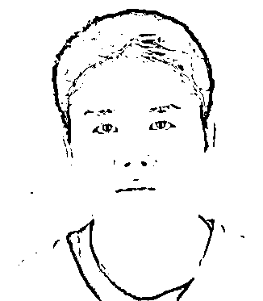

# 刘强东案庭外和解! 折腾了好几年竟然是一场误会! 章泽天拿捏他死死的

> 原文：[`mp.weixin.qq.com/s?__biz=MzIyMDYwMTk0Mw==&mid=2247544982&idx=4&sn=061fa57bac3b0b73fedc694ca8ee8319&chksm=97cbfbaea0bc72b8870e762f1ba34d068e0b0e9734bc7f4ed04c808c61354a96d545a86f902e&scene=27#wechat_redirect`](http://mp.weixin.qq.com/s?__biz=MzIyMDYwMTk0Mw==&mid=2247544982&idx=4&sn=061fa57bac3b0b73fedc694ca8ee8319&chksm=97cbfbaea0bc72b8870e762f1ba34d068e0b0e9734bc7f4ed04c808c61354a96d545a86f902e&scene=27#wechat_redirect)

**开庭前突然和解 背后过程曲折**

昨晚，持续 4 年之久的刘强东案突然霸屏微博热搜。满屏都是#刘强东声明#、#刘强东和解#、刘强东发声对不起妻子#的话题。

据悉，此案原定于 10 月 3 日在明尼苏达州明尼阿波利斯市市中心的亨内平郡地区法院开庭审理，预计审理时间在 1 个月左右。许多北美华人都在等着好戏开场。毕竟前段时间才拍到章泽天怀孕，刘强东陪她逛打折店 Target，两人悠居乡下而不在往常定居的纽约，必然就是为了等这场官司。

但出乎意料的是，开庭前一天，双方**庭外和解**了。

一些知情人士认为，和解是必然的结果。因为这两天，原被告双方正在选定陪审团。刘强东本人全程在场，就连章泽天也一直坐在旁听席，而**女方刘婧尧却没有出席**，全权委托律师团队。

他们当时就猜测，女方不出面，说明东哥信心十足，十拿九稳。

随后，女方（刘婧尧）和男方（刘强东）的律师团队共同签署了一份联合声明，内容十分耐人寻味——“当年的强奸案是一场**误会**！” 

声明内容如下： 

“双方在 2018 年美国明尼苏达州的一次偶然事件所造成的误会，已占用大量的社会资源，也给彼此的家庭造成了严重困扰。今天，双方同意消除误会、达成和解，以终止诉讼可能造成的进一步的伤害。至此，刘婧尧女士以及其律师将不会再做出任何回应，双方也不会再出去任何其他的联合声明。”

简而言之，刘婧尧方面要**彻底封口**了。

不过，女方噤声意味着男方有了绝对的话语权。刘强东本人对媒体声明：“对妻子表示歉意，感谢她的宽容、支持和陪伴。” 

章泽天也发了朋友圈。 

走到这一步，这个案子的确尘埃落定了。

但今天能达成庭外和解的局面、甚至女方封口，绝不是一蹴而就的。这中间可不止一波三折，起起伏伏简直闹得翻天覆地——绝不是现在网友轻飘飘一句：“钞能力摆平一切！”就可以解决的。否则，这场官司也不会僵持了 4 年。

回顾案件的起点。2018 年 8 月 31 日凌晨，刘强东被指控性侵 21 岁的明尼苏达大学学生刘婧尧。

两人的交集来自一场 8 月 30 日的校友聚会。刘婧尧作为志愿者陪同前往。一群人都喝醉了，而刘强东和刘婧尧饭后共同回到了刘婧尧的住所，**并发生了性关系。**

双方各执一词。女方说自己是唯一的女志愿者，是被设计灌酒的猎物，如果不假意屈从，担心自己遭到报复。 

而男方则放出多段裁剪过的监控视频，有的视频片段是女方主动挽手，指路邀请回房的，还有的视频片段里，女方主动给多位领导敬酒。

双方在 31 日凌晨发生性关系后，女方突然报警。据新闻报道，警方鱼贯而入，而刘强东当时光溜溜的还没穿衣服，正熟睡着。 

身份地位如强东，照样被美国警察**关押了 17 个小时**，还流出了这样一张“囚犯照”。 

2018 年 12 月 21 日，刘强东的刑事指控被解除，当地检方决定不予起诉。不过，这并不代表女方没机会提起民事诉讼。

果然，2019 年 4 月，女方提告刘强东以及京东，索赔**至少 5 万美元，上不封顶**。而刘强东也因为这件事的一连串后果，不得不卸任京东的 CEO。

也正是从这一刻开始，双方的舆论战打响了。

刘婧尧的立场似乎很挣扎，她一度陷入了一种自我矛盾。比如，**警方执法记录仪中显示，刘婧尧自己承认，是自愿发生性关系。**但之后又多次改口——这到底是是不是强奸，她自己也说不清。 

在这段期间，刘婧尧还纠结过要不要公开露面。不过，由于后来刘强东的监控视频曝光了她的长相，她最终选择站在了公众面前。

关于官司的目的，她也摇摆不定。在一段录音中，她曾说自己需要的赔偿是钱和道歉。赔偿金额一度**从 5 万美元飙升到 500 万美元**。 

当她接受《纽约时报》、《财经》等媒体的采访时，她又说，坚持为名誉打官司，即使收到赔偿金，也会系数捐出。

待到最近一段时间，刘婧尧又改口了。据界面新闻报道，她多次通过律师询问陪审团：“**如果所有的赔偿金都给我的当事人个人**，而不是红十字会、学区或者别的什么地方，你会觉得这很难接受吗？”

经过多轮听证会，双方似乎坚定了要打赢官司的决心，均在近期大量增加曝光度。刘婧尧登上《纽约时报》，而刘强东拉着章泽天逛超市被拍。

可就在观众以为双方要进行一场耗时一个月的恶战时，“啪”的一下，一纸声明丢了出来，双方和解了——兵不血刃啊！ 

对于案情，网络上有两派立场： 

一方认为，刘婧尧同意和解，是因为自己底气不足。如果证据硬，那么民事官司打下去，打赢了，照样能拿钱。

另一方则认为，刘强东请了那么强势的律师团，结果还要和解，律师再优秀，自己心里没谱，慌着给钱消灾。

不过对于刘强东来说，诉讼还是和解，其代价都是一样昂贵的——光想想 4 年来的律师费就知道了。 

刘强东的顶级律师天团又被戏称作“百万律师团”，4 大名将**平均每小时就要花费 2 万人民币**，这 4 年下来，自然耗费百万以上。 

至于和解是否意味着刘婧尧拿到了大笔“封口费”，每个人都有自己的猜想，而谁对谁错、真相如何，其实也不重要了。

不论如何，这起事件对于男女双方而言，都没有赢家。

对于刘强东来说，他个人以及京东的企业形象，都因此受到影响，不存在盈利，只是如何将损失最小化。而对于刘婧尧来说，她的外貌被曝光、卷入舆论漩涡，注定了她无法再做个普通人。

来源：加拿大加新网，宾曰语云 

欢迎关注灰产圈社群服务号

