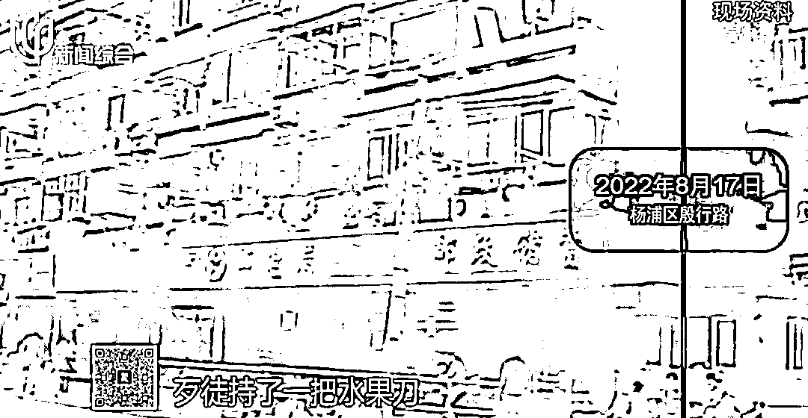
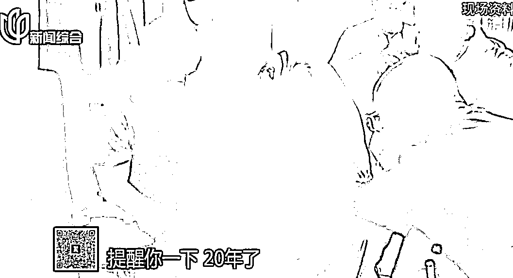
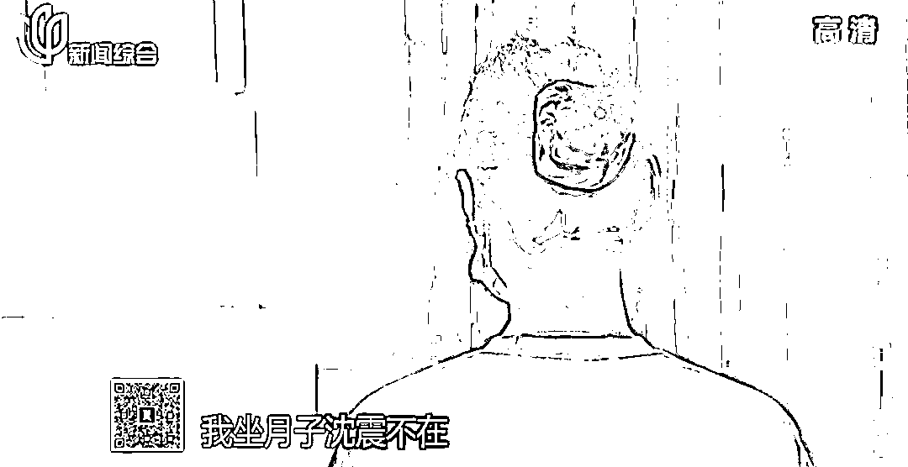

# 上海杨浦抢劫邮政储蓄所案 20 年后告破！抢了 10 万元的作案人：其实我不差钱…

> 原文：[`mp.weixin.qq.com/s?__biz=MzIyMDYwMTk0Mw==&mid=2247544982&idx=5&sn=1dce019cc933587e40a9426aa98e11f0&chksm=97cbfbaea0bc72b8e12cf39a3e052fc9b05d828d65bd8fbd1ac300e0b602825e048f421da560&scene=27#wechat_redirect`](http://mp.weixin.qq.com/s?__biz=MzIyMDYwMTk0Mw==&mid=2247544982&idx=5&sn=1dce019cc933587e40a9426aa98e11f0&chksm=97cbfbaea0bc72b8e12cf39a3e052fc9b05d828d65bd8fbd1ac300e0b602825e048f421da560&scene=27#wechat_redirect)

不知道大家有没有关注过前些日子的这桩新闻：**上海杨浦抢劫邮政储蓄所案 20 年后告破。**

最近东方 110 果然播出细说了这个案子，意外的令人感慨。 

嫌疑人到案后一直强调自己不差钱的，那为什么会去抢劫 10 万块……鬼迷心窍？年少叛逆？

最后他自己也说，人生踏错一步，就算逃了 20 年，最终还是要还的。 

时间回到 2002 年 8 月 1 日，当天中午 12 时 30 分许，一名身着白色圆领广告衫、浅蓝色牛仔裤，戴着太阳眼镜的高个青年男子走进了位于**上海市杨浦区殷行路上的工农邮政储蓄所**。

他前往柜台假意办理储蓄登记，之后突然从“包裹收发”窗口翻入柜台内，用水果刀逼退营业员、劫得 10 万元现金后仓皇逃走。 

案发后，综合现场勘查和视频录像分析，专案组初步推断出犯罪嫌疑人的身高和年龄，随即兵分多路，围绕嫌疑人样貌特征、衣着打扮等开展大量走访调查工作。

那时上海警方也曾发布悬赏通告，称对于提供重要线索、协助捉拿“8·1”储蓄所抢劫案嫌疑人的市民，警方将给予人民币 10 万元重奖，那时陆续收到举报线索 900 余起。

当年的通告披露了嫌犯的相关信息：身高 1.83 米，30 岁左右，上海口音，偏瘦，皮肤较黑。 

作案时戴金边太阳眼镜，携黑底红面的尼龙拉链折叠包。

但由于现场遗留线索较少，同时受到当年工作条件、侦查技术等诸多因素的限制，始终无法确定嫌疑人的身份信息，案件侦查工作一时陷入僵局。 

20 年来，虽然办案民警换了一批又一批，专案组始终没有放弃，每隔一段时间，侦查员们就会翻出案卷复查，根据新线索逐一核查。

期间，专案组的足迹遍布全国 20 余个省市，积累的案卷多达 200 余册。 

近日，上海市公安局刑侦总队从当年案发现场的痕迹入手，运用最新刑事技术获得突破性线索，会同杨浦分局最终成功侦破“2002.8.1”抢劫邮政储蓄所案。

这起当年曾一度轰动上海滩的大案，随着犯罪嫌疑人的落网，终于得以告破。 

这个名叫沈震的男子，案发当时 26 岁，容貌、身高和身材都和当年的歹徒相似度很高。

2022 年 8 月 14 日 6 时许，专案组成功在犯罪嫌疑人沈某位于上海的居住地将其抓捕归案。

到案后沈震很快和盘托出了犯案经过，20 年来他自己肯定也心知肚明，逃不掉的。

在犯案的前一天，沈震去邮政储蓄所兜了一圈，但那时他只是抱着看看有没有心仪邮票的心态，当时他无意间发现了安全防范上疏漏。

他发现储蓄所放钱的地方开了一个很大的窗口，连保安也没有。

那个瞬间，沈震萌生了一个自己也觉得奇怪的念头，不如他来试试抢掉好了。

当天作案后，沈震心态相当平静。

不过因为到处都在发协查通告，沈震渐渐觉得上海待不下去了，2002 年 8 月 5 日当即远赴重庆，2005 年 2 月，沈震才回到上海。

这三年来他缺席了妻儿的生活。

回顾以前的教育，沈震的父亲百思不得其解，儿子为什么会干出抢劫的事情，

沈震则说，他爸妈就是那种很希望孩子按他们的路来走的父母。

或许，抢劫就是沈震表现叛逆的一种体现。

2002 年~2022 年间，沈震先后购入了 3 套房产，还遇上了动拆迁补偿，今年年初他还将儿子送往国外求学，那么 2002 年抢劫来的 10 万块赃款，不是他的“第一桶金”呢？ 

似乎看起来不是的，因为沈震说 2002 年那会他月薪有四五千多块，而且早早买车，另外父母也给予了强大经济支持，1998 年就出钱帮他在浦东德州路买房。

案发前一个月，他自己还以首付 9 万，按揭 14 万的方式，买下了一套闵行区 74㎡的婚房。 

和妻子的婚礼也办的很豪华。

据沈震交代，他抢来的 10 万块是这样花掉的：4 万用于婚房装修，4 万借给朋友，2 万块用于日常开销。

家境良好，吃穿不愁，怎么会去抢劫呢？

沈震反复强调的不差钱，可能是虚荣心，也可能是掩饰其他原因，就像他感慨的，人有两面。

但不管怎样，他恐惧的这一天还是到来了。 

来源：上海全知道

欢迎关注灰产圈社群服务号

