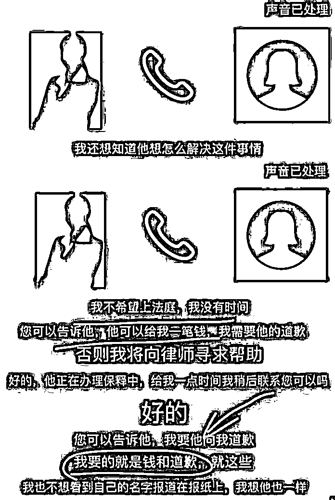
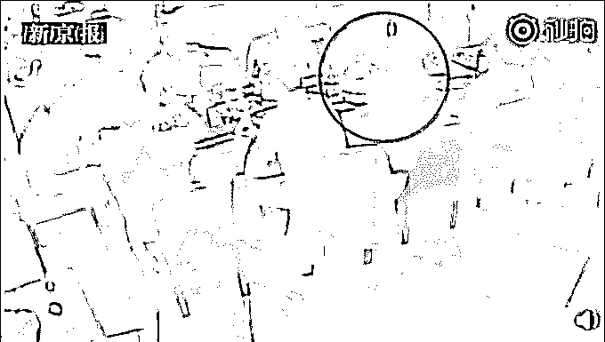
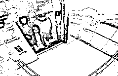
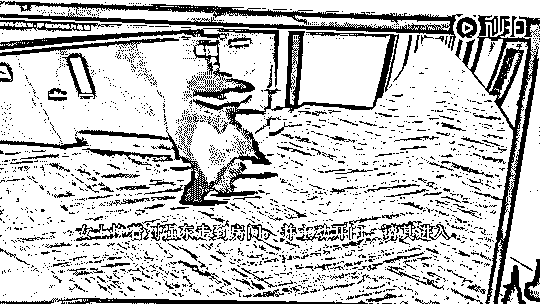
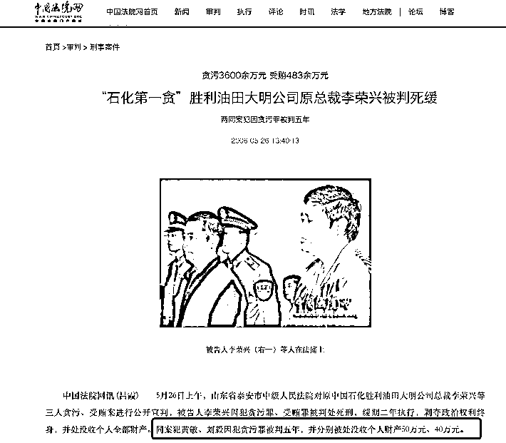

# 刘强东案和解，赔多少了呢？女主家庭背景不简单！

> 原文：[`mp.weixin.qq.com/s?__biz=MzIyMDYwMTk0Mw==&mid=2247544982&idx=6&sn=2de83ba3bffd1d99a56fae44c447c706&chksm=97cbfbaea0bc72b883baf15f9f6ffa9ddd81c3a6ac2ec1ef213c53d84a9688ad7d8972851498&scene=27#wechat_redirect`](http://mp.weixin.qq.com/s?__biz=MzIyMDYwMTk0Mw==&mid=2247544982&idx=6&sn=2de83ba3bffd1d99a56fae44c447c706&chksm=97cbfbaea0bc72b883baf15f9f6ffa9ddd81c3a6ac2ec1ef213c53d84a9688ad7d8972851498&scene=27#wechat_redirect)

纠葛 4 年之久的“刘强东明州事件”，终于画上了句号。 

美国时间 10 月 1 日晚间，“明州事件”双方当事人刘强东和刘婧尧的律师团队，发表联合声明，达成和解。

声明称，“刘强东先生和刘婧尧女士于 2018 年在美国明尼苏达的一次偶然事件所造成的误会，占用了大量的社会资源，也给彼此的家庭造成了深重的困扰。

今天，为了避免进一步的诉讼伤害，双方决定消除误会，达成和解，为这次事件画上句号。

除以上声明，刘婧尧女士及其代表和律师不再发表任何评论，双方也不会出具其它的联合声明。”

刘强东本人还发表了声明： 

纠葛四年的事情，今天终于结束了！ 再次对被这件事困扰的所有人尤其是我的妻子表示歉意。在这里， 我要特别感谢妻子的宽容、支持和陪伴！ 没有她，我无法坚持到今天！时间永远向前， 我希望我的生活和工作能够尽快恢复正常。 我们也即将迎来新的小生命，我会更加珍惜、守护好这个家庭。祝福所有人明天会更好！

章泽天随后也发文回应： “人生总有风雨，但时间永远向前。”

该案原定于 10 月 3 日在明尼苏达州明尼阿波利斯市市中心的亨内平郡地区法院开庭审理。 

外界猜测，本次意外和解，刘强东方面应该提出了一个让刘婧尧难以拒绝的**金额，具体多少钱双方都没有披露。**

****

刘强东性侵案和解，可以说，是一个不错的双赢结局。

对于刘强东和京东公司，和解的结局避免开庭持续 1 个月时间，双方庭里庭外交锋，造成刘强东的家庭尤其是妻子再次持续性地受到伤害，还可避免股价严重下跌的巨额损失，而且判决不服还可上诉，损失自然会进一步扩大，不如直接赔点钱来得简单。

对于刘婧尧一方，硬扛下来也有可能分文赔偿也得不到，或者赔偿的费用并不理想，甚至得不偿失；如果刘强东和京东一方出价合适，见好即收也不失为上策。

和解是个彼此让步的过程，是双方通过谈判找到彼此都能接受之赔偿数额的过程。

公众特别好奇的就是这个赔偿数额，而双方联合声明中并没有公布这个数额。

可以想见，该核心要点应该是和解协议的重要内容，即彼此对赔偿数额应进行保密；任何一方违反，应承担怎样怎样的违约责任。这是法律允许和保护的。

因此，公众的好奇应止步于不损害公共利益的“个人隐私”和“商业秘密”，哪怕刘强东是公众人物，这个“隐私”也还在保护范围。

当然，这不妨碍我们作些猜测。

我们还记得，三年半以前原告起诉，原告提出的请求只有 5 万美金赔偿。

双方和解联合声明中提及的“一次偶然事件”，缘于 2018 年 8 月底，刘强东参加明尼苏达大学卡尔森管理学院工商管理博士 DBA 项目。

据该项目网站称，该项目是“为在中国及周边地区全职工作的顶级高管量身定制的”。

当时，DBA 项目招募志愿者。明尼苏达大学 DBA 项目副院长崔海涛教授，也是刘婧尧父亲的老师，崔海涛称在刘婧尧父亲的同意下，将刘婧尧的微信名片推送给了 DBA 项目负责招募与面试的员工，刘婧尧成了 DBA 项目的学生志愿者。

值得一提的是，该 DBA 项目的学生志愿者中，还有一位 Tao 同学。本案中至今仍旧令人蹊跷的是，刘婧尧并不是“明州事件”刑事案的第一报案人，而是与刘婧尧为 DBA 项目学生志愿者的 Tao，他也成为“明州事件”中关键且神秘的人物。

不过，9 月 29 日，有关“明州事件”的一段 27 页的聊天记录曝光。据极目新闻报道称，刘婧尧与事发时报警的男同学 Tao 以及其他多位知情人士关系破裂，甚至互相攻击。

Tao 认为刘婧尧和律师不可信，不再和刘合作，刘则认为 Tao 是为了拿绿卡，得知靠这个事拿不到绿卡后就消失了。

聊天记录的另一方，是明尼苏达大学教授崔海涛。流传出的聊天记录显示，沟通的双方语气并不友好。

刘婧尧责骂崔海涛，而崔海涛则埋怨刘婧尧，因为刘向媒体爆料，自己饱受舆论压力。

这份 27 页的聊天记录显示，她的父亲就是刘毅，是国内知名商业人士。

公开资料显示，崔海涛曾经担任长江商学院助理教授，鉴于刘父是一位“成功的商人”，长江商学院也许是他们建立师生关系的地方，孕育过许多美丽爱情故事的长江商学院。”

根据自媒体锌财经报道，根据 6 月底双方提交的证据中刘婧尧所作的一份心理评估对话显示，在她小学一年级的时候，就跟随母亲从青岛到北京读书，就读的是一所北京顶级的学校，“像一个古代的皇子拥有的中国宫殿”。

按照刘婧尧的口述，自己进入这所学校并没有经过考试，只是经过了一个面

试就通过了。

而自己能够上这所北京顶级学校，则是依靠舅舅和校长的关系，同时，舅舅还解决了全家人的北京户口。

刘婧尧的舅舅为何有如此大的能量？

根据了解刘婧尧的知情人士透露，刘婧尧的舅舅名叫邢彪。

公开资料显示，邢彪此前常年在中国证监会和全国社保基金担任要职，并且曾经担任过证监会主板发审委的专职委员；2015 年起转入鹏华基金管理有限公司。

根据媒体公开报道，在参加 2020 中国资产管理年会时邢彪的身份为鹏华基金副总裁。

她当初之所以要转入北京读书，还有一个原因是她的父亲在当时因做生意被陷害而被判入狱。

而根据上述知情人士透露，刘婧尧的父亲当年确实是因为做生意卷入一场刑事案件，而且这起案件在当年也是轰动一时的“石化第一贪”李荣兴腐败案。

根据中国法院网的公开信息以及当时的媒体报道显示，李荣兴当年犯下的最大一起贪污案件，是中国石化胜利油田大明公司与井田公司合作开发房地产项目过程中，采取抬高土地价格的方法贪污了 3500 万元，而李荣兴当时并没有直接操作，是通过了另一家央企背景的房地产公司负责人刘毅操作，并允诺给予其相应的好处。

刘毅，正是刘婧尧的父亲。

2006 年，山东省泰安市中级人民法院对李荣兴等三人贪污、受贿案进行公开宣判，被告人李荣兴因犯贪污罪、受贿罪被判处死刑，缓期二年执行，剥夺政治权利终身，并被处没收个人全部财产。

作为同案犯的刘毅因犯贪污罪被判五年，并被处没收个人财产 40 万元。

刘毅因判刑离开国企房地产公司之后，还给公司留下了不少烂摊子。比如在 2003 年的时候，作为公司主管的刘毅在主导公司一块土地的合作时，明明有国企可以选择的情况下，却偏偏选择了一个没有资质、没有经验的自然人合作。

关于该自然人和刘毅的关系，事后公司认为是“非同寻常的密切关系”，而实际了解当时情况的人士透露，疑似和刘毅存在“包养”关系。

来源：锌财经，TECH 星球，和美之音

欢迎关注灰产圈社群服务号

