# 又暴雷了！某知名区块链钱包被盗！用户损失过亿！

> 原文：[`mp.weixin.qq.com/s?__biz=MzIyMDYwMTk0Mw==&mid=2247544982&idx=7&sn=a828d8c4f53fb9847a30f3f0dd1d25b2&chksm=97cbfbaea0bc72b86c48068fa0d8782d71fa65d38ab38175d18d7c9bb4bfb619b198d836e8fb&scene=27#wechat_redirect`](http://mp.weixin.qq.com/s?__biz=MzIyMDYwMTk0Mw==&mid=2247544982&idx=7&sn=a828d8c4f53fb9847a30f3f0dd1d25b2&chksm=97cbfbaea0bc72b86c48068fa0d8782d71fa65d38ab38175d18d7c9bb4bfb619b198d836e8fb&scene=27#wechat_redirect)

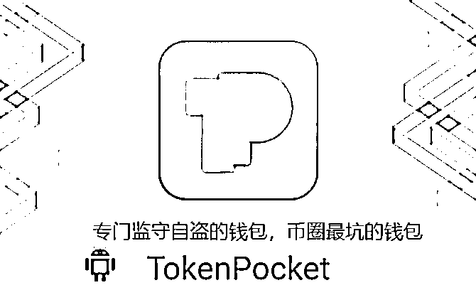

以前我说 tp 钱包不可信，用 tp 钱包的朋友早被坑，晚被坑，早晚被坑，当时还有很多人喷我，说我根本不懂 tp 钱包，也不懂什么是去中心化钱包，还说我不懂什么狗屁授权是用户自身行为等等，我记得当时很多人喷我，希望喷我的你们，现在都用了 tp 钱包的闪兑功能~

最早可以追溯到去年，tp 钱包上面的 nft 被盗事件：

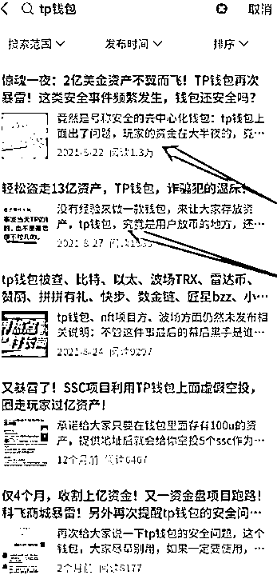

我在给大家截取一些当时大聪明的言论：

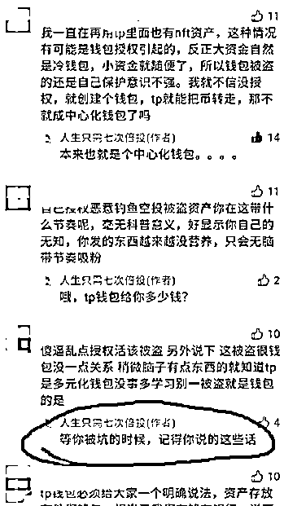

当时很多的人，都认为自己很聪明，自己没有去授权，自己没有被骗，就有资格站在高点指责那些被骗的人是傻，是他们自己活该，然而今天，板子终于落在自己身上，才回想起一年前，村长就说过的话，是有道理的，是金玉良言，但是，悔之晚矣。

所以，当我们的同伴，受到了不公平的对待，我们应该站起来帮他们发声，而不是站在操盘手和项目方的角度，用他们制定的规则，来嘲笑和我们一样只不过被较早收割了的同伴，兔死尚且狗悲，我们所有的散户都是同类，在被恶意收割的时候，应该站在一起来发声，不然，下一个被钱包坑的被项目方坑的就是我们自己了。

tp 钱包的所谓授权，只不过是监守自盗的一个蹩脚的理由。

在过去这一年的时间里面，在 tp 钱包里面发生的各种被盗被骗被坑事件，数不胜数，利用 tp 钱包实行诈骗的项目层出不穷，然而无论出了什么问题，tp 钱包都是一副事不关己高高挂起的姿态，之前的那么那么多事件，tp 钱包官方可以说自己不知情，说自己不相关，今天的这件事，tp 钱包方面应该是 100%脱不了干系了：

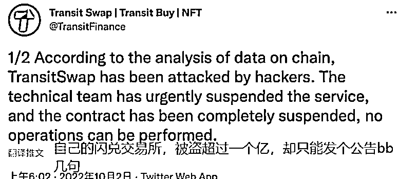

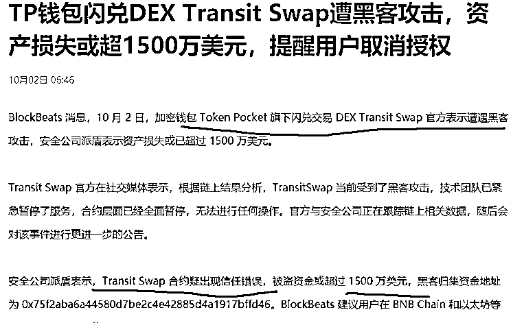

看到了吗，时隔一年，tp 钱包再次收割了用户的接近一个亿的资产，同样的手法，不一样的方式，去年收割 nft 玩家过亿资金，今年收割 dex 用户过亿资金，这套路，简直无敌。

有个大哥本来牛市结束，准备把币存起来，休养生息，下一轮再战，结果昨晚 2 点 25 分转入 tp 钱包 300 多万 u，2 点 40 分就被盗走：

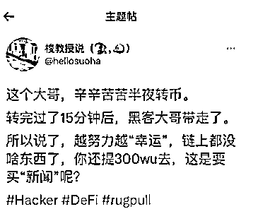

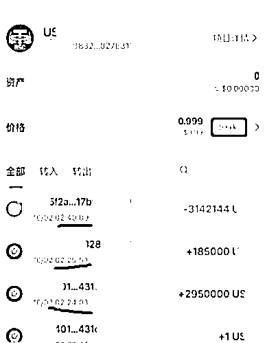

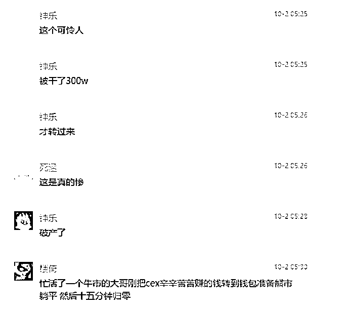

还有一些是小额的，但是也是用户的血汗钱：

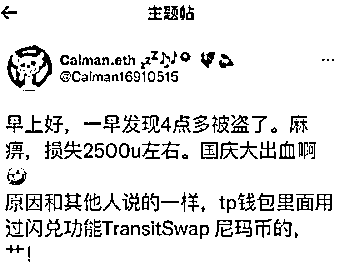

圈了大家的钱，甩锅给黑客，这么看来，币圈的操盘手们，真的都没有必要再去开盘了，学习 tp 钱包，弄个中心化钱包，然后再随便搞几个功能，让大家把币存进来，然后找个借口私吞掉就行了，还不用担心用户投诉，只要用户一投诉，就说用户授权有问题，啧啧，我拿了你的钱，错的人还得是你。

真是防不胜防的套路。

tp 钱包为什么我说他是监守自盗，因为被盗了一个多亿之后，下午的时候，说攻击者又主动给大家退回了 70%的资产：

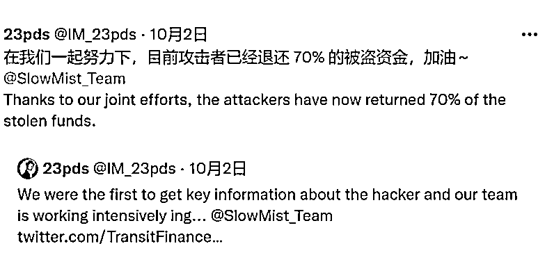

在咱们这个圈子，你见到过黑客会给退币的吗？

区块链的世界里面，代码即使法律，币被转走之后，只要黑客不主动，那么币是根本不可能回得来的，不信大家可以回顾一下过去这段时间，币圈发生的各种盗币事件，比如说，今年三月份，

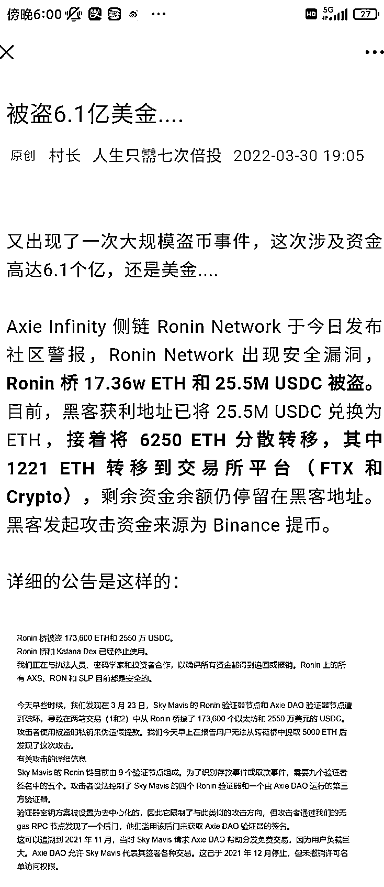

直到今天，黑客还在把盗窃到的 eth 和 usdc 通过各种洗币池洗币进行资金的转移洗白，是压根不想还给大家。

那么盗窃 tp 钱包的这个黑客为什么要把币转回来呢？

原因很简单，黑客也是 tp 钱包的自己人。

这次只不过是搞得太多了，没办法自圆其说的情况下，上面发话了，赶紧退一点，做做样子，不然 tp 钱包以后在圈内就没办法再混下去了，名声不只是烂大街，都快烂皮炎子了~

还有个朋友直接剖析了全过程，只不过有一点没想到，那就是这么快找回了币，还让黑客主动退让，其根本原因是，黑客就是自己人，不过就是自导自演的又一起监守自盗事件：

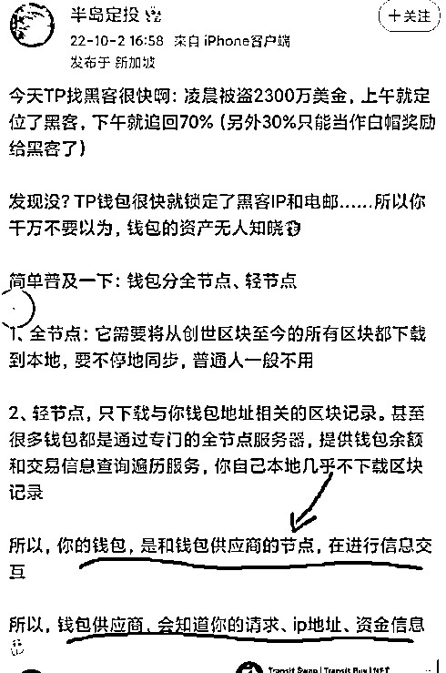

而这位朋友的分析中，大家需要注意的是，非常关键的一点就是，大家用的 tp 钱包，其本质，就是你的钱包和钱包供应商的节点，在进行信息互换，

重要的话，再说一遍，

其本质，就是你的钱包和钱包供应商的节点，在进行信息互换。

压根没有区块链啥事。

昨天 sol 的服务停了，知道是为什么吗？

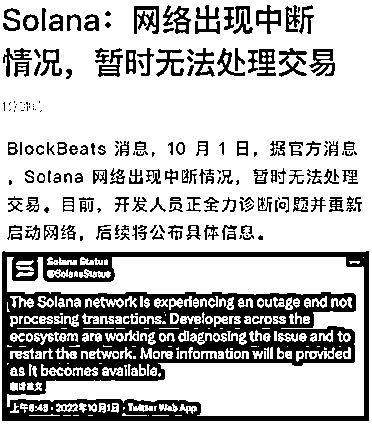

因为服务器没交钱呗，这件事也发生在 trx，还有之前的小蚂蚁公链上，咱们圈内的老玩家，应该都知道。

其实，包括以太坊在内，都是相对去中心化的东西，绝对去中心化的，也就是只有比特币了。

好像扯远了，说回 tp 钱包，为什么说这次事故是监守自盗？

因为合约在部署前和部署中以及部署之后，都要经过 n 多次的测试，这种测试，就是为了找出合约的漏洞然后进行修补，就像上面那位朋友说的，tp 钱包的闪兑功能根本没开源，黑客是怎么进去找漏洞的？黑客又是怎么利用漏洞把钱偷走的？

这一切，想要解释的通，真相只有一个，那就是，监守自盗。

在结合 tp 上面出现过的那么多次被盗事件，这结论，大概率是实锤了。

村长说过，不建议用 tp 钱包，尤其是小白，小白用户单纯不懂，用 tp 前阿伯被坑的几率极大，如果你实在是搞不了，你的自己也不太多，就在某安某易，踏踏实实的玩算了，至少不会莫名其妙睡醒了，钱不见了。

而老油条们，大家更要警惕，自己学会使用冷钱包或者物理钱包，千万不要把大额资产放在任何交易所或者市面上的这些钱包里面，像上面这个 300 万老哥一样，因为轻信 tp 钱包，直接 15 分钟损失超过 2000 万人民币，这可能是几年的努力，一夜被清光，如果是我，我估计头都得秃了。。。。

币圈就是这么多坑，但是又因为超高的暴利如此迷人，如果我们想要在这个圈子里面生存，一定要牢记村长的这个原则，投资从保本开始，保本从防骗起步，防骗从远离非区块链本质的应用上手。

最后，还是得说一句怼杠精的话，你明知道 tp 钱包的用户隔三差五的丢东西，你还非得用，非要用自己的钱，去证明 tp 钱包的安全，我是说你傻呢，还是说你聪明呢？

常在河边走，哪有不湿鞋，你就能保证你在用 tp 钱包的时候一辈子不偶然点错？

相信你也不能保证，所以，你被盗是个概率性事件。

但是不用 tp 钱包，村长是的确能保证一辈子不会点错，那些什么狗屁授权永远不会和我扯上关系~

对了，再多说一句，你们认为不错的 tp 钱包，今年 7 月份，已经公司主体注销了：

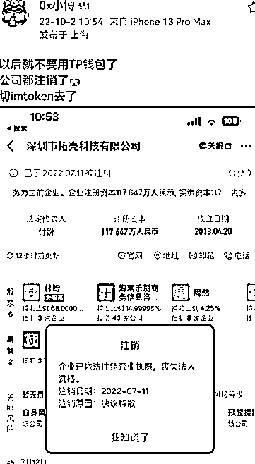

再借用一个圈内朋友的观点：

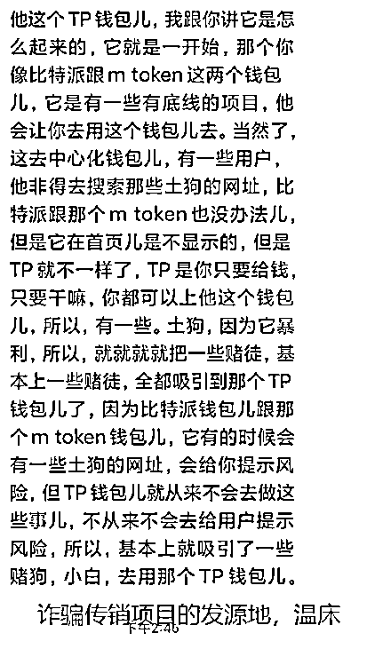

来源：安全圈

欢迎关注灰产圈社群服务号

