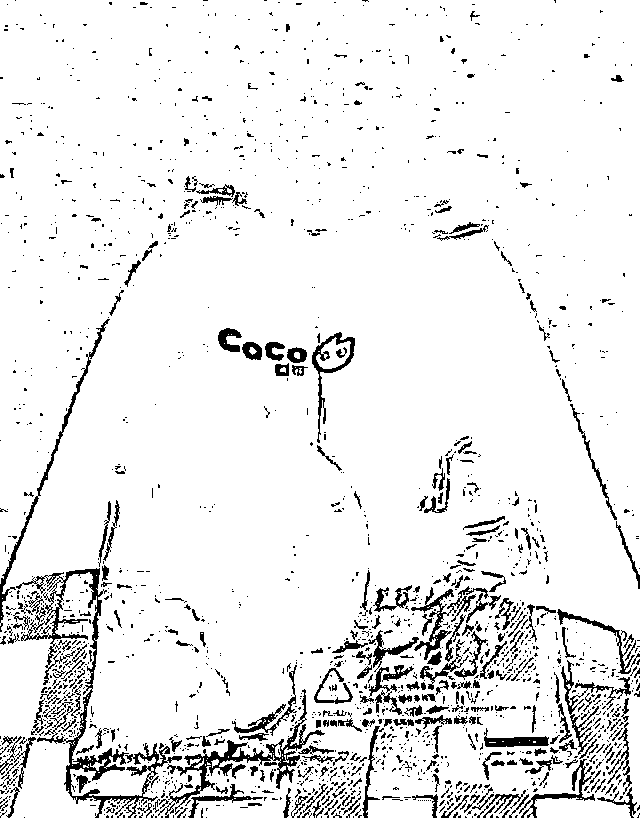
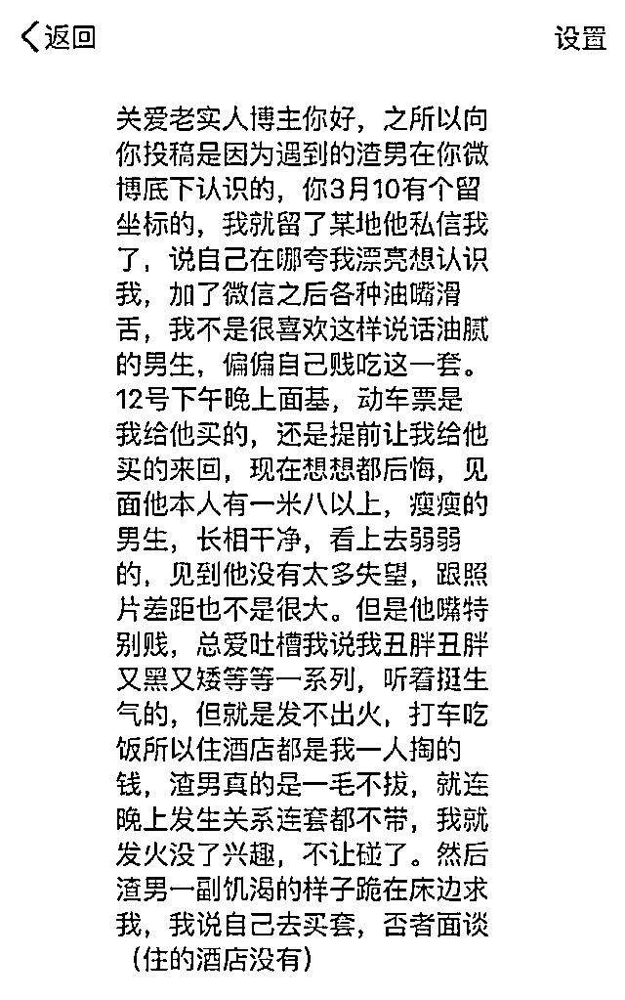
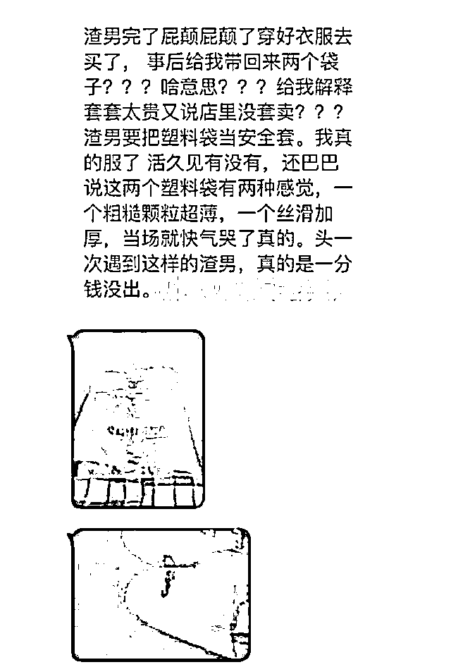
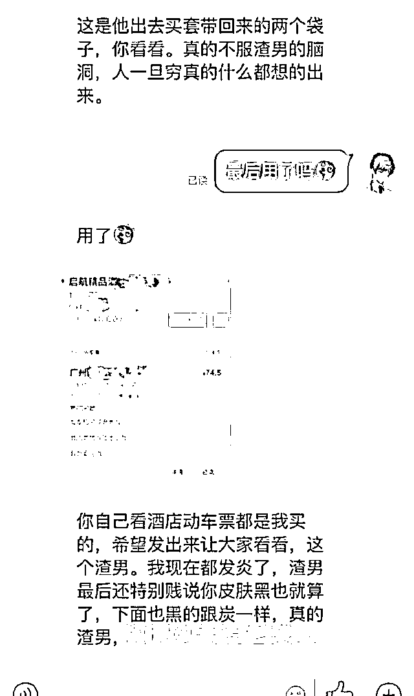
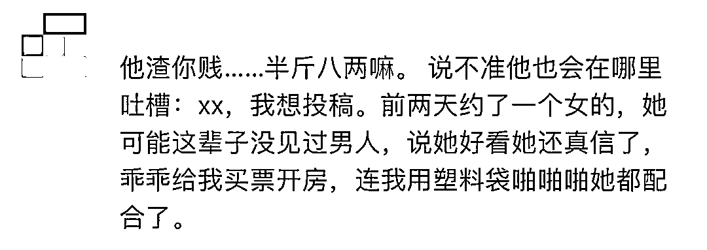

# 网恋渣男用塑料袋当避孕套，致女友私处发炎？多图流出，辣眼睛...

> 原文：[`mp.weixin.qq.com/s?__biz=MzIyMDYwMTk0Mw==&mid=2247545020&idx=1&sn=18a0b1ebb771f8af2e1f63a0a52f12dd&chksm=97cbfb84a0bc729223ee5098137464dbb23308b80b64aa692a55d9d6af1ddaf2f9d26845e872&scene=27#wechat_redirect`](http://mp.weixin.qq.com/s?__biz=MzIyMDYwMTk0Mw==&mid=2247545020&idx=1&sn=18a0b1ebb771f8af2e1f63a0a52f12dd&chksm=97cbfb84a0bc729223ee5098137464dbb23308b80b64aa692a55d9d6af1ddaf2f9d26845e872&scene=27#wechat_redirect)

都 2022 年了，在一个性教育普及的时代，还有人做出这么离谱的事情来。

前段时间在网上看到了一个投稿帖子，看完后把我都给整大无语了。 

帖子的大概内容，我就用一句话先概括：

**《网恋男友一毛不拔，让他买 tt，他却带回了塑料袋代替避孕套！》**

最最让人惊呆的是，两人居然还用上了。

具体是个什么情况，我们一起来看看吧

01

这事情还要从微博上一个女生和博主投稿的求助信说起。

女生和博主吐槽说自己遇到了一个渣男，而这个渣男就会嘴上功夫，加了微信后，各种油嘴滑舌，偏偏这个女生又特别喜欢吃这套，就约了男生面基。

见到男网友时，他本人特别高个，有一米八以上，身材也算还不错，长相干净，整体看上去还算是没让女生太失望。

但男网友见到女生时，总是吐槽她丑胖黑矮等一系列。

这也就算了，就是两人打车吃饭住酒店，都是女生在掏钱。

就甚至晚上发生关系连 tt 都不戴，女生见状，就来气了，也不愿意男网友碰他。

男网友饥渴难耐的望着她，说自己去买套。

**男网友出去溜达了一圈回来，竟只拿了两个塑料袋？？？**

**还和女生说店里的避孕套太贵了，所以就没买，并且还说服了女生塑料袋可以代替避孕套使用？**

其他不花钱也就算了，就连干那事，都能抠成这样？

难道买个避孕套，还能给他穷死？

**抠门男还解释说这两个塑料袋一个丝滑加厚、一个颗粒超薄……**

**这还不算完，还有更劲爆和令人无法理解的后续，**

**最后女方竟然还接受了？？？**

> ****“最后用了吗” “用了”****

**这也可以，66666！我觉得你们两个天生就是一对啊。”**

****

**而女孩由于使用了塑料袋，导致了私处被感染与发炎。**

**你说说，这个傻女人，约见网友就算了，又出钱又出力，还给自己整出了炎症？**

****

****

**所以要说，女生也应当自重，千万不要相信一个不认识的人。**

**从一开始这个男的就没想对你花一分钱，到最后还是看不清这个男的品行，也只能说是一个愿打一个愿挨吧。**

**网上有一句话是这样说的：**

****不是他不懂，只是他不想懂。不是他不注重细节，只是他爱的不是你。****

**02**

**这样的事情，本以为独一份，没想到一搜还真有一样情况。**

**在越南，有一对小情侣正在热恋阶段，有一天他们实在是忍不住想要发生点什么。**

**但奈于害羞不敢去买安全套，于是就打起了塑料袋的注意。**

****

**最后，两个人也因此住进了医院，经过医生的检查，两个人的生殖器官都受到了一些损伤。**

**导致受损的原因是：在发生关系时，由于塑料袋的摩擦才导致的出血。**

****虽然他们都知道使用安全套是最安全的，但因为担心被朋友发现，所以才没敢去买。****

**在做羞羞事期间，两人想到用塑料袋代替，结果没曾想发生意外。**

****

**还记得之前看过一新闻，19 岁的小芳，捂着肚子来到了医院。**

**在医生的询问下，小芳和医生说：自己与男友发生关系，没有采取措施。**

**但这并非是小芳不愿意戴，而是男友不愿意买。**

**最后男友又害怕小芳会因此怀孕，所以就想到了可乐可以杀精，一开始男友让小芳喝下了一大瓶的可乐，但又担心没什么效果，于是又说将可乐倒进下体，才会有避孕的效果。**

**这是什么歪门邪道的人会说出的话，都多大的人了，一点常识都没有。**

**自己是爽了， 害了自己的女朋友，真想将小芳的男友拖来痛打一顿。**

**后来小芳肚子疼痛了两天才去了医院，医生检查说小芳的下体已严重发炎，甚至很有可能导致不孕。**

**通过这三个故事，都可以看出，男的都是为了自己的一时爽快，不顾及女友的身体健康。**

**仅仅因为男友害怕买避孕药丢脸，就丢失了自我的底线，任凭男友用女生的身体，为他的错误买单。**

**为了避免悲剧再次发生，我们必须从中获得教训。**

**喜欢一个男人没有错，为爱勇敢也没有错。**

**但是感情里最忌讳的，就是你喜欢别人，对方却压根不拿你当回事。**

**03**

**一个爱你的男人，不会为了自己的那点私欲去伤害你。**

**身体是我们自己的，我们都要爱护它。**

**也不要因为害怕别人怎么说，而来损害自己的身体健康。**

**只有懂得如何爱自己，才能学会如何爱别人。**

**勇敢说不、即使止损，从来都不意味着失去，而是获得幸福的前提。**

**来源：幸福小酒馆******

**欢迎关注灰产圈社群服务号**

****