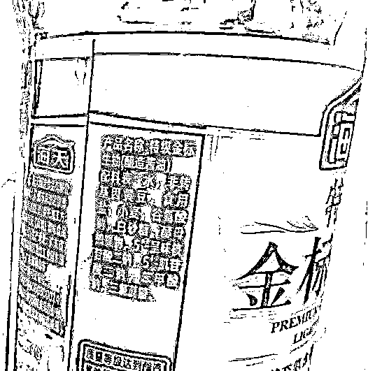

# 海天酱油“中外双标”背后：是酱油标准起草人，市值蒸发超 3000 亿

> 原文：[`mp.weixin.qq.com/s?__biz=MzIyMDYwMTk0Mw==&mid=2247545020&idx=3&sn=01600936898ef0acc6b2c7e93ae2546e&chksm=97cbfb84a0bc7292cd4e41a22c56d9afc73ef9a501ce410aaadcb75612e3724321e5a45a667f&scene=27#wechat_redirect`](http://mp.weixin.qq.com/s?__biz=MzIyMDYwMTk0Mw==&mid=2247545020&idx=3&sn=01600936898ef0acc6b2c7e93ae2546e&chksm=97cbfb84a0bc7292cd4e41a22c56d9afc73ef9a501ce410aaadcb75612e3724321e5a45a667f&scene=27#wechat_redirect)

国庆假期刚开始，一则有关海天味业酱油国内外“双标”，国内产品含有添加剂，国外则不含的事件引起的争议便开始持续发酵，将这家 3800 亿的行业龙头推上了风口浪尖。

尽管海天味业很快便发布声明澄清，但声明中只是强调其产品符合相关标准，并未对网友在意的“双标”问题作出回应。此外，海天味业还被曝出是多个酱油在内的行业标准的起草人之一。

这些都导致网上对该事件的舆情不仅没有得到平息，反而有进一步发酵的趋势。

**一则海克斯科技**

**引出海天味业添加剂争论**

近期，在短视频平台有一些针对海天酱油添加剂的讨论，称国外售卖的海天酱油配料表上没有添加剂，只有水、大豆、小麦、食盐等天然原料，而在中国售卖的除了天然原料之外还有较多添加剂。部分短视频账号利用“海克斯科技”等话题指出海天味业的酱油产品是“海克斯科技食品”。

从家用的一瓶海天金标生抽的配料表看到，其除了天然原料，主要的添加剂是谷氨酸钠、5'-呈味核苷酸二钠、5'-肌苷酸二钠、苯甲酸钠、三氯蔗糖，这与大部分网友晒出的海天酱油配料表基本一致。

公开信息显示，上述 5 种添加剂中，前 3 种为增味剂，苯甲酸钠则为常用的食品防腐剂，三氯蔗糖则为甜味剂。

有网友指出，海天酱油配方中，使用的食品防腐剂苯甲酸钠已经被明文列为一级致癌物，已经被国际淘汰，认为海天贪图便宜，不使用更安全的山梨酸钾，而使用具有致癌性的苯甲酸钠。

**声明称合乎标准**

**但也是多个行业标准起草人**

舆论愈演愈烈之下，海天味业也急忙出来回应。9 月 30 日晚间，海天味业官方微博发布一则声明，对近期产品添加剂争议进行回应。

主要内容为三点：

> 1\. 海天所有产品都严格按照《食品安全法》生产，并且随时接受国家及各级食品安全主管部门的常态化监管和检查；
> 
> 2\. 海天所有产品中食品添加剂的使用及其标识均符合我国相关标准法规要求；
> 
> 3\. 针对在事件中悉意造谣中伤海天品牌的短视频账号，公司己委派专业律师团队调查取证，必将恶意造谣者、传播者的法律责任追查到底。

但食品中放添加剂并不存在问题，而是一个正常现象。据《食品安全国家标准 食品添加剂使用标准》（GB 2760-2014）显示，食品添加剂是指为改善食品品质和色、香、味，以及为防腐和加工工艺的需要而加入食品中的化学合成或天然物质。

抛开剂量来谈食品添加剂的危害，都是耍流氓。有食品行业业内人士接受红星资本局采访时表示，“大部分的食品都讲究符合大众口味，食品添加剂能进一步弥补原料的不足，使其符合消费者的期待。只要量不超标，对人体没有伤害。”

至于多少算超标，就要看相关行业标准和国家标准的规定了。

但在查询酱油相关标准时，深蓝财经发现，**海天本身就是酱油相关行业标准的起草人之一。**

据全国标准信息公共服务平台检索结果显示，佛山市海天调味食品股份有限公司不仅是**耗油、配制酱油行业标准的起草人之一**，也是**甜醋、原酿本味酱油团体标准的起草人之一。**

此外，海天还**参与起草制定和修订了《料酒质量通则》、《酿造酱油工艺技术规范》、《酱油质量通则》等国家标准计划**，目前还在起草或批准过程中，还没有正式发布。

**“双标”才是网友怒火核心**

**海天的声明没有给出答案**

在这场添加剂风波中，虽然看似是围绕着食品添加剂健不健康，但实际上，海天酱油产品海内外的双标才是更惹怒网友的点。

在海天味业的澄清声明下，网友的评论依旧存在较大的差异。有网友对海天表示支持，认为恶意造谣中伤民族企业的短视频账号“太可恶”了！“外行看热闹，内行看门道，进出口真不是一两句话能解释的”，“海天也有零添加的产品，这个还要看按需购买吧“。

海天在声明中称，公司也有好吃不贵的 0 添加系列、有机酱油系列。据了解，海天味业的“头道酱油”“金标生抽”“草菇老抽”等产品，分别推出了有添加剂和零添加剂两种款式。零添加剂相关海天酱油在电商平台均能购买。

零添加的海天酱油“0 金标生抽”的配料表为水、非转基因大豆、食用盐（未加碘）、小麦、白砂糖、酵母提取物等。详情页中标明本产品在生产过程中 0%添加防腐剂（苯甲酸钠、山梨酸钾）、甜味剂（三氯蔗糖、安赛蜜）、味精、脱脂大豆。从配料表可以看出，这款酱油和抖音网友口中的“日本售卖的海天酱油”一致。

而在价格方面，据海天官方天猫旗舰店显示，无添加剂的“0 金标生抽”售价为 9.9 元，而有添加剂的经典“金标生抽”活动价为 14.9 元，两瓶折后相当于一瓶 11.9 元，有添加剂的酱油价格竟然比无添加的更贵。

但也有网友认为，海天的声明**并没有解释为什么在海外卖的没有添加剂**。为什么中外有别？为什么存在国外国内双重标准？这才是网友争议的核心问题，海天的声明并没有给出答案。

**国内外的标准的差异**

那么，**为什么海天的国产酱油和出口酱油成分会相差这么多**？

根据一篇名为《日本最新食品添加剂种类和使用标准分析》的论文，有学者曾针对中国和日本的食品添加剂标准进行比较，文中提到：

我国卫生部发布的《GB2760-2011 食品安全国家标准食品添加剂使用标准》，其中包括食品添加剂、食品用加工助剂、胶母糖基础剂和食品用香精等 2314 种，涉及 16 大类食品、23 个功能类别。而日本食品添加剂标准所规定的食品添加剂种类为 1504 种，比中国少了 810 种。

简单来说可以这么理解，同样一种添加剂，由于各国标准的不同，有的地方可以用，有些地方则被严格限制使用。

比如苯甲酸钠这种成分，苯甲酸钠属于酸性防腐剂在酸性环境下防腐效果较好，是很常用的食品防腐剂，有防止变质发酸、延长保质期的效果，在世界各国均被广泛使用。然而近年来对其毒性的顾虑使得它的应用受限，有些国家如日本已经停止生产苯甲酸钠，并对它的使用作出限制。

那国内的酱油都是加了添加剂的吗？并不是。近年来，随着人们饮食健康意识的增强，越来越多酱油生产商纷纷推出以“零添加”为卖点的产品，不过普遍上无添加的酱油价格要贵上一些。

但也有医药研究员表示，“零添加不一定等同于完全健康，有食品添加剂的产品也不等同于低劣产品。消费者应理性看待食品添加剂。”

存在中外双标的不止海天酱油，近年来，食品快消领域存在中外双重标准的案例层出不穷。

2021 年 8 月份， 联合利华旗下梦龙冰淇淋被曝中外用料不同：欧洲市场销售的梦龙冰淇淋主要原料是水及浓缩奶，而中国在售梦龙主要原料却是水及少量的乳粉。

对此，联合利华全球副总裁曾锡文表示，不同地区的整体配方体系一致，但是具体用料确实存在差异。

当然，诸如海天酱油、联合利华梦龙这样的中外双重标准着实让中国消费者感到很伤心，但也有一些中外双标的情况是让中国消费者受益的。

比如 2020 年 8 月发生了这样一件事：当时海外麦当劳 McDonald’s、汉堡王 Burger King 及温迪汉堡 Wendy's 等连锁餐饮店被曝其快餐包装含有致癌物质 PFAS（全氟和多氟化合物）。

随后麦当劳、汉堡王纷纷回应称：中国使用的食品包装材料中没有添加 PFASs（全氟和多氟化合物），完全符合国家相关标准。请大家放心。

**业绩增速承压**

**市值已蒸发超 3000 亿**

公开资料显示，海天味业成立于 2000 年，其发展历史可追溯至民国时期的佛山古酱园（海天酱园）。1955 年，公私合营，佛山 25 家实力卓著的古酱园谋略合并重组，组建“海天酱油厂”，为今日海天前身。

海天味业于 2014 年上市，上市首日，市值就达到了 497 亿元；到了 2020 年 8 月 18 日，海天味业市值一度突破 5000 亿元，9 月 1 日突破 6000 亿元，一度被业界称之为“酱油茅”。

但如今，这个酱油一哥相比 2021 年的高增长时代，业绩放缓，股价也一蹶不振。自 2021 年初至今，海天的股价接近腰斩，市值蒸发超过 3000 亿。

今年上半年，因为疫情、消费疲软等原因，海天味业的经营业绩表现平平。中报显示，海天味业实现营收 135.32 亿元，同比增长 9.73%；归母净利润 33.93 亿元，同比增长 1.21%。虽然营收和净利润保持着增长态势，但是净利润增速却是创了上市以来的新低。

分产品来看，中报显示，三大核心产品中，对营收贡献最大的酱油实现营收 74.93 亿元，同比增长 6.81%；其次是蚝油，上半年营收 22.09 亿元，同比增长 3.69%；调味酱实现营收 14.22 亿元，同比下滑 3.6%，也是唯一收入下滑的品类。

今年以来，海天味业股价整体走势也在震荡走低，年初至今累跌幅超 12%，截至 9 月 30 日，海天味业股价为每股 82.82 元，最新市值 3837.74 亿元。

来源：深蓝财经综合  编辑：包不同

欢迎关注灰产圈社群服务号

