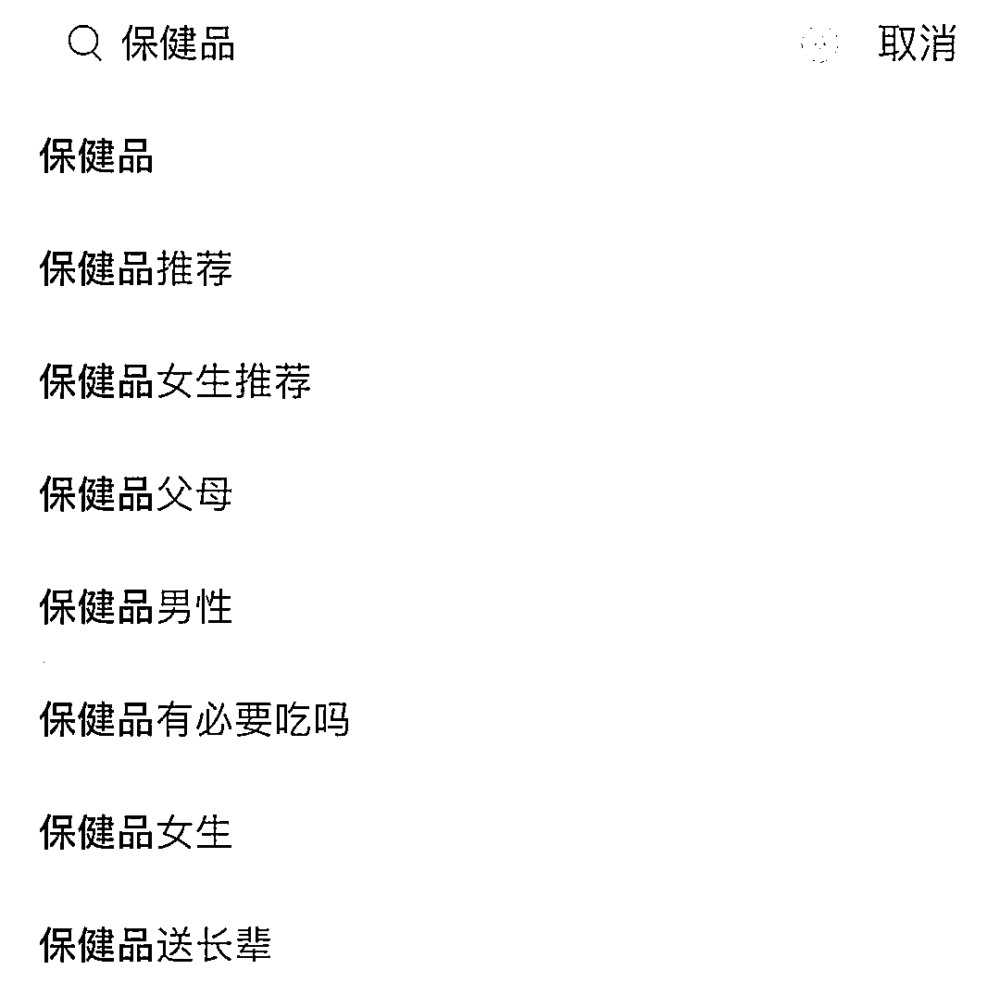
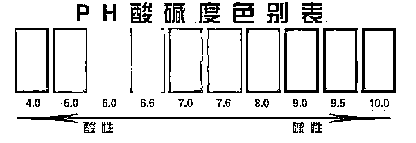
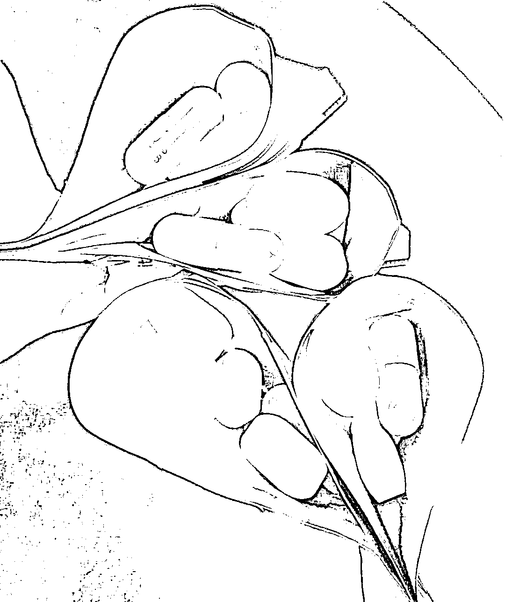
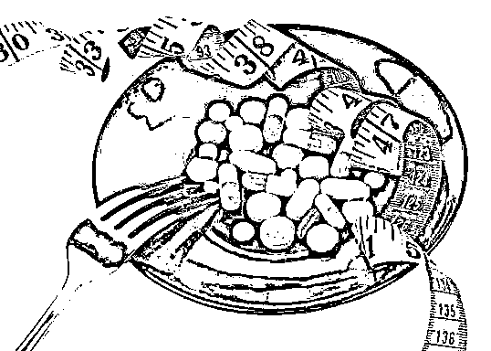

# “网红药”别乱吃！23 岁女孩险些丧命

> 原文：[`mp.weixin.qq.com/s?__biz=MzIyMDYwMTk0Mw==&mid=2247545020&idx=4&sn=bd691fcfbad8731e7744977d8c08d2ca&chksm=97cbfb84a0bc7292bd02f6fe64269cf40c07f38f37036b9dc580cab33a833f802fe877663e5e&scene=27#wechat_redirect`](http://mp.weixin.qq.com/s?__biz=MzIyMDYwMTk0Mw==&mid=2247545020&idx=4&sn=bd691fcfbad8731e7744977d8c08d2ca&chksm=97cbfb84a0bc7292bd02f6fe64269cf40c07f38f37036b9dc580cab33a833f802fe877663e5e&scene=27#wechat_redirect)

要说“养生”可是一门大学问

早睡早起、勤锻炼、吃蔬菜......

要做到这些

其实不难

但总有一些人觉得

耽误了放肆享乐

但又想跟上养生的潮流

于是，他们把目光投向了保健品

**一些“网红”保健品、药物流行开来**

在社交媒体上

关于保健品的讨论络绎不绝

但网络上的推荐鱼龙混杂

**不少年轻人在“网红”保健品上踩了坑**

今年 23 岁的女孩安安（化名）

是个“健康、养生爱好者”

家里堆满了“网红”保健品、药品

**但她吃后却差点“疯了”**

**甚至有了生命危险**

这是怎么回事？

**一觉醒来，意外发生**

“下次不能再这么吃了！”

安安在妈妈的陪同下

从急诊抢救室出院

医生再三叮嘱她

有什么问题来医院，找专业医生

  女孩连连点头表示：

不吃了，家里的都扔了

前一天早上 6 点

安安妈妈听见女儿房间传来一声尖叫

连忙过去查看

**只见女儿双眼紧闭**

**面色苍白、嘴唇发紫**

**时不时还会尖叫一声**

**任由旁人如何拍打、喊叫都没有反应**

家人赶紧打了 120 送医

知道女儿喜欢在网上买些保健品

在送医时

安安妈妈把散落在女儿床头的药丸

也一并带去了浙大一院之江院区

在急诊科

医生一边对症治疗

一边对安安进行全面检查

发现血液 PH 值、乳酸值等等指标异常

医生诊断

安安处在严重的酸中毒

**合并****电解质紊乱状态中**

与此同时

安安开始严重腹泻

在医生的救治下

几个小时后

安安逐渐缓了过来

**“网红药”差点带来生命危险**

医生仔细查看了安安妈妈带来的药品

仔细问诊后

专家团队发现

**又是一起“瞎吃药”导致的事件**

原来安安一向注重“养生”

常年在网上买各种各样的保健品

**身高 162 厘米、体重 85 斤的她**

**本就瘦成了“纸片人”**

**她却还觉得自己有点“水肿”**

安安自己也说不清楚

“水肿”到底是什么意思

**只觉得自己虽然体重不高**

**但人看上去还是“胖胖的”**

在视频博主的推荐下

安安购买了一款**“利尿丸”**去水肿

图片来源于网络，仅供参考

这种“利尿丸”网上可以轻易买到 

商品简介里写着许多功效

利尿、排水肿、瘦腿、瘦脸、去浮肿......

总之可以让人变得“轻盈”

安安服用了一个多月

**“尿确实变多了**

**但也没有瘦下来”**

出事的前一天

安安和同事说起自己最近便秘

**积累了不少“毒素”**

在同事的推荐下

安安又买了一款“网红”小药丸

号称可以通便

**吃了两颗“利尿丸”**

**又吃了两颗同事给的“通便丸”**

**第二天清晨就发生了意外**

意识混乱进了急救室

图片来源于网络，仅供参考

经过进一步检查、排除相关病因 

急诊专家推测

**在利尿剂和通便丸的双重作用下**

短时间内

安安体内的水分大量丢失

导致人体处于严重脱水

内环境紊乱状态

出现严重酸中毒

**影响了安安身体各器官的功能**

**也影响了脑细胞**

**从而让她出现了尖叫、意识混乱等谵妄现象**

**医生提醒，“网红药”别乱吃！**

之江院区急诊科主任李彤说

还好安安不是独居

否则

一旦没有及时发现

这种严重酸碱度不平衡

且电解质紊乱

是会进一步迅速发展的

**很快就会出现多器官衰竭**

**有性命之危**

各大购物平台上

“网红”保健品和药品琳琅满目

在带货博主的宣传中

它们有着非常吸引人的功效

“通便”“去毒素”“美白”“消水肿”......

但专家反复提醒

药不能乱吃

经常有乱吃保健品

把自己吃出肾衰竭、肝功能受损的事情

医生提醒

**保健品不能治病**

**顶多有个辅助功能**

**有不舒服一定要到医院就诊**

找专业的医生

哪怕要吃保健品

也要在医生的指导下服用

网上的“网红药品”更要警惕

查看说明书上的**禁忌症**

**副作用、禁忌人群**等信息

千万别当小零食乱吃！

来源：学校共青团，中国青年网微信

欢迎关注灰产圈社群服务号

