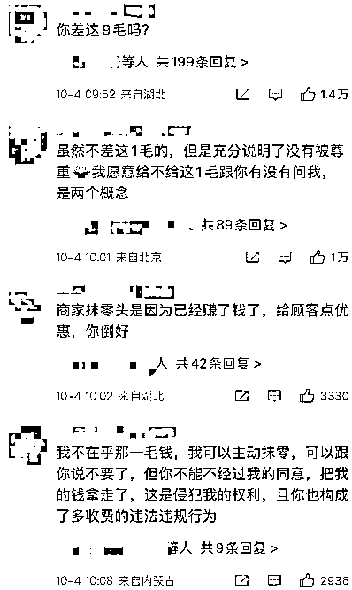
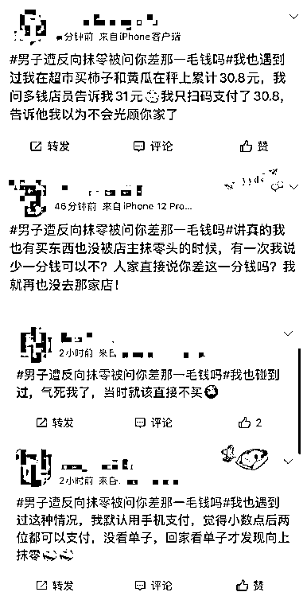

# 男子结账遭反向抹零，被商家反问“你差这一毛钱吗？”

> 原文：[`mp.weixin.qq.com/s?__biz=MzIyMDYwMTk0Mw==&mid=2247545020&idx=5&sn=2d0795e803e75a571b16adf1e885a7ca&chksm=97cbfb84a0bc72929f533d1a399b517b7bcde6d50ddfa3e7633fd1d6b20b05bd288efd62ab26&scene=27#wechat_redirect`](http://mp.weixin.qq.com/s?__biz=MzIyMDYwMTk0Mw==&mid=2247545020&idx=5&sn=2d0795e803e75a571b16adf1e885a7ca&chksm=97cbfb84a0bc72929f533d1a399b517b7bcde6d50ddfa3e7633fd1d6b20b05bd288efd62ab26&scene=27#wechat_redirect)

在外面吃饭，

结账的时候商家顺手抹去零头，

是常有的事儿，

**少个几块钱、几毛钱，** 

**既能凑个方便支付的整数，** 

**也能当个顺水人情，**

和顾客“搞好关系”。

但是， 

见过抹零的，

还真没见过**“反向抹零”**的，

近日，辽宁大连，

一男子和朋友在海鲜大排挡吃饭，

结账时发现账单怎么看都不对劲。

仔细一看才发现，

**总共消费了 930.9 元，**

**收款时竟被“反向抹零”，**

**收取了 931 元。**

[`mp.weixin.qq.com/mp/readtemplate?t=pages/video_player_tmpl&action=mpvideo&auto=0&vid=wxv_2605110199703715840`](https://mp.weixin.qq.com/mp/readtemplate?t=pages/video_player_tmpl&action=mpvideo&auto=0&vid=wxv_2605110199703715840)

男子一脸疑惑，

找到收银员讨说法，

对方称，

**这是正常的“四舍五入”抹零，**

**零头超过 5 就往上抹，**

**反之就往下抹。**

男子表示，

**从来没听说过抹零还能往上抹。**

**没想到，** 

**店员反倒觉得男子不可思议，**

**呛了男子一句，**

****“你要是差这一毛钱，****

****我转给你好吧？”****

**男子将视频发到网上，** 

**这句话让网友都“气笑了”，**

**纷纷为男子鸣不平。**

****

**在这则话题下，**

**有不少网友表示，**

****自己也遇到过这种情况。****

****

**曾经，有媒体报道，** 

**福建厦门的吴女士，** 

**也遇到过这种情况，**

**发现自己被猪肉店老板多收了钱，** 

**吴女士找到市场监管局投诉，**

**猪肉店被罚款 2000 元，** 

**谁知老板此后仍旧我行我素，** 

**接着“反向抹零”，** 

**吴女士再次投诉，** 

**市场监管局又对猪肉店作出了处罚。**

**法官提醒，**

****擅自“反向抹零”是违法行为，****

****遇到这种情况，**** 

****消费者可保留好相关票据及付款凭证，****

****及时向市场监管部门进行反映，****

****捍卫自己的合法权益。****

**“反向抹零”的迷惑行为，** 

**你遇到过吗？**

**评论区聊聊**

**来源：央视网、长沙广播电视台、澎湃新闻**

****

**欢迎关注灰产圈社群服务号**

****