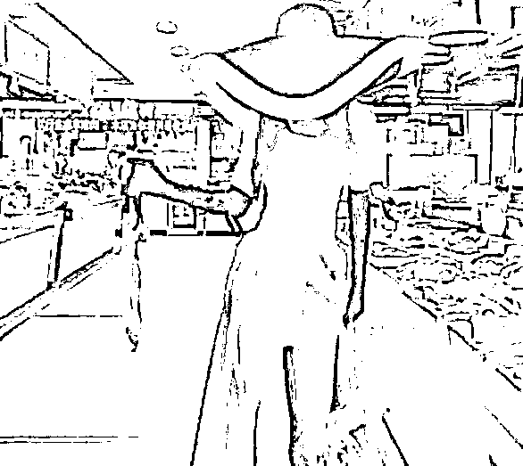

# 飞盘媛、山媛泛滥成灾，“钓鱼媛“又火了？

> 原文：[`mp.weixin.qq.com/s?__biz=MzIyMDYwMTk0Mw==&mid=2247545069&idx=1&sn=51e8271e3fc06b635c558c57713a50ab&chksm=97cbfbd5a0bc72c3ee6037ae01d7039849d6ead3f16255c73df826ec04191fe9dc3ccbbc46d1&scene=27#wechat_redirect`](http://mp.weixin.qq.com/s?__biz=MzIyMDYwMTk0Mw==&mid=2247545069&idx=1&sn=51e8271e3fc06b635c558c57713a50ab&chksm=97cbfbd5a0bc72c3ee6037ae01d7039849d6ead3f16255c73df826ec04191fe9dc3ccbbc46d1&scene=27#wechat_redirect)

自从“上海名媛、佛媛”引起网友的关注后，“媛”字似乎就被划分到了贬义区！ 

**随之出现 了一系列的病媛、幼儿媛、核酸媛、超市媛、飞盘媛...**

**最近，夜店里，一个新圈子开始火了，这个圈子，就叫鱼圈。**

如果你细心观察，就会发现，曾经夜店当家，不摇到腿抽筋不算晚的，如今已经开始岁月静好。

手持鱼竿，回归田园。

**野钓女孩的快乐就是这么简单。**

“轻轻松松又是一条翘嘴进网，再看，再看就把你吃掉”，

在朋友圈中刷到了一个女钓手，穿着超短裙，自创的拿杆方式尽显优雅。

虽然底下有人评论，“这是鲢鳙，不是翘嘴”，

**但这丝毫不影响她钓鱼的心情，毕竟她已经钓到了想要的东西。**

懂的人自然懂，这一身装扮有多格格不入。

**大太阳底下依然要吊带走起。**

这钓法十分独特，挺别致呀！

为了更好地引“鱼儿”上钩，不打窝，也不放鱼饵，毕竟这些东西太腥了，好家伙，连浮漂都不要了。

钓鱼带的不是装备，而是摄影师和吊带裙，**讲究的是“愿者上钩”。**

她们会穿着紧身的长裙钓鱼，

穿着低胸装，黑丝防晒，摆着矫揉造作的姿势握着鱼竿。

气势完全不落下风。

虽然她的穿着，十分严实。

但就是这种明明什么都没露的，才叫撩人于无形。

咱也不知道，就想问问，这个姿势专业么？

甚至有时小露大腿，打卡钓鱼，

一条 2 两的小鱼上钩，哎哟，

赶紧发朋友圈呀，拍照庆祝呀。

**她们发的文案句句修心，**

**配图却张张是钓金龙鱼的心思。**

经过一番激战，女钓手拿下了第二名的好名次，榜一的大哥直接将 2W 奖金奉上，随后举办庆祝大会。

**欢呼，欢呼，有钱的大哥，大哥你抽烟，**

大哥，天气热，来杯 82 年的冰阔落。

钓鱼讲究的是开心，走，大哥，我帮你收拾工具，咱们回家~~~回家吃鱼。

**不愧是钓鱼“大师”，绝！**

女钓手们的加入，钓鱼界是越来越热闹了。

你那么爱鱼，爱吃鱼，去市场逛呀，

结果菜市场也沦陷了， 

做秀场，走起了台步

女性的一言一行，甚至穿搭，瞬间被推上风口浪尖！ 

之前网上出现了“山媛”，原本是三位小姐姐高高兴兴的去爬山，

然而却遭到网友的嘲讽：“山媛吗”、“穿瑜伽裤爬山？”

妙啊，瑜伽裤外穿=丢人？！

如果你留意各大城市的街头，不难发现：瑜伽裤早已成为一道街头风景线~

瑜伽裤的流行背后，离不开舒适、自由、健康，

且正在逐渐成为女性心目中穿衣风潮的关键词！

毕竟来势汹汹的 YQ 让更多人意识到，健康的身体永远位是第一位。

运动不仅成为当下流行的生活方式，更成为日常生活中不可或缺的一部分。

以身边朋友的穿搭感受为例，只要是穿过瑜伽裤的女生，都会有种“穿上就爱上”的感觉。

从材质来看，它具有贴身透气、轻薄吸汗等等特点，

其次，自身的一片式穿着设计（没有裤缝），能明显突出臀部和腰部的曲线。

不同于传统观念里的秋裤、打底裤，它的起初设计灵感来源于舞蹈演员，

后来由于瑜伽等运动的兴起，逐渐被广泛关注，在拒绝“body shame”思潮的影响下，

即便不具备凹凸有致的身材，也不影响女性把瑜伽裤穿出街。

But！瑜伽裤有多火，争议就有多大。

很多运动博主就曾吐露自己因为瑜伽裤外穿遭歧视的经历，类似的事情并非罕见，

总有网友冒出“穿成这样就敢出门？”、“真当自己超模身材了？”

等等对瑜伽裤外穿的嘲讽...

甚至还遭到道德层面尖锐的谴责：

一些人认为瑜伽裤的轮廓过于贴合身体，以至于走在街上难免会有男性想入非非。

早前，知乎上的一个提问：健身穿 Legging 里面要不要穿内裤？

原本女生间细致全面的经验分享，却引发了部分男士的冷嘲热讽。

随着讨论的激烈，话题逐渐升温，创造了近四千万浏览量。

翻看这些热度极高的留言可以发现，当女性们给出建议穿着浅色或同色内裤，不要穿着普通或有花边内裤的同。

讲真，类似的争议并不是第一次发生~

在前几年关于“穿吊带逛街为什么总被盯着看？”、“为什么说穿黑丝的女生就是经验丰富？”的评论区，和这次几乎没有太大差异。

比基尼、吊带衫、一字肩上衣…女孩子们一次又一次因为自己的穿着喜好，

遭受着从穿衣风格上升到精神人格的侮辱...

但凡可以凸显出女性身材曲线的服饰，总会被标上“品行不端”的指摘~

这不禁让人反思：为什么衣服款式和布料的多少，会成为社会的热议话题？

女性选择性感的衣着，并不代表她需要承受被骚扰或侵犯的后果，

穿得少=骚？，穿得多=安全？

身材不好，被骂！身材好，实现穿衣自由，也被骂？

来源：电脑学习

欢迎关注灰产圈社群服务号

