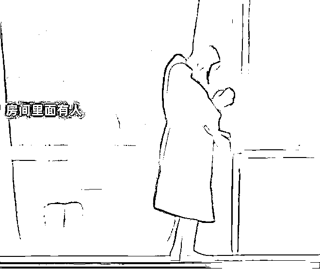

# 广州“浴袍女”站 28 层高楼外躲“捉奸”？后续女子发声：系前男友不忠，一时上头做傻事

> 原文：[`mp.weixin.qq.com/s?__biz=MzIyMDYwMTk0Mw==&mid=2247545069&idx=2&sn=fba472bb790a26ecbf3a8aac1238949e&chksm=97cbfbd5a0bc72c3a5d4581bf32d8a8801632ba011816f07693c628ab1cba4b1d9598d9e44ee&scene=27#wechat_redirect`](http://mp.weixin.qq.com/s?__biz=MzIyMDYwMTk0Mw==&mid=2247545069&idx=2&sn=fba472bb790a26ecbf3a8aac1238949e&chksm=97cbfbd5a0bc72c3a5d4581bf32d8a8801632ba011816f07693c628ab1cba4b1d9598d9e44ee&scene=27#wechat_redirect)

****

前段时间，有一则浴袍女站高楼外的视频，引起网友的注意。

起初看到这个视频的时候，还以为是女子出轨被抓现行才逃至窗外。

后被消防员救下，才了解并非如此。

都是一些网友们为了蹭热度瞎编乱造出来的文案。

01

7 月 21 日午间，在广州天河区万菱汇高层公寓上，

**一名穿着浴袍的女子从酒店窗户翻出，站在窗外极窄的屋檐上，随时都有坠下的可能，看着十分惊险。**

****

从视频可以看出，这高度，别说恐高的人看的头会晕腿发软，即便是没恐高的人，站在里头往下看，都会感到害怕。

更何况是站在窗外，还是没有任何的防护下。

事件发生时，该女子站在屋外玻璃墙边的横条上，屋内还有一名女子在走动。

当时女子并没想直接从楼上跳下，而是挥舞着手，时不时的拍打着窗户，正言语激动和屋内的人对话。

因此有就网友猜测，这名站在窗外的女子并没有想要轻生，而是在躲避屋中的女子。

或是因为争吵过于激烈才有了视频中的这一幕。

****

随后消防员接到任务后，立马赶到了现场，并在楼下架起了救生气垫。 

又派了一名消防员上楼安慰劝阻女孩，最终女子被安全救下。

****

而现场网友疯狂吃瓜，纷纷出动拍摄。

甚至动用了无人机和单反……那么高的地方将女生的表情都拍得一清二楚……

**甚至有人制作出了恶搞图片：**

****

许多不明真相的吃瓜群众仅靠自己的猜想，便把“偷情和捉奸”视为真相

这些未经核实的言论，脱口而出。

02

这是事发时有人从房间内往外拍的。

 

这个是浴袍女生的妹妹拍摄的，她当时也在现场，

**女子的妹妹发文辟谣，这并不是什么“小三”、“捉奸”的戏码。**

**随着网上铺天盖地的“捉奸”“小三”谣言越传越俞烈，当事人不得不出面进行回应。**

于是，22 日，她面对媒体发声表示：

“所谓‘捉奸’子虚乌有，自己是一名在校大学生，

**此次事件是因为得知男友有‘外遇’，当时情绪激动才作出危险动作。”**

据了解，当天女子会有这样的举动，是因为得知男友同时同时交往多位女性并出轨，找男友对峙时，他非但不承认，还出言辱骂我。

因为太难过了，一直都睡不好，必须得吃安眠药才能好好睡下，闺蜜得知后来公寓陪伴我。

第二天醒来时，又想起了自己与男友的点点滴滴，始终没办法释怀，再加上男友一句道歉也没有，还骂她。

越想越上头，就爬到了窗外。

好在消防员救下了我，现在冷静想想，还是自己太冲动了，非常的感谢消防员给了我第二次生命，以后一定会好好的生活。

在朋友的眼中，自己也不是一个冲动会做出这样事情来的人，当时朋友们也都吓傻了。

现在再回想起之前的种种，自己确实是被男友 PUA 了，似乎自己做什么都是错的。

面对男朋友的出轨，女子一下子内心就崩塌了，经过了这次彻底清醒了，也表示不会再有过激的举动。

看到女子的回应，网友纷纷暖心安慰，是前男友不忠诚，你干嘛惩罚自己，一定要好好的啊。还有的网友表示，没有任何人值得你放弃生命。

希望你以后能珍惜自己的生命，好好爱自己，这样才会有人爱你。

03

人的生命只有一次，千万不要因为一点点的挫折就选择轻视生命。

这是非常不明智也很愚蠢的选择。

人这一生不可能都是一帆风顺的，总是会遇到各种不顺遂的事情。

但这些事情都是可以通过时间或者努力去解决的，适当的将情绪释放出来，也可以得到更好的帮助。

遇到了渣男也不要将气撒在自己的身上，不要拿别人的过错来惩罚自己，大不了就是重新选择，重头来过。

遇到这个不行就下一个，总会遇到那个对你好的人。

即便是遇不上那个可以陪伴一生的人，你还有家人和朋友爱你。为了他们你也该好好的活下去。

生命的意义在于活出自己，活出意义。

大家也不能天真的相信所谓的：生命诚可贵，爱情价更高。

人生在世，除了生死，一切都是浮云。

而对于网络世界的谣言，我们也不可轻信，更不要加以传播，因为尊重他人也是尊重自己。

来源：幸福小酒馆

欢迎关注灰产圈社群服务号

