# 上海名媛餐厅尴尬一幕：爱装逼的人，终于被狠狠打脸了

> 原文：[`mp.weixin.qq.com/s?__biz=MzIyMDYwMTk0Mw==&mid=2247545069&idx=4&sn=c6a544b415b539a02b3ea43a34e7dc82&chksm=97cbfbd5a0bc72c39e642bdce9a21d08b790e039da6a7ceb4cc1b6620703e9681fe0ba3c8224&scene=27#wechat_redirect`](http://mp.weixin.qq.com/s?__biz=MzIyMDYwMTk0Mw==&mid=2247545069&idx=4&sn=c6a544b415b539a02b3ea43a34e7dc82&chksm=97cbfbd5a0bc72c39e642bdce9a21d08b790e039da6a7ceb4cc1b6620703e9681fe0ba3c8224&scene=27#wechat_redirect)

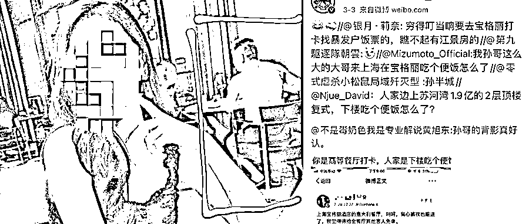

1

朋友圈或社交平台上，你们一定都遇到过这样的“名媛风”： 

每次出场都是豪车名牌、高级酒店，充满了奢侈的味道。

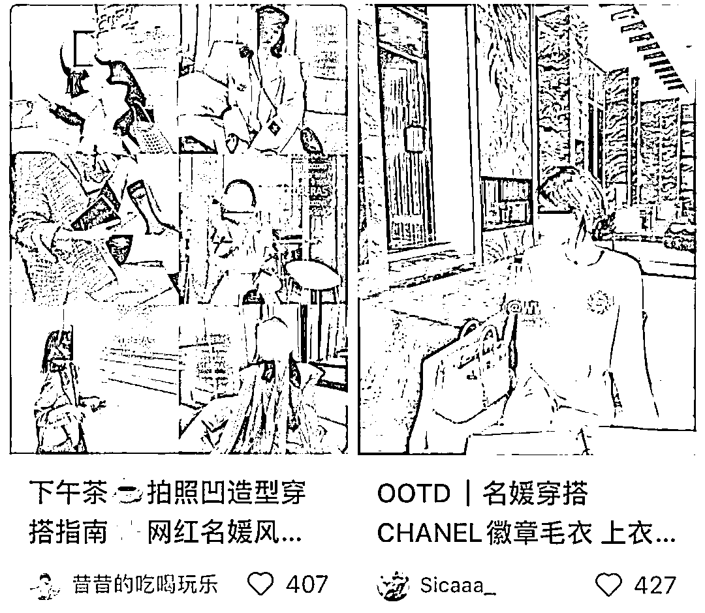

精致的生活、完美的朋友圈，让人好生羡慕。

短视频刷多了，

总感觉自己是全世界最穷的那个人。

前段时间火了的“上海名媛”群，她们的真实日常，其实是这样的。

**“下午茶拍照有姐妹拼单吗？”**

**“就差四个人了，大家快来拼一拼！”**

…

在群里，6 个人拼单一份丽思卡尔顿双人下午茶，平摊每人 85 元，就能享受一段精致的上海名媛时光。

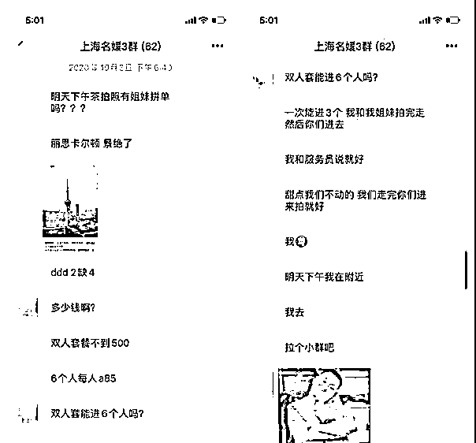

假名媛事件刚告一段落，上海宝格丽酒店又发生了魔幻的一幕。

有个漂亮女生专门去宝格丽酒店的网红意大利餐厅打卡，看着酒店餐厅的陈设与传闻描述一致，想着这一趟算是没白来。

就在她要拍照的时候，镜头里一个穿背心裤衩拖鞋的大哥，碍了她的眼。

**背心裤衩的屌丝居然也在宝格丽餐厅用餐，什么情况？**

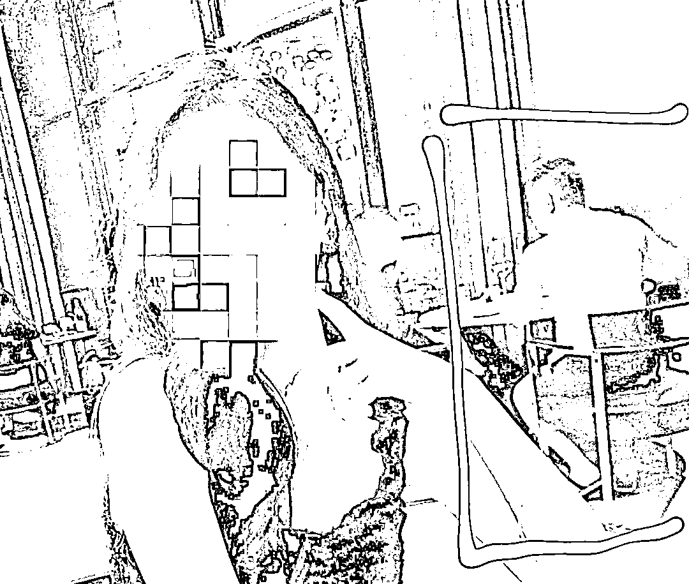

**于是发了条微博，阴阳怪气地嘲讽：**

**“上海宝格丽酒店的意大利餐厅，怎么穿个背心裤衩也可以进了？我觉得需要给全餐厅的客人免单。”**

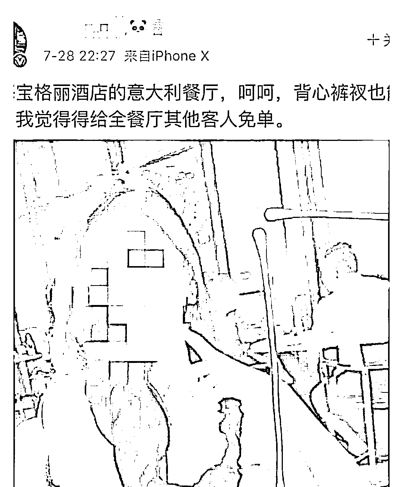

那气愤的模样，就像是在说：

**“我特意买了一身名牌衣服，就是为了能在人均消费 1500 的高级餐厅发个朋友圈，炫一下富，而你一个穿大裤衩的 low 男，不配和我坐在同一家餐厅吃饭！”**

没多久，这条微博就被啪啪啪的打脸了。

> “你是高档餐厅打卡，人家只是下楼吃个便饭。”
> 
> “我孙哥在苏河湾有 1.9 亿的 2 层复式套房，下楼吃个便饭怎么了？”
> 
> “穷的叮当响要去宝格丽打卡找暴发户饭票的，瞧不起有江景房的”

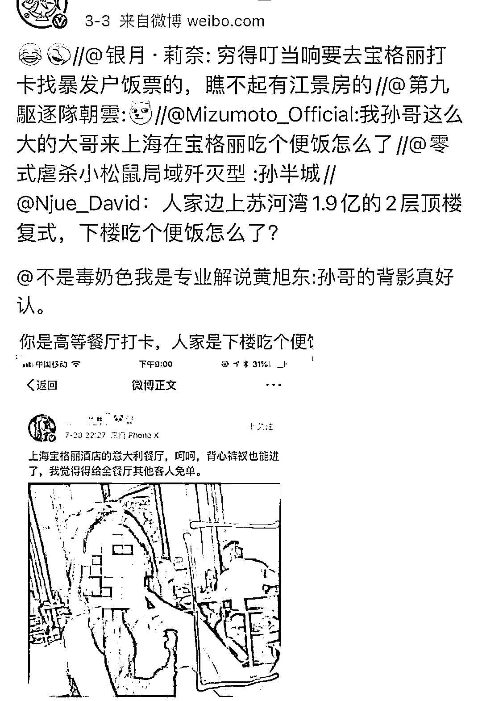

网友的回复彻底笑喷了。

**生活中，总是有这样一些人，哪怕花半个月工资去做一件事，打肿脸充胖子也要把自己伪装成过得很好。**

朋友圈里岁月静好，现实生活一地鸡毛。

他们自以为是的优越感，真是让人尴尬的恨不得脚趾扣地。

**一个人越是炫耀什么，内心就越缺少什么。**

**而内心真正富足的人，从不把优越感写在脸上。**

**2**

之前，陌陌总裁王力发了这样一条微博，戳破了很多人对霸道总裁的幻想：

“下图是比较典型的霸道总裁的样子：因为业绩压力过大而干枯分叉的头发；

因为长期睡眠不足而迷惑无神的双眼、因为过度焦虑紧张而蜡黄起痘的皮肤；

因为植物神经紊乱而严重发福的身材、因为疲劳困顿而四仰八叉的坐姿；

以及加起来不到 300 块的优衣库 T 恤和无印良品短裤。

以上就是霸道总裁的标准照，请编剧们不要再用杨烁来误导广大人民群众了。”

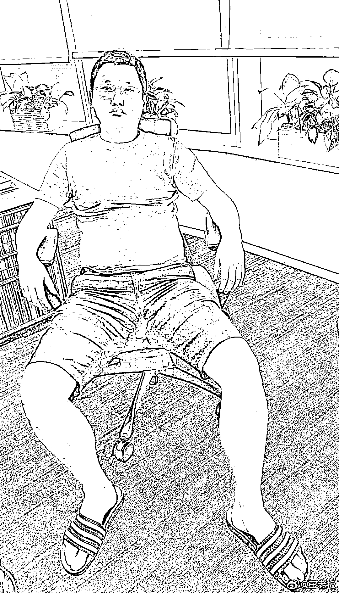

现实世界中，那些叱咤风云的老板、大佬们，其实大多数都是这样朴素的画风。

格力董事长董明珠，对 100 块钱的花裙子情有独钟，一穿就是好几年；

小米创始人雷军，经常在发布会上穿着一件简单到极致的黑 T 恤，朴实无华且枯燥；

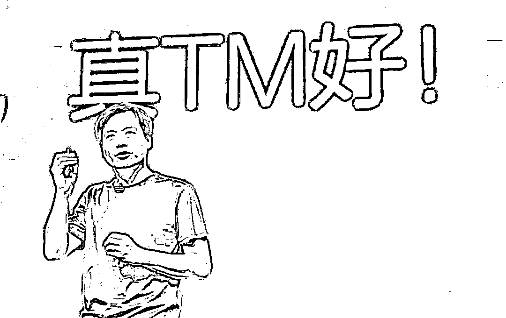

万达董事长王健林，平时就喜欢在公司食堂吃饭，钟爱的菜单是素白菜、溜丸子和韭菜盒子。

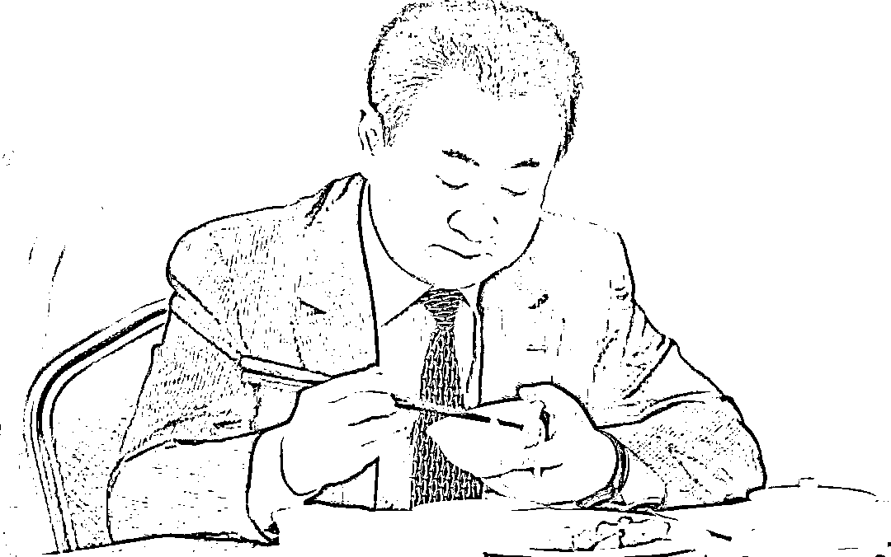

**有句话说：“水深而流缓，人贵而语迟。”**

意思是，越是水深之处，越是水流缓慢；越是厉害的人，越不会太过张扬。

那些不显山不露水的“隐形富豪”，早已不需要通过奢侈品来彰显自己的身价，早已脱离了浅显的低级趣味。

他们不需要向外界证明什么，底气来自于内心的富足，而不是外表的炫耀。

果然，装逼还需自身硬，低调到极致，才是最牛逼的炫耀。

**3**

在这些炫富视频的影响下，一些年轻人的价值观开始变了。

“假精致”，成为了 ta 们的氧气。

有越来越多的女孩，用精致的、闪着光的昂贵物品来彰显自己的不平凡。

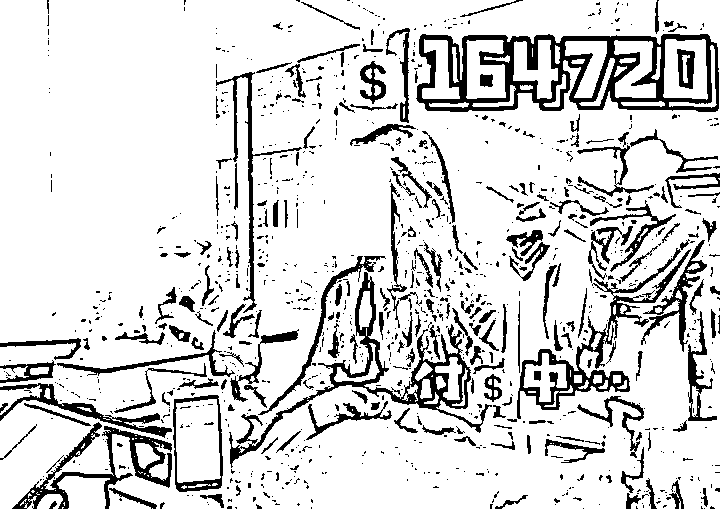

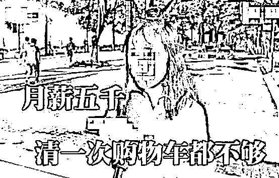

也有越来越多的男孩，用奢侈的、名表球鞋来彰显自己是高人一等的。

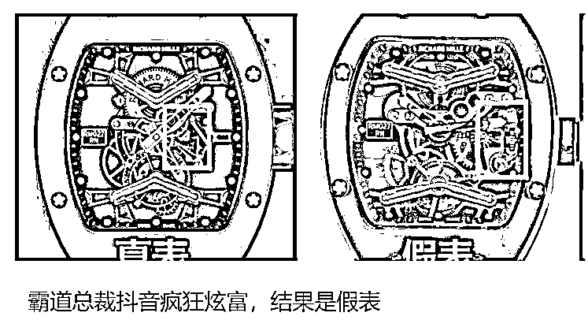

这些年轻人在购买时，完全没考虑过是不是自己需要的。购买这些东西的钱，都需要花费大量的工资甚至伸手问父母要。

**《圆桌派》有一期对这种现象表达了看法：在中国，奢侈品跟身份是不匹配。**

很多人上班挤地铁，每月只赚几千块钱，却背着几万十几万的包，用几千块化妆品。

然后再美美的拍个朋友圈。

这些奢侈品并不是为这个阶层设计的，但很多人努力去花。

喜欢“买、买、买”，只买贵的，不买对的；“死要面子活受罪”，喜欢被人点赞，被人羡慕。

风风光光的人生背后，是债台高筑。精致的外表后面，是一种极度虚伪的心态。眉开眼笑的背后，是言不由衷。

**“真的假不了，假的真不了”，假精致的生活，就像一根稻草，看起来很轻，但随时可以压垮一个人。**

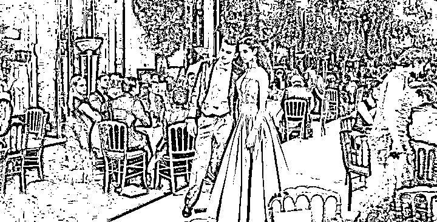

网上太多的噪音，使得很多年轻人迷失了自己。

他们似乎忘记了，富有从来不只是体现在金钱上，更多的是精神层面。

**三毛曾说：精神富足的人，就算一无所有，同样能过得风生水起；精神贫穷的人，哪怕得到再多金钱，还是会将人生活得一败涂地。**

深以为然。

让我们一起戒骄戒躁，做一个内心真正富足的人。

莫做朋友圈里的王者，现实中的青铜。

**写在最后：**

看过这样一个故事。有一次，英国王室在伦敦为印度当地的领袖举办了一场宴会。

宴会中，达官贵人们觥筹交错，相谈甚欢，气氛融洽。

当最后一道餐点结束时，侍者为每人端来了一盘洗手水，精巧的银盘里盛着清澈的凉水。

印度客人不知道这盘凉水是用来洗手的，不由分说地端起盘子，咕噜咕噜地一口气喝光了，一旁作陪的贵族见此大吃一惊。

而身为宴会主人的温莎公爵，却面不改色，一边与客人继续谈笑风生，一边也端起了洗手水。

他没有多说什么，而是效仿着印度客人的样子，自然而然地将那盘洗手水一饮而尽。

在场的众多贵族见状，紧绷的心弦像获得了解放一般，也都纷纷把面前的水喝光。

原本一场即将引发的难堪与尴尬，就这样在温莎公爵的善解人意中，化解于无形。

对比那位在高档餐厅打卡的网红，看不起他人的着装，觉得别人拉低了自己的层次，简直高下立判。

**果然，有些人的优越感，并不是来自容貌、财富、学历、地位，而是由于教养的缺乏，见识的浅薄。**

真正的高贵，是能站在对方的角度，体恤和包容他人。

真正的强者，从来不显山露水，而是低调又充满涵养。

想起作家林清玄去买花，卖花人对他说：“自然界中白色的花几乎都很香，但颜色艳丽的花往往不怎么香。”

**人亦如花，越装逼，越暴露出一个人内在的浅薄。**

**愿我们都能，戒掉总是爱显山露水的浮躁，用内心的富足填满匮乏感。**

来源：精读

欢迎关注灰产圈社群服务号

