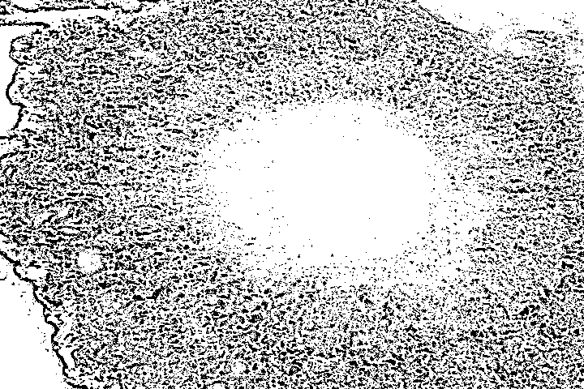
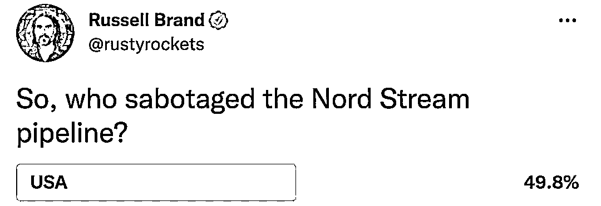
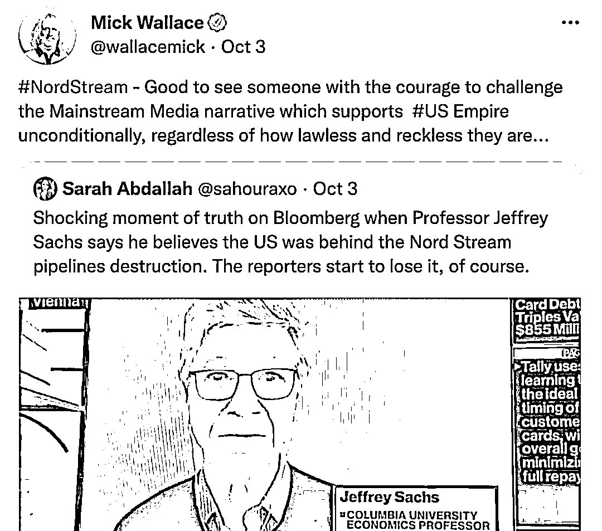

# 美国专家：“北溪”管道泄漏 美国嫌疑最大

> 原文：[`mp.weixin.qq.com/s?__biz=MzIyMDYwMTk0Mw==&mid=2247545069&idx=5&sn=14460249bad55e05166560e1179398a2&chksm=97cbfbd5a0bc72c3d3ebe2acd1c413545d9fdc00ec702fcf051176f4ce2a30830080680180a9&scene=27#wechat_redirect`](http://mp.weixin.qq.com/s?__biz=MzIyMDYwMTk0Mw==&mid=2247545069&idx=5&sn=14460249bad55e05166560e1179398a2&chksm=97cbfbd5a0bc72c3d3ebe2acd1c413545d9fdc00ec702fcf051176f4ce2a30830080680180a9&scene=27#wechat_redirect)

“北溪”天然气管道泄漏事件日前备受关注，对肇事者的猜测和指责在国际舆论场上引发“漩涡”。两位美国专家日前分别在接受新华社和美国媒体采访时直言，**从事件逻辑和种种证据来看，美国嫌疑无疑最大。**

请看新华社记者从华盛顿发回的报道——

[`v.qq.com/iframe/preview.html?width=500&height=375&auto=0&vid=w3359yxysqe`](https://v.qq.com/iframe/preview.html?width=500&height=375&auto=0&vid=w3359yxysqe)

**美国教授：俄欧双输 美国“最有可能”**

联合国秘书长前特别顾问、美国哥伦比亚大学经济学教授杰弗里·萨克斯 3 日接受新华社记者书面采访时表示，种种迹象表明，“北溪”天然气管道泄漏“最有可能的肇事者是美国”。

萨克斯指出，美国把矛头对准俄罗斯的说法没有说服力，**这起事件的“最大输家是俄罗斯和德国”，欧洲“在很多层面上遭到严重打击”。**

“这起事件令欧洲更容易受到能源危机所引发的经济严重衰退的影响，令欧洲更加依赖美国，”他说，“也令俄罗斯失去了一个谈判筹码。”

这张瑞典海岸警卫队 9 月 28 日发布的航拍照片显示的是，“北溪-1”天然气管道仍在泄漏大量气体。新华社发（瑞典海岸警卫队供图）

当天，萨克斯在接受美国彭博社视频连线采访时，也表达了自己对美国的质疑。当被主持人问及为何认为美国是肇事者且有何证据时，萨克斯一口气给出了三个线索：部署在波兰的美国军事直升机曾出现在“北溪”管道附近区域；美国官员此前曾警告“无论用什么办法，必须终止‘北溪’项目”；美国国务卿布林肯把“北溪”天然气管道泄漏描述成“巨大机会”。

布林肯 9 月 30 日在记者会上针对“北溪”管道泄漏事件说，“无论如何，这件事也算是一个巨大的机会”，这有利于欧洲“一次性彻底摆脱对俄罗斯能源的依赖”。此番公开表态连日来使舆论哗然。

“倘若他真担忧国际重要基础设施的安全问题，如此表态未免太奇怪了。”萨克斯说。　　

**美军退役上校：美英具备破坏管道能力**

美国前国防部长高级顾问、美军退役上校道格拉斯·麦格雷戈 9 月底在接受美国播客视频连线采访时表示，“北溪”管道设计非常坚固，世界上没有多少国家有能力破坏管道。**“北溪”是俄罗斯重要的经济来源，认为俄罗斯破坏管道的说法“很荒唐”；而德国对管道天然气有着巨大需求，也不可能是肇事者。**

剩下的选项不多，美国海军特种作战部队和英国皇家海军具备这个能力。“这一点很清楚。”他说。

英国演员及政治活动人士拉塞尔·布兰德在社交媒体上发起“谁破坏了‘北溪’管道？”投票，吸引近 2 万网友参与。美国以 49.8%得票率名列第一。

英国演员及政治活动人士拉塞尔·布兰德发起网络投票的截屏

**“在西方，你不被允许说出这些”**

在谈及对美国肇事的怀疑时，萨克斯也无奈表示，他深知自己的观点与当前西方主流媒体的叙事对立。

**“在西方，你不被允许说出这些。”**他说，**“但事实上当我与全世界其他地方的人聊起这事，大家都觉得是美国干的。就连我们报纸报道这个领域的记者私下也会对我说，‘当然就是这么回事’**。但这些不会出现在我们的媒体报道上。”

欧洲议会议员米克·华莱士 3 日在社交媒体上转发了彭博社对萨克斯的采访视频片段，并留言评论：“很高兴看到有人勇敢挑战当前主流媒体无条件支持‘美帝国’的叙事方式，无论美国行事多么无法无天、肆无忌惮。”

欧洲议会议员米克·华莱士社交媒体评论截屏

美国约翰斯·霍普金斯大学经济学教授史蒂夫·汉克留意到，萨克斯在强调美国嫌疑最大时被主持人打断，这体现出华盛顿审查不符合其宣传口径的内容。

美国新闻评论员莉萨·布思在社交媒体上评论说：“俄罗斯完全可以关闭供气，何必非要破坏‘北溪’管道？我对我们被告知的大部分内容表示怀疑，我们已被听了太多谎言。”

来源：新华社

欢迎关注灰产圈社群服务号

