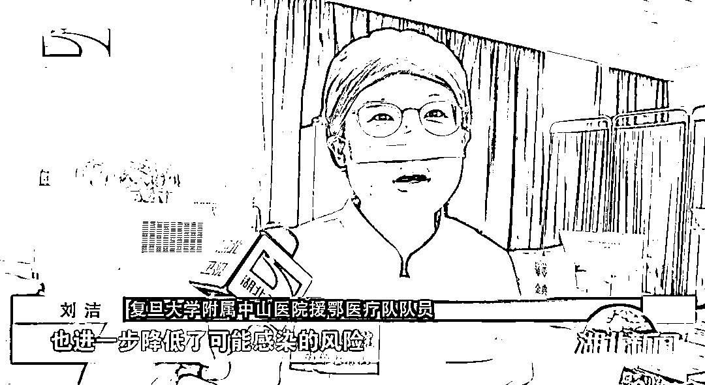
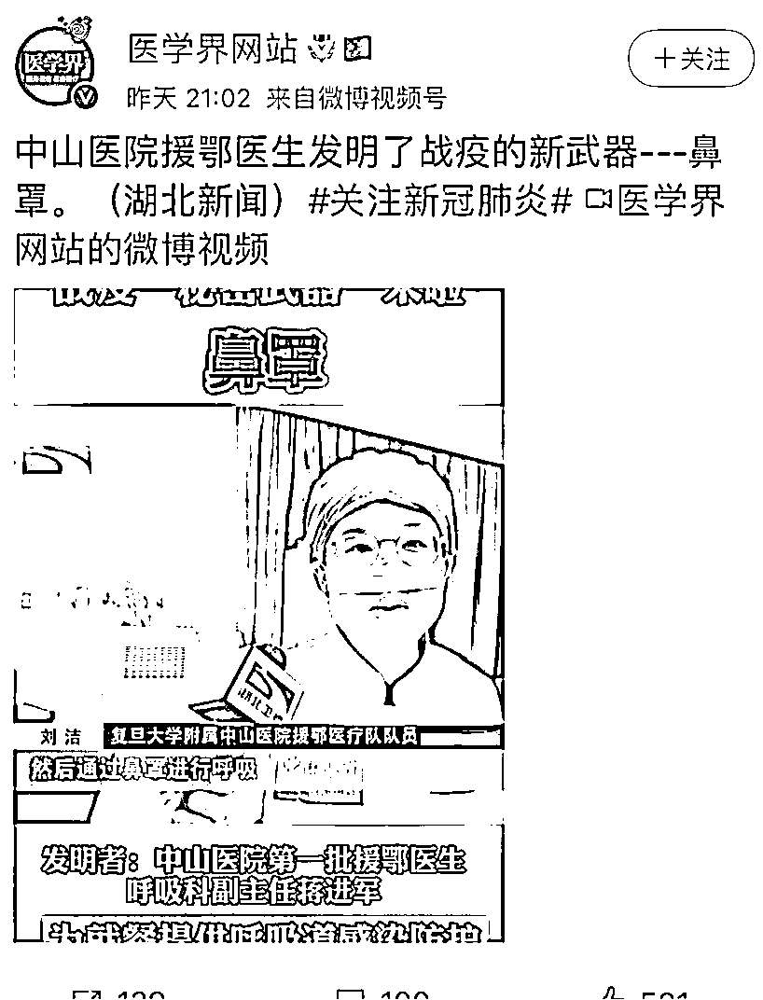
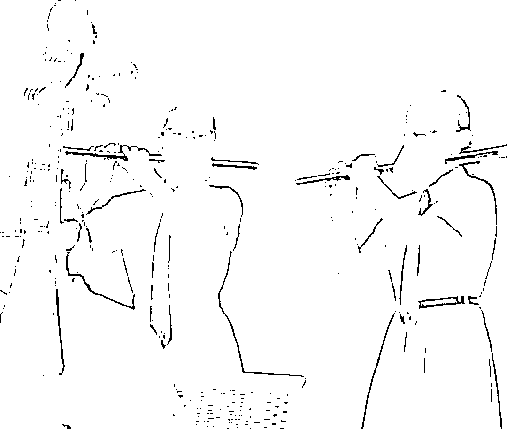
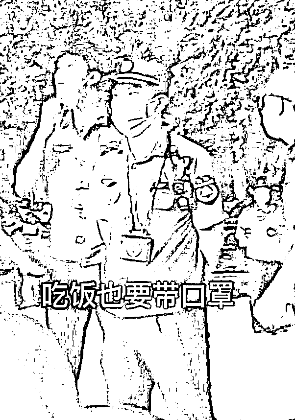

# 这个新闻，是我今天快乐的源泉

> 原文：[`mp.weixin.qq.com/s?__biz=MzIyMDYwMTk0Mw==&mid=2247545069&idx=6&sn=6f558fb5da9ae40ed1e29160e28f6685&chksm=97cbfbd5a0bc72c3fa326e5218c6219d9313f0a8676417b10371b7e65c54698092c3d8643883&scene=27#wechat_redirect`](http://mp.weixin.qq.com/s?__biz=MzIyMDYwMTk0Mw==&mid=2247545069&idx=6&sn=6f558fb5da9ae40ed1e29160e28f6685&chksm=97cbfbd5a0bc72c3fa326e5218c6219d9313f0a8676417b10371b7e65c54698092c3d8643883&scene=27#wechat_redirect)

昨天，有媒体的官方微博发布了一个视频，这个视频引起了不少网友的广泛热议。

可以看到，发布这个视频的博主，微博名字叫“医学界网站”——这是一个中国的较为权威的医学新媒体和医生服务平台。而他们发布的视频，是这样的：

[`v.qq.com/iframe/preview.html?width=500&height=375&auto=0&vid=w33583l840m`](https://v.qq.com/iframe/preview.html?width=500&height=375&auto=0&vid=w33583l840m)

**看完这个视频后，我承认，我笑了很久。不夸张地说，这个新闻，真的是我一天快乐的源泉了。**

虽然这个新闻让我很快乐，但是从视频中，通过这些医护人员穿的衣服我们可以看得出，这应该是在冬天或春天的时候拍摄的视频，因此可以判断，这个视频的拍摄应该是有一段时间了。 

**所以看完这个视频后，查一下我发现，这个视频的发布时间，其实是两年前——也就是疫情刚爆发后的几个月。**

看到这个视频后，很多网友也都表示这个新闻很能令自己欢乐：

**虽然大家看到这个设计后都乐了，虽然大家都觉得这个发明有点“达文西”，但是我想说，其实我个人是理解这个设计的。**

我知道这个设计看上去有点奇怪，也知道这个东西其实用处并不大。但是在当时疫情刚爆发，而且我们也对病毒还不了解的情况下，医护人员吃饭的时候带上这个东西，这从某种程度上来说，我觉得应该表示理解。

**毕竟当时大家对病毒都还不了解，当时的抗疫医护人员们为我们冲锋陷阵，他们抱着一份安心带上这个，其实也是为了健康着想，所以我觉得这个新闻当个乐子看就好了，没必要去指责新闻中的当事人。**

两年前，大家在对病毒还不了解的情况下，医护人员弄出“鼻罩”这个看上去有点“达文西”的发明，我是理解的。

但是在两年后，在大家都对病毒已经有了一定认知，且也知道病毒的毒性变化、传播性的变化、以及已经大概知道关于防病毒的各种举措会衍生出的各种利弊之后，此时一些人还做出一些奇葩的举动，这就很令人不理解了。

例如这种：

当然，上面这个图，我们不能怪吹乐器的孩子，要怪也是怪让孩子带上口罩吹乐器的主办方或者视频拍摄方，因为这种奇葩操作，确实是很令人费解的。

还有这位让人吃饭戴口罩的小伙子：

上面这位小伙子，则是在大庭广众下，用非常骄傲的表情告诉吃饭者，他自己吃饭的时候就是把口罩摘下来，吃一口，然后吃完一口再戴上，想吃的时候又把口罩摘下来，再吃一口，然后再戴上... 

**这就是典型的没事找事，故意刁难为难吃饭的群众了。**

**而且同样让我不能理解的，还有如今的一些学校的“封校”举动。**

我承认，在两年前，在疫情刚开始爆发的时候，那时候疫情很严重，病毒的毒性也相对较强，而且当时我们对病毒的大多数特性都不了解，所以那时候为了防止疫情大规模扩散，我认为“封校”也是一种可以理解的举动。

但是到了现在，一些学校还坚持动不动就“封校”，这就比较让我不理解了。

如果一个大学所在的城市，每天还不停地有几十例或者上百例以上的新增，那我认为学校领导决定进行封校，这也无可厚非。

但是现在，我们其实已经很少有城市一天会出现几十例上百例的新增了，可此时一些学校则还是动不动就封校，甚至坚持长期封校，这真的合适吗？

这些学校的这种举动，真的不是过度防疫吗？这种决定，真的有利于学生们的身心健康吗？

我知道有一些大学生，他们自从上了大学之后，就从没见过自己的同学（都是线上上课），没见过自己的学校，还有一些同学则是进了学校后，却还从没机会出来看一看这座自己大学所在的城市，还有一些同学，则是一直无法出学校办事...

所以，一些学校这种“一刀切”式的此类抗疫举动，真的是为学生好吗？这真的是从学生的利益考虑问题吗？

这种令人不解的高校治理模式，到底是为了学生好，还是为了替校领导规避责任，为了替校领导“保乌纱”呢？

**回到文章最开始的话题。**

在疫情最开始的时候，抗疫医护人员们发明的上面这个“鼻罩”，看上去虽然有点“达文西”，但那时候大家都处于未知状态中，所以我是很理解他们的这个发明的。

但是现在疫情已经过去两年了，大家都对现实有一定程度的了解了，而如果此时我们一些人还要求孩子戴口罩吹笛子、要求群众戴口罩吃饭、或者动不动就对学生封校...那对于这种现状，我只能说——抱歉，请恕我无法理解……

来源： 麦杰逊

欢迎关注灰产圈社群服务号

# 原文：[`mp.weixin.qq.com/s?__biz=MzIyMDYwMTk0Mw==&mid=2247545069&idx=7&sn=cd4185ed46b50efc78151e6d49c59de3&chksm=97cbfbd5a0bc72c367d0673ff6aa7173183505bf07a09aa52914445ca2b0b643af46b2c0eb58&scene=27#wechat_redirect`](http://mp.weixin.qq.com/s?__biz=MzIyMDYwMTk0Mw==&mid=2247545069&idx=7&sn=cd4185ed46b50efc78151e6d49c59de3&chksm=97cbfbd5a0bc72c367d0673ff6aa7173183505bf07a09aa52914445ca2b0b643af46b2c0eb58&scene=27#wechat_redirect)