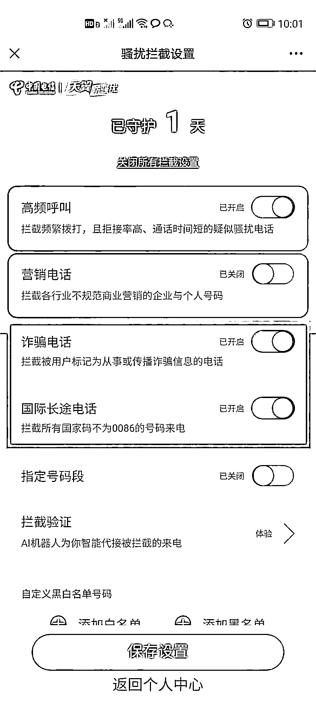

# 我的银行卡居然收了别人 216 万！我怎么不知道？

> 原文：[`mp.weixin.qq.com/s?__biz=MzIyMDYwMTk0Mw==&mid=2247545069&idx=8&sn=19a75a83696f8b75ca1003f4075d87ce&chksm=97cbfbd5a0bc72c399f2fff3ebd30c343db00699cf4bf8f532f4d91193bc952f2f9c09f48c12&scene=27#wechat_redirect`](http://mp.weixin.qq.com/s?__biz=MzIyMDYwMTk0Mw==&mid=2247545069&idx=8&sn=19a75a83696f8b75ca1003f4075d87ce&chksm=97cbfbd5a0bc72c399f2fff3ebd30c343db00699cf4bf8f532f4d91193bc952f2f9c09f48c12&scene=27#wechat_redirect)

“你已经涉嫌协助诈骗收款，

银行卡即将被冻结。”

莫名接到“民警”打来的电话

并发来“协查函”

你会有什么样的反应？

如果还没有答案

就先看看小李(化名）的故事

...... 

9 月 29 日，小李突然接到一个“00”开头的号码打来的电话，号码归属地显示澳门，小李接起电话后，对方称是公安局的民警，因小李的银行卡被他人用来诈骗，现要将他的银行卡冻结。

不明所以的小李一听对方身份虽有些疑惑，但更多的还是紧张，并立即表示愿意配合调查，双方加了微信。

加上微信，对方给小李发来一份协查函，上面显示小李的个人信息都准确无误，公章是南京市公安局刑事侦查总队，简要案情是查获招商银行卡协助犯罪。意思是，小李的一张招商银行卡自 8 月 11 日起，被他人使用协助诈骗收款，共 17 人被骗，涉案金额达 216 万元。

“人在家中坐，祸从天上来”？小李一看，更懵了。当时被吓到的他，想都没想，便按照对方告诉他的指示进行操作，分两次给对方转账 5 万余元。

当对方再次要求转账时，小李这才反应过来，发现自己上当受骗，遂立即向警方报案。目前，该案正在进一步办理中。

反诈民警提醒

如果你收到“00”或“+”开头的境外来电时，请提高警惕，注意甄别。若无固定的海外关系需要经常联系的，可联系运营商屏蔽境外号码。

凡是来电自称“公安机关、政府部门、社保局”要求通话保密，配合调查接受资金审查，需要转账或填写支付密码的，都是诈骗!

接到自称“客服”或“商家”的电话称可以退款或理赔的，99.9%都是诈骗!一定要登录官方购物网站查询相关信息。

**附国家反诈中心 APP 及各家运营商**

**境外来电屏蔽功能设置方法↓**

国家反诈中心

第一步：打开国家反诈中心 APP

第二步：开启来电预警功能

第三步：随时更新来电预警功能，并开启上图相关功能

中国移动

第一步：中国移动用户通过短信发送“KTFSR”到 10086 免费开通。

第二步：再关注微信公众号“中国移动高频骚扰电话防护”。

第三步：开启国际号段拦截功能。如您还想拦截别的类型的骚扰电话可开启对应号段的拦截功能。

中国电信

第一步：中国电信用户拦截国际电话可先关注微信公众号“天翼防骚扰”。

第二步：点击业务设置，选择智能拦截设置。

第三步：开启国际长途电话、诈骗电话拦截功能。

中国联通

第一步：中国联通用户拦截国际电话，先关注微信公众号“中国联通微厅”。点击办理，选择智慧沃服务，找到页面内的防骚扰拦截，点击免费订购。

第二步：订购完成后，关注微信公众号“智慧沃服务”。

第三步：号段拦截功能内开启国际电话的拦截功能。如您还想拦截别的类型的骚扰电话可开启对应号段的拦截功能。另外，骚扰类型设置功能还可拦截 9 种类型的骚扰电话。

来源：昆明反电信网络诈骗中心

欢迎关注灰产圈社群服务号

