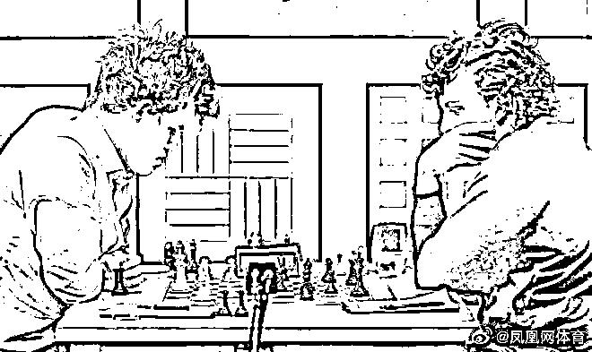
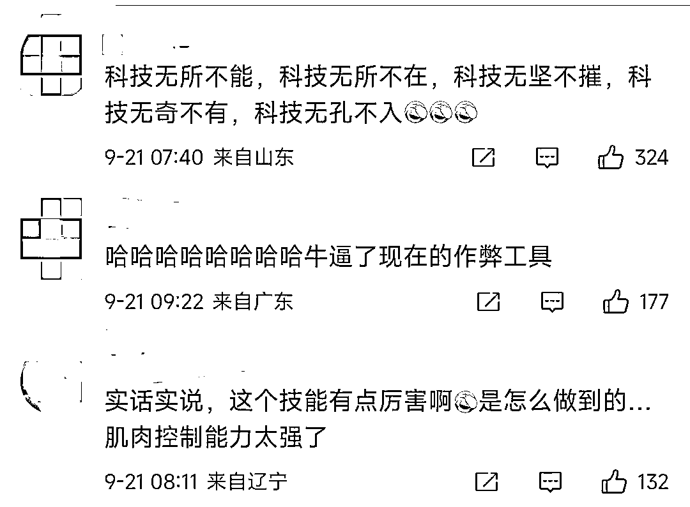

# 疑用智能肛珠作弊？！无名小卒逆袭打败世界冠军，国际象棋界曝最大丑闻

> 原文：[`mp.weixin.qq.com/s?__biz=MzIyMDYwMTk0Mw==&mid=2247545120&idx=1&sn=66fc72bc19136d6d6bf1a5667a1fc553&chksm=97cbfa18a0bc730ef13e3915339b055b393b79604ca00b5dab6c78cbc769a2289d8283d7771f&scene=27#wechat_redirect`](http://mp.weixin.qq.com/s?__biz=MzIyMDYwMTk0Mw==&mid=2247545120&idx=1&sn=66fc72bc19136d6d6bf1a5667a1fc553&chksm=97cbfa18a0bc730ef13e3915339b055b393b79604ca00b5dab6c78cbc769a2289d8283d7771f&scene=27#wechat_redirect)

**国际象棋**

不知道有多少朋友了解这个运动呢？

相信大部分人应该都是只听说它的名字

并不了解国际象棋的规则

虽然只和中国象棋差两个字

但其中的区别可大了去

不过与中国象棋相同的是

国际象棋也同样需要依仗策略

就是这样一个低调而又高级的运动

最近却因为一个花边新闻

而又在国内上了热搜

就在 9 月 4 号的 Singuefield 大师杯中

**一位 19 岁的无名小卒**

**打败了国际象棋的世界冠军**

爆出了一个大冷门

无名小卒打败世界冠军...

什么逆袭的爽文剧本？

不过比赛总有输赢

选手当天状态比较好的话

会出现这种大冷门也是可以理解的

但是，在赛后

输掉比赛的 Magnus Carlsen

却发布了一条推文宣布退散

将这件事一下推上了风口浪尖

**“比赛水很深，如果我说了，我就有大麻烦。”**

言下之意就是

**获胜的 Hans Niemann 可能作弊**

于是网友们脑洞大开

纷纷猜测起了 Niemann 的作弊方法

有人认为，Niemann 是在屁股里塞了串

“钢珠型”的超级计算机来进行作弊

...........

这猜测可真是太有想象力了...

**世界冠军与劣迹斑斑的无名小卒   **

不了解国际象棋的话

大家可能对**Magnus Carlsen**也没有印象

但 Carlsen 在国际象棋届

确实算得上是一个神话级的大师

1990 年生于挪威的 Magnus Carlse

是世界排名第一的特级国际象棋大师

他 8 岁开始学国际象棋

13 岁时就打败当时的世界棋王卡尔波夫

打平人称“国际象棋最高峰”的卡斯帕罗夫

人称“棋坛莫扎特”

2013 年 11 月在世界国际象棋冠军赛中

挑战维斯瓦纳坦·阿南德并获胜

成为历史上第 16 位无争议国际象棋棋王

反观这次比赛中他的对手

来自美国 19 岁的 Hans Niemann

名气相对而言就小了许多

甚至去年在国际象棋界都没有排名

今年 3 月才刚刚跻身世界第 98 位

可以说是真的“无名小卒”了

然而就是这样的一位无名小卒

却在九月初的这场比赛中打败了

5 届国际象棋世界冠军的 Magnus Carlse

结束了 Carlse 连续 53 场的不败纪录

如此不可思议的战绩

加上 Carlse 事后的退赛

以及在推特上的那句暗讽

确实很难不让人怀疑

Hans Niemann 是不是作弊了？

除此以外

Hans Niemann 自身也算得上劣迹斑斑

**他曾有线上作弊的前科**

被世界最大的国际象棋网站列入黑名单

禁止参加线上比赛

这一前提更是加深了网友们对他的怀疑

于是便有网友推理认为

Hans Niemann

是在屁股中塞入了一个阿尔法狗

也就是塞了串“肛珠型”的超级计算机

其原理类似摩斯电码

通过括约肌有节奏地张弛收缩

把信息传达给股间的超级计算机

后者分析棋局，然后用震动的高低频

刺激 Hans Niemann 的直肠神经

难道说 Hans Niemann 比赛的时候

表面风平浪静

背后其实是这样的！？

不得不说，这种说法虽然扯淡

但也确实具有一定的可行性

对于外界的质疑

Hans Niemann 也否认得相当果决

有机构表示可以帮助 Niemann

裸体参赛自证清白

对此 Niemann 则表示**要脱光衣服比赛那就脱**

**因为自己本来就是清白的**

**作弊与否，众说纷纭   **

这样的花边新闻一出

网友们自然也炸开了锅

大家纷纷表示难以置信，看傻了

现在的作弊工具

都已经这么牛逼了吗？

《棋魂》有魂魄佐为教人下棋

Niemann 这是用肛珠教他象棋吗哈哈哈

用智能肛珠作弊的方式虽然有点奇葩

但关于 Hans Niemann 到底有没有作弊

还是有争议的

有网友认为高段位的选手

有能力分清自己是在跟人下

还是在跟电脑下棋

更何况是作为世界冠军的 Magnus Carlse

也有人认为肛珠作弊太过扯淡

大概率还是使用骨传导耳机进行了作弊

不过也有网友替 Hans Niemann 抱不平

说关于 Niemann 作弊这件事也**没有任何实锤**

**作弊与否，众说纷纭   **

**而最新的调查结果显示，尼曼并不无辜**

**他在 100 多场在线比赛上做过弊**

**对此他私下承认过** 在部分线下比赛，他的表现也非常可疑

明明处于关键棋局，却注意力分散

调查中还发现，作弊的人不止他

还有几十个象棋大师

其中包括 4 个全球前 100 名的棋手…

Chess.com 举办过很多比赛

尼曼和卡尔森都是它的老用户

同时平台也开发出很多反作弊工具

比如将参赛者的下棋步骤和电脑推荐的走法做对比

如果高度一致，那大概率作弊
还用数据分析参赛者过往的表现

如果提升速度异常快，则有概率作弊
平台还能实时监控参赛者的电脑操作

如果比赛时打开别的浏览器窗口，基本能肯定是作弊

结果发现，仅在 2020 年

尼曼就作弊了 100 多场比赛

平台的“首席国际象棋官”在报告里说

**他们发现尼曼在比赛时，经常打开新的窗口来回切换**

**每次切换后他的比赛表现会更好**

就和游戏里开外挂差不多吧

不用付出什么，就能轻轻松松胜利

不得不说这一招真的好狠哈哈哈哈哈

举报肛珠作弊一箭多雕

这下本来不怎么关注的路人也记住他了

不过，这样子的“下三路闹剧”

都已经让中国的吃瓜网友震惊

赛事官方还不准备出手澄清一下吗？

两位选手和国际象棋观众吃瓜网友

都值得一个真相啊！ 

来源：上海全知道

欢迎关注灰产圈社群服务号

