# 调味品协会与海天味业的逻辑悖论

> 原文：[`mp.weixin.qq.com/s?__biz=MzIyMDYwMTk0Mw==&mid=2247545120&idx=3&sn=292fe57ade9a66451cfd2ce4a010c758&chksm=97cbfa18a0bc730e138737e06c52de3e5e7aa8f8c602362324db93feec17d6d84e55837b29e4&scene=27#wechat_redirect`](http://mp.weixin.qq.com/s?__biz=MzIyMDYwMTk0Mw==&mid=2247545120&idx=3&sn=292fe57ade9a66451cfd2ce4a010c758&chksm=97cbfa18a0bc730e138737e06c52de3e5e7aa8f8c602362324db93feec17d6d84e55837b29e4&scene=27#wechat_redirect)

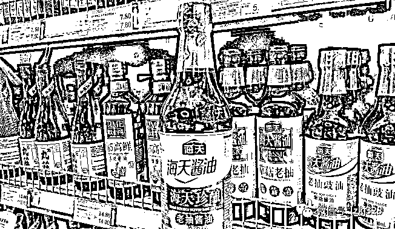

“海天酱油”产品的国内外“双标”问题，还在发酵。

前天（10 月 4 日）子夜时分，“海天味业”继 9 月 30 日发布《严正声明》后，又发布了旨在“正本清源，以正视听”的声明。声明否认了“双标”的存在，认为这是用所谓“双标”来挑起消费者与中国品牌企业的矛盾对立。

> 食品添加剂广泛应用于世界各国的食品制造中，各国对食品添加剂均有明确的法规标准，这些标准本身并没有高低之分、优劣之别。
> 
> 由于每个国家和地区的食品法规标准不尽相同，对应的产品标识也有所不同，因而说是一国（地区）一标也一点不过分。

在“海天味业”发布第二份声明之后，昨天（10 月 5 日）凌晨，中国调味品协会发布《关于净化市场环境，引导调味品企业高质量发展的声明》，把“海天味业”的两份声明内容重复了一遍，对海天味业进行力挺、加持。

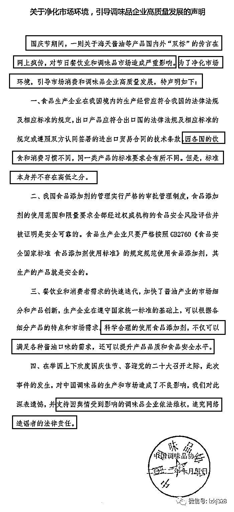

在声明中，中国调味品协会首先亮明立场，发这份声明是“为了净化市场环境，引导市场消费和调味品企业高质量发展”，但内容无非是“海天味业”两份声明中的那些说辞。

调味品协会在声明中说，“因各国的饮食和消费习惯不同，同一类产品的标准要求会有所不同。但是，标准本身并不存在高低之分。”对此，有网友质疑道：“各国饮食和消费习惯不同”，难道中国人爱吃添加剂？！

调味品协会在声明中说，“科学合理的使用添加剂，不仅可以满足各种酱油口味的需求，还可以提升产品品质和食品安全水平。”不知道这是什么混账逻辑，既然使用添加剂有如此多的好处，既能调味，又能提升品质和食品安全水平，为什么出口的酱油非要写上零添加？

**调味品协会的声明与海天味业的声明都有一个逻辑悖论：**

**网友质疑海天酱油国内外双标，海天抛开双标问题，说添加剂符合国家标准；**

**海天味业否认存在“双标”，又说“一国（地区）一标也一点不过分”，偏偏无法解释为什么只有中国国内的消费者爱吃添加剂；**

**调味品协会把添加剂说得天花乱坠，加量了应该加价才对，海天味业在第二份声明中也说，海天早在十年前就已陆续推出众多好吃不贵的零添加产品，以满足不同消费者的需求，那么，如何解释：同样是海天酱油，既然标准本身并不存在高低之分，海天向日本和美国**出口过含添加剂的酱油没？**既然标准本身并不存在高低之分，********海天酱油为什么要花重金宣传“0 添加酱油”，为什么零添加产品的价格比添加了添加剂产品的价格反而高出很多？既然用了添加剂反而造成产品价格下落，厂家又何必脱裤子放屁多此一举？**

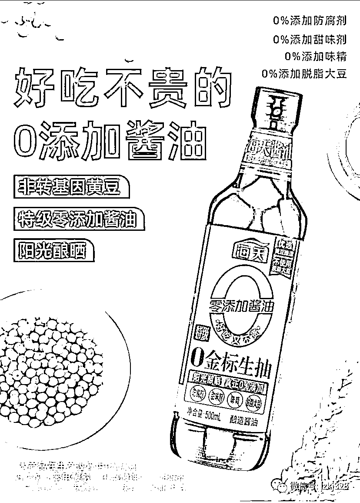

**说添加剂既能调味，又能提升品质和食品安全水平，请问，你们平时自己吃的是“0 添加酱油”还是带多种添加剂的酱油？**

而调味品协会在声明中扬言要“追究网络造谣者的法律责任”的蛮横言论，更是被网友斥责为协会与商家“沆瀣一气”。

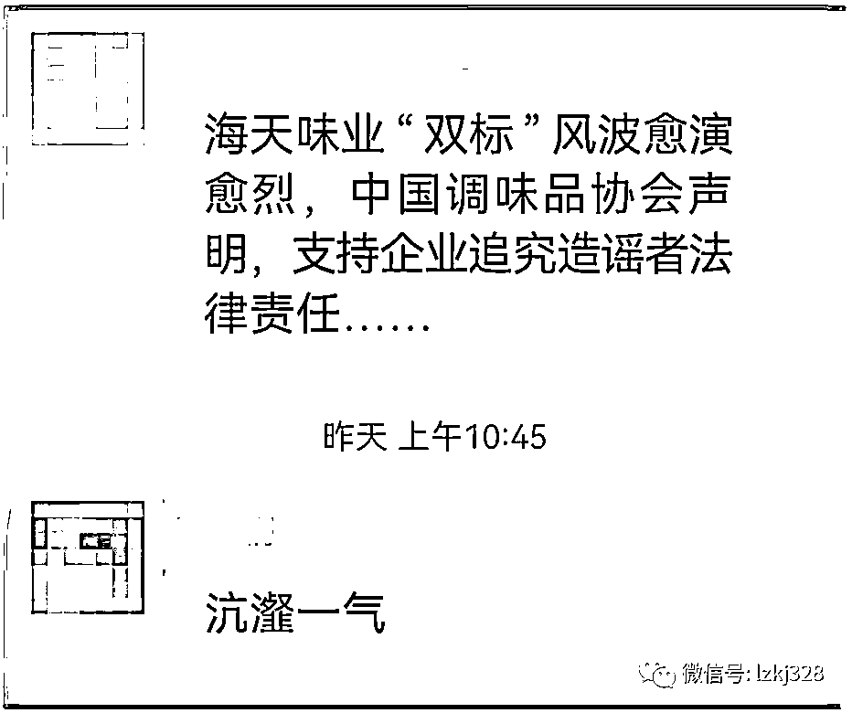

调味品协会的蛮横态度，让一些原本支持海天味业，认为他们的产品符合中国标准，因此无可指责的网友也表示“无法理解”。

知名网友周蓬安说，实在无法理解这个声明中“追究网络造谣者法律责任”的提法。

> **知名网友周蓬安：**首先，网友有没有造谣？至少我了解的情况并没有造谣，网友发布的新闻是：网友发视频称海天酱油产品的配料表中，除小麦天然原料外，还加入了谷氨酸钠、5'-呈味核苷酸二钠、5'-肌苷酸二钠、苯甲酸钠、三氯蔗糖等添加剂，其中前 3 种为增味剂，苯甲酸钠则为常用的食品防腐剂，三氯蔗糖则为甜味剂。而同样是售往日本的海天酱油，配料表只有水、大豆、盐、砂糖和小麦。
> 
> 这个网友陈述的是不是事实？如果是事实，那就不存在造谣。如果不是事实，请指出他哪里说错了？你们这个声明所表述的，与曝光新闻所表述的本质上都是一样，都是说“内外有别”，只是中国调味品协会这个表述多了个“各不相同”而已。
> 
> 而如果说我们这些转帖的都是“传谣”，那就更荒唐了。能发出去的视频，至少是审核过关的合法视频，转发视频根本就不构成“传谣”。如果这也是“传谣”，你追究得过来吗？

中国调味品协会为什么会和海天味业穿一条裤子？知道了协会的性质就明白了。

协会，谁都知道这是一个什么组织。中国调味品协会，由全国酱油、食醋、酱类、酱腌菜、腐乳、烹调酒和各种调味料生产经营及相关的企业、事业单位组成。协会是要向这些企业收取会费的，谁缴的“会费”越多，在企业里就越有话语权。

中国调味品协会官网“中国调味品协会专家工作委员会领导机构名单”显示，海天味业的黄文彪是副主任委员，他的另一个身份是：海天味业副总裁。据东方财富网，黄文彪的薪酬为 193.4 万元。

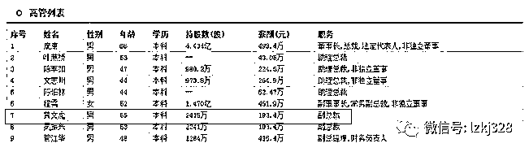

而在酱油专业委员会第一届领导机构名单里，海天味业更是占据了 7 席中的两席，主任委员庞康是海天味业董事长，秘书长黄文彪是海天味业副总裁黄文彪。

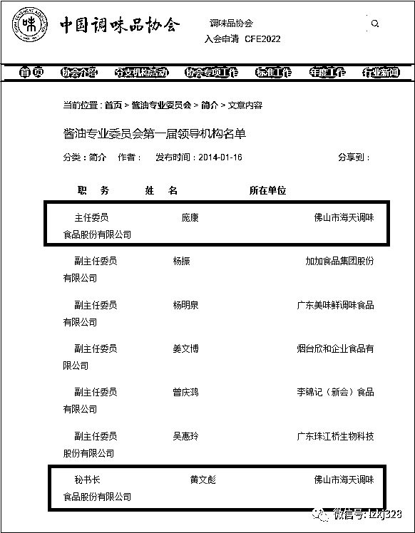

今年 9 月 22 日，2022 年中国酱油及调味酱产业创新发展高峰论坛在山东泰安召开，佛山市海天调味食品股份有限公司副总裁黄文彪以中国调味品协会酱油专业委员会秘书长身份出席会议。

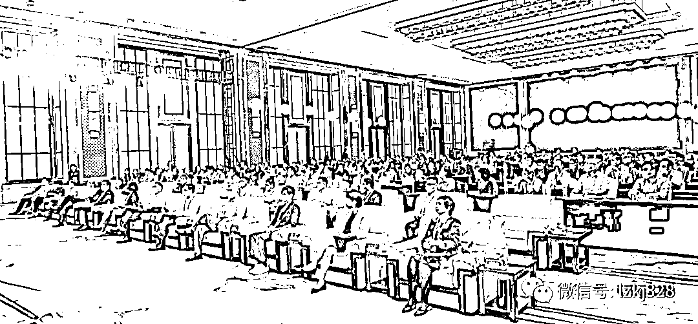

更神奇的是，在中国调味品协会官网产业信息 > 协会执行会长专题“中，今年 3 月和 5 月，执行会长卫祥云两次发文高度赞扬海天味业。

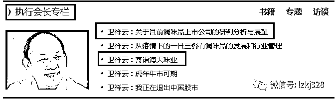

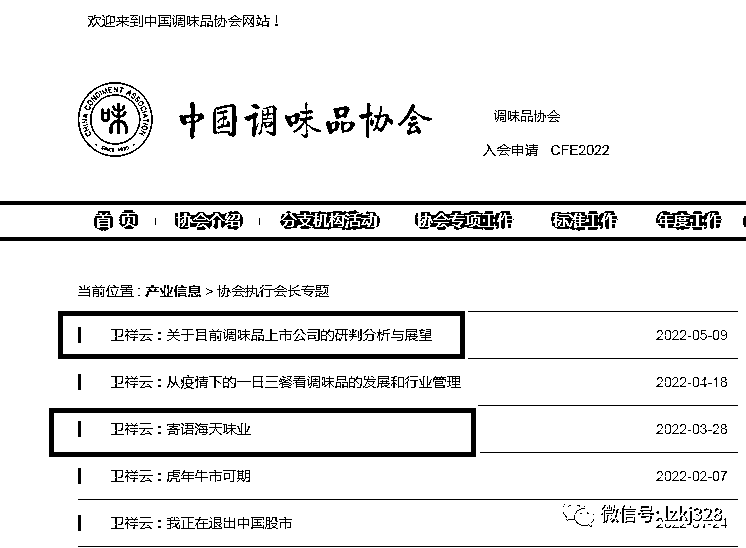

在今年 5 月 9 日《卫祥云：关于目前调味品上市公司的研判分析与展望》文章中，中国调味品协会执行会长、上市公司专委会首席研究员 卫祥云称赞“海天味业 2021 年实现营收和利润双增长，实属不易。”

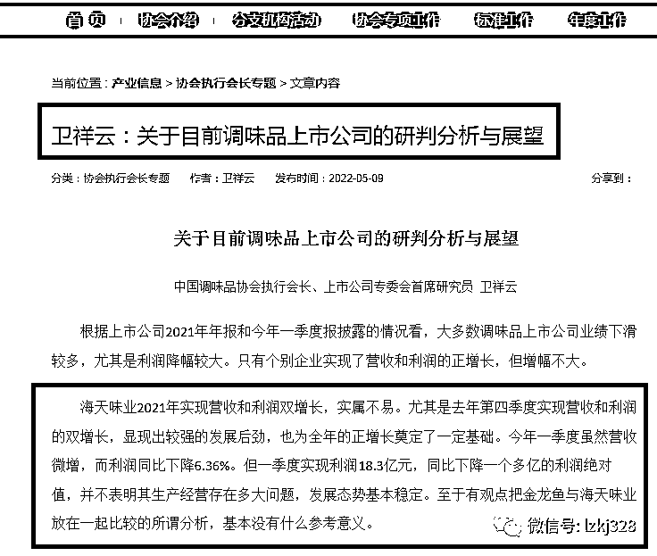

今年 3 月 28 日，更是发了篇《寄语海天味业》的文章，指出海天味业 2021 年在全行业不景气和面临诸多困难与挑战的情况下，交出了一份逆势增长、来之不易的靓丽成绩单。海天味业触及消费者 6.2 亿人，渗透率达 79.4%，位于全国消费者首选十大品牌之列。

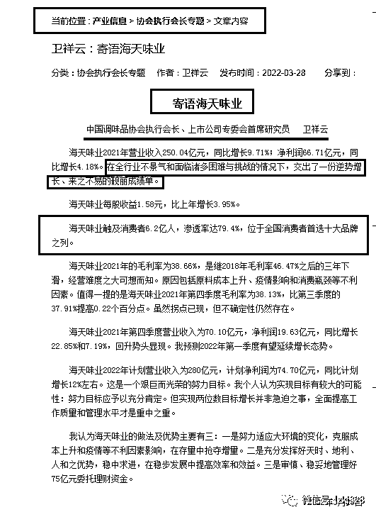

看到此，大家自然也就明白了，为什么调味品协会会与海天味业穿一条裤子、一个鼻孔出气了：人家本来就是同味相投好吧。

来源：宾曰语云  ID 号：lzkj328

欢迎关注灰产圈社群服务号

