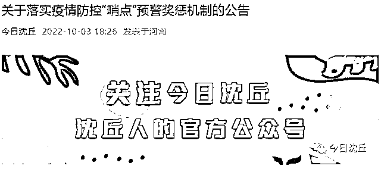

# 河南沈丘：发现阳性人员奖 5 万！发现红码人员奖 500 元

> 原文：[`mp.weixin.qq.com/s?__biz=MzIyMDYwMTk0Mw==&mid=2247545120&idx=4&sn=6e6e021f67361afec90a9f5c17b118ba&chksm=97cbfa18a0bc730edbf0f9cdbf17e4f0d4175fd8ca9de9a0bc719653804cd6337f4df3deda79&scene=27#wechat_redirect`](http://mp.weixin.qq.com/s?__biz=MzIyMDYwMTk0Mw==&mid=2247545120&idx=4&sn=6e6e021f67361afec90a9f5c17b118ba&chksm=97cbfa18a0bc730edbf0f9cdbf17e4f0d4175fd8ca9de9a0bc719653804cd6337f4df3deda79&scene=27#wechat_redirect)

据“今日沈丘”微信公众号 3 日消息，河南省沈丘县新型冠状病毒感染的肺炎疫情防控指挥部发布公告，“哨点”发现并上报红码人员，一人次奖励 500 元。“哨点”发现有中高风险地区旅居史的发热病人，及时上报并落实临时管控措施，后经核酸检测确诊为阳性的，一人次奖励 5 万元。公告具体如下：

**广大居民朋友：**

为充分发挥发热门诊、基层医疗机构、酒店、药店、饭店、商超、公共场所、公交出租车等“哨点”监测预警作用，把握疫情防控主动权。经研究，决定在全县实施“哨点”预警奖惩机制，现将有关事宜通告如下：

一、基层医疗机构、酒店、药店、饭店、商超、出租车等“哨点”扫码发现黄码人员，查验行程码发现有中高风险地区旅居史人员，及时上报并落实临时管控措施的，一人次奖励 200 元；发现并上报红码人员，一人次奖励 500 元。

二、基层医疗机构、酒店、药店、饭店、商超、出租车等“哨点”发现有中高风险地区旅居史的发热病人，及时上报并落实临时管控措施的，一人次奖励 5000 元。

三、基层医疗机构、酒店、药店、饭店、商超、出租车等“哨点”发现有中高风险地区旅居史的发热病人，及时上报并落实临时管控措施，后经核酸检测确诊为阳性的，一人次奖励 5 万元。

四、鼓励广大群众对基层医疗机构、酒店、药店、饭店、商超、出租车等“哨点”扫码、验码工作进行监督，凡发现不扫码、验码，随意进入上述场所的，举报并查实，每起奖励第一举报人 100 元。

沈丘县新型冠状病毒感染的肺炎疫情防控指挥部

2022 年 10 月 3 日

之前，山西多地曾发布类似公告。 

山西省运城市：〔2022〕第 36 号

对广大市民提供的风险人员违反疫情防控规定的线索，经核查，确属于应报未报、应管未管的，给予同一线索第一位提供人现金奖励。 

奖励标准

（一）提供的线索属于上海市、吉林省或其他中高风险地区入运返运人员的，奖励 5000 元；

（二）提供的线索属于疫情发生地市入运返运人员的，奖励 2000 元；

（三）提供的线索属于省外其他地市入运返运人员的，奖励 1000 元。

四、奖励资金由当地政府责令被举报人支付。

山西省运城市新绛县：

举报方式及奖励措施

举报人应准确提供被举报对象姓名、现详细居住地址、未落实相应管控措施等情况。 

举报线索经查证属实的，给予举报人 500 元的奖励，同一情形被多人举报的，奖励首位举报人。

山西省临汾市尧都区： 

对举报情况经核查属实的，按以下标准给予相应奖励：确定为居家隔离对象的，奖励举报人 5000 元；确定为集中隔离对象的，奖励举报人 10000 元；确定为确诊病例的，奖励举报人 50000 元； 

举报线索经查证属实的，一次性给予举报人奖励，同一情形多个举报人分别举报的，奖励首位举报人。

山西省吕梁市交口县交口县：

对发现瞒报 14 天内有重点地区、中高风险地区旅居史、境外旅居史、新冠感染史、密切接触史的（健康码为红码），如举报内容属实，给予举报人一万元奖励。 

对非责任主体提供的线索，经防控办分析认为有助于填补防控机制漏洞的，如内容属实，给予提供线索单位（个人）五千到一万元奖励。

对发现未按要求落实集中隔离医学观察措施的，如举报内容属实，给予举报人两千元奖励。

对发现未按要求落实居家隔离医学观察措施的，如举报内容属实，给予举报人两千元奖励。

对违规组织和承接其他聚集性活动的，如举报内容属实，给予举报人一千元奖励。

对个体诊所违规接诊发热患者或药店违规销售“一退两抗”药品的，如举报内容属实，给予举报人一千元奖励。

对省外和省内涉疫地区返（入）交人员本人未主动上报的，如举报内容属实，给予举报人五百元奖励。

对非法营运的各类车辆（黑出租或黑拼车），如举报内容属实，给予举报人一千元奖励。

山西省阳泉市城区阳泉市城区：

奖励标准

提供的线索 7 天内属于上海市、吉林省或其他中高风险地区入泉返泉人员的，奖励 3000 元；

提供的线索 7 天内属于疫情发生地市入泉返泉人员的，奖励 2000 元；

提供的线索属于省外其他地市入泉返泉人员的，奖励 1000 元。

奖励资金由当地公安部门责令被举报人支付。

山西省朔州市：

对广大市民提供的风险人员违反疫情防控规定的线索，一经核查，确属于应报未报、应管未管的，给予同一线索第一位提供人现金奖励。

提供的线索属于中高风险地区隐瞒行程、逃避查验入朔返朔人员的，奖励 2000 元；

奖励资金由当地政府责令被举报人支付。

来源：今日沈丘微信公众号，山西经济日报，宾曰语云 

欢迎关注灰产圈社群服务号

