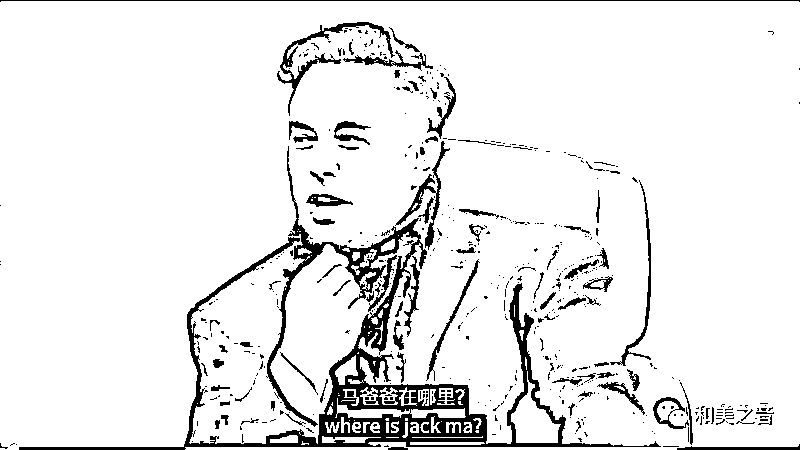
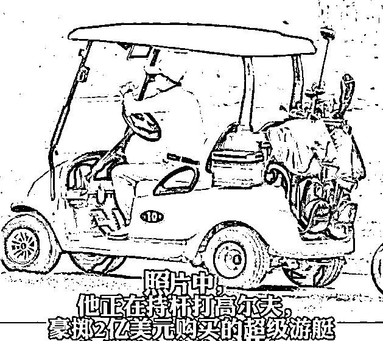
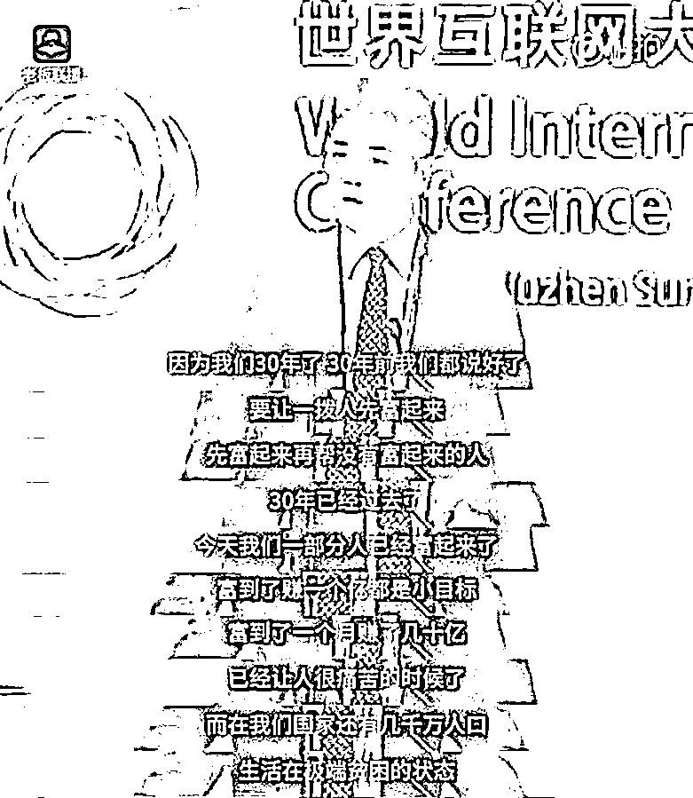
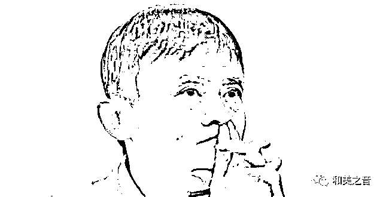

# 刘强东携孕妻赴美，马云去哪了？

> 原文：[`mp.weixin.qq.com/s?__biz=MzIyMDYwMTk0Mw==&mid=2247545120&idx=6&sn=0cece9c71458fab20f9cf7e4e5f43c70&chksm=97cbfa18a0bc730ee47efbbde1d7b6f90d035916f74fdc29e0bc6cb67322a26a7d008ee51952&scene=27#wechat_redirect`](http://mp.weixin.qq.com/s?__biz=MzIyMDYwMTk0Mw==&mid=2247545120&idx=6&sn=0cece9c71458fab20f9cf7e4e5f43c70&chksm=97cbfa18a0bc730ee47efbbde1d7b6f90d035916f74fdc29e0bc6cb67322a26a7d008ee51952&scene=27#wechat_redirect)

近日，世界首富马斯克接受主持人采访，被问到如何看到中国科技公司及**互联网大佬**时，马斯克竟然问道：**马云去哪儿了？**

**马斯克：****马云去哪儿了？**

[`mp.weixin.qq.com/mp/readtemplate?t=pages/video_player_tmpl&action=mpvideo&auto=0&vid=wxv_2608209569605042176`](https://mp.weixin.qq.com/mp/readtemplate?t=pages/video_player_tmpl&action=mpvideo&auto=0&vid=wxv_2608209569605042176)

确实，有好长一段时间都没有听到马云的消息了。

上一次有关他的新闻，还是传他润到了西班牙，开着价值 2 亿美元的豪华游艇。（据称马云套现了 2000 亿人民币。） 

而这几天，有网友猜测：**刘强东要润美国，做美国人的“爸爸”了！**

大家应该都听说了吧，4 年前，刘强东在美国明州的案子已和解终结了。

在该案件开庭的前几日，有在美华人拍到他与已有身孕的妻子章泽天在美国逛超市。

对此，网友猜测说，**大强子这次赴美不是仅仅为了出庭，这是要生个美国宝宝，要当美国人爸爸了...**

因为按照美国的法律，孩子出生在美国，就有美国的国籍。

甚至有网友说，**大强子抛售资产，与奶茶妹妹赴美，是早有准备啊！ **

据公开信息显示，明州案后，刘强东就开始退居幕后，**他辞去了包括京东集团、京东物流等一系列公司的法人代表、董事长等职务。**

**接连从 300 余家京东系企业抽身，将京东物流和京东健康的股权转手他人。**

但是，刘强东在幕后的操作却不断：**持续抛售资产！**

**今年 4 月和 5 月，**刘强东连续减持京东健康股票，价值超过 4.4 亿港元（约合 3.76 亿人民币）。

**今年 6 月份**，媒体又披露刘强东又减持了公司股票价值约 2.79 亿美元，合计人民币 18.71 亿元。

据不完全统计，他这几年已累计**套现 640 亿**。前段时间还流传他花了**5.6 亿**在意大利买豪宅的消息。

**2017 年，在第四届互联网大会上，刘强东发表演讲，他说：**

“我们 30 年前说好了，让一部分人先富起来，先富起来的人再来帮助没有富起来的人。

现在 30 年已经过去了，无数人已经富裕起来，而在我们国家还有几千万人生活在贫困的状态下...

我想这是中国人，特别是已经富起来的人的耻辱。”

他的此番发言，曾引来一片喝彩，但在第二年（2018 年），就发生了流传海内外的“美国明州性侵案”...

有网友说，东哥还是比马云强，曾经叱诧风云的“马爸爸”如今已经成了“万恶的资本家”。

**刘强东时代正在落幕，**这也是一代互联网大佬退休潮的一个缩影。

拼多多的黄峥、阿里巴巴的马云，还有搜狗的王小川，他们都和刘强东一样，**不约而同地在当打之年选择了英年早退。**

来源：和美之音

欢迎关注灰产圈社群服务号

