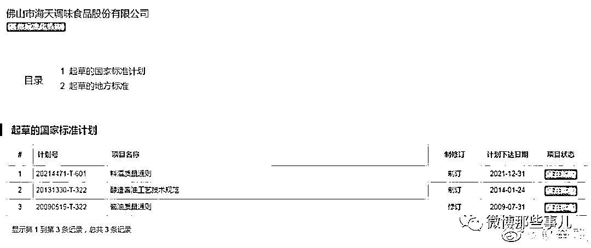

# 海天酱油引爆行业震荡，为省 1 分钱选用致癌物添加剂

> 原文：[`mp.weixin.qq.com/s?__biz=MzIyMDYwMTk0Mw==&mid=2247545182&idx=1&sn=5c70303fd49014f6e79475754d580440&chksm=97cbfa66a0bc73703f668fb683ef03f6fe1555de4323a094eb011457f2629d4c3fe00fe0399d&scene=27#wechat_redirect`](http://mp.weixin.qq.com/s?__biz=MzIyMDYwMTk0Mw==&mid=2247545182&idx=1&sn=5c70303fd49014f6e79475754d580440&chksm=97cbfa66a0bc73703f668fb683ef03f6fe1555de4323a094eb011457f2629d4c3fe00fe0399d&scene=27#wechat_redirect)

近日，“酱油一哥”海天味业因国内外双标和食品安全问题引发争议。

继 9 月 30 日晚海天味业官微发布声明对近期产品添加剂争议回应后，10 月 4 日晚间海天味业进一步澄清所谓“双标”的质疑。文中有用“国产品牌”进行道德绑架的嫌疑。两次声明的态度引发网友不满，完全可以通过对科学知识和法律法规的进行解读，但遗憾的是海天味业的两份声明却直接把自己与消费者者对立起来，人为推高了危机的热度。

一个卖酱油的硬生生营造出了权威部门的感觉。

2022 年 10 月 5 日，中国调味品协会发布声明称，在酱油中添加了“苯甲酸钠”等添加剂的海天味业，符合国家相关食品添加剂标准规定，支持因受到此次舆情影响的调味品企业，依法维权。

为什么海天味业反复强调产品符合标准？？？因为国内标准就是海天参与起草的。

继双标风波之后，配料表中的苯甲酸钠再次成为焦点，已经明文列为一级致癌物，被国际一些地区淘汰。尤其是苯甲酸钠不易被人体分解，遇维生素 C 易生成苯类物质，儿童禁止食用！

湖北省黄石有色医院中医科副主任医师张思燮、北京医院内科主治医师聂志扬均认为，苯甲酸钠和人体内的胃酸可能会发生反应，进而生成苯甲酸。苯甲酸有毒性，如果长期饮用可能会引起人体慢性苯中毒。慢性苯中毒的症状一般主要表现为神经衰弱，比如头晕、头痛、记忆力减退以及乏力等。同时，患者还可能会出现白细胞减少，严重的甚至还会造成再生障碍性贫血。

据调查海天味业仍然在中低端产品里用了苯甲酸钠，苯甲酸钠 1 克 1 分钱，每公斤添加 1 克，500ML/瓶的酱油仅添加苯甲酸钠 0.5 克，成本 0.5 分钱。

如果用比苯甲酸钠毒性小的添加剂山梨酸钾，成本是苯甲酸钠的 3 倍，每瓶成本多 1 分钱。

面对此质疑，海天味业暂未回应。

来源：微博那些事儿

欢迎关注灰产圈社群服务号

