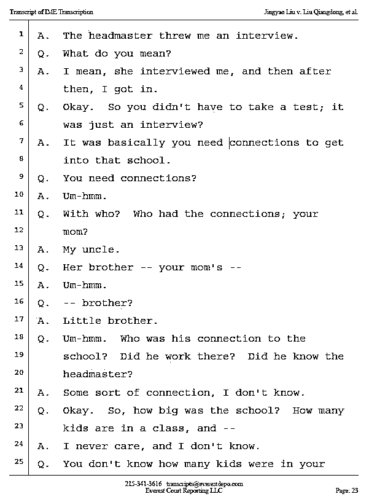
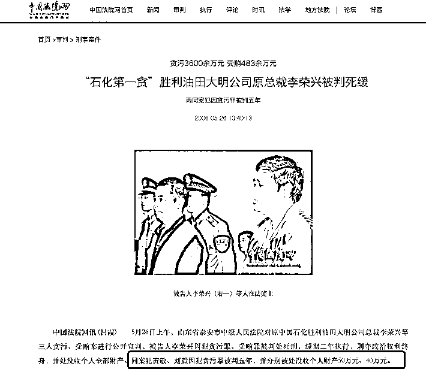
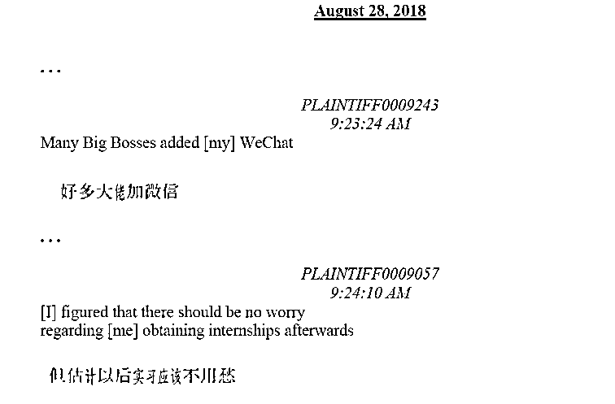
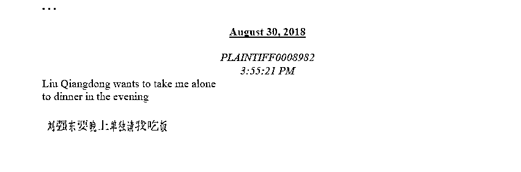
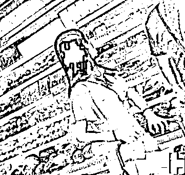

# 起底“东哥案”刘婧尧！

> 原文：[`mp.weixin.qq.com/s?__biz=MzIyMDYwMTk0Mw==&mid=2247545182&idx=2&sn=41c4d07faec76ade8988c476760e59ee&chksm=97cbfa66a0bc7370bd6a84490457c33c9b5a6d7a92eaf74e6698a51d1fe4ef2ed103e685de5f&scene=27#wechat_redirect`](http://mp.weixin.qq.com/s?__biz=MzIyMDYwMTk0Mw==&mid=2247545182&idx=2&sn=41c4d07faec76ade8988c476760e59ee&chksm=97cbfa66a0bc7370bd6a84490457c33c9b5a6d7a92eaf74e6698a51d1fe4ef2ed103e685de5f&scene=27#wechat_redirect)

在这个假期里，远在大洋彼岸的刘婧尧诉刘强东事件迎来超级反转，双方最终决定消除误会，达成和解，为这次事件画上句号。 

这起刘婧尧诉刘强东民事侵权案原计划于美国时间 10 月 3 日在美国明尼苏达州法院开庭审理。在 9 月 26 日，该案已经进行了一轮听证会，提交了包括证人名单、证据、备忘录、拟议的陪审团指示等材料。在此前原告所提交证据存在不利的情况下，前不久也爆出作为证人的 BEN 和 TAO 也认为刘婧尧和律师不可信而不再沟通合作。 

关注这起案件的明州律师认为，原告在证据中存在大量矛盾之处。根据警方提供视频证据，刘婧尧在事发当天和警察明确说自己是自愿的，但是随后又推翻了这一说法，说自己当初不敢承认的原因是不想得罪刘强东，担心自己的家人在国内会被报复。

然而，据了解，刘婧尧并非来自于普通家庭。

**能量巨大的舅舅**

根据 6 月底双方提交的证据中刘婧尧所作的一份心理评估对话显示，在她小学一年级的时候，就跟随母亲从青岛到北京读书，就读的是一所北京顶级的学校，“像一个古代的皇子拥有的中国宫殿”。

根据消息查证，在 20 年前北京使用王府旧址作为办学场所的重点小学，屈指可数，其中一家确实是可以称之为北京的顶级重点小学。

按照刘婧尧的说法，自己进入这所学校并没有经过考试，只是经过了一个面试就通过了。而自己能够上这所北京顶级学校，则是依靠舅舅和校长的关系，同时，舅舅还解决了全家人的北京户口。

刘婧尧的舅舅为何有如此大的能量？

根据了解刘婧尧的知情人士透露，刘婧尧的舅舅名叫邢彪。公开资料显示，邢彪此前常年在中国证监会和全国社保基金担任要职，并且曾经担任过证监会主板发审委的专职委员；2015 年起转入鹏华基金管理有限公司。根据媒体公开报道，在参加 2020 中国资产管理年会时邢彪的身份为鹏华基金副总裁。

** 身份神秘的父亲**

按照刘婧尧的口述，她当初之所以要转入北京读书，还有一个原因是她的父亲在当时因做生意被陷害而被判入狱。

而根据上述知情人士透露，刘婧尧的父亲当年确实是因为做生意卷入一场刑事案件，而且这起案件在当年也是轰动一时的“石化第一贪”李荣兴腐败案。

根据中国法院网的公开信息以及当时的媒体报道显示，李荣兴当年犯下的最大一起贪污案件，是中国石化胜利油田大明公司与井田公司合作开发房地产项目过程中，采取抬高土地价格的方法贪污了 3500 万元，而李荣兴当时并没有直接操作，是通过了另一家央企背景的房地产公司负责人刘毅操作，并允诺给予其相应的好处。

刘毅，正是刘婧尧的父亲。

2006 年，山东省泰安市中级人民法院对李荣兴等三人贪污、受贿案进行公开宣判，被告人李荣兴因犯贪污罪、受贿罪被判处死刑，缓期二年执行，剥夺政治权利终身，并被处没收个人全部财产。作为同案犯的刘毅因犯贪污罪被判五年，并被处没收个人财产 40 万元。

刘毅因判刑离开国企房地产公司之后，还给公司留下了不少烂摊子。比如在 2003 年的时候，作为公司主管的刘毅在主导公司一块土地的合作时，明明有国企可以选择的情况下，却偏偏选择了一个没有资质、没有经验的自然人合作。关于该自然人和刘毅的关系，事后公司认为是“非同寻常的密切关系”，而实际了解当时情况的人士透露，疑似和刘毅存在“包养”关系。

**家人支持出去见世面**

9 月底，有媒体爆料了一段“明州事件”后刘婧尧和当时 DBA 项目负责人明尼苏达大学教授崔海涛的聊天记录。根据公开信息显示，DBA 项目是明州大学卡尔森管理学院和清华大学经管学院合作的工商管理博士课程，刘强东此前就是参与的这一项目。

在这份微信截图的聊天记录中，崔海涛对刘婧尧的微信备注名是“刘毅高金十期闺女”。这一备注与刘婧尧在起诉书中所述信息一致，即自己的父亲刘毅，曾是崔海涛在中国的学生。

按照崔海涛所述，他是在征得刘毅的同意之后，才将刘婧尧推荐给项目志愿者招集工作负责人的，而刘婧尧则认为崔海涛是有意陷害自己。在双方长达几十页的聊天记录中，刘婧尧言辞凌厉、气势逼人，逼迫崔海涛不得不妥协。

这段对话，与刘婧尧在 2018 年与家人的微信聊天记录截然相反，根据事发前两天的聊天记录显示，刘婧尧希望能够通过此次聚餐认识到刘强东等大佬，对于自己未来的实习会有帮助。而在事发当日，刘婧尧还在和家里人表示，刘强东晚上要单独请她吃饭。

随着刘婧尧和刘强东最终达成和解，这件拖延了四年的纠纷也终于画上了句号，对于刘婧尧而言，在胜算很小的情况下，已经得到了一个最好的对价；而对于刘强东而言，结束这场四年的噩梦，腾出精力把事业和家庭搞好，同样更有意义。

来源：大国风采，新洞察

欢迎关注灰产圈社群服务号

