# 争相与诺奖得主攀亲戚，总比盲目排外强

> 原文：[`mp.weixin.qq.com/s?__biz=MzIyMDYwMTk0Mw==&mid=2247545182&idx=3&sn=58295320964046085647c70b0b91a6f8&chksm=97cbfa66a0bc73705eb39b2dda661f721031f3b38bba0625bb5dcc700b5be4312ecbf56d993a&scene=27#wechat_redirect`](http://mp.weixin.qq.com/s?__biz=MzIyMDYwMTk0Mw==&mid=2247545182&idx=3&sn=58295320964046085647c70b0b91a6f8&chksm=97cbfa66a0bc73705eb39b2dda661f721031f3b38bba0625bb5dcc700b5be4312ecbf56d993a&scene=27#wechat_redirect)

**一**

2022 年诺贝尔奖陆续出炉，有人发现，我们成了大赢家。

比如，南京大学率先宣布，本届诺奖的物理学奖得主是他们学校的名誉教授。

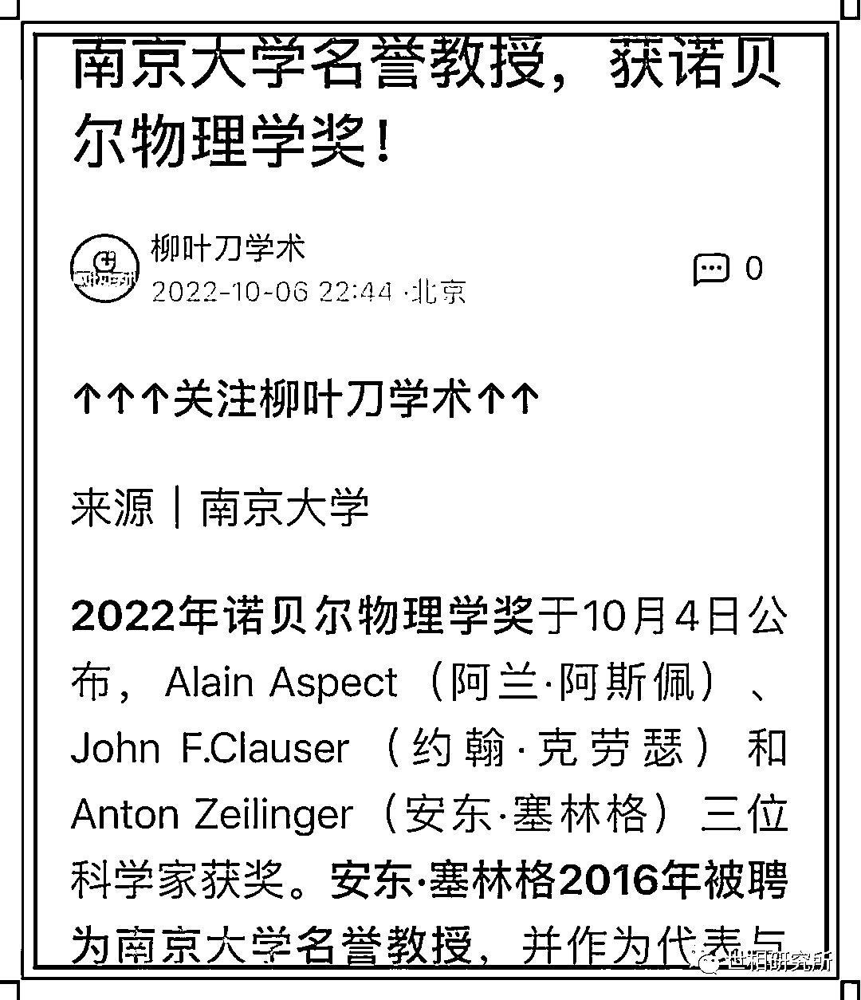

接着，同济大学火速宣布，诺奖的化学奖得主是他们的名誉教授。

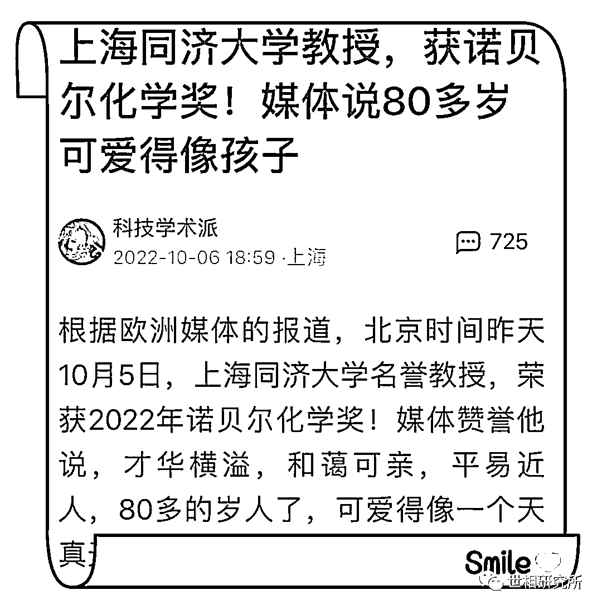

西安交大、中国科技大学也不甘示弱，宣称物理奖得主是他们的名誉教授或讲席教授。

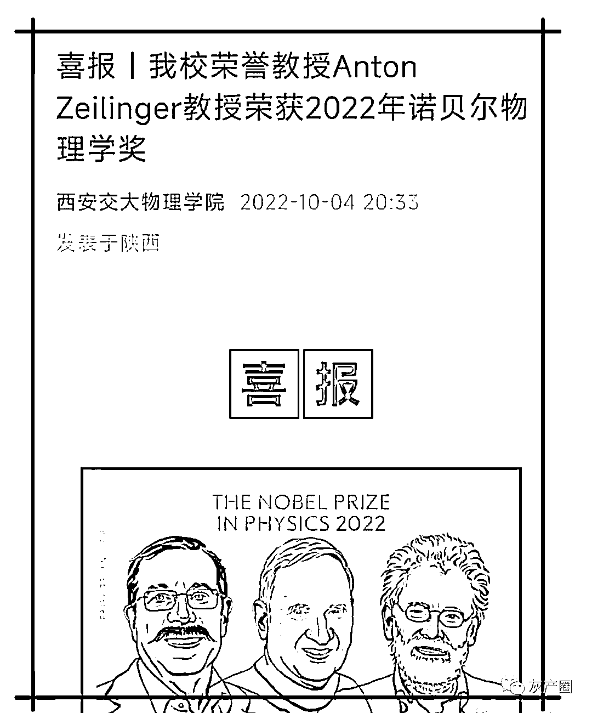

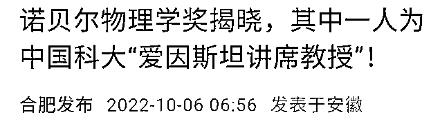

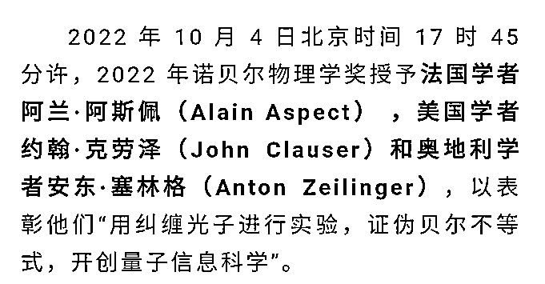

最令人“惊艳‘的是，人民文学出版社也出来报喜了，将本届诺奖文学奖得主称为他们出版社作家。

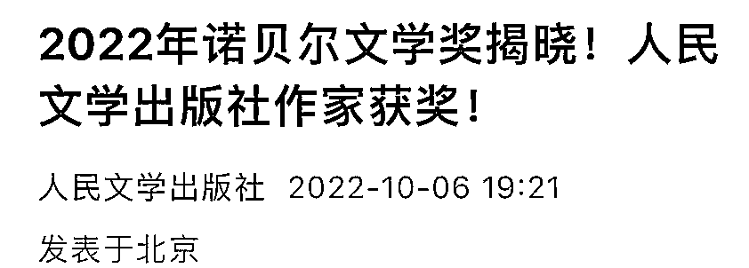

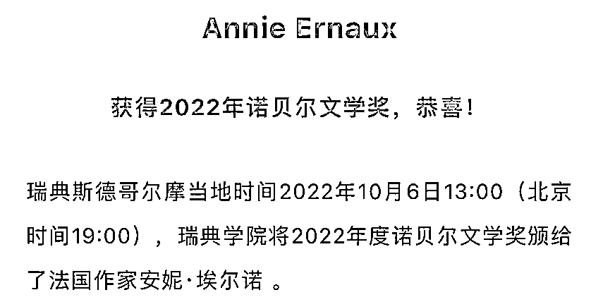

当然，还可以继续与诺奖得主”攀亲戚“，门生就是其中一项。

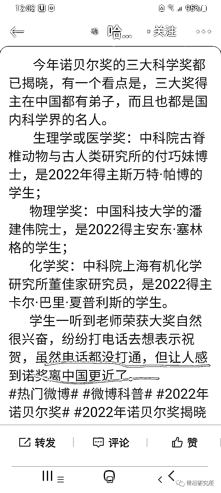

这不由得令人想起，前些年出现的那条“热烈祝贺我校女婿荣获诺贝尔奖”的横幅。

2014 年 10 月，诺贝尔化学奖得主揭晓，美国科学家埃里克•白兹格获此殊荣，奖项是为了表彰他们在超分辨率荧光显微技术领域取得的成就。

而他的夫人吉娜，就是安徽蚌埠人，毕业于蚌埠市第一中学。

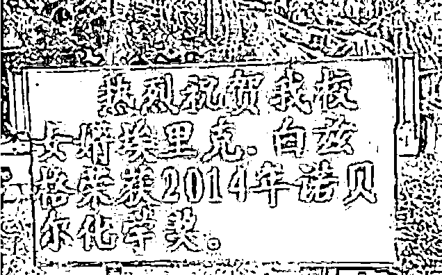

消息出来后，有网友拍到安徽蚌埠一中挂出“热烈祝贺我校女婿埃里克•白兹格荣获 2014 年诺贝尔化学奖”的标语。

**二**

有好事者进一步总结，我们不盛产诺贝尔奖得主，但盛产诺贝尔奖女婿。

比如，斯坦福大学教授托马斯·祖德霍夫荣获 2013 年诺贝尔生理医学奖，他的妻子是毕业于中国科技大的 89 级校友陈路。

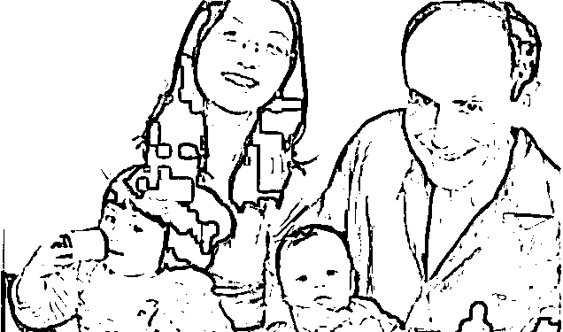

托马斯•祖德霍夫和陈路一家

不仅有媒体用“中科大女婿拿下诺贝尔医学奖”这样的笔触做标题，更有记者深入江苏无锡采访陈路的求学经历。

2013 年度诺贝尔经济学奖获奖者之一的汉森是湖北孝感下辖县级市应城籍辛亥元老蒋作宾的孙女婿。在媒体报道中，汉森有湖北、应城、台湾、华人女婿等多样身份，孝感市人民政府台湾事务办公室官网仍挂着“应城女婿分享诺贝尔经济学奖”的消息。

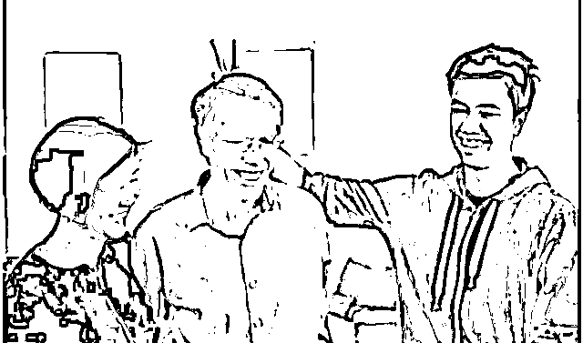

拉尔斯•彼得•汉森与他的家人

2012 年诺贝尔化学奖得主布莱恩·科尔比卡是美国斯坦福大学医学院分子和细胞生理学系主任，也是一名广东女婿。

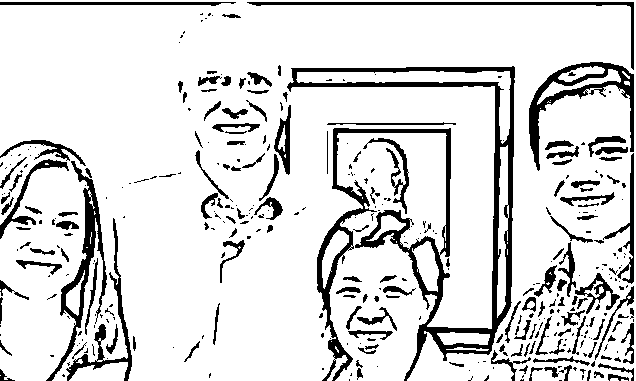

布莱恩•科尔比卡一家

2010 年诺贝尔经济学奖得主克里斯托弗·皮萨里德斯则是一名四川女婿。妻子魏莉华 6 岁之前生活在成都，6 岁以后随父母迁居到香港，后来成为香港科技大学第一届经济学毕业生，随后赴美攻读博士学位，学成之后在伦敦政治经济学院任教，现已是教授。

无论是今日多所高校争先恐后宣称诺奖得主是本校客座教授，还是过去屈出不穷的“诺奖女婿“喜报，网上评论多半是调侃或讽刺的口吻，如“没能嫁给诺奖获得者，拖母校后腿了”，“没能嫁个好男人给母校争光，内心十分惶恐与愧疚”等等

高校以“客座教授攀附之，也被看成是一个笑料。

**三**

但我倒不完全这么看。

首先，我认同网友对这种“攀附“心理的调侃乃至讽刺。与其过度关注诺奖得主身世背景，看是不是华人，或者是否跟中国沾亲带故，不如注重改善人才培养机制。

但是，在更大的荒谬面前，这样的“攀附“反倒显示了其价值。

更大的荒谬是什么呢？是盲目的排外心理，如我在前几天的文章中所说，不少人认为诺奖只是西方人玩的游戏，跟我们没什么关系，别老是强调它的存在。

要不就是，某某技术，不是我们领先吗？

都知道闭关锁国要不得，但一些人在心理上已完成了自己的闭关锁国。他们似乎仇恨一切外来文明，开个外国车、用个外国产品、吃个洋快餐就是不爱国，只要说一句西方文化也有可取之处，就是“别有用心“，一顶“汉奸“帽子可能就给你戴上了——当然总好过 U 形锁。

不过，这样下去，迟早会出现更多的 U 形锁。

看看，连最近被推上风口浪尖的海天酱油，在严正声明中也熟悉地用上了“不明真相“、”别有用心“之样的词汇。

相比之下，这种对诺奖的“攀附“是不是反而显得有几分可爱？

在价值观层面，它至少体现了对诺奖的认同，对常识的尊重。这总强过阿 Q 精神，在文化心理上是开放的，是面向世界的。

从现实层面，无论是诺奖得主成为中国大学的客座教授，还是成为中国女婿，都是中国与世界融合而不是孤绝于世界的一种证明。

不止是客座教授，深圳还建立了多个由诺奖得主参与的科技实验室，为深圳注入了科技创新动力。这样不是很好吗？

至于诺奖女婿，我们从报道里不难看到，嫁给诺奖得主的中国女孩本身就是非常优秀的科研学者，她们不是靠美貌，而是靠学识与才华——至少部分是——征服诺奖得主。

诺奖得主与中国的学术交流多了，中国的诺奖女婿多了，是不是意味着中国本土可能离诺奖更近了？

相反，如果关起门来自嗨，仇视外来文明，甚至觉得英语都是可有可无之物，必欲将其逐出课堂而后快，其带来的荒芜景象可想而知。

在大荒谬面前，小荒谬值得我们珍惜。

作者：里约热泪奴 来源：世相研究所

欢迎关注灰产圈社群服务号

