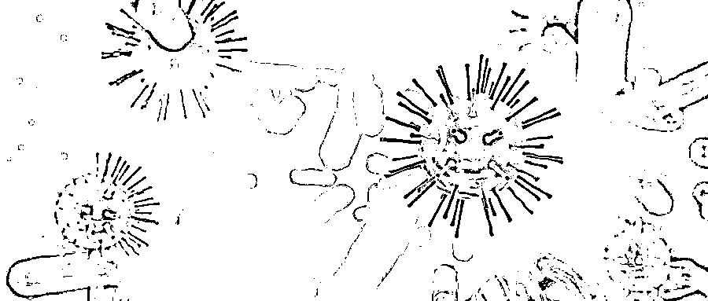
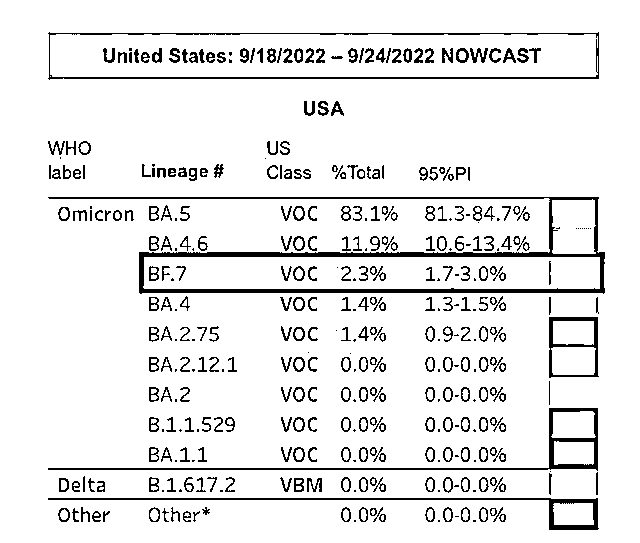

# 又变异，更具传染性！世卫组织对奥密克戎变异株 BF.7 发出警示，疫苗、药物还有用吗？

> 原文：[`mp.weixin.qq.com/s?__biz=MzIyMDYwMTk0Mw==&mid=2247545182&idx=5&sn=29233d0148a5726b9bfc37d3f8184732&chksm=97cbfa66a0bc73705e6ddc06e4e1bcb62584d42a2d22b8555f471486c7abc8f9f67116fb6b01&scene=27#wechat_redirect`](http://mp.weixin.qq.com/s?__biz=MzIyMDYwMTk0Mw==&mid=2247545182&idx=5&sn=29233d0148a5726b9bfc37d3f8184732&chksm=97cbfa66a0bc73705e6ddc06e4e1bcb62584d42a2d22b8555f471486c7abc8f9f67116fb6b01&scene=27#wechat_redirect)

新冠奥密克戎变异株又变异了。世界卫生组织发出警示，**BF.7 正全球传播， “几周内或成主流”**。

疫苗和新冠口服药对 BF.7 变异株有效吗？我国已出现首例 BF.7 新冠感染者，接下来该如何应对 BF.7 的流行？

图片来源：摄图网 _400820573（图文无关）

## **呼和浩特本轮疫情**

## **毒株为奥密克戎 BF.7**

据中新网，10 月 7 日，记者从呼和浩特新冠肺炎疫情防控新闻发布会上了解到，10 月 6 日 0 时—24 时，内蒙古呼和浩特市新增新冠肺炎确诊病例 8 例(含 6 例无症状感染者转确诊)、无症状感染者 651 例。

据介绍，**呼和浩特市本轮疫情毒株为奥密克戎 BF.7 变异株进化分支**，临床症状包括高烧、持续性咳嗽、身体疼痛、头痛、喉咙痛、嗅觉改变和食欲不振等，具有更强的传染力、扩散性以及逃逸性，极易造成大面积传播，疫情处置、控制的难度也成倍增加。

陕西疾控部门也称，BF.7 变异株比现有奥密克戎变异株具有更强的传染性，可以进一步逃避 BA.5 诱导的免疫反应。一项尚未经同行评审的研究表明，**BF.7 是目前为止免疫逃逸能力最强的变异株**。

BF.7 是 BA.5.2.1.7 的缩写，被认为是奥密克戎 BA.5 变异株衍生的第三代亚型，中间隔了 BA.2.75 变异株。BF.7 之所以拥有更强的免疫逃逸能力，是因为它获得了新的基因突变。BF.7 在 BA.4/5 基础上增加了受体结合域 RBD 突变 R346T，这可以进一步逃逸 BA.5 感染诱导的中和抗体。

约翰斯·霍普金斯大学医学院教授图尔特·雷表示，BF.7 感染病例在多个国家具有增长优势，因此有理由认为 BF.7 正在站稳脚跟，而且它可能比 BA.5 更具传播性。

## **新变异株进一步逃避免疫**

“奥密克戎是病毒进化的一种集大成形式。”美国奥密克戎疫苗研究学者、美国国立卫生研究院研究学者、免疫学博士王宇歌告诉人民日报健康客户端记者，**BF.7 本质上还是一种 Omicron BA.2 谱系病毒。从 BA.2 到 BA.5 再到 BF.7，新的变异株不断“内卷”，病毒传播力不断增强，逃避免疫能力越来越强**。

# 新冠病毒在美流行情况。图片来源：美国疾控中心官网

陕西疾控中心对 BF.7 变异毒株解读指出，该变异株感染后表现的症状包括高烧、持续性咳嗽、身体疼痛、头痛、喉咙痛、嗅觉改变和食欲不振等。

放眼全球，近期美国疾控中心新冠数据监测发现，BF.7 在短时间内成为美国新冠病毒检出比例第三位的变异毒株。在欧洲地区，比利时 BF.7 比例达 25%，德国、法国和丹麦则占到 10%左右。聚焦国内，9 月 28 日，呼和浩特市现首例 BF.7 本土新冠感染者，这是 BF.7 变异株首次在国内引起本土疫情。

“**感染过 BA.5 的患者仍有被 BF.7 感染的风险**。”王宇歌进一步解释，BF.7 在 BA.4/5 基础上增加了受体结合域 RBD 突变 R346T，这可以进一步逃逸 BA.5 感染诱导的中和抗体。因此，它有可能会成为今年秋冬季流行的突变株。

## **疫苗、口服药对 BF.7 仍有效**

多位专家表示，目前现行的抗击新冠方案依然有效。

“接种疫苗仍然是有效的预防手段。”王宇歌表示，疫苗通过诱导中和抗体起作用，如果中和抗体水平很高，变异株 BF.7 虽然有一定逃逸，但仍可以保护人体，疫苗依然起作用。

WHO 新冠疫苗优先次序评审专家、江苏省疾控中心副主任朱凤才告诉人民日报健康客户端记者，突破性感染情况一直存在，再次感染新冠的情况也存在，目前看，**疫苗还是有保护效力的**。而且，虽然 BF.7 传播力增强，但无症状患者和轻症患者居多。

不仅是疫苗，**新冠药物对变异株 BF.7 也应该有效**。中国工程院院士、中国医学科学院药物研究院院长蒋建东告诉人民日报健康客户端记者，“新冠小分子药物主要靶标是病毒复制酶，而目前看相关药物结合靶标位点在奥密克戎上并未发现突变，因而对小分子药物的影响应该不大。阿兹夫定对于目前的流行毒株，我们收集的真实世界的临床数据看是有效的。”

来源：每日经济新闻综合自中新网、人民日报健康客户端、公开资料等

欢迎关注灰产圈社群服务号

