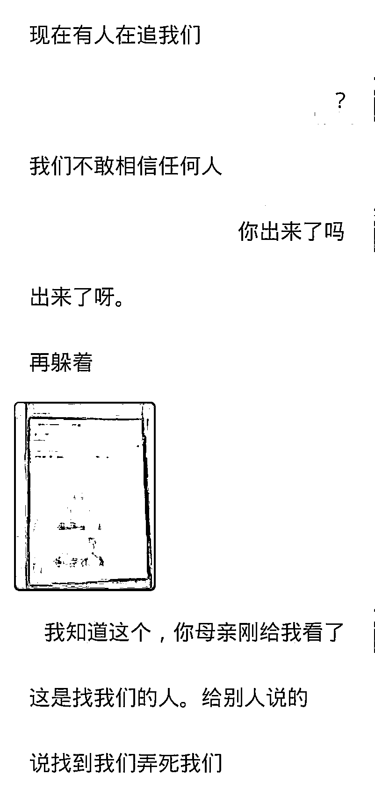
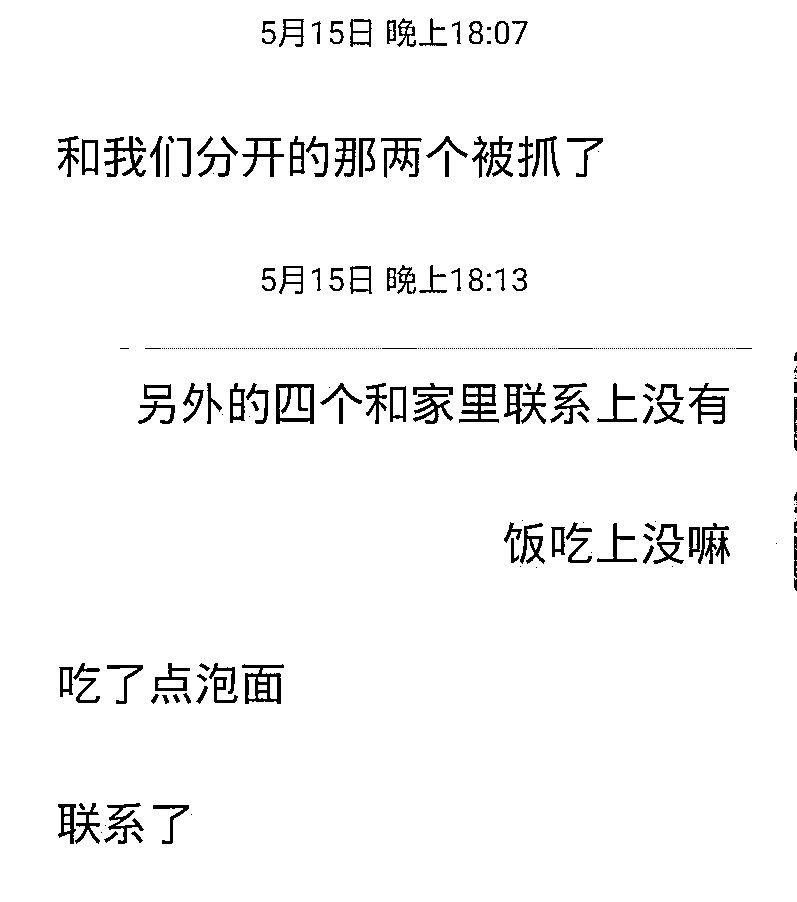
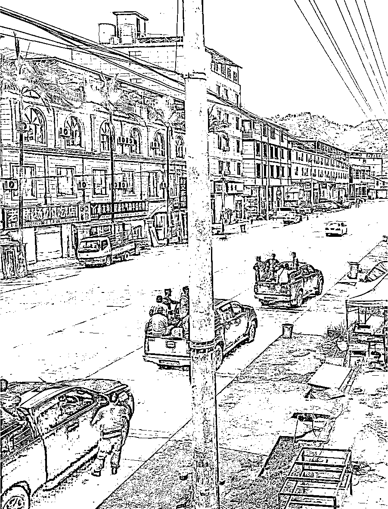
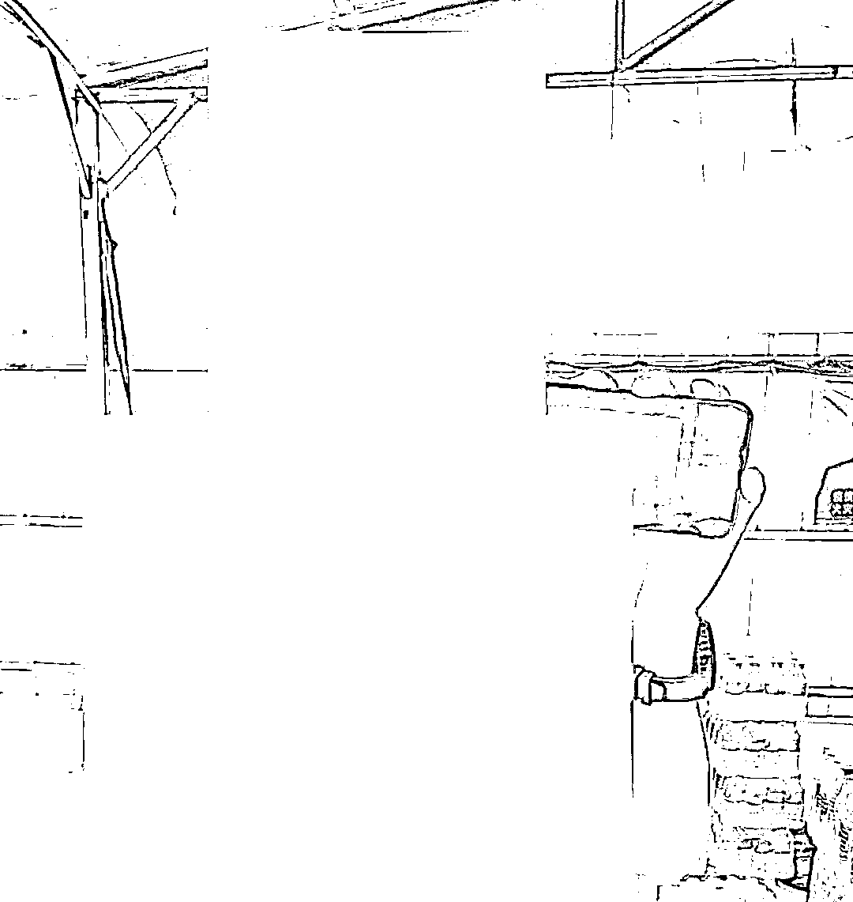
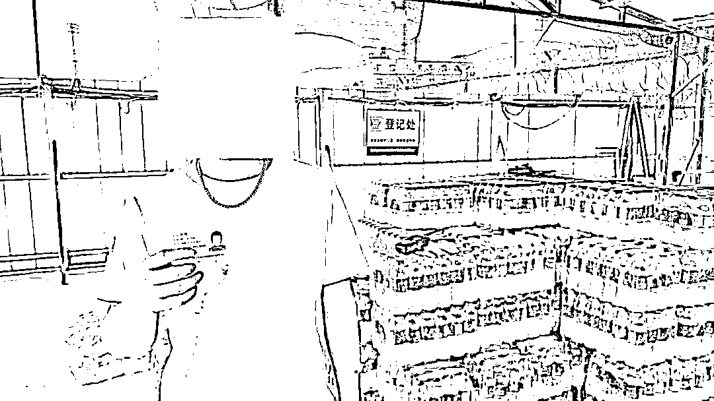
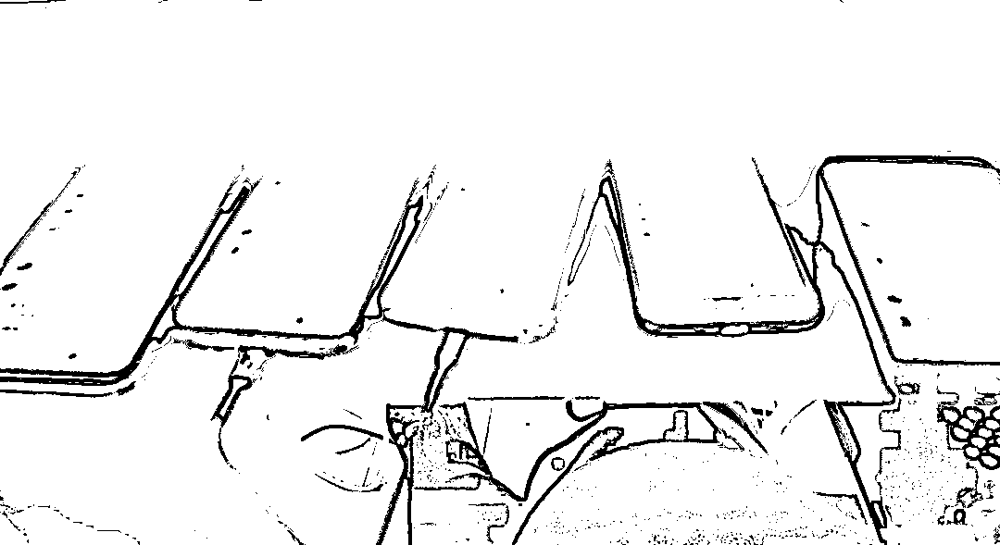
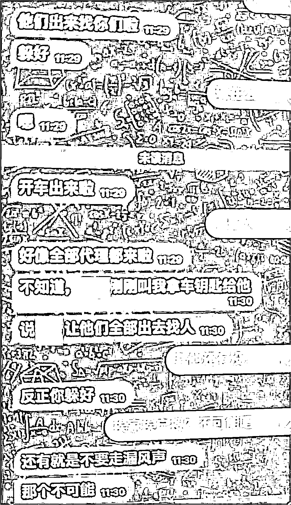
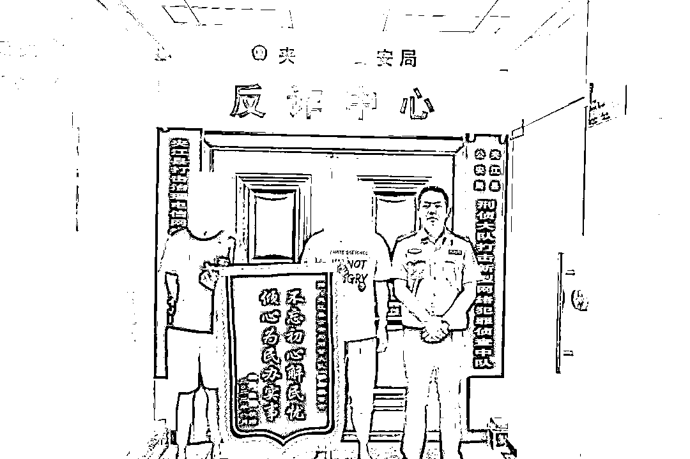
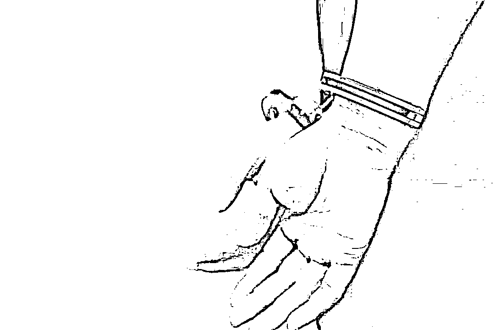

# 男子在警方协助下逃离缅北后，亲述惨痛遭遇……

> 原文：[`mp.weixin.qq.com/s?__biz=MzIyMDYwMTk0Mw==&mid=2247545182&idx=6&sn=83d0d96f0894e01c7e620ba03fa49980&chksm=97cbfa66a0bc7370d434ea019007634c979d2108d4c5e232f47b5051330b7ab932d3cda23e1f&scene=27#wechat_redirect`](http://mp.weixin.qq.com/s?__biz=MzIyMDYwMTk0Mw==&mid=2247545182&idx=6&sn=83d0d96f0894e01c7e620ba03fa49980&chksm=97cbfa66a0bc7370d434ea019007634c979d2108d4c5e232f47b5051330b7ab932d3cda23e1f&scene=27#wechat_redirect)

时至今日
竟还有人轻信缅北的“高薪招聘”

抱着“一夜暴富”的幻想

偷渡出国?

然而，等待他们的不是金山银山

而是境外人员的殴打和虐待

乐山夹江就有一个小伙儿

因为“高薪职位”的诱惑

和好友一起被骗到境外

身陷缅甸诈骗窝点

幸好他及时醒悟逃了出来

并在乐山夹江公安的帮助下

平安回家

**儿子身陷异国，母亲急求帮助**

2022 年 5 月 14 日，四川省夹江县公安局反诈中心接到辖区居民钱某（化名）母亲报警，称儿子钱某和其他几人被骗到缅甸某诈骗公司后不堪虐待，又无法交付“赎金”，刚从诈骗窝点逃出来，现正躲藏在缅甸的一个偏僻地方，而该诈骗窝点的武装人员正在到处寻找他们，情况十分危急，请求夹江公安帮助钱某尽快安全回到国内。

**武装围追堵截，解救逃出生天**

了解相关情况之后，反诈工作人员立即向乐山市公安局反诈中心汇报，并与市局边境工作小组进行协调沟通，终于与钱某等人取得了联系。

**▲民警与钱某的聊天记录**

因境外疫情原因，钱某等人只能一直躲在位于境外某处藏匿点内，配合边境工作小组开展解救工作。

**▲民警与钱某的聊天记录**

期间，境外诈骗公司曾打听到钱某等人踪迹，多次安排武装人员进行寻人。

**▲诈骗窝点武装分子搜寻钱某几人**

直到 2022 年 7 月底，钱某等人才安全到达边境隔离点，并在隔离结束之后终于再次踏上了祖国坚实的土地。

**缅北血色记忆，噩梦不堪回首**

“在那里，真的太恐怖了！”钱某即使平安回到了国内，提起那段噩梦般的经历，仍然心有余悸。

**▲被解救的钱某**

2021 年 5 月中旬，钱某在某招聘网站上看到一则境外高薪招聘游戏客服的广告，遂约上好友孙某（化名）一起准备过去挣点过年钱，在跟对方联系好后，便来到了云南边境，并于当晚被带到缅北某诈骗公司。

**▲钱某的好友孙某也被救出**

“公司”是一栋多层的房屋，拿着枪的保安、冰冷的高墙和铁丝网、封闭式的大铁门拦住了所有出路。而“公司领导”的第一个要求就是要钱某等人交出身份证、手机等一切身份证明材料和通讯工具。钱某等人此时才明白，所谓的“高薪招聘”，只是诈骗分子“招兵买马”“请君入瓮”的诱饵，自己这些人完完全全被骗了。 

据钱某叙述，“公司”犹如一个封闭的世界，每个楼层都有持枪的保安把守，楼下有小卖部、奶茶店，但物价却比国内翻了数倍之多。 

钱某等人先是被分开关押了近两个星期，随后被迫接受“入职培训”。培训中不仅要接受“公司”的洗脑，还被要求必须熟记几十页纸的诈骗“话术”。

“每天强迫上班 16 个小时，想骂就骂，想打就打，怎么打都没人管。”钱某说，“专门有 4 名工作人员‘盯梢’，打瞌睡或者工作不积极，就是一顿咆哮辱骂，有时直接一耳光打得眼冒金星。一旦有人上钩，就必须第一时间交给组长，继续下面的诈骗环节。”

**▲钱某被迫用多个手机“钓鱼”**

期间，钱某等人曾抓住机会逃跑过一次，但很快便被抓了回去，并遭受到“公司”人员的持械毒打，导致钱某手肘被捅伤。

随后，“公司”人员将钱某关到一间小黑屋，并把他的双手铐在了 1 米多高的铁棍上。就这样，钱某只能蹲着或者站着，靠着每天一碗白米饭，在这个没有任何声音和光线的房间里熬过了两天。 

两天后，“公司”持枪保安前来“谈判”：“要么交十万元走人，要么好好上班，否则别想活着回去。”面对身体和心理的双重折磨，钱某几近崩溃，没有钱交赎金，只能选择继续“上班”。

直至今年 5 月，在诈骗公司遭受非人待遇长达 1 年之久的钱某等人才又找到机会从诈骗公司逃离，并在乐山夹江公安的帮助下结束了这段黑暗的生活。

**▲被解救的二人向民警赠送锦旗**

✦

**相关法律链接**

✦

根据《中华人民共和国刑法》第三百一十八条规定，组织他人偷越国（边）境的，处二年以上七年以下有期徒刑；第三百二十一条规定，运送他人偷越国（边）境的，处五年以下有期徒刑、拘役或者管制，并处罚金；第三百二十二条规定，违反国（边）境管理法规，偷越国（边）境，情节严重的，处一年以下有期徒刑、拘役或者管制，并处罚金。

**  反诈民警： ** 

奉劝那些

企图偷渡去国外发横财的人

及早打消念头

同时正告那些

仍滞留在缅北从事违法犯罪活动的人

看清形势，早日回国自首 

争取依法从轻或减轻处理

来源：熊猫反诈

欢迎关注灰产圈社群服务号

