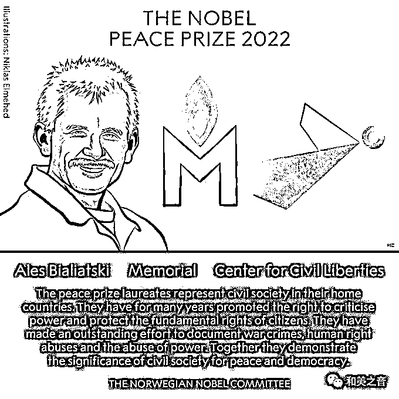
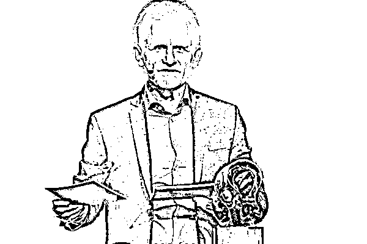
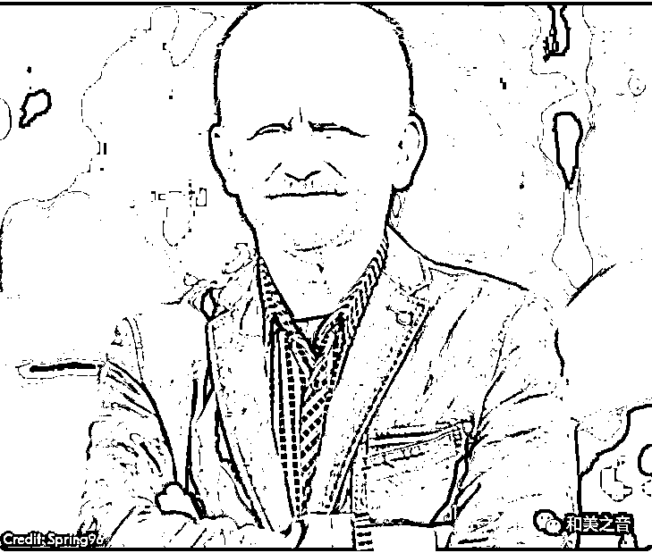
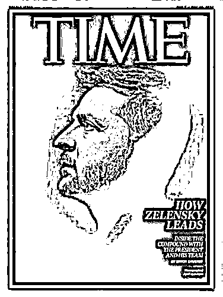
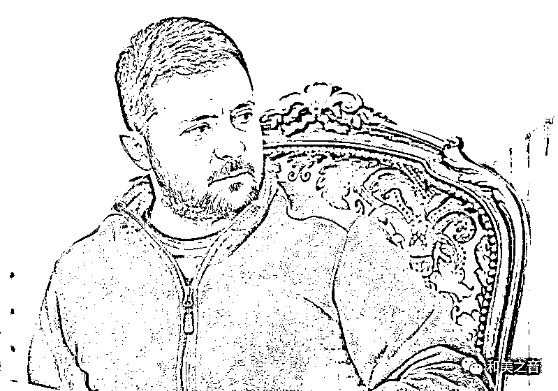
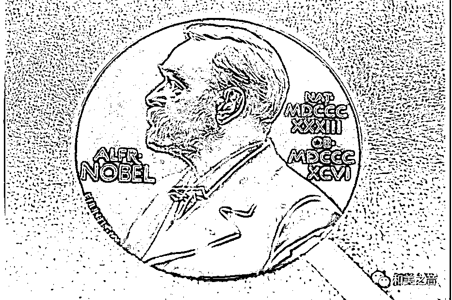
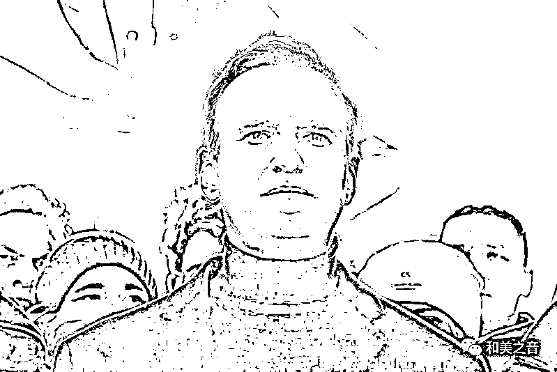

# 2022 年诺贝尔和平奖，未颁给泽连斯基

> 原文：[`mp.weixin.qq.com/s?__biz=MzIyMDYwMTk0Mw==&mid=2247545228&idx=6&sn=34edc01c701d7d8d4430f31cd2929dd7&chksm=97cbfab4a0bc73a2502f417fa7e543d732d2dec136ecb29eebbeedd8468251c0121a8620e071&scene=27#wechat_redirect`](http://mp.weixin.qq.com/s?__biz=MzIyMDYwMTk0Mw==&mid=2247545228&idx=6&sn=34edc01c701d7d8d4430f31cd2929dd7&chksm=97cbfab4a0bc73a2502f417fa7e543d732d2dec136ecb29eebbeedd8468251c0121a8620e071&scene=27#wechat_redirect)

2022 年诺贝尔和平奖 7 日揭晓，今年得主包括**一名个人及两个组织**，由白俄罗斯**人权活动家阿列斯-别利亚茨基、俄罗斯非政府组织纪念馆以及乌克兰的“公民自由中心”**共同获奖。

2022 年诺贝尔和平奖颁给一个个人及两个组织。（取自诺贝尔奖官网）

挪威诺贝尔委员会表示，2022 年诺贝尔和平奖颁发给毕亚利亚茨基、**“**纪念**”**以及**“**公民自由中心**”**，希望借此向在白俄罗斯、俄罗斯和乌克兰这 3 个邻近国家，**捍卫人权、民主与和平**的杰出贡献者致敬。

委员会指出，通过他们对捍卫人类价值、反军国主义，以及法律原则的持续付出，今年的得奖者重振并荣耀了诺贝尔奖创办人诺贝尔（Alfred Nobel）对于**国与国之间的和平与博爱愿景，这也是当今世界最需要的。**

诺贝尔委员会表示，**得奖者致力推动人权、消除暴力的努力，不会被遗忘。**

阿列斯-维克塔拉维奇-别利亚茨基

**阿列斯-维克塔拉维奇-比亚利亚茨基（Ales Viktorovich Beliatski），**1962 年 9 月 25 日出生，白俄罗斯政治活动家。 

### 他是白罗斯 1980 年代民主运动发起人之一，于 1996 年成立了维斯纳（Viasna） 人权组织。

### 他毕生致力于促进祖国的民主与和平发展，曾多次遭到当地政府逮捕：2011 至 2014 年遭监禁、2020 年的大规模反政权示威之后，他再次被捕，且仍未经过审判就被拘留。

尽管历经巨大的困难，但毕亚利亚茨基丝毫没有退让。

毕亚利亚茨基（Ales Bialiatski）

# **诺贝尔委员会吁放人**

目前，毕亚利亚茨基仍在监狱里，他刚刚在白俄罗斯的监狱中度过了 60 岁生日。去年 7 月，他因为逃漏税而被捕。

挪威诺贝尔委员会呼吁白俄当局释放毕亚利亚茨基。 

诺贝尔委员会主席赖斯-安德森告诉记者，**“我们呼吁白俄罗斯当局释放毕亚利亚茨基先生，我们希望这会确实发生，让他能来到奥斯陆，亲自接受颁发给他的荣誉”。**

白俄罗斯总统的批评者认为，白俄当局这么做，只不过是为了**让毕亚利亚茨基噤声**的拙劣手段。

欧洲联盟执行委员会主席冯德莱恩说，她要对乌克兰、俄罗斯及白俄罗斯人权斗士的勇气致敬。

她在推特发文表示，****“**诺贝尔委员会认同了这些男女挺身而出反抗专制的无比勇气。他们展现了公民社会在争取民主抗争中的真正力量**”****

****

**毕亚利亚茨基与妻子**

****俄罗斯非政府组织“纪念（馆）”****

**俄罗斯非政府组织“纪念（馆）”成立于 1989 年”。由前苏联的人权活动人士建立。**

**苏联解体后，发展成为俄罗斯最大的人权组织。**

**2021 年年底，俄罗斯当局以“违反一项与外国代理人相关的法律”为由，将该组织强行解散。但是，该法律具有极大争议。**

****乌克兰公民自由中心****

**公民自由中心在 2007 年成立于基辅，由乌克兰律师 Oleksandra Matviichuk 创立，目的是促进乌克兰的人权和民主。**

**这是乌克兰公民或团体首次获得诺贝尔奖。**

**该自由中心向当局施压，要求乌克兰成为一个全面的民主国家，也积极倡导乌克兰加入国际刑事法院。**

**在今（2022）年 2 月俄乌开战后，该自由中心一直致力于查明和记录俄罗斯对乌克兰平民犯下的战争罪行。**

****

****获奖大热门：泽连斯基****

**由于今年全球战事连连、灾害不断，和平奖最终奖落谁家备受外界关注。**

**根据瑞典炸药发明人诺贝尔留下的遗嘱，诺贝尔和平奖应该颁发给“为促进国家间友谊、取消或裁减军备以及为和平会议的组织和宣传尽到最大努力或作出最大贡献的人”。**

**主办单位今年透露，共有 343 名提名者，但完整名单不会公布，要 50 年后才会公开。**

**热门得奖人选包括：**瑞典气候活动家童贝里（Greta Thunberg）、俄罗斯反对派领袖纳瓦尼（Alexei Navalny）、白俄罗斯反对派领袖季哈诺夫斯卡娅（Sviatlana Tsikhanouskaya）、带领全球对抗新冠疫情的世界卫生组织（WHO）和天主教教宗方济**各等。**

**而今年，积极对抗俄罗斯的乌克兰总统泽连斯基得奖呼声最高。**

**在和平奖颁出之前，舆论普遍认为并支持将今年的诺贝尔和平奖将授予乌克兰总统泽连斯基。**

**3 月中旬，在俄罗斯开始进攻乌克兰后不久，近 40 名欧洲议员曾致信诺贝尔委员会，联合提名“乌克兰总统泽连斯基”。**

****

**乌克兰总统泽伦斯基得奖呼声高**

****

**但也有人质疑，泽连斯基不应该获奖，因为这个奖项通常会颁给为结束冲突作出贡献的人，而非战时的国家领导人。**

**另外，俄罗斯反对派领袖纳瓦尼（Alexei Navalny）也曾是诺贝尔和平奖得奖热门人选之一：**

****

**来源：和美之音**

****

**欢迎关注灰产圈社群服务号**

****