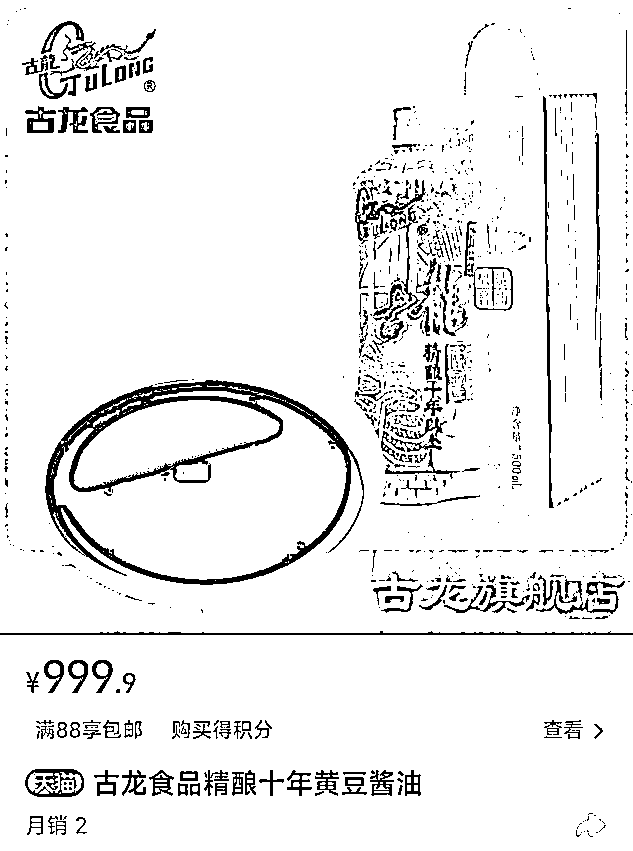
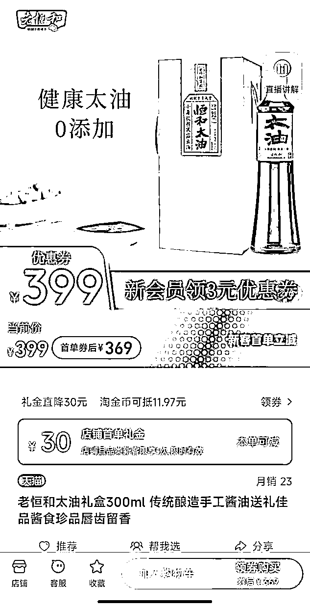

# 一瓶酱油到底能卖多贵？三万！

> 原文：[`mp.weixin.qq.com/s?__biz=MzIyMDYwMTk0Mw==&mid=2247545355&idx=4&sn=825cc8d09cb4fa5711b298bfb4a3999c&chksm=97cbf933a0bc7025407c93e8dca042277e7ddf52849ef54c4b05d0a92c1eee7fcfd413a80893&scene=27#wechat_redirect`](http://mp.weixin.qq.com/s?__biz=MzIyMDYwMTk0Mw==&mid=2247545355&idx=4&sn=825cc8d09cb4fa5711b298bfb4a3999c&chksm=97cbf933a0bc7025407c93e8dca042277e7ddf52849ef54c4b05d0a92c1eee7fcfd413a80893&scene=27#wechat_redirect)

**作者/潘哥  ****编辑/三火  ****排版/张玉琪**

**如果没有海天事件，大家可能不会去关注酱油这个产品，原来如此之多天价产品！** 

**海天酱油因为“双标”火了之后，潘哥发现如今的市场上，酱油价格差别很大。3 万元的六月鲜、1755 元的李锦记、1125 元的先市酱油……真真假假，让人看不清楚。**

**不过，千元一瓶的古龙、399 元的老恒和、298 元的千禾天元有机、218 元的仁昌酱园、86 元的薛泰丰，则成了很多人厨房里的常客。**

**同时，日本的酱油品牌，也成了很多人的最爱，大字酱油、东字酱油、万字酱油在国内很受欢迎。**

**这些酱油的价格，究竟与什么有关？潘哥发现，除了品牌与产地外，制作材料、制作工艺、食用用途、酿制时间等，都是其决定因素。**

**这些昂贵酱油，真的是生活中的必需吗？酱油这么贵，人们还能继续酱油自由吗？**

## ****特级酱油，3 万一瓶**** 

## 

**海天酱油最近火了，因为国内外配料表的“双标”。对此，不少网友在其天猫旗舰店留言：海天海克斯双标酱油好吃吗？酵母提取物，不是添加剂吗？到底有没有狠活儿？** 

**而在海天之外，消费者该选择什么样的酱油，成了很多人头疼的问题。潘哥秉承着价格越贵、东西越好的观念，在淘宝、京东这样的平台上，发现了许多天价酱油。**

****在京东上的某家店铺，潘哥发现 1.8 升的六月鲜特级酱油，售价竟然达到了 3 万元，享受 2 件 9.9 折的活动后，售价为 29700 元一瓶。****

****

**对于这瓶令人瞠目的天价酱油，客服表示请勿拍下，因为暂时发不了；而对于具体原因，对方则表示这边也不清楚。截至发稿，该商品仍在京东有售。**

****在天猫李锦记旗舰店，潘哥发现 1.75 升的薄盐生抽酱油，售价为 1755 元；咨询客服后，对方表示价格可能是运营设置错了，不推荐顾客购买这个。****

****

**在京东上，潘哥发现有家茶叶专营店，正在 5 折销售天价酱油。其中，8 瓶 400 毫升的日本东字牡蛎酱油，售价 4054 元，打折后 2027 元；1 升的日本盛田丸金酱油，售价 3050 元，打折后 1525 元；5 瓶 200 毫升的日本万字豌豆酱油，售价 2024 元，打折后 1012 元；而 1260 毫升的四川先市酱油，在这里标价 2250 元，折后价 1125 元。** 

****

**对于这家店铺的酱油，为何比别人家贵这么多，潘哥咨询了客服。对方表示：“产品您放心，别人家的不知道呢。”** 

**这样看来，电商平台上的这些天价酱油，有的似乎是某种引流手段，做不得真；有的则源于卖家的某种迷之自信。**

****

## ****高价酱油，有人买****

******那些售价上万元、数千元的天价酱油，确实有些离谱；不过，也有些酱油价格虽高，但最终也走进了寻常百姓家。****** 

********在天猫古龙食品旗舰店，潘哥发现 500 毫升一瓶的精酿十年黄豆酱油，售价****达到了 999.9 元，只比千元少一毛。**对此，客服向潘哥解释道：“这是十年的精酿，和普通酱油相比酿造时间不同，时间越久酱油酱香味越浓。”******

************

******天猫的老恒和旗舰店内，300 毫升的老恒和太油礼盒，号称采用传统工艺酿制、进行了四次套酿，售价 399 元。有网友表示，看过黄磊版的《深夜食堂》后，被剧中的“酱油拌饭”吸引，因此购入了天价的恒和太油，食用后对其倾心不已，吃完恨不得舔盘子。******

************

********同样在天猫上售卖的千禾天元有机酱油，号称非量产、无任何添加，一瓶 516 毫升，售价 298 元。**有网友评价这款酱油：“味道香浓又不太咸，包装大气上档次，看瓶子以为是白酒。”还有网友表示：“千禾有机酱油贵是贵，味道也一般，但胜在配料表干净，食品行业一分钱一分货是绝对的真理。”****** 

************

******在天猫仁昌记旗舰店，潘哥发现店内售卖的仁昌酱园黑豆酱油，500 毫升一瓶的售价 218 元。该店铺客服表示：该产品是手工纯粮酿制，零食品添加剂，可以当生抽用，还可以蘸着吃。同时，客服还表示：“家里用的话，55 元 360 毫升的土造太油就可以了，也是零添加。”****** 

********一瓶薛泰丰特级生抽酱油，500 毫升售价 86 元，成为了天猫薛泰丰旗舰店的第一热销品。**有网友食用后表示：“薛泰丰不愧是酱油界的爱马仕，拌进饭里真心让人惊呼，这是什么人间美味。”******

************

## ********日本酱油，有啥大不同？******** 

********除了国内的高价酱油，如今的市场上，潘哥还见到了各式各样的日本酱油，它们漂洋过海来到中国，也受到了不少国人的欢迎。******** 

**********在淘宝上，两瓶 100 毫升的日本大字透明酱油，售价 118 元。**客服告诉潘哥：“透明酱油虽然口感上没有多大差别，也是酿造酱油的风味，但是透明酱油经过脱色加工处理，会比正常的酱油工序繁琐很多。”********

****************

**********而前文提到的 400 毫升天价东字牡蛎酱油，到了京东超市，两瓶只需 89 元，最近一个月销量突破 200 套。**有网友表示：“牡蛎酱油很鲜，有点儿蚝油混着酱油的感觉，炒饭的时候加点它，简直太香了。”********

****************

********来自日本的万字酱油，拥有别具一格的桶装版本。在京东上，25 公斤一桶的日本万字酱油，售价 288 元，如果购买两件，单价约为 263 元。******** 

****************

**********在天猫万字旗舰店，潘哥发现万字特选丸大豆酱油，日本原装进口，500 毫升一瓶售价 79.8 元；不过，同样的国产零添加万字酱油，1.8 升仅售 42.9 元。********** 

********对于这种差异，客服表示：“日本原装的丸大豆酱油，是全脂大豆酿造，无任何添加成分；不过，国产的万字酱油，大豆、小麦、盐水等原料均取材于中国，在技术和味道上，与日本产酱油几乎没有区别；但是有些买家觉得有区别，这是看个人口感的灵敏度。”********

********曾在日本生活过的大伟则表示：“日本大多为酿造酱油，中国则多为配制酱油，酿造的工序繁琐，酱油口感也更好，因此要贵一些；另外，日本酱油大多采用复合菌群发酵，中国大多只采用米曲霉发酵。”********

## **********天价酱油贵在哪？**********

******这些不同品牌的酱油，在市场的售价如此不同，到底和什么因素有关呢？潘哥看来，除了品牌、产地等带来的溢价之外，酱油的价格高低，主要还由以下几个因素影响：****** 

********首先，酱油的制作材料不同。**黄豆、黑豆、大豆等材料，是酿造酱油的主体，不同的制作材料成本不同，就会影响到酱油的价格。******

********其次，酱油的酿制工艺不同。**比如，前文提到的酿造酱油与配制酱油的区别；比如，很多酱油厂商如今提倡古法工艺，打造零添加“人设”的同时，也提高了生产成本。******

********第三，酱油的食用用途不同。**在酱油的品类中，海鲜酱油、蒸鱼豉油、生抽、老抽等，用在不同的菜肴之上，也会影响到其售价。******

********最后，酱油的酿制时间不同。**比如，李立群的“厨邦酱油美味鲜，晒足一百八十天”。比如，前文提到的古龙特级酱油，进行了十年精酿，时间成本很高。******

******这些号称零添加的高端酱油们，对消费者来说，真的是生活必需吗？******

******有网友购买了日本万字酱油后表示：“酱油价格虽然高，但是味道没有想象中的好。”**还有网友表示：“只要是加工食品，没有食品添加剂的凤毛麟角，所以没必要为此焦虑，有食品添加剂不等于食品不安全。”********

******而在这些高端酱油的影响下，“打酱油”这个用于调侃的词汇，如今也打上了奢侈的标签。毕竟，在这么贵的酱油面前，人们可不能想打就打。******

******来源：智商税研究中心******

************

******欢迎关注灰产圈社群服务号******

************