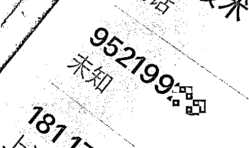
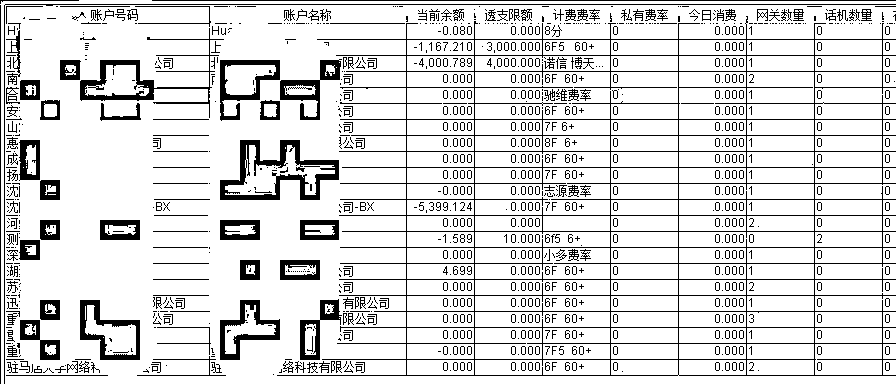
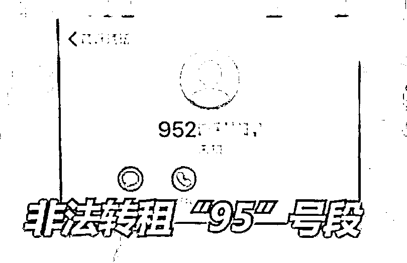
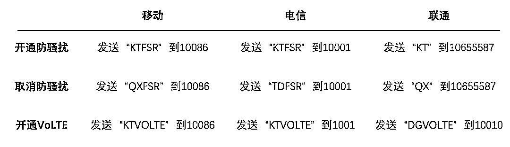

# 遭遇 95 号段电话“轰炸”！终于知道幕后黑手……

> 原文：[`mp.weixin.qq.com/s?__biz=MzIyMDYwMTk0Mw==&mid=2247545355&idx=5&sn=774c678cbece571c6b5e18963f015442&chksm=97cbf933a0bc7025d6a2e2c0f916e6453e0639f9a774081923184e0aa674f22c5424b9e7d712&scene=27#wechat_redirect`](http://mp.weixin.qq.com/s?__biz=MzIyMDYwMTk0Mw==&mid=2247545355&idx=5&sn=774c678cbece571c6b5e18963f015442&chksm=97cbf933a0bc7025d6a2e2c0f916e6453e0639f9a774081923184e0aa674f22c5424b9e7d712&scene=27#wechat_redirect)

净网 2022 百日行动

***95 号段***

奉化警方成功破获利用“95”号进行帮助通讯网络诈骗案件

# **百日行动**

***警惕！***

很多人都收到过骚扰电话

不少是以 95 开头的 8 位数号码

**95 号段**的背后究竟藏着什么秘密？

为什么不法分子特别青睐？

让我们通过一个案例

带大家走进**95 号段**背后的神秘世界

**#01**百日行动 2022

**95 号段来电，被骗 10 万**

2022 年初，李先生接到一个号码为 9548XXXX 的电话，对方向其推销贷款。

看到似乎是正规机构来电，缺钱的李先生便立即申请了 1 万元的贷款。在对方的指导下，李先生下载一款金融 App，并用自己的个人信息和银行卡号进行了注册。

正当李先生等待放款时，App 却提示他的银行账号不正确，为了更改账号，李先生按照对方客服要求，又给对方账号转账了一笔数额不小的手续费。

然而，账号错误、提现需要缴纳保险、需要充值 VIP 获取积分，一拨“套路”操作下来，李先生不但没有拿到一分钱贷款，还在对方的“精心指导”下先后多次汇款。

直到汇出总计 10 万元之后，李先生才察觉自己可能是被骗了，赶紧报警求助。

**#02**百日行动 2022

**95 开头的号码是什么鬼？**

李先生接到的号码是一个 95 开头的八位数号码，那么就从这个号码找起。

根据我国电信网编号计划规划，95 号码是全国范围统一使用的号码，按用途可以分为 3 类：

**服务型企事业单位客户服务号码、公益服务号码**和**其他业务接入号码**，通常就是我们所说的企业客服电话。因此，用 95 号码给你打电话的可能是某银行、某航空公司，还可能是某个做业务的增值电信企业，如快递公司，也可能是不良企业，骚扰电话多为最后一类来电。

也就是说，95 开头的号码本来是按照规定正常开通的。但为何李先生接到的电话又成了诈骗电话？

**#03**百日行动 2022

**非法转租 95 号段，抓！**

原来，近年来，由于高额利润的趋势，部分企业把申请到的“95”号段非法出租，而这一转租，就被一些骗子盯上了。

他们利用“95”号段号码来冒充企业进行诈骗，而受害人接到这种电话时都会在某种程度上降低戒备心理，受骗的可能性大大提升。

奉化警方接到报案后，经过 2 个多月的缜密侦查，共抓获犯罪嫌疑人 7 人，捣毁从事犯罪活动通讯技术类公司 2 家，查封“95”号段 20 个，非法网络电话线路 1 万余条，涉案金额高达数百万元。

犯罪嫌疑人交代，2021 年起，该犯罪团伙在天津、陕西两地收购具有“全国呼叫证”、“95 码”号证的两家“空壳”网络信息服务公司后，从宁波奉化电信公司租赁了“95 号段中继语音”线路，在明知买家可能从事违法犯罪行为的情况下，仍以高价违规转售或转租给第三方公司或个人，最终导致多名被害人受骗。

**目前，7 名犯罪嫌疑人均已移送审查起诉，2 家网络通讯技术类公司已被依法行政处罚。**

**#04**百日行动 2022

**如何识别和屏蔽骚扰电话？**

犯罪团伙利用“95”号段号码拨打电话主要有两个原因：一是此类号码多为大型企业使用，实施诈骗时具有较强迷惑性；二是网络技术的不断发展和升级，利用网络电话拨打具有很强的隐蔽性且不受地域限制。

对此，移动、电信、联通三大运营商都推出了官方免费的防骚扰电话屏蔽业务，操作如下图，不过这个功能仅限 4G 用户，同时还需要开通 VoLTE 业务。

另外，为了帮助用户区分“95”号段来电，工信部开放了免注册的号码查询服务，输入网址：

**http://www.miinac.gov.cn**

在首页“号码查询”栏目就可以查询来电号码信息。

如果接到涉及“95”号段的骚扰电话，用户可以向工信部委托的**12321 网络不良与垃圾信息举报受理中心**进行投诉，投诉方式为**12321 官方网站或 12321 举报助手 App**，相关单位将按规定程序对骚扰电话进行核查处理。

**昆明市反诈中心提醒**

不要轻易相信来历不明的电话或者短信，避免给不法分子进一步设下圈套的机会。

不要轻易向陌生人汇款、转账，若是遇到必须要汇款、转账的情况必须要再三核实对方信息。

广大网友务必通过正规合法渠道申请金融贷款。

来源：昆明市反电信诈骗中心综合公安部网安局、普洱警方

欢迎关注灰产圈社群服务号

