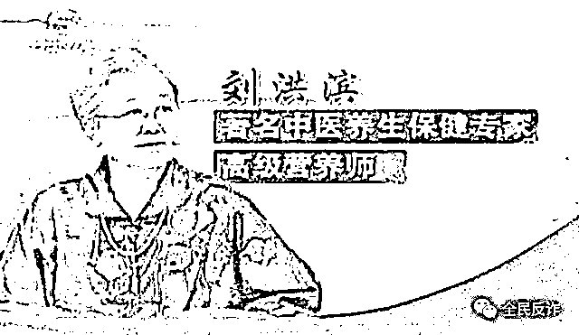

# 它能治病？请转给你的父母看看

> 原文：[`mp.weixin.qq.com/s?__biz=MzIyMDYwMTk0Mw==&mid=2247545414&idx=2&sn=fe5d630630ccee8d533eb5f20e4f9d95&chksm=97cbf97ea0bc70688b86c190eee73f3fa0ba16ea429aeaf599cc56481f2cd82c99c46bcde7e7&scene=27#wechat_redirect`](http://mp.weixin.qq.com/s?__biz=MzIyMDYwMTk0Mw==&mid=2247545414&idx=2&sn=fe5d630630ccee8d533eb5f20e4f9d95&chksm=97cbf97ea0bc70688b86c190eee73f3fa0ba16ea429aeaf599cc56481f2cd82c99c46bcde7e7&scene=27#wechat_redirect)

昨天寒露，

深秋的节令

也到了一年中进补时机了

前几天国庆假期 

几个朋友回老家一看

父母家屯了不少驼奶粉

老人说起来滔滔不绝

感觉可以包治百病

山西省太原市王大伯的经历来看下。

王大伯 65 岁，退休在家。一天，王大伯接到陌生电话，对方自称是驼奶粉的生产厂家，针对中老年人搞促销活动，王大伯很幸运地成为中奖顾客，现只需 198 元就可以购买到满 6 桶原生态驼奶粉，还额外赠送两根长白山野生人参。

刚开始，王大伯想挂断电话，但对方称这个产品是正规厂家生产，支持货到付款、7 天无理由退货，对老年人的心脑血管还有效。

“现在帮您登记，大概三四天能收到货，您记得开箱验货，确定是六桶奶粉两根大人参，再给快递员 198 元就可以了。”对方说。

王大伯有心脑血管方面的基础病，他听下来，觉得风险不高，又是正规厂家，还可以 7 天无理由退货，就买了 6 罐驼奶粉。

收到货后，王大伯用水一冲驼奶粉，根本冲泡不开，喝了感觉也没什么疗效，就报了警。

王大伯是辽宁阜新警方打掉的一个由侵公犯罪滋生养老诈骗犯罪的全链条犯罪团伙中涉及的一个受害者。

日前，阜新警方取缔犯罪窝点 6 处，扣押涉案电脑 62 台、手机 84 部，收缴公民个人信息 1200 余万条，查封涉案假冒保健品生产设备、包材、假冒食品多批，涉案金额 900 多万元。

**王大伯个人信息被转了三道手**

山西王大伯的信息是怎么到骗子手上的呢？

其实，王大伯的信息已经转了好几道手了。

第一道：2020 年 3 月以来，罗某非法获取中老年公民个人信息数据 1200 余万条。罗某将信息以 400-600 元/万条的价格卖给一个“靠谱”的朋友黄某，非法获利 100 余万元。

第二道：黄某某在所购买的信息中精心挑选出中老年人群体，组织公司员工电话推销仿冒伪劣“营养品”，实施诈骗活动。

同时，他又把使用过的个人信息转卖给“信得过”的前女友徐某、表弟黄某及其他两个朋友李某和谢某。

第三道：黄某等人效仿黄某某模式，分别成立电话销售公司，以类似手段销售假冒伪劣“保健品”。黄某还在网上把手中公民信息非法出售给高某、涂某等人。

这些团伙拿到中老年群体个人信息后，大肆从事诈骗犯罪活动。

从上可以看到，卖给王大伯驼奶粉的骗子两头赚钱，先买来个人信息，从中选出中老年群体作为对象，进行“电话轰炸式”诈骗，转手又把被骗过的中老人信息再次转手卖了赚钱。

骗子们选择的对象，多为退休在家、有一定经济基础、热衷养生保健的老年人。对不同类型的老年群体分级分类开展诈骗活动，甚至详细制定了 1000 余多页的话术资料。

而所谓的驼奶粉是伪劣产品，成本价只要 5 元，被他们包装成高端保健品，以几十倍的价格出售。

**买了 144 箱囤在家里**

今年 8 月初，柳州警方发现，在胜利路某市场内经常有不少老人在上课。

经查，这又是一个关于驼奶粉的骗局。

所谓的“讲师”夸大宣传驼奶粉的功效，可以治愈高血压、糖尿病等。在他们的大力宣传吓，老人纷纷掏钱，又是办会员等。

事实上，这些罐装的驼奶粉进货价可能只要 90 元左右，但他们对外销售的价格一罐高达 800 多元，翻了近 10 倍。他们还说，入会员的话可以拿会员价，也要两百多元一罐。

前期套路也是给老人免费发放鸡蛋、面条等，为老人建健康跟踪调查表，目的是诱骗老人办会员卡、长期高价购买产品，对骗子来说，是以小博大、怎么都不亏本的“生意”。

甚至有的老人，一出手就是大手笔。去年，一位南宁大妈被拉进南宁津头市场的一家驼奶粉销售店体验新产品，还被邀请前往厂家参观。

“不买就断货了”，各种“专家”轮番登场，大肆鼓吹驼奶粉的神奇功效，结果老人一口气花了 10 多万元，买了 144 箱驼奶粉囤在家里，直到家人发现……

**卖驼奶粉只是个敲门砖**

其实卖驼奶粉，只是骗子的敲门砖。

来看山东省东营市垦利区法院近日宣判的一起案件，该案中，有 700 多名老年人被骗 240 多万元，涉及到 17 个省市。 

河北退休老师刘老师，72 岁。

2020 年初，他接到一位自称北京同仁堂工作人员的电话，对方说可以免费试用驼奶粉。

刘老师在听对方讲了驼奶粉对老年人身体健康的诸多好处后，同意了，对方也是说货到付款，但要交纳 1500 元保证金，刘老师转了 1500 元过去，也收到了托奶粉。

几天后，有一位自称同仁堂章院长的人给刘老师打来电话，称可以帮他申请中国红十字会的救助金。

刘老师也相信了，后来对方以交纳个人所得税、保证金等方式陆续骗走了 28 万多元。期间，刘老师还买了 6 万多元的三七粉、四宝粉、西洋参粉、驼奶、海参、阿胶和玉碗等。

刘老师不知道，这背后其实是一伙人。

经查，2018 年 11 月，单某注册成立了以焦某为法人的大连市智宇生物科技有限公司。

2019 年下半年,单某先后招聘了王某、魏某等人为诈骗犯罪团伙成员，短期培训后上岗，公司分为人事、客服、销售、物流等部门，互相分工配合，通过向全国不同地区不特定老年人打电话进行诈骗。

单某等人冒充名医、医院院长、红十字会工作人员的身份，以办理会员、免费试用保健品、交纳保证金、大额救助金交纳个人所得税等理由，受害人一般在收到快递后，会被要求支付一定费用，还有的则以中奖、升级会员为名要求缴纳个人所得税。

从 2019 年 11 月至 2021 年 3 月，这个诈骗团伙共骗了 240 多万元，涉及 17 个省市 700 多名受害人，以老年人为主。

单某最后因诈骗罪被判有期徒刑十二年，并处罚金 25 万元，其他 7 个嫌疑人分别获刑并处罚金。

**为什么深信不疑可以治病？**

为什么这些年，驼奶粉的名字一直出现在针对老年人的保健品诈骗案中？

因为“神秘性”。

平时，我们常见的奶粉是牛奶制品。驼奶粉、羊驼奶粉，因为骆驼、羊驼这类动物我们不常见，所以带上了神秘。也给了骗子编造神话的空间。

但说到底，驼奶粉、羊奶粉是一种营养品，营养价值高，但它不是一种可以治病的药品。

那么，老人们为什么会深信不疑这奶粉可以治病呢？

我们梳理这些年涉及到驼奶粉的骗局，骗子们一般就是走的这些路线： 

**打开骗局之门**

利用免费的奖品进行引诱，利用人性的弱点，利用爱占便宜的普遍心理，用免费的奖品打开骗局之门。

一般，老人他们那一代人经历过生活的风霜与艰苦，每一样东西都是来之不易的。如能有免费的东西，感觉一定是自己走运了。很多老年人觉得，免费的奖品不要钱的不去领多亏呀。

有时候，连年轻人也会觉得“不付出、不用花钱就可以得到”这种诱惑难以抵挡。

**演戏满足心理**

很多老人退休后，每天也没什么事，儿女平常生活工作比较忙，极少陪伴，老人难免会感到孤独、空虚、失落感。

在骗局里，骗子“爸爸妈妈、爷爷奶奶”地叫，已经不是新鲜事。他们了解老人的生活状态会，扮演老人儿女的角色，关心慰问体贴入微，赢得老人的开心和信任，让老人感觉到，我自己孩子对我都没这么好，“当花钱买开心了”，而且还有免费的奖品好拿。

之前，**全民反诈**报道过，有个诈骗团伙被抓后，受骗的老伯还要替他求情，而口口声声嘴上喊着爸爸妈妈的骗子，在自己微信上，把诈骗对象备注成仆人。 

[点击可看 ▶](http://mp.weixin.qq.com/s?__biz=MzIwMzU1NTc4MQ==&mid=2247500573&idx=1&sn=d95310078074361c16eaa44073d89d63&chksm=96cf15b7a1b89ca1e53cfd61ecdd28fc1f7a90f7a8e1840d5ab4892c9711aabf2e03614b6dcd&scene=21#wechat_redirect) [卖保健品的骗子有多坏？表面嘘寒问暖，背地里却把客户备注为“仆人”，更想不到的是，老人被骗十多万，竟不愿报案还要为他们求情……](http://mp.weixin.qq.com/s?__biz=MzIyMDYwMTk0Mw==&mid=2247539786&idx=6&sn=0b0425a202b9d607813106cb8b78eb3b&chksm=97cb9772a0bc1e6424f85726479d7f2b1ea4a4f3230184a7e6c6dc25d6827e4190458e2adb95&scene=21#wechat_redirect)

是的，骗子很会演戏。演技一流。

在人多的地方，他们满面笑容，甜言蜜语，把老人当成自己的爹妈一样，让老人很有面子，自尊心、情感都得到满足。

而且，有的老人和子女关系一般，老人就会觉得留钱干嘛呢，生不带来死不带去。留给儿女，儿女都不在自己身边，所以他们宁愿把自己的积蓄花在买这些保健食品上，多听几句好话。

**放大痛点**

老年人身体上多多少少都会有些基础疾病，有的老人身体本身就不好。

骗子放大老人身上的疾病，使老人感到痛苦和恐惧，这个时候，骗子又很耐心地专业地帮助老人分析利弊。

一来一去，老人在痛苦和恐惧当中，对骗子推出的产品产生信任和依赖，掏钱买产品。

你看，是不是很熟悉的配方？很多商家都会用这招，把一样东西销售出去，首先要挖痛点然后放大痛点，制造需求。比如减肥产品，天天说减肥了人生重新开启，说多了都会心动。

**救命稻草**

骗子操作起来，就会把骆奶粉、羊奶粉的营养价值，功效，当成药品的疗效来去宣传。

而老人因为被放大痛点后产生恐惧，想抓住一根救命稻草，骗子的宣传，无疑让他们感觉就是救命稻草。

如果要买骆奶粉、羊奶粉，就去正规渠道买。大家还可以在网上正规的专卖店、旗舰店看看这类奶粉要多少钱，做个判断比较。

**“专家”上阵** 

骗子还会请出所谓的“专家”，大多就是他们一伙的，或者找个人来演专家，比如这位，眼熟吗？

这个刘洪斌（也叫刘洪滨、刘洪彬）在各电视上出现过，一会儿中医，一会儿睡眠、一会儿又是苗医专家。

“40 年来我专攻失眠，只要是失眠问题，用我的方法就能解决……” 

“我是刘医生，我行医几十年，只治咳喘这一种病……”

“活骨老方在苗寨已经传了几百年，到我这整整第十三代……”

“吃了我的药啊，糖尿病患者完全可以放开吃喝，过上正常人的生活……”

有人统计过，刘洪斌 3 年内就扮演了 9 位各类专家，是被网友戏称为“中国四大神医”之一。

其实，刘洪斌就是一个退休工人，退休了去剧组跑龙套，有广告公司看上她年纪大可扮演专家角色。就这样，在广告公司团队包装“加持”下，她从一个平平无奇的老太太摇身一变，穿上一身蒙古长袍，就成了大名鼎鼎，妙手回春的蒙医，穿上小西装，那就是北大来的教授专家…… 

不仅线上行骗，刘洪斌和公司还展开线下业务，全国各地搞巡讲，四处捞金，几年下来线上线下诈骗金额高达几十亿元。

**上课有托** 

上课时所谓的健康讲师，也会灌输一些伪知识。为什么要说伪知识呢？

比如，所谓讲师说人为什么会生病这个问题？会说跟我们吃的东西有关系，人生病跟缺乏营养缺乏某种营养元素有关系，补充某种元素就可以起到治疗好疾病的作用，就这样间接性的，慢慢的，循序渐进的去让老人明白这个道理，让老人买下产品。

去听课的老人中，还有一些骗子的托 ，他们扮演吃过并有效的人，我说的话你不相信，专家说的话你不相信，那他说的话你总该信吧，看到活生生的案例，老人瞬间信了。

最后，老人追求健康，作为子女我们都要支持，理解他们，我们不要和老人硬去讲道理，因为家不是一个讲道理的地方。

但我们也要让老人们有一点防备，请把这篇文章转给你父母看看~

来源：全民反诈

欢迎关注灰产圈社群服务号

