# 为什么中国的诺贝尔奖得主很少？现实可能更残酷

> 原文：[`mp.weixin.qq.com/s?__biz=MzIyMDYwMTk0Mw==&mid=2247545414&idx=3&sn=6ea508d3e96a6c2a191cf9add67d59bc&chksm=97cbf97ea0bc7068f9aeb74429a1f4d335c3219a6432ad7868ff3178c9f053c5448aaa7c4c12&scene=27#wechat_redirect`](http://mp.weixin.qq.com/s?__biz=MzIyMDYwMTk0Mw==&mid=2247545414&idx=3&sn=6ea508d3e96a6c2a191cf9add67d59bc&chksm=97cbf97ea0bc7068f9aeb74429a1f4d335c3219a6432ad7868ff3178c9f053c5448aaa7c4c12&scene=27#wechat_redirect)

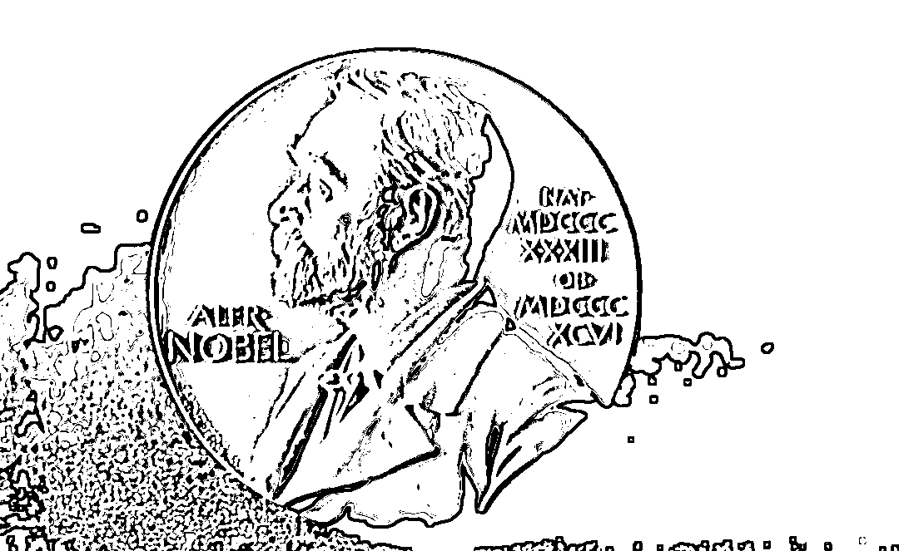

每年的诺贝尔奖都是一大看点，今年也没例外。

从 10 月 3 日起，2022 年诺贝尔奖陆续揭晓。

仅剩一项还未公布的诺贝尔经济学奖，也将在即将到来的 10 月 10 日公布。 

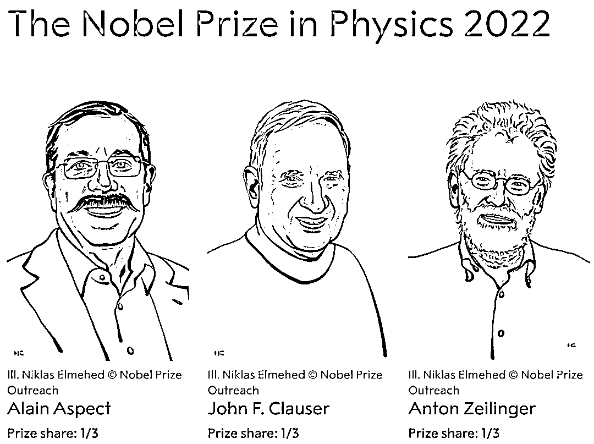

2022 诺贝尔物理学奖 

2022 诺奖周即将落幕，关注这项颁奖的国人却有点失望。

**将近一周陆续公布的诺贝尔获奖者中，没有中国科学家的身影**。 

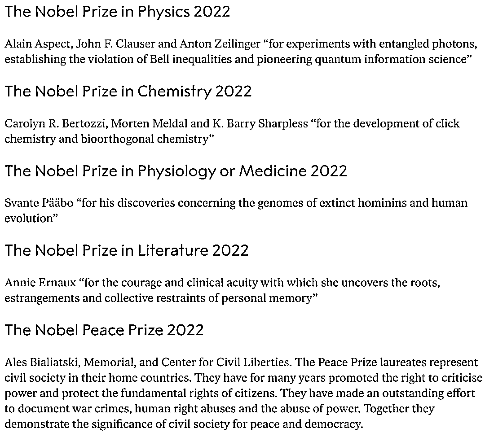

目前已公布的五项诺奖获奖名单

美国在彰显历来诺奖得主，多出自美国研究机构及美国大学。 

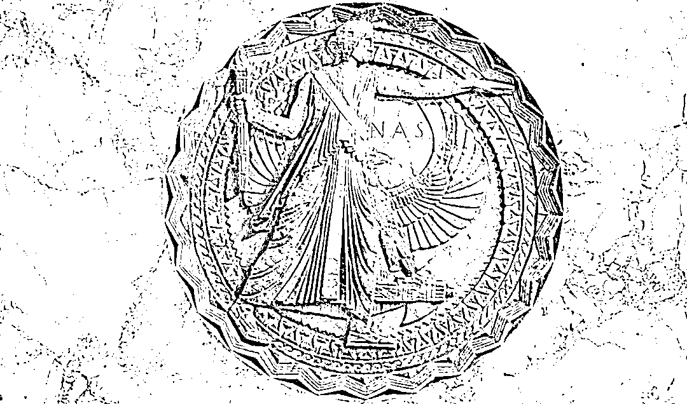

美国国家科学院墙面浮雕

日本提出的“50 年 30 个诺贝尔奖”的计划，曾被看作“口出狂言”，如今已经悄然实现了三分之二。

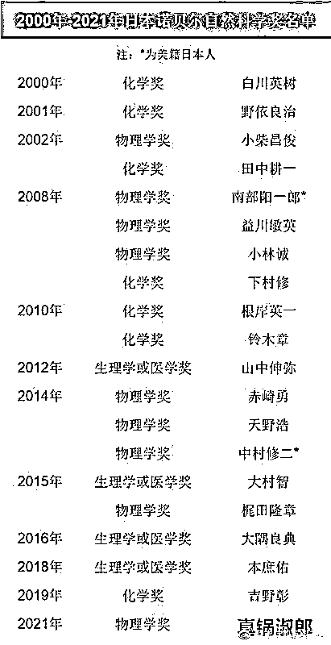

作为世界上最负盛名的奖项，诺贝尔奖旨在授予全球在物理、化学、生理学或医学、文学、和平、经济 6 个领域取得非凡成就的人。

印度作为亚洲范围内获得诺奖数第二多的国家，迄今为止共有 9 名诺奖得主。 

我国历年来，只有**莫言拿到了 2012 年诺贝尔文学奖，屠呦呦拿到了 2015 年诺贝尔生理或医学奖**。

华裔有 9 人，分别为李政道、杨振宁、丁肇中、李远哲、朱棣文、崔琦、高行健、钱永健、高锟。

诺奖从 1901 年开始颁发，经济学奖自 1969 年始颁发，**为何中国的诺贝尔奖得主却很少？** 

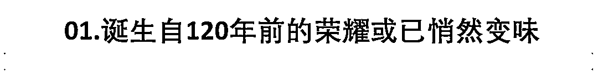

长久以来，诺贝尔奖都被认为是无上殊荣，诺奖得主被认为对人类世界作出了杰出贡献，推动了社会进步。 

一个世纪来，**诺奖科学领域的奖项获得者，都是当时科学事业的开创者**。 

根据诺贝尔基金会网站关于物理、化学、生理学或医学、经济学四个奖项的统计，全部科学领域以及经济学奖得主共有 710 人次，其中有 3 人获得过两次科学领域的奖项。

分别是鼎鼎大名的法国居里夫人；

发现晶体管原理和建立超导 BCS 理论的美国科学家，约翰·巴丁（John Bardeen）；

测定胰岛素分子结构和核酸 DNA 序列的英国科学家，弗雷德里克·桑格（Frederick Sanger）。

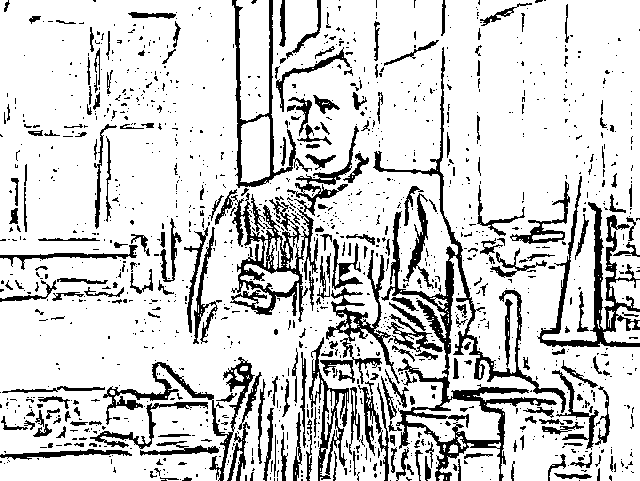

物理学、化学两度获得诺奖的居里夫人

然而科学领域之外的诺贝尔文学奖及诺贝尔和平奖，被诟病颇多。

这不是空穴来风。

文学奖与和平奖被广泛认为打上了西方世界意识形态、价值观，及其双重标准的烙印，因此缺少必要的客观性、公正性和科学标准。

美国史上进行战争最久的总统奥巴马，获得 2009 年诺贝尔和平奖，表彰他为加强“国际外交和人民之间合作”所作出的努力。

1939 年，瑞典一个国会成员甚至曾提名阿道夫·希特勒为诺贝尔和平奖候选人。

何其讽刺。

不同于其他诺奖，和平奖是由挪威议会选举产生。这个奖项是否早已违背诺贝尔的遗言，只有评选者自己心里最清楚了。

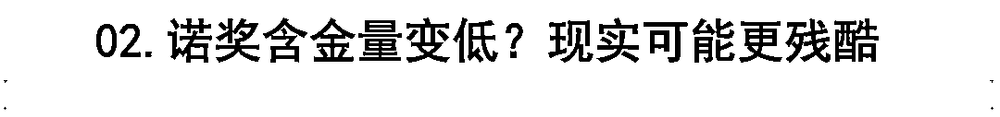

想获得诺贝尔奖，不但成果要经过科学界的重重考验，并且只有“活着的人”才可以参加评选。

**对不少年龄比较大的科学家来说，时间才是最大的考验**。

每年一度的诺贝尔奖并不只着眼于前一年有重大贡献的候选人。

据官方统计，通常自技术或理论提出之后 18 年左右才会获奖。

从 1901 到 2014 年间获得诺贝尔科学奖的得主情况看，从发表科研成果到获奖，**物理、生理学或医学奖的最长滞后时间均为 55 年左右**。

比如屠呦呦在 1972 年提取出治疗疟疾的青蒿素，直到 43 年后的 2015 年才获得诺贝尔生理学或医学奖。

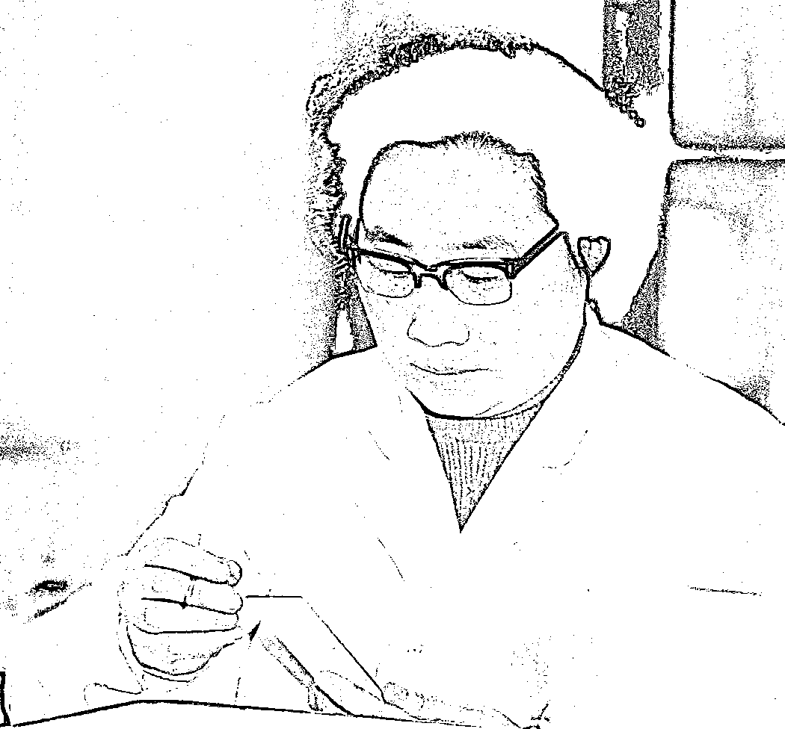

屠呦呦

除了评选的滞后性，近年来诺奖“含金量”也备受质疑。 

按照章程，要获得诺贝尔奖，首先要获得提名，之后经审核投票。

根据规定，诺贝尔物理奖和化学奖由瑞典皇家科学院评定，生理或医学奖由瑞典皇家卡罗林医学院评定，文学奖由瑞典文学院评定，经济奖委托瑞典皇家科学院评定。

这些评选机构的权威性和公平性，通常被认为是不容置疑的。

然而近年来，每每诺奖公布，其含金量总要受到人们的质疑。 

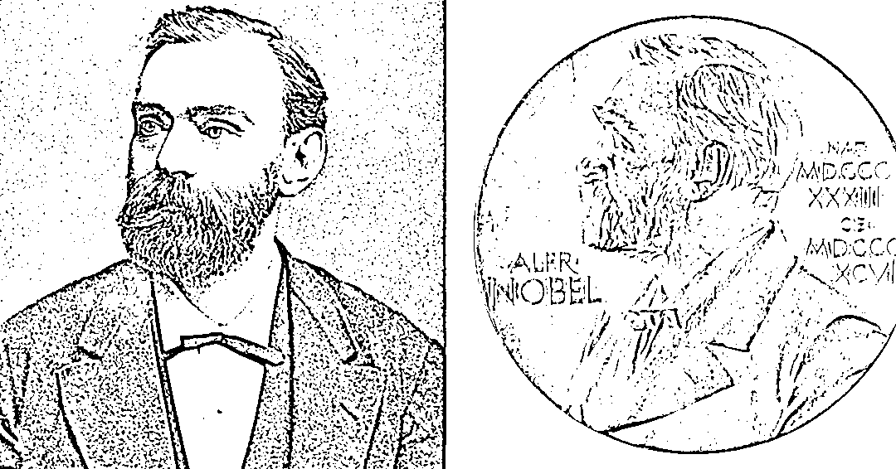

真的是诺奖含金量下降了吗？ 

众所周知上个世纪初期，世界范围内出现了一大批优秀的科学家，随即诞生了大量的科学成果。

这些成果影响之大，随便拿当时一个诺奖获得者的研究发明，或许就能影响整个世界。

也正因此，现代科学成果很难与几十年前比拟。

不少科学家认为，**最近几十年，人类在基础科学领域一直没有大的突破，才是现在诺奖含金量“下降”的原因**。

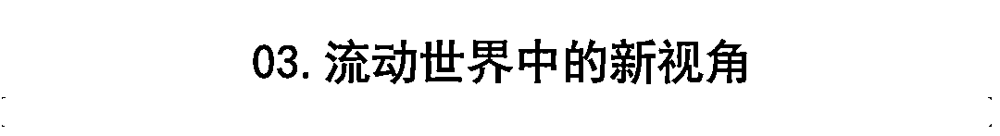

2022 年诺贝尔奖的奖金为 1000 万瑞典克朗 ，约合 642 万元人民币。

由于疫情，2020 及 2021 年诺奖未举办授奖仪式，今年诺奖的颁奖典礼将邀请前两届得主，于今年 12 月齐聚斯德哥尔摩。

**诺贝尔奖的获奖者地图中，美英德依旧是三大巨头**。截至 2021 年，美国获奖者达 399 人，英国 136 人，德国 111 人。

虽然历年来累计获奖人数不多，近些年来中国也开始在诺奖领域崭露头角。

莫言和屠呦呦的获奖，更是让国人鼓舞精神。

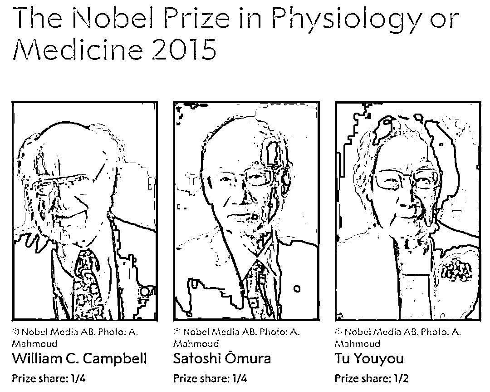

1895 年，63 岁的瑞典化学家诺贝尔立下遗嘱，用 3100 万瑞典克朗的遗产设立了诺贝尔基金会。

“在此我要求遗嘱执行人以如下方式处置我可以兑现的剩余财产：将上述财产兑换成现金，然后进行安全可靠的投资；以这份资金成立一个基金会，将基金所产生的利息每年奖给在前一年度中为人类作出杰出贡献的人。将此利息划分为五等份，分配如下：

一份奖给在物理界有最重大的发现或发明的人； 

一份奖给在化学上有最重大的发现或改进的人；

一份奖给在医学和生理学界有最重大的发现的人；

一份奖给在文学界创作出具有理想倾向的最佳作品的人；

最后一份奖给为促进民族团结友好、取消或裁减常备军队以及为和平会议的组织和宣传尽到最大努力或作出最大贡献的人。

这是我的一切遗嘱中有效的遗嘱。”

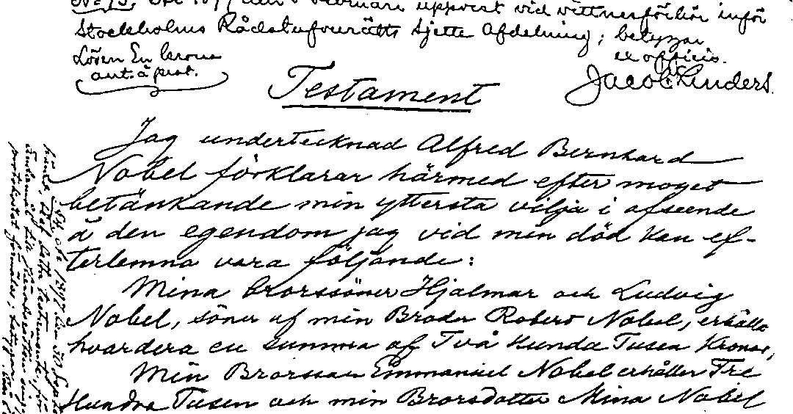

诺贝尔遗嘱

如今这份诞生自 120 年前的荣耀，在流动的世界中，有了新的视角。 

**对待诺贝尔科学奖，我们既不能不屑一顾，也没必要膜拜迷信。**

科学态度评价，科学规律认识，平和心态看待。凡是能促进诺奖级别重大科学领域的产出，一定是有益于全人类的。

中国科学界在进步，不在于有几个诺奖得主。 

一个伟大的科学家也不会因为他没得诺贝尔奖，就不再是一个伟大的科学家。

ref：

时代周报：诺贝尔奖 121 年：奖金越发越多，用滞后性奖项记录时代变迁

来源：北美留学生日报

欢迎关注灰产圈社群服务号

