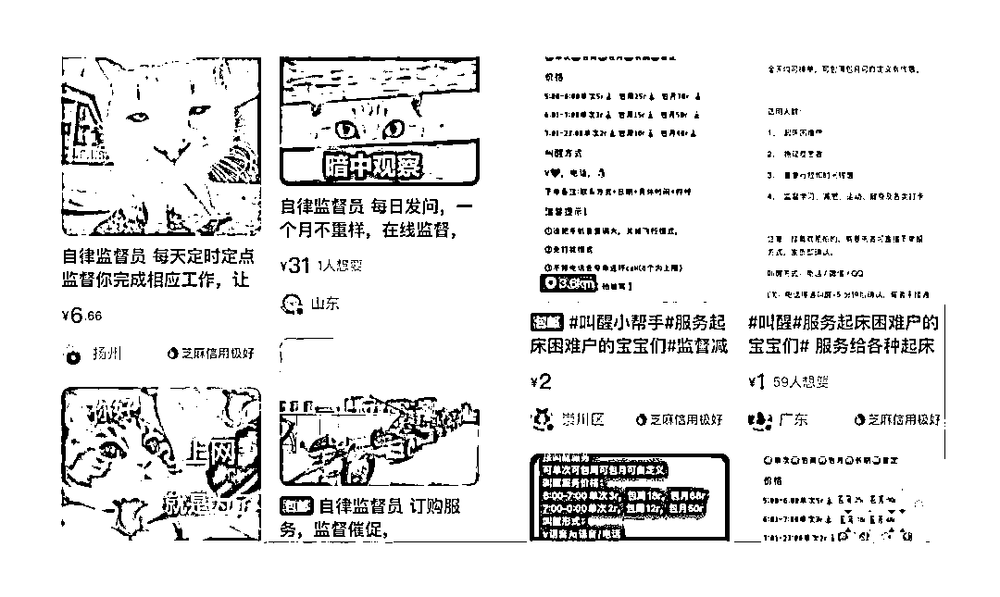
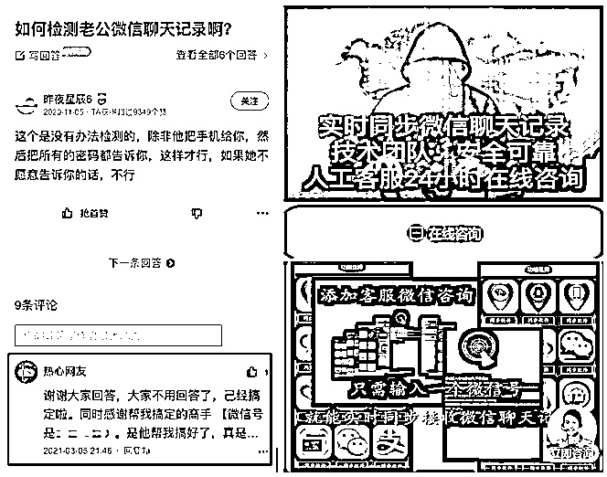
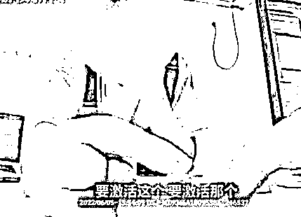

# 波兰人买的煤，下雨后褪色了......

> 原文：[`mp.weixin.qq.com/s?__biz=MzIyMDYwMTk0Mw==&mid=2247545414&idx=5&sn=02af27d3ffc387810f27a746a26c64a0&chksm=97cbf97ea0bc70685ae11fe1947ce07cc57489593853629d2d3290daef4e9871d2ebbcacd74a&scene=27#wechat_redirect`](http://mp.weixin.qq.com/s?__biz=MzIyMDYwMTk0Mw==&mid=2247545414&idx=5&sn=02af27d3ffc387810f27a746a26c64a0&chksm=97cbf97ea0bc70685ae11fe1947ce07cc57489593853629d2d3290daef4e9871d2ebbcacd74a&scene=27#wechat_redirect)

电信网络诈骗已成为全球性问题 

各国骗子在骗术使用上

都有着异曲同工之处 

这不“凛冬”降至

遭遇煤炭短缺危机的波兰人

同样遭遇了购物诈骗

有人付了钱没收到货

有人买到了一车

染成黑色的石头……

**涂黑石头冒充煤炭？****波兰发生多起涉煤炭诈骗事件**

[`mp.weixin.qq.com/mp/readtemplate?t=pages/video_player_tmpl&action=mpvideo&auto=0&vid=wxv_2593224221292806145`](https://mp.weixin.qq.com/mp/readtemplate?t=pages/video_player_tmpl&action=mpvideo&auto=0&vid=wxv_2593224221292806145)

其实就是波兰一居民预定 3 吨煤炭 

对方工作人员送货上门亲自卸货

**然而几场雨过后**

**买到的“煤”开始褪色**

**她才发现买到的并非燃料**

**而是经过染色的石头**

这好歹还是线下购物 

遇事还能逮着工作人员或公司

有线可查 有据可退

但线上订购煤炭就又是另一回事了

波兰另一居民网上看中一批煤炭

该国煤炭运费往往由买家支付

且价格不菲

因此当对方承诺包运费

并将在 10 天内发货后

男子立即下单

结果对方收钱之后迅速消失

**电话、电子邮件都联系不上**

这套路的味道 

**叫“物以稀为贵”**

和不同时间段“顶流”的网络销售

如出一辙

这也成为骗子轻易拿捏买家的王牌

其实网上不仅能买到实物

（当然也可能存在货不对板、假冒伪劣、甚至直接“空头支票”）

# 还有各种另类奇葩的虚拟服务

好奇也好 猎奇也罢

的确是满足了一些人的需求

（图片源自网络）

更有一些技术类的“调查”服务

公然在各类贴吧、论坛

通过“自问自答”“一问一答”的形式

发布广告贴

吸引有需求人员“入场”

这类买家总以为

**万能的网络**

**能够解决自己所有的需求**

**也坚信网络背后的一拨人**

**掌握着游走于法律边缘**

**试探法律底线**

**逃避法律追究的能力**

这样的认知

也是骗子拿捏买家的另一王牌

（图片源自网络）

常熟的小吴想查看男友聊天记录

为此她通过网络联系上一名“黑客”

对方了解到她的需求后

给她推荐了一款软件

表示支付 450 元就能破解手机

心急的小吴没有想太多

立马下载软件并支付了 450 元

在注册账号后

软件界面开始跳出

**“需要购买激活码”**

**“需要实名制信息”**

**“需要购买套餐激活设备”**

**“需要授权、保证金”等各种提示**

每一次提示都需要缴纳一定的费用

不知不觉中

小吴已经支付了接近 8000 元

仍然没有解锁全部功能

更没能解锁男友的手机

**反诈君想说**

购物诈骗、虚假服务类诈骗 

一般青睐于想购买“稀物”

想占便宜购买低价产品、服务

或有不足为外人道也需求的人

这样的产品、服务一般

也无法有官方平台背书保证

买家心知肚明

有时也愿意相信对方

所提供的的平台担保

（可偏偏那样的平台可以作假）

只能做好给钱挨打的准备 

赌网络那头的人有没有“心”

可偏偏骗子是最没良心的

就如下雨天

那褪了色的煤一样

来源：南通反诈

欢迎关注灰产圈社群服务号

