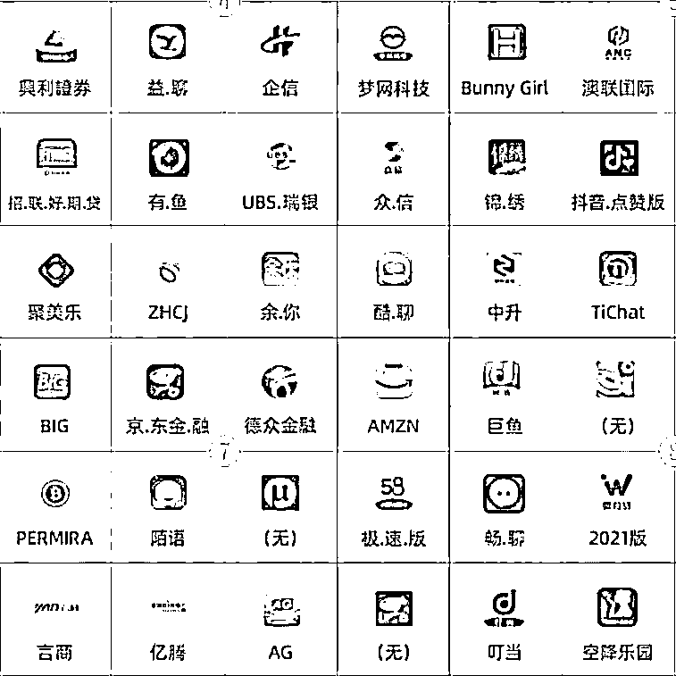

# 700 个涉诈 APP，下了就中招！

> 原文：[`mp.weixin.qq.com/s?__biz=MzIyMDYwMTk0Mw==&mid=2247545414&idx=7&sn=824c86161135a044f571cfb800d93f78&chksm=97cbf97ea0bc7068665336d371e7f7aa7415869f02fff7be3b5fc4f899ffd49a244632b0233e&scene=27#wechat_redirect`](http://mp.weixin.qq.com/s?__biz=MzIyMDYwMTk0Mw==&mid=2247545414&idx=7&sn=824c86161135a044f571cfb800d93f78&chksm=97cbf97ea0bc7068665336d371e7f7aa7415869f02fff7be3b5fc4f899ffd49a244632b0233e&scene=27#wechat_redirect)

你  

**被骗过吗？**

你的亲属朋友

**被骗过吗？**

受骗之后......

是选择**隐忍！**

还是**报警！**

[`mp.weixin.qq.com/mp/readtemplate?t=pages/video_player_tmpl&action=mpvideo&auto=0&vid=wxv_2602213602808463361`](https://mp.weixin.qq.com/mp/readtemplate?t=pages/video_player_tmpl&action=mpvideo&auto=0&vid=wxv_2602213602808463361)

**（以上视频来源于网络）**

当下

手机应用软件**（英文简称 App）**

已成为社会公众**娱乐交往**

**生活消费****投资理财**的主要媒介

**App**的广泛使用

在给用户带来便利的同时

也在为诈骗分子

实施电信网络诈骗提供便利

**（经典的虚假投资理财、网贷、刷单、博彩、招嫖“约炮”诈骗**

**都有诈骗 App 为其助力）**

各大反诈公众号

曾转发一篇文章

公布了**700 个**

**涉诈 App**的图标及名称

其中不乏仿冒大品牌的虚假 App

但涉诈 App 改头换面的速度 远超你的想象 所以识别涉诈 App 紧靠公布科普还远远不够

**NO.1**

**真假 APP 之充值方式不同**

* * *

正规 App

正规投资理财平台的充值方式都是集成在平台上的，**也就是说在投资理财平台上可以直接用绑定的银行卡进行充值**。充值方式可以是银行卡支付，也可以是微信、支付宝等其他第三方支付方式。

涉诈 App

骗子制作的虚假投资平台一般不会把充值方式集成到平台上去,而是让受害者将钱充值到诈骗 App 的账户中去；即使有的 APP 界面上提供了“充值”这一个可点击的界面，但点开出现的也仅仅是提供对方的收款账户信息，不能直接在平台转账。

* * *

**NO.2**

**涉诈 App 存在支付漏洞的原因**

究其原因无外乎**成本**、**安全**和**技术**要在 App 上集成充值必须要用到对公账户也就是单位或公司账户个人账户是不能办理的总结成以下两点

**01**

要将银行或支付宝、微信支付集成到 App 上，必须要到银行、阿里巴巴和腾讯申请接口，这个申请要求必须是对公账户，而且必须提供营业执照、机构代码、法人身份证等相关资料。 

**02**

另外，对公账户一旦集成到 App 上用于收款，一次只能用一个账户，一旦当前在用的账户被冻结，更换起来非常麻烦，必须要重新走一遍接口申请的流程。所以不管是从**成本**还是**技术**的角度诈骗集团都没有理由选择将**对公账户**集成到诈骗**App**中用于收款

当然

在**“断卡”行动**深入开展之前

确实有很多诈骗集团利用

对公账户将支付方式集成到诈骗**App**上

受害者可以直接充值

但随着打击涉诈“两卡”犯罪力度的增强

黑市上贩卖的对公账户已大幅减少

而价格也随之水涨船高

即使诈骗集团拿到了对公账户

**也随时面临着被冻结的处境**

**NO.3**

**仅仅一个刷单换了 7 个账户**

一个并不复杂的刷单案例中一共换了**7 个充值账户**这种情况下骗子无法将充值的人和平台账号对应**所以通常会要求发送已转账的截图**这样他才能在对应的平台账号上加上充值的金额**而这些是正规平台所不需要的步骤**正规平台会知道谁充值了明白了以上道理之后判断一个诈骗 App 就变得非常容易了其实总的来讲平台外转账进行充值的经常更换收款账号的需要提供转账截图的满足以上三点的

不是诈骗就是网络赌博

以下是今年以来

常见的**九大高发诈骗手法**

快跟小编一起来学习吧~

 

**反诈骗，我们需要您的参与！**

**多一人转发，少一人受骗！**

来源：天下有诈

欢迎关注灰产圈社群服务号

