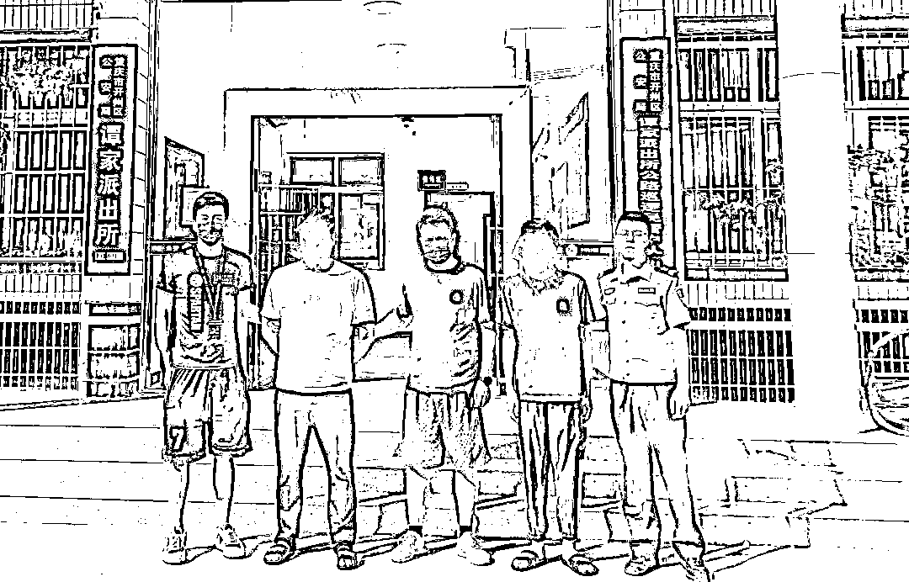

# 这个贩卖公民个人信息的违法犯罪团伙落网了！

> 原文：[`mp.weixin.qq.com/s?__biz=MzIyMDYwMTk0Mw==&mid=2247545414&idx=8&sn=84c5b99df923557536b83e37dd914df8&chksm=97cbf97ea0bc7068964298733ac365de3066ac150a746c41c9e15c674722270aabced0ce1234&scene=27#wechat_redirect`](http://mp.weixin.qq.com/s?__biz=MzIyMDYwMTk0Mw==&mid=2247545414&idx=8&sn=84c5b99df923557536b83e37dd914df8&chksm=97cbf97ea0bc7068964298733ac365de3066ac150a746c41c9e15c674722270aabced0ce1234&scene=27#wechat_redirect)

“您需要 xxx 嘛”

“对 xxx 您有购买意向嘛”

被垃圾短信、推销电话“轰炸”

相信不少人都经历过

并对此深恶痛绝

在一个昏暗的屋子里，王某带领团队在某境外聊天软件上秘密地进行信息交易。他的 10 余名员工分散在重庆、成都、上海等城市的角落里。

曾从事**电话销售**相关工作的王某，深入了解相关工作模式和销售链路后，积累了自己的人脉网络，在利益驱使下，从一名“打工人”，“自立门户”，化身老板，叫上了自己的老乡们，成立——**信息贩卖团队**。

作为“中间商”，王某从上游黑客处低价买入用户信息，后通过 Telegram 平台将获取的一手信息打包，**以五毛至 2 元每条的单价**，贩卖给电话销售团队或相关证券公司，以此来获得非法收益。

王某团队涉及公民个人信息数据巨大，信息包含期货、证劵投资人员的姓名、身份证号码及绑定手机号码等。

法网恢恢，疏而不漏！

王某的”好日子“没过多久……

2022 年 7 月，杭州临安网警在工作中发现了他们的影踪！

杭州临安网警立刻展开分析研判，查实频道创建人王某，25 岁，重庆人。继续深入追查，警方终于摸清了以王某为首的分布在成都、重庆、上海等地的侵犯公民个人信息团伙。

2022 年 8 月，专案组在成都、重庆、上海等地实施抓捕，一举抓获犯罪嫌疑人 10 人，扣押现金 120 余万，剩余资产冻结，**总计折合人民币价值约 1500 万元。**

**网警提醒**

出售公民个人信息是**违法犯罪行为**，相关企业要完善内部管理制度，加强数据信息防护，加强对员工以及外包公司人员网络安全和法治教育，杜绝公民个人信息泄露。

**警方将持续重拳打击**，以打击团伙、追查源头、斩断链条为重点，坚决摧毁侵犯公民个人信息不法利益链条，切实保障人民群众合法权益。

广大群众要注意保护好自己的个人信息，发现侵犯公民个人信息的线索，**请及时拨打 110 向公安机关举报****。**

来源：公安部网安局

欢迎关注灰产圈社群服务号

