# 千万网红梅尼耶被骗 1500 万！老板诈骗 80 多套房产，金额超 2 亿被刑拘，更多内幕被曝光

> 原文：[`mp.weixin.qq.com/s?__biz=MzIyMDYwMTk0Mw==&mid=2247545470&idx=2&sn=993279358372fc2cd23b34adc51150ed&chksm=97cbf946a0bc705099099d3440dcb7792cd295b87de705984e73676235fc98d0b8d64beadf8a&scene=27#wechat_redirect`](http://mp.weixin.qq.com/s?__biz=MzIyMDYwMTk0Mw==&mid=2247545470&idx=2&sn=993279358372fc2cd23b34adc51150ed&chksm=97cbf946a0bc705099099d3440dcb7792cd295b87de705984e73676235fc98d0b8d64beadf8a&scene=27#wechat_redirect)

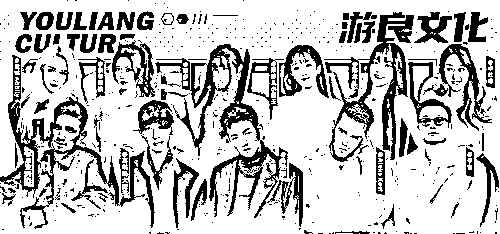

粉丝超三千万的网红梅尼耶，经过近十来天的断更后，在最新的视频中置顶了一条评论，透露自己疑似被公司创始人骗了 1500 万，并表示最近过的很压抑很疲惫。 

**01**

**幕后“神豪”操手，多名网红被骗**

为什么会说梅尼耶疑似被公司老板骗钱呢？这事还要从 9 月 29 日，同为汽车达人的“小刚学长”在个人小号上发布了一条图文动态，表示据传“神豪”被刑拘了，还透露据说“神豪”诈骗房产八十多万，涉案资金超 2 亿元，已经有五十多个被骗的人报警。

小刚学长透露自己被骗六十多万兼职就是毛毛雨，因为公司旗下多位艺人、公司其他投资人，都被这个“神豪”骗了很多钱，艺人们不知道能不能解约成功，也不知道钱拿不拿的回。而罪魁祸首“神豪”却以各种理由手段想办法逃避责任。

而这个“神豪”到底是谁呢？有官方发布权威消息，表示“神豪”就是深圳知名头部 MCN 创始人罗冠彦。这家公司旗下的艺人也都非常有名，如梅尼耶、蔡萝莉、陈意礼等千万级别的网红，全都是该公司的签约艺人。

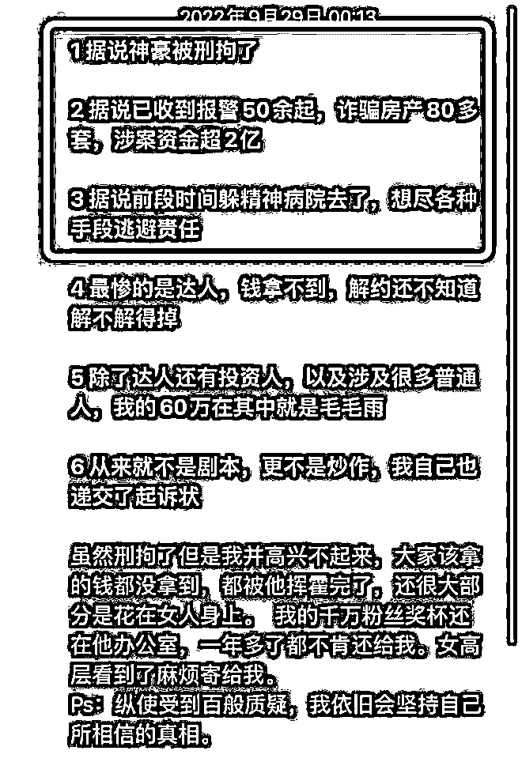

就在当天，疑似梅尼耶在朋友圈发动态称“真的好人没好报”，一口叹气尽显无奈，似乎是在暗示自己被公司老板罗冠彦骗钱这件事。

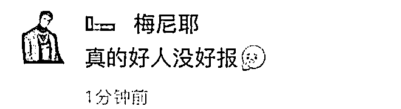

紧接着，该公司也发表了严正声明，重点有以下几条。第一，罗冠彦已经将经营权转交于高管团队及董事会，罗冠彦和该公司已经没有任何关系。第二，公司没有收到相关部门的调查通知；第三，希望网络上的媒体们、达人们针对公司的不实谣言全部删除。

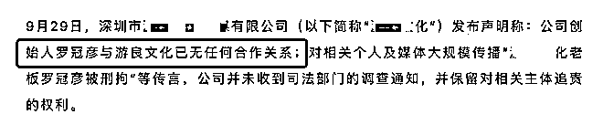

后来有财经媒体打电话到该公司，希望进一步了解真相，但对方接通电话并未透露任何信息。就在十月四日晚上梅尼耶发声后，小刚学长用大号再次发表声明，强调目前该公司很多达人很崩溃，因为信任却被欺骗。还强调自己没有被谁利用，也没有任何剧本，单纯是个人主动站出来曝光，想要回自己的钱，也希望不要再有人上当受骗。

**02**

**梅尼耶发文，1500W 看清一个人**

经常刷短视频人肯定知道梅尼耶等人，几乎鲜少人会想到人前风光无二的他们，背后原来也有许多难处，也会被人欺骗损失财产，也会面对各种复杂的利益纠葛。

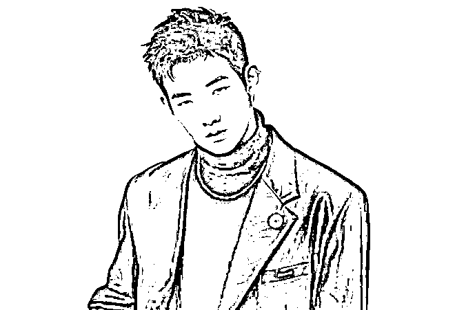

梅尼耶作为三千万级别粉丝的大网红，大部分人都会觉得肯定赚不少钱，作为头部网红，一个月光靠着流量和视频点击，也能赚个几十万，放着这么大的流量不拍视频赚钱，怎么就突然在 9 月底毫无征兆的停更到现在。

但很多人不知道的是，这些网红背后都签约 MCN 机构，网红的收益都会先经过 MCN 账户，然后再抽取一部分成，剩下的才会给到网红个人账户。这就意味着一旦公司跑路，或者负责人沟通要延期打款，网红明知道这钱是自己的，也是没有办法的。

近期，梅尼耶突然在评论区发文，称 1500W 看清一个人，这个代价真的大，不明白为什么一次次相信别人，换来的却是这个结果。而梅尼耶还曾在朋友圈发文直言好人难做，可见是当了好人用 1500W 交学费了。

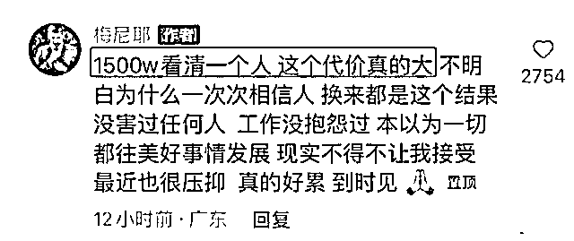

但可以知道的是，罗老板还在职时，是对梅尼耶负责的，而梅尼耶又是该机构的主播榜首，每次罗老板的演说，都少不了要夸一夸梅尼耶。这也说明在为公司赚钱上，梅尼耶自然也是第一名，可见这两个亿中，有梅尼耶的 1500W 也就是情理之中的事情了

梳理一下思路可以得知，当初罗老板并没有按时把属于梅尼耶的那一部分“工资”打到梅尼耶账户上，很大一部分都给了该机构，但其中罗某利用公司获得了两个亿的非法资金，梅尼耶本想做个好人一再退让给时间延缓这笔钱，没想到信任换来的却是欺骗，为了进一步减少损失也是对公司的失望选择了停更。

对于梅尼耶被骗这件事情，其实并不是梅尼耶说的好人难做，最主要的是看错了人，出于情面上太信任，也有一些主播早就发现了端倪，并开始划水状态，维持当下的同时并减少损失。

**03**

**小刚学长爆料数十位网红深受其害**

**梅尼耶被公司老板罗冠彦诈骗这事，是被小刚学长捅出来的，9 月 29 日，小刚学长发文揭露游良老板罗冠彦骗其 60 万，现在公司也变成了空壳，小刚学长一怒之下把罗冠彦告上了法庭。**

**在这之前千万网红卓仕琳曾给小刚学长下跪道歉登上热搜，这把许多网友都搞懵了，许多不知情的吃瓜群众都不知道她为何要下跪道歉。**

****

**事情起因要从小刚学长与游良老板罗冠彦的讨债风波说起。前不久，“理想 ONE 代言人”小刚学长发文说他被罗冠彦骗了 60 万，为了维护自己的权益，小刚学长直接将他告上了法庭。**

**网红被自己的老板诈骗，反将老板告上法庭。这么劲爆的话题一经发布就引起了网友热议，有人说这是剧本，也有人说这是真事，但大多数网友都是围观看戏的态度。**

**这时，众多游良旗下的网红跑出来为老板说话，她们去小刚学长视频下面当众怒怼小刚学长。**

**600 多万粉丝的美女网红赵喵喵喵说：三言两语定义一个人，真有你啊。小刚学长则回怼：被洗脑洗傻了吧？赵喵喵喵说：别颠倒是非。**

**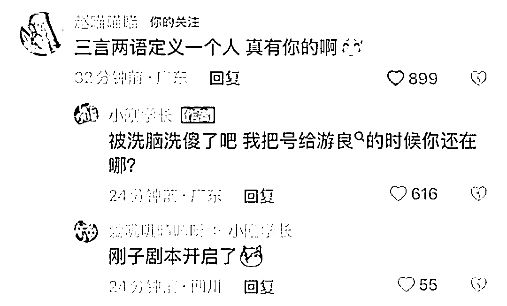**

**500 多万粉丝的美女网红江离评论说：小刚学长你什么人需要我来说吗？你是图什么心里不知道吗？要我站出来捶你吗？那么喜欢造谣装弱势群体真让人反感。对此言论小刚学长估计是懒得搭理，没有出面回复。**

**而粉丝过千万的美女网红卓仕琳也突然跑过来为罗冠彦发声，说罗老板是什么样的人她最清楚，诈骗小刚学长的不是罗冠彦，而是另有其人，他也是受害者，被骗的更多。**

**你私下转钱给人家，钱要不回来了，然后让老板帮你给这个钱。意思小刚学长有颠倒是非之嫌。**

**小刚学长对卓仕琳的评论给出了一段非常柔和的回复，意思是一直把你当好朋友，这是我和他的事，其中有很多道道你不了解，不要参与。从小刚学长回复的话语来看，他确实是拿卓仕琳当好朋友看待。**

**除了挺游良的也有倒游良的。网传内容显示，有大批游良旗下达人发朋友圈表达对游良的失望，例如梅尼耶、呆妹、高雨田等。**

**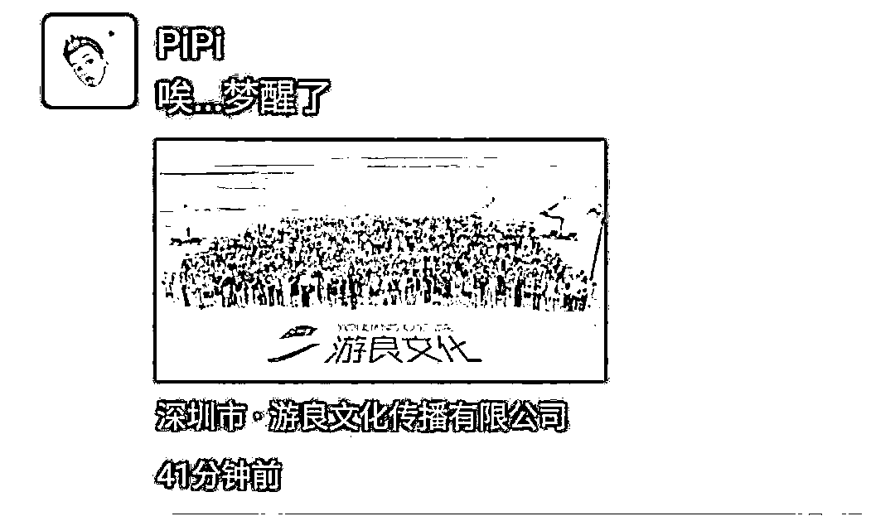**

**特别是高雨田，他爆料称，因为看不下去老板的为人，便与游良解约。他还调侃称自己这一年的经历拍成电影《名侦探高雨田》肯定非常精彩。** 

**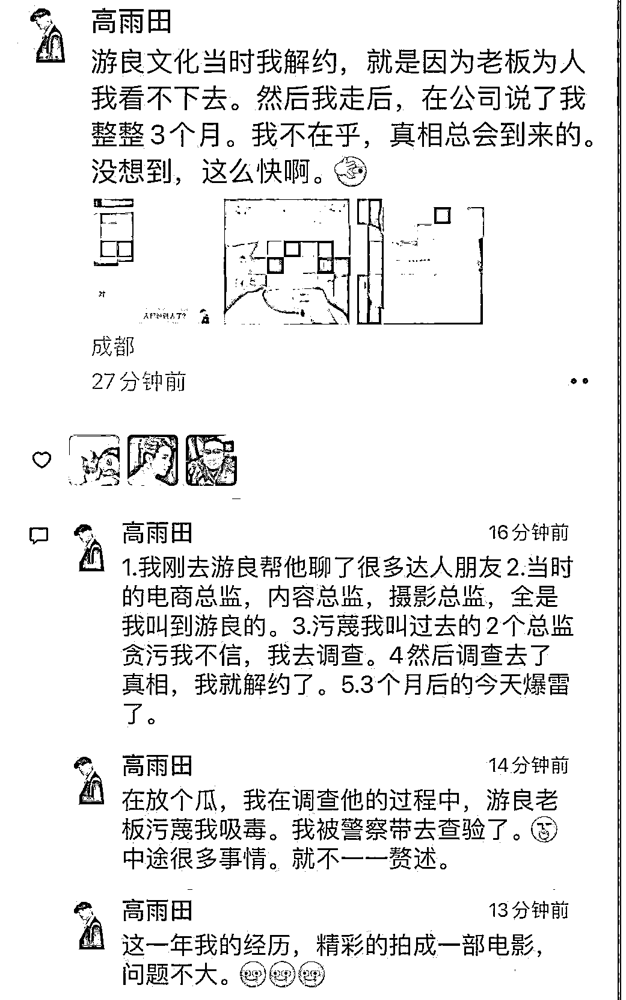**

**对于这些网传爆料内容，有疑似游良文化的员工辟谣称，公司目前经营正常，并且网传内容并非全部真实。** 

**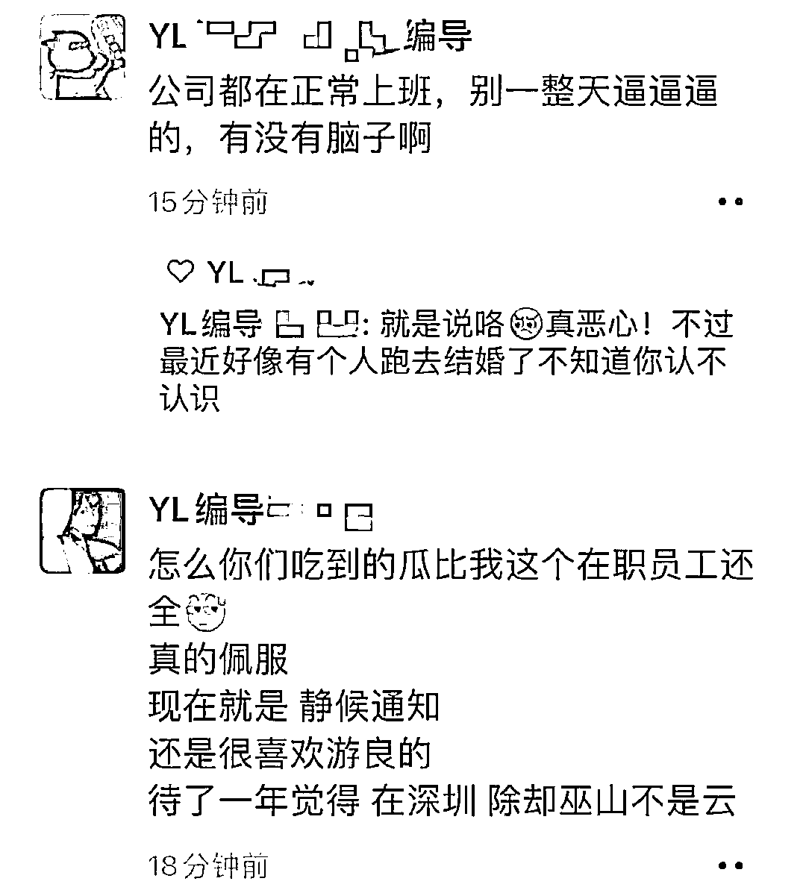**

**然而这事才发酵没多久，小刚学长就又爆料游良文化的创始人之一罗冠彦就因卷入诈骗案被刑拘了！** 

**小刚学长在爆料里还透露说，罗冠彦诈骗了 80 多套房产，涉案资金超 2 亿元，已收到报警 50 余起，游良旗下数十位网红深受其害。**

**针对上述内容，游良文化在同一天也发布了声明与罗冠彦撇清关系，声明称：罗冠彦曾经作为创始人之一参加了公司经营工作，但在公司稳定后便将经营权转交给高管团队及董事会，现在罗冠彦已经与公司没有任何合作关系。**

**游良表示截至目前，公司并未收到司法部门调查通知，并且公司运营正常，罗冠彦的个人行为与公司不存在任何关系。**

**据天眼查显示，游良文化传播有限公司成立于 2019 年 12 月 4 日，注册资本 5000 万元。公司法定代表人为罗嘉彦。此外，罗嘉彦还是大股东，持股比例 54.5%。**

**游良文化的法人和大股东确实都不是罗冠彦，并且游良的一些关联公司以及变更记录中，也均未出现罗冠彦的名字。这似乎佐证了游良澄清声明中，公司与罗冠彦无关系的说法。**

**但有趣的是，多篇发布于今年 9 月 6 日的游良文化宣传通稿中，罗冠彦还是以公司创始人的身份出现在文章里。另外，在今年 8 月新榜的直播连麦中，罗冠彦的 title 也还是游良文化创始人、董事长。**

**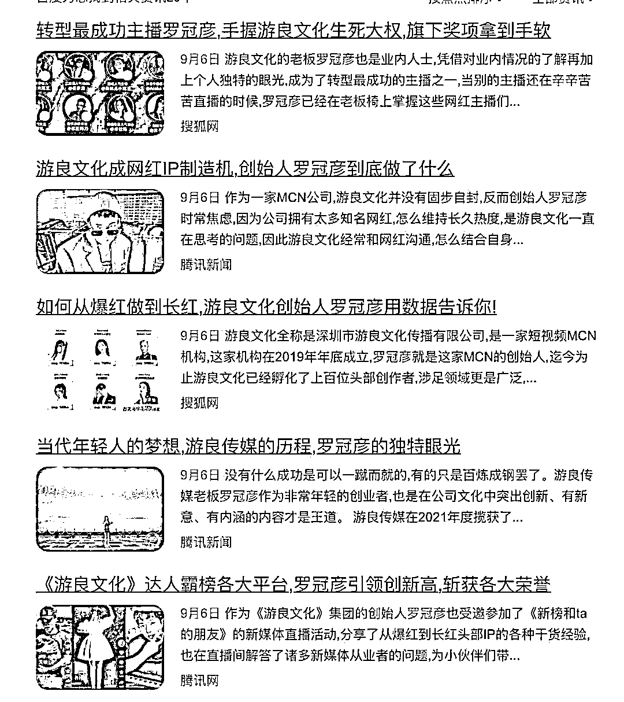**

**也就是说，一个月前还是创始人，今天就“啥也不是了”？变成了一个无关之人了？不过，虽然游良文化撇清了与罗冠彦的关系，但没有否认其是否做过被指控的事。** 

**那这件事跟卓仕琳下跪有啥关系呢？因为卓仕琳除了替老板出头怒怼小刚学长外，还曾夸下海口，说但凡信错了老板，但凡他是你口中那样的人，我卓仕琳跪下来道歉都可以！**

**如今被现实打脸，卓仕琳这才亲自录制视频道歉。从曝光的画面中不难看出，卓仕琳确实有下跪，并表示自己错了。**

**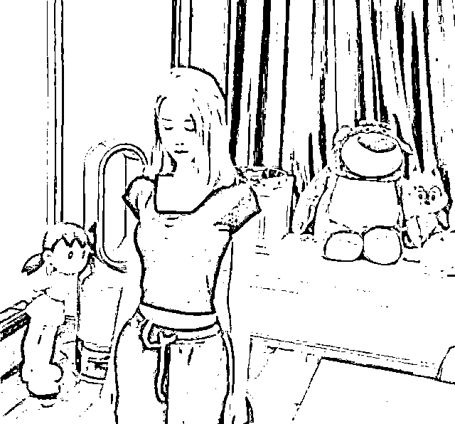**

**对于卓仕琳这一翻操作，很多网友并不买账，有人说，圈内人都知道，卓仕琳是老板女朋友，在一起三年了，别人或许不清楚你还不清楚吗？** 

**除了卓仕琳外，当初那些怼小刚学长的也纷纷出来道歉，怼人最狠的赵喵喵喵发长文表示自己也是受害者，并向小刚学长道歉。**

**不用想，网友们自然不买账，有网友还发现她们三位道歉的网红有几个共同点。
1、都是受害者人设
2、都是因无知被老板欺骗帮忙发声
3、道歉后，一面说虚心接受批评，一面疯狂删除评论** 

**小编觉得作为公众人物，要学会谨言慎行，要为自己的一言一行负责。**

 **当你做出仅凭主观思想就为诈骗犯发声怒怼别人后，也就成了网暴的带头者，那么你就要考虑到翻车后自己能不能承受得住舆论的反扑。**

**不可否认的是，MCN 机构的借力为许多小网红搭建了流量的快车，帮助其一跃成为了网络红人。但是，近几年接连发生的网络红人突然断更、与 MCN 机构解约等事件的背后折射出 MCN 机构在内部治理、经营合规等方面尚存在诸多亟需完善与补足的地方。今有头部 MCN 游良文化的爆雷，殊不知其他 MCN 是否有可能成为下一个“火坑”。**

**来源：金秘瓜田 ，大 R 说安全**

****

**欢迎关注灰产圈社群服务号**

****