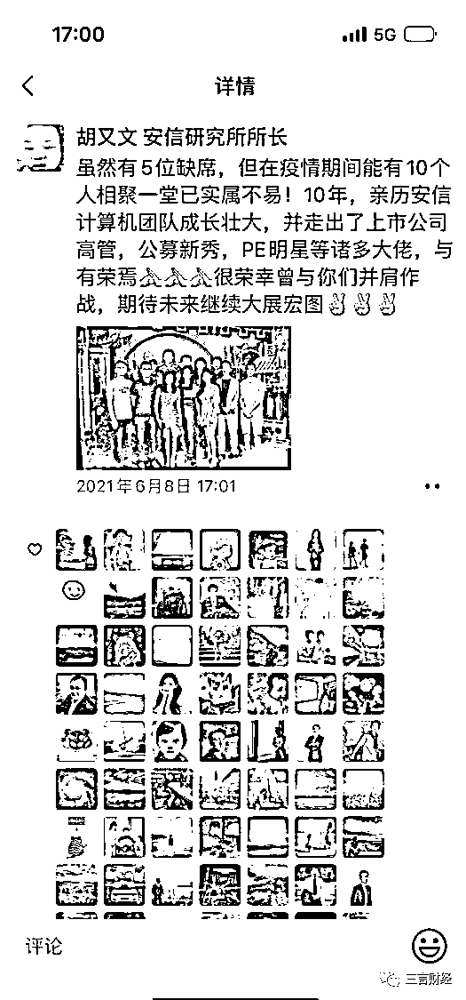

# 原券商美女分析师参选世界小姐又反转？信息显示身份未造假，原公司遭指责

> 原文：[`mp.weixin.qq.com/s?__biz=MzIyMDYwMTk0Mw==&mid=2247545470&idx=4&sn=01ab7dc0fafbe2b17f9484c4a9ef8f04&chksm=97cbf946a0bc70506ab3ccbb6b45caae1e7f691a911681b07ebaab6e8068f9c3b22cc01de885&scene=27#wechat_redirect`](http://mp.weixin.qq.com/s?__biz=MzIyMDYwMTk0Mw==&mid=2247545470&idx=4&sn=01ab7dc0fafbe2b17f9484c4a9ef8f04&chksm=97cbf946a0bc70506ab3ccbb6b45caae1e7f691a911681b07ebaab6e8068f9c3b22cc01de885&scene=27#wechat_redirect)

今年 8 月底，曾经沸沸扬扬的“券商美女分析师参加世界小姐比赛”话题，登榜微博热搜，并引发网友热议围观。后有多家媒体爆料，称其券商分析师学历及工作身份造假，并指与某币圈大佬关系密切（→[超美金融圈女神！世界小姐秦泽文，被扒出学历、工作经历都是假的啊？](http://mp.weixin.qq.com/s?__biz=MzIyMDYwMTk0Mw==&mid=2247542745&idx=1&sn=10cf7d4c9961aa5f80fa9c4a8ed779da&chksm=97cbece1a0bc65f7d2fdcdc3f4610a5ce014c3bc2ce5268f99394b92847bfa83a1a1428fe8eb&scene=21#wechat_redirect)）。

三言财经获取相关资料信息并向行业人士求证，秦泽文以分析师身份入职“安字券商”，不存在职业身份与学历身份造假。网传的简历为网友虚构，在任何工作与世界小姐选拔中从未使用，并且在该券商与世界小姐参赛阶段均为真实学历与个人简历，是经过安字券商人力部门核查的。

**信息显示：秦泽文以“分析师”入职**

**而非安字券商声明的“助理分析师”**

秦泽文参选世界小姐一事曝光后，8 月 25 日，安字券商发布声明称，秦泽文于 2020 年 6 月 22 日通过社招以助理分析师入职。就职期间主要负责联系客户，整理资料等基础工作。2021 年 12 月 31 日秦泽文正式离职，从业时间仅一年半。

该券商表示，秦泽文已从公司离职八个月并且已经注销行业从业资格，参加社会活动属于个人行为，与公司无关，更不能代表行业女性。该券商称将对乱用借用公司名义造成不良影响的行为保留法律追究的权利。

安字券商的声明中阐述了几项关键信息。

首先，秦泽文职务不是“分析师”，而是“助理分析师”；其次，其职责主要负责联系客户，整理资料等基础工作，说通俗点，就是一个“打杂的”。

从获得的相关资料信息来看，该券商上述声明中或存在与事实不符的情况。

**1、是“分析师”身份入职，而非“助理分析师”**

关于秦泽文入职安字券商职位问题，有入职 offer 显示，她就是以“分析师”职位入职的。

2020 年 4 月 16 日，安字券商向秦泽文发送《XX 证券面试通知》邮件，告知秦泽文已通过部门面试，接下来将参加人力资源部组织的面试。

邮件显示，秦泽文面试职位是分析师，面试时间为 2020 年 4 月 20 日下午 13:30 至 14:30。

2020 年 5 月 22 日，安字券商向秦泽文发送了《XX 证券录用通知》以及录用函，邮件中有着“您在应聘本公司分析师岗位中脱颖而出，经我们认真考核筛选，决定录用您为分析师岗位人选”的明确表述。

而录用函上的岗位信息明确记录秦泽文就职部门是研究中心，岗位是分析师，工作地点为上海。

另外，根据一张证券类 app 用户截图显示，秦泽文所属公司是安字券商，具体职务是计算机行业分析师。

而且秦泽文就职安字券商期间，其名片下的职位也明确是“研究中心计算机行业分析师”。对于向安字券商这样知名公司，员工使用的名片理应经过公司审核，公司人事给安排印刷，名片模板、编辑权力应该在公司手里。如果是员工伪造职务信息，这么久，公司也应该察觉，或者察觉了也不应该睁一只眼闭一只眼，否则是管理上的失职。

因此，综合上述信息，安字券商声明中所谓“助理分析师”的说法站不住脚，秦泽文就是以分析师职位入职。

**2、并非只是整理资料这种基础工作**

**还干过主持人等多项工作**

接下来，就是秦泽文职责是不是只是个“打杂的”、只干一些基础工作的问题。

从多张涉及秦泽文在安字券商工作期间参加的各项活动、获奖内容以及微信工作群截图等信息，或与打杂的说法不符。

首先是在工作群，当事人每天发送计算机日报，当时群里的备注是计算机研究员。

秦泽文多次以主持人、联系人身份参与安字券商的各项工作，包括对公的电话会议、线上论坛、线下论坛等。只干基础工作的员工，能干得了主持人吗？

时任安字券商研究所所长的胡又文还曾发朋友圈表扬了秦泽文所在的计算机团队，配图中就有秦泽文。

秦泽文所在团队获得新财富最佳分析师相关奖项，她也作为团队一员与大家合影。

显而易见，秦泽文在安字券商就职期间参与的工作内容，远远超出了“负责联系客户、整理资料”的范畴，确实工作项目也杂，但也非普通的基础工作。安字券商的声明与事实不符。

**3、不能代表金融行业女性？**

秦泽文在朋友圈中写道，将行业女性的声音带到世界舞台。从未有说过代表安字券商或者代表金融行业。安字券商声明中提到的“不能代表行业女性”的说法有歧视员工和女性的嫌疑。

安字券商的声明急于撇清关系，称秦参选世界小姐是个人行为，与公司无关，更不能代表行业女性。

在学历等质疑没有定论之前，安字券商或许是怕自身沾染负面，可以理解，但是说不能代表行业女性，有点“越权”了。且不说“券商美女分析师”的头衔是媒体或网友给的定义，而非秦自己下的定义，即便曾经是助理的分析师，也算是这个行业的人。离开了一个公司 8 个月，就等于离开了这个行业吗？

只能说，安字券商的声明不够豁达，如果改为“当事人确曾为我司员工，已离职，学历等质疑自会水落石出，我们也乐见其在另一个领域攀登高峰”，是不是就不一样了？不夺冠，则祝福；若夺冠，公司以你为荣。

**当事人遭网暴**

**已起诉相关媒体**

8 月 25 日，有媒体撰写了题为《币圈首富 or 潮汕大佬 谁在给造假的“世界小姐”撑腰？》的报道。该文将一些未经证实的网传信息与安字券商的声明内容结合，引导出秦泽文工作、学历造假，后有靠山，打造“假人设”。

这篇文章一经刊发，循序引来针对秦泽文的质疑和网络暴力。据悉，目前秦泽文已经正式起诉涉事媒体。

三言财经也将持续关注事件发展。

来源：三言财经

欢迎关注灰产圈社群服务号

