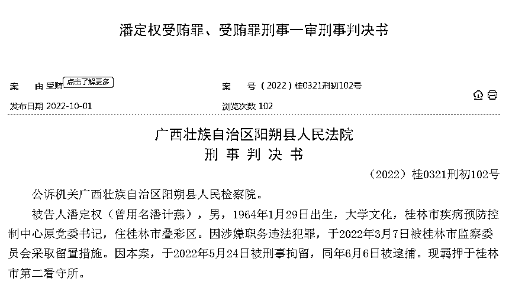
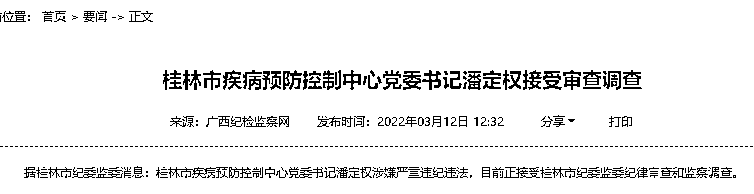
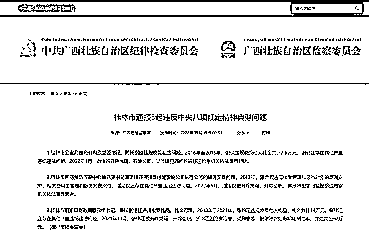
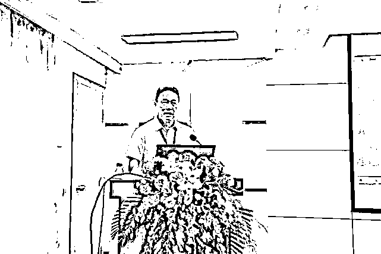

# 在派出所旁收现金，这位疾控中心原主任借疫苗敛财！行贿名单涉及一家上市公司

> 原文：[`mp.weixin.qq.com/s?__biz=MzIyMDYwMTk0Mw==&mid=2247545517&idx=2&sn=a89e8a105d410b70750452d3a4d885fd&chksm=97cbf995a0bc70834da7ae37945f56ade84d8435e691c0a84028dfd7cff58471be287d94126d&scene=27#wechat_redirect`](http://mp.weixin.qq.com/s?__biz=MzIyMDYwMTk0Mw==&mid=2247545517&idx=2&sn=a89e8a105d410b70750452d3a4d885fd&chksm=97cbf995a0bc70834da7ae37945f56ade84d8435e691c0a84028dfd7cff58471be287d94126d&scene=27#wechat_redirect)

今年 3 月初，桂林市疾控中心党委书记潘定权被查。5 月，潘定权被开除党籍、开除公职，其涉嫌犯罪问题被移送检察机关依法审查起诉。

不到半年，10 月 1 日，该案一审判决书公布，潘定权被指受贿 364 万元，被判刑 10 年。判决书显示，A 股上市公司智飞生物也卷入其中。

**一审获刑 10 年**

经阳朔县人民法院审理查明，2013 年至 2022 年期间，被告人潘定权利用其担任桂林市疾控中心主任、党委书记的职务便利，非法收受黄某 1、刘某 1 强、黄某 2 给予的现金人民币共计 364 万元，并为三人谋取利益，收受上述款项后，潘定权分多次存入自己的银行账户或用于日常开支。

具体为：

*   非法收受广西南宁康华医药有限公司（以下简称康华公司）原法定代表人黄某 1 给予的现金 216 万元。

2013 年至 2019 年期间，被告人潘定权利用其担任桂林市疾控中心主任的职务便利，为康华公司在桂林市疾控中心的疫苗销售、配送、推广等业务上提供帮助，分 5 次收受黄某 1 给予的现金共计 216 万元。

*   非法收受广西南宁康硕生物科技有限公司（以下简称康硕公司）实际控制人刘某 1 强给予的现金 108 万元。

2017 年至 2020 年期间，被告人潘定权利用其担任桂林市疾控中心主任的职务便利，为康硕公司在桂林市疾控中心的流感、手足口病等检测试剂及检验设备销售等业务上提供帮助，分 4 次收受刘某 1 强给予的现金共计 108 万元。

*   非法收受重庆智飞生物制品股份有限公司桂林分公司区域经理黄某 2 给予的现金 40 万元。

2019 年至 2022 年期间，被告人潘定权利用其担任桂林市疾控中心主任、党委书记的职务便利，为重庆智飞生物制品股份有限公司在桂林市疾控中心的宫颈癌疫苗销售推广业务上提供帮助，分 4 次收受黄某 2 给予的现金共计 40 万元。

其中一次是在 2022 年年初，在桂林市叠彩区叠彩派出所大门旁的路边，潘定权收受黄某 2 给予的现金 10 万元。

法院另查明，2022 年 3 月 7 日，桂林市监察委员会在掌握潘定权主要受贿事实后，决定对其进行留置，潘定权到案后，供述了上述主要受贿事实及部分尚未被掌握的受贿事实。案发后，潘定权退出全部赃款 364 万元，并预缴罚金 50 万元于法院。

法院认为，被告人潘定权身为国家工作人员，利用职务便利，为他人谋取利益，非法收受他人给予的财物共计 364 万元，数额特别巨大，其行为已构成受贿罪，依法应予惩处。

一审判决，被告人潘定权犯受贿罪，判处有期徒刑十年，并处罚金人民币五十万元；退出的受贿犯罪所得人民币三百六十四万元依法予以没收，上缴国库。

**曾被评为全国“抗疫先进个人”**

公开的简历显示，潘定权 1964 年 1 月出生，广西资源人，2004 年任桂林市疾控中心副主任，2010 年 6 至 2020 年 4 任桂林市疾病预防控制中心党委副书记、主任；2020 年 4 月起至落马前任桂林市疾病预防控制中心党委书记。

今年 3 月初，据桂林市纪委监委消息：桂林市疾病预防控制中心党委书记潘定权涉嫌严重违纪违法，目前正接受桂林市纪委监委纪律审查和监察调查。

5 月，桂林市通报 3 起违反中央八项规定精神典型问题，其中包括桂林市疾病预防控制中心原党委书记潘定权违规接受可能影响公正执行公务的旅游安排问题。2013 年，潘定权违规接受管理和服务对象的旅游安排，相关费用由管理和服务对象支付。潘定权还存在其他严重违纪违法问题。

2022 年 5 月，潘定权被开除党籍、开除公职，其涉嫌犯罪问题被移送检察机关依法审查起诉。

2020 年 9 月 11 日，潘定权在会上分享获评全国抗疫先进个人这份荣誉。来源：桂林疾控

据桂林疾控微信公众号消息，潘定权 2020 年被评为“全国抗击新冠肺炎疫情先进个人”。

来源：每日经济新闻综合自中国裁判文书网、桂林市纪委监委

欢迎关注灰产圈社群服务号

← 向右滑动与灰产圈互动交流 →

