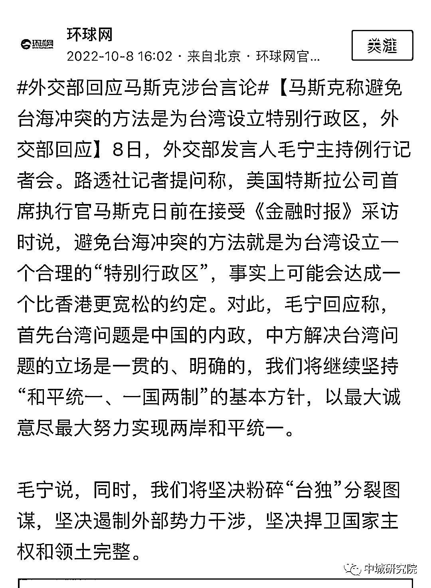

# 两岸热议！马斯克提议：设立中国台湾特别行政区

> 原文：[`mp.weixin.qq.com/s?__biz=MzIyMDYwMTk0Mw==&mid=2247545517&idx=3&sn=c1b56dcea53e516042e8b26521f608a4&chksm=97cbf995a0bc70837ff223ea500e97bba17ea3421a85cfb47782bc66bee3425b2a5d57f8d5ee&scene=27#wechat_redirect`](http://mp.weixin.qq.com/s?__biz=MzIyMDYwMTk0Mw==&mid=2247545517&idx=3&sn=c1b56dcea53e516042e8b26521f608a4&chksm=97cbf995a0bc70837ff223ea500e97bba17ea3421a85cfb47782bc66bee3425b2a5d57f8d5ee&scene=27#wechat_redirect)

# 最近，马斯克绝对上得了热搜，不是因为他的火箭，他的特斯拉，他的星链，而是因为他的言论，关于乌克兰和台湾问题。

对他妄议台湾问题，大陆官方回应很官方，呵呵，大陆民间有反对，有支持，胡猜一下啊，支持的可能多一些。

台湾方面反应也很强烈，绿委甚至说要抵制特斯拉。

也有人说，何必呢？言论自由嘛！一介商人而已！

希望马斯克竞选美国总统，给世界带来一些不一样的变化，

# 

来源：和美之音，中城研究院

欢迎关注灰产圈社群服务号

← 向右滑动与灰产圈互动交流 →

