# 买蓝月亮却收到“蓝月壳”？客服：亲，蓝月壳正品……

> 原文：[`mp.weixin.qq.com/s?__biz=MzIyMDYwMTk0Mw==&mid=2247545551&idx=3&sn=1385f48cef61fdb1f39e0a109787951f&chksm=97cbf9f7a0bc70e1478c3ad47de24f4fd6c2d143ebad057439d12a7f58b8342a7a5e65d9a847&scene=27#wechat_redirect`](http://mp.weixin.qq.com/s?__biz=MzIyMDYwMTk0Mw==&mid=2247545551&idx=3&sn=1385f48cef61fdb1f39e0a109787951f&chksm=97cbf9f7a0bc70e1478c3ad47de24f4fd6c2d143ebad057439d12a7f58b8342a7a5e65d9a847&scene=27#wechat_redirect)

原以为买的是**蓝月亮**

收到货却发现是**“蓝月壳”**

**河北廊坊一高校女生**

**在宿舍拿出网购的洗衣液**

**仔细一看尴尬了...**

**↓↓↓**

**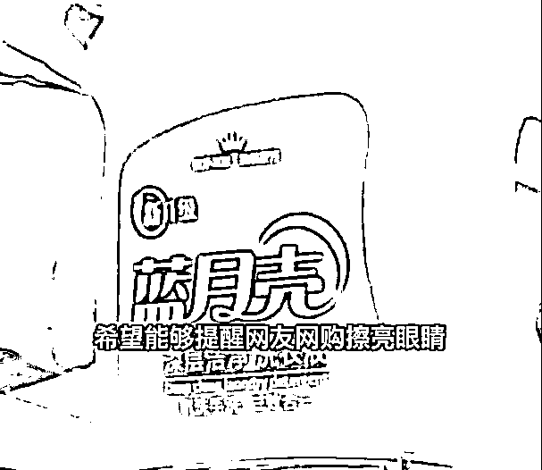**

****网购图片标题被挡，****

******收货时发现错了“一个字”******

********“我室友前几天在网上买了一瓶 2.5kg 装的洗衣液，10 月 9 号收到货后却是‘蓝月壳’ **”10 月 11 日，发布该视频的女生告诉记者，她室友购买的这瓶“蓝月壳”洗衣液价格为 10.9 元，当时室友还寻思，这款产品为啥比之前买的便宜了不少……收到时一看，瓶身上写着 3 个大字，哪里是什么蓝月亮，而是**蓝！月！壳！********

********难道购买前没看清楚吗？********

********女学生仔细再去看了看购买链接，********

**********发现为原来是商品图中**********

************“亮”的位置************

************故意被遮挡商标！************

********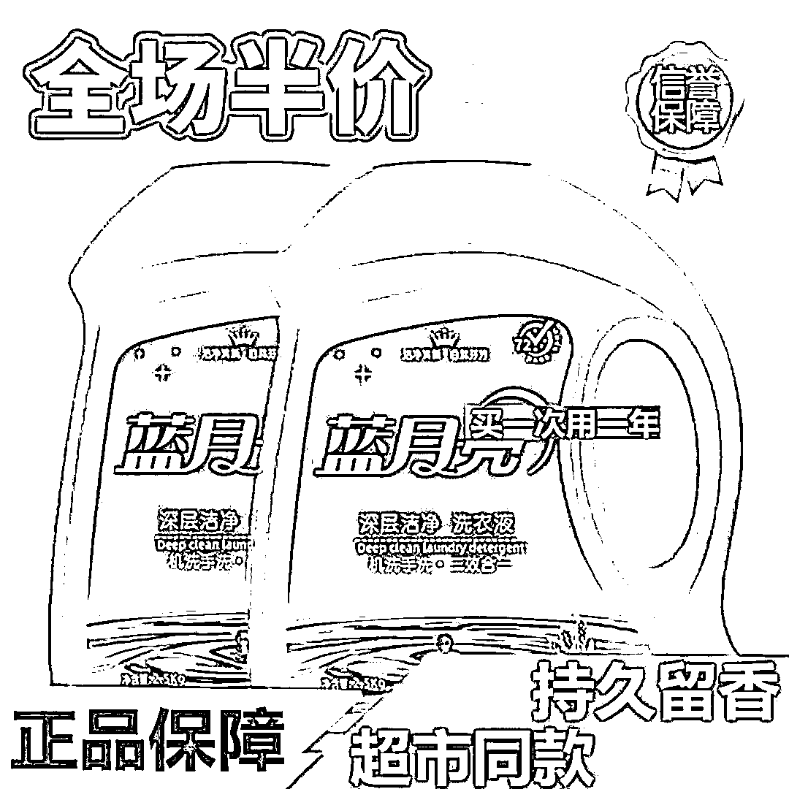********

********此外，“蓝月壳”的商品包装和“蓝月亮”非常相似，如果不细看的话，还真不容易发现不是“蓝月亮”。********

********根据网上搜索发现，品名“蓝月壳”的洗衣液不少，2.5kg 规格的售价为 10 到 20 元不等，有的店铺销量甚至过万。********

********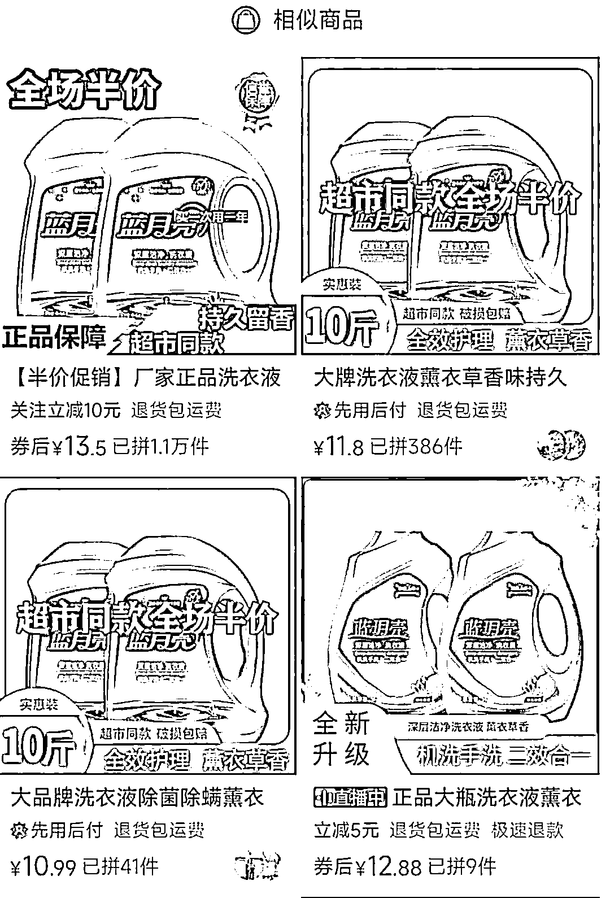********

********对此，有媒体向出售“蓝月壳”洗衣液的店铺客服咨询。对方介绍称，**蓝月壳是正品，不是只有大品牌才好用，支持试用，不满意可以退货。**对于“蓝月壳”品牌是否涉嫌“傍名牌”，另一商家则回应称，该品牌跟蓝月亮没有关系，属自主品牌。******** 

********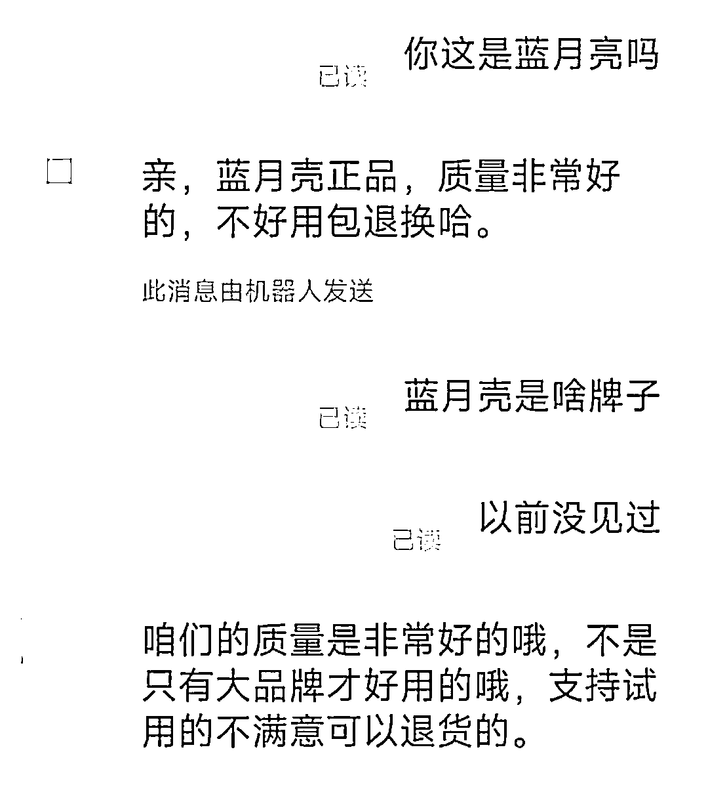********

********天眼查 App 显示，“蓝月壳”商标已被石家庄 2 家日化有限公司申请注册，国际分类均为日化用品，其中 1 枚申请于 2018 年 4 月，当前状态为商标无效，另外 1 枚申请于今年 9 月，当前状态为商标申请中。********

********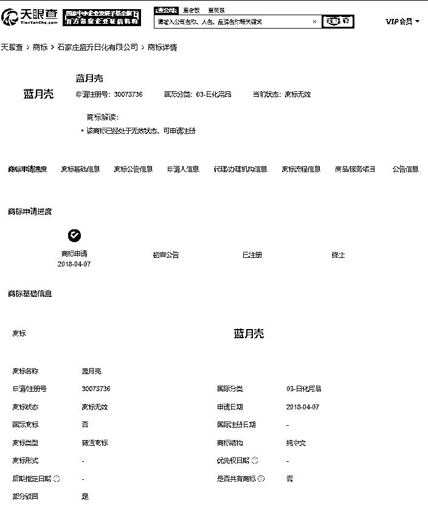********

********值得一提的是，上述一家日化公司还申请了“超熊”、“趈能”、“淦纺”商标，国际分类均为日化用品，其中“淦纺”商标已注册成功。********

********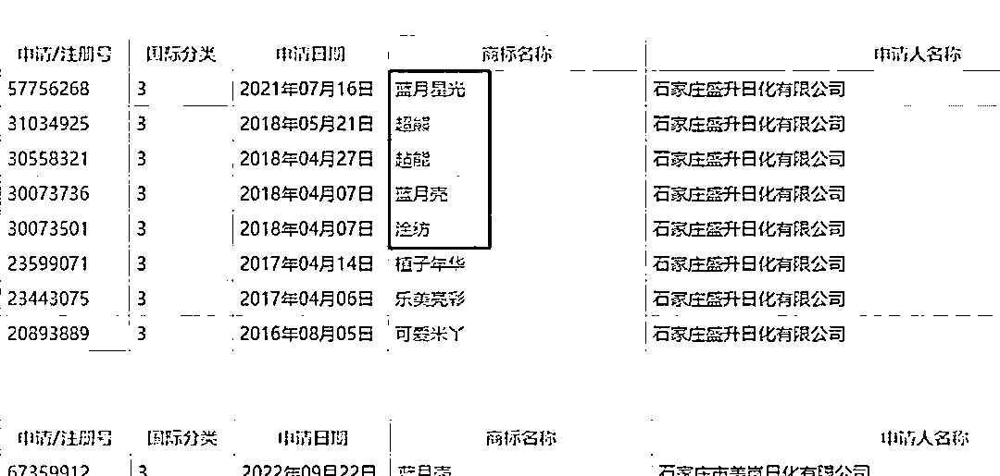********

********此外，天眼查还显示，与“蓝月亮”字形相近的“蓝日亮”“篮月亮”“蓝冃亮”也曾被抢注商标，申请人多为日化公司，国际分类均包含日化用品，当前状态多为商标无效。******** 

********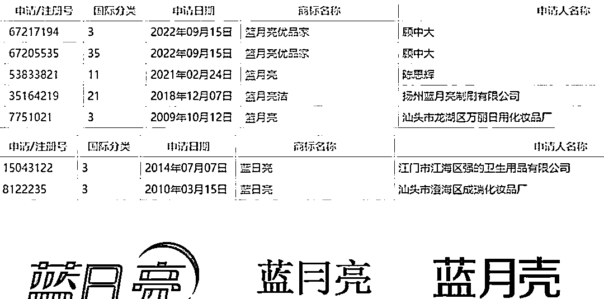********

**********那些年傻傻分不清楚的**********

************“康帅傅们”************

************事实上，类似“蓝月壳”的案例并不在少数。例如想吃“康师傅”，买到的竟是“康帅傅”；想喝“娃哈哈”，拿到的却是“娃恰恰”；“思念”变成“恩念”、“奥利奥”成了“粤利粤”……************

************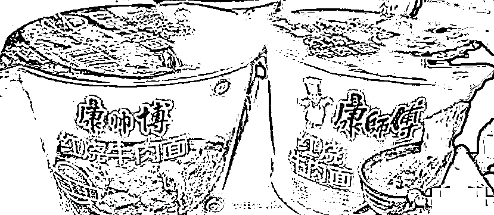************

**************而为了保护品牌，防止山寨品牌蹭热度，部分品牌甚至不惜注册多个近似商标。**有报道称，大白兔为了保护自己的商标，注册了十几个近似商标：大灰兔、大黑兔、大花兔、小白兔、金兔、银兔……集齐兔兔家族没错了************ 

************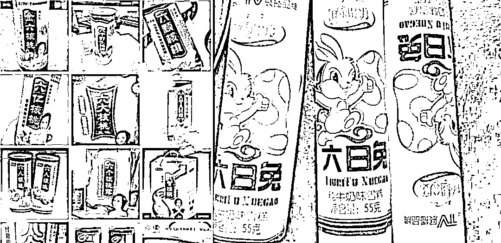************

************此外，星巴克注册起商标来也是“丧心病狂”，他们可能翻遍了新华字典：星巴客、巴克星、巴星克、辛巴克、辛巴客、新巴特……************

************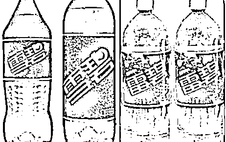************

************而大家所熟知的“雷碧”，也已经是可口可乐公司所注册的商标了。这次的蓝月壳事件让不少网友调侃称：让我喝口雷碧压压惊！************

************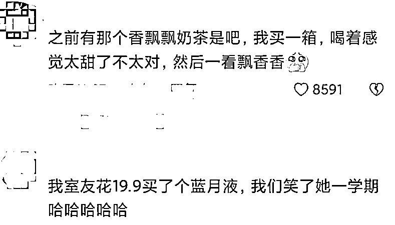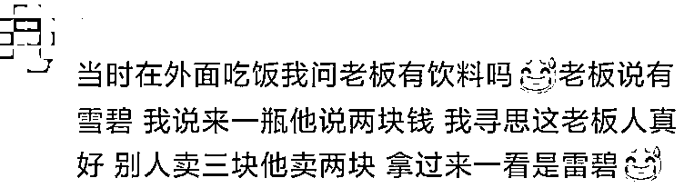************

**************注册商标受到法律保护**************

****************“傍名牌”行为涉及侵权****************

**************有人会把“傍名牌”当作笑料看待，但其背后伤害的却是企业知识产权以及正常的市场秩序。注册商标受到法律保护，任何企图“打擦边球”的“傍名牌”行为都面临着侵权损害赔偿的风险。**************

*   ****************对小企业而言**，起名字的时候要注意规避一些现有的知名商标，不要总想着用蹭热点、走捷径的方式吸引流量，增加销售。因为一旦陷入侵权纠纷，不仅会增加公司的生产经营成本，也会对公司商誉造成负面影响。**************

*   ****************对大企业来说**，要注意对知名商标的保护，既要多类别注册商标，也要在某些类别注册防御类商标，避免他人“傍名牌”造成不良影响。同时，面对商标侵权时，要及时通过法律途径维护自身合法权益，坚决对抗侵权行为，弘扬市场正气。**************

*   ****************有关部门**也要积极构建诚实信用的市场环境，加大对注册商标的保护。综合运用行政、民事、刑事等多种手段，加大打击处罚力度，让创新者无后顾之忧，让侵权者不敢肆意妄为。**************

*   **************来源：潇湘晨报 、极目新闻、中国人大网、经济日报、河北青年报、天眼查**************

****************************

**************欢迎关注灰产圈社群服务号**************

********************************************************

**************← 向右滑动与灰产圈互动交流 →**************

****************************