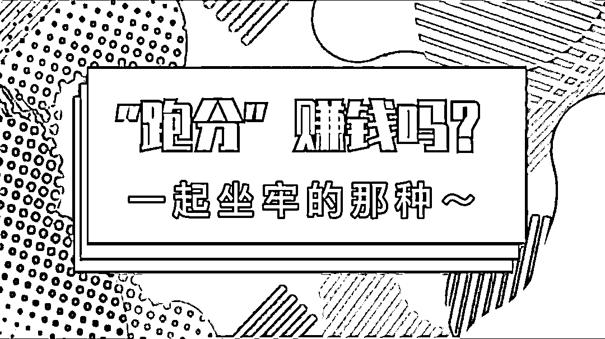
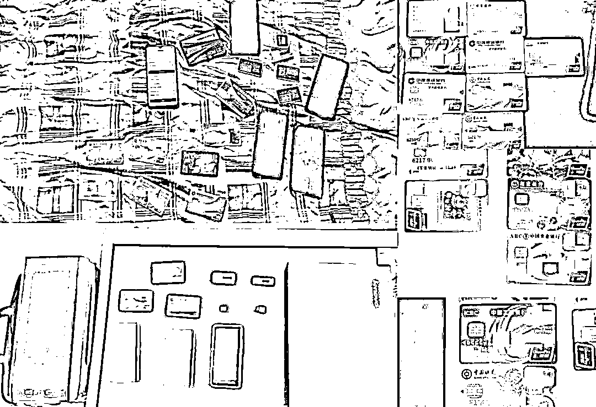
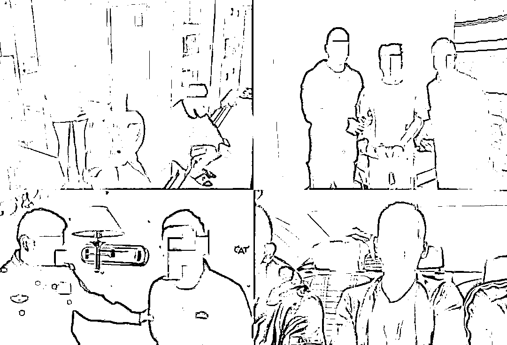
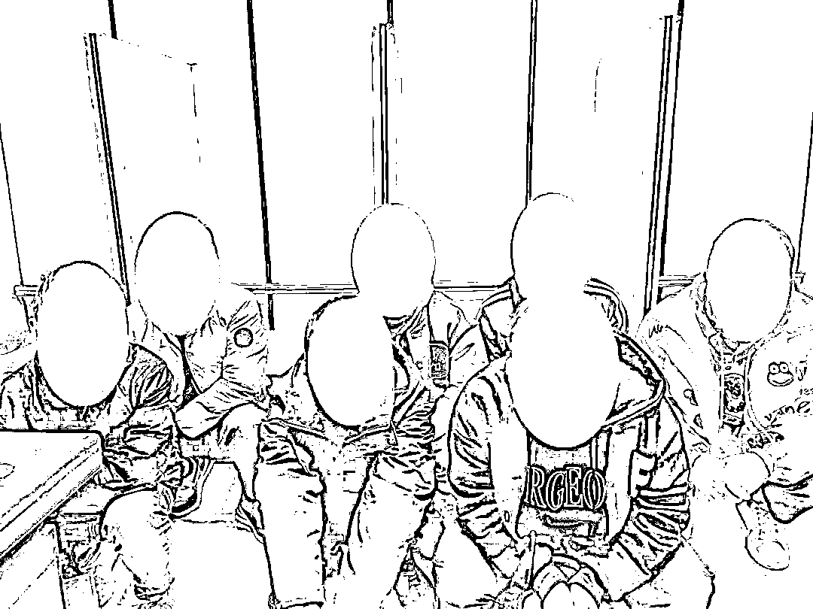
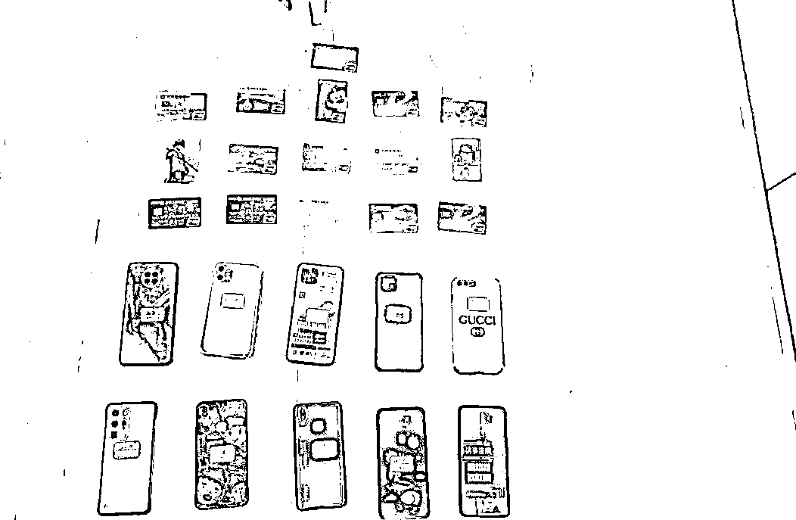
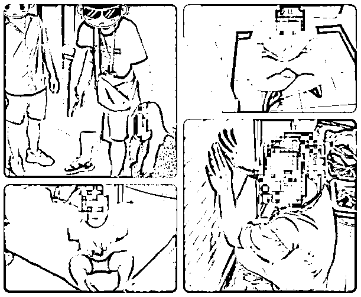

# “跑分”赚钱吗 多久会被抓到？

> 原文：[`mp.weixin.qq.com/s?__biz=MzIyMDYwMTk0Mw==&mid=2247545551&idx=4&sn=b781ca9cc0df24cde73a4c928004a8d5&chksm=97cbf9f7a0bc70e1a9c0dbd870c85cbe92b85cf68de2b2b741db5d9dcde0c54a4ce206c2f8fb&scene=27#wechat_redirect`](http://mp.weixin.qq.com/s?__biz=MzIyMDYwMTk0Mw==&mid=2247545551&idx=4&sn=b781ca9cc0df24cde73a4c928004a8d5&chksm=97cbf9f7a0bc70e1a9c0dbd870c85cbe92b85cf68de2b2b741db5d9dcde0c54a4ce206c2f8fb&scene=27#wechat_redirect)

在浏览器输入“跑分”

有一条关联问题是这样的

“跑分多久会被警察查到？”

答案是

马上！

工作轻松

在家兼职

会简单电脑操作

就可日进斗金

这样一份工作摆在面前

心动吗？

(点击图标播

放视频)

你心动很正常

我听着也心动了

能被这种好事选中

可能是因为他书读的多吧

但是

警方近期打掉多个**“跑分”**窝点

抓获多个涉嫌**“跑分”**人员

可能会让你

重新认识

天上不会掉馅饼

**0****1**

**安徽·当涂**

2021 年 9 月，安徽马鞍山当涂警方在工作中发现一个盘踞在本地的“跑分”犯罪团伙，立即成立专案组开展调查。

经查，2021 年 6 月至 10 月，犯罪嫌疑人花某兴与境外网络赌博公司取得联系，在国内发展下线王某、承某、尚某、邹某杰、刘某军等人，在马鞍山、芜湖、当涂等地设立窝点，通过银行卡转账的方式为网络赌博公司提供“代付”、“代收”、“中转”、“结算”等非法业务，涉案金额上亿元。

10 月 21 日，多警种联合开展行动，抓获犯罪嫌疑人 11 名，缴获涉案资金 4 万余元、涉案电脑 3 台、手机 20 余部、银行卡 30 余张、网银 U 盾 8 个。 

目前，该团伙 11 名犯罪嫌疑人均已被采取刑事强制措施，案件正在进一步侦办中。

**0****2**

**甘肃·定西**

2022 年 1 月，甘肃定西公安机关摧毁了一个盘踞本地，为境外诈骗和跨境赌博团伙提供“跑分”洗钱的团伙。现场查获一批涉嫌犯罪活动的银行卡、手机卡等物品，抓获犯罪嫌疑人 10 人，均为青少年，其中 7 人未成年，5 人还在校就读。

经查，2022 年 1 月初，该犯罪团伙核心成员安某某在外务工时与朋友闲聊，了解到“跑分”可以赚钱。小赚几笔后，尝到甜头的他回到老家，积极鼓动周围人利用多种支付途径，为他人代收款赚取佣金，从事“跑分”洗钱等违法活动。

该犯罪团伙部分成员表示，自己明知“工作”违法，但在利益诱惑下，最终将周围人一同拉入犯罪的深渊。 

目前，安某某等 3 人已被依法刑事拘留，其余 7 个未成年人被批评教育后，依法上报有关部门将其违法行为记入个人征信。

**03**

**广西·梧州**

2021 年 8 月底，广西梧州网警在工作中发现本地人员李某涉嫌“跑分”洗钱活动。

针对所掌握的重要线索，民警进一步开展研判，发现李某此前曾多次前往湖南长沙的一个“洗钱”窝点内实施相关违法犯罪活动。

9 月 10 日，专案组火速出击，连夜赶赴湖南长沙，成功捣毁 “洗钱”窝点 1 个，抓获李某等涉案团伙成员 4 人，缴获作案工具手机、银行卡等物品一批，涉案金额数百万元。

经审讯，该团伙成员均对其提供本人银行卡、微信、支付宝等网络支付工具给他人用于实施犯罪，并从中获利的犯罪事实供认不讳。

目前 4 名涉案嫌疑人已被公安机关依法刑事拘留，案件仍在进一步侦办中。

什么是**跑分**

“跑分”就是**利用个人账户代收账、转账，以此赚取佣金，用于电信网络诈骗、赌博等违法犯罪活动收款。**

近年来，**非法开办贩卖电话卡、银行卡**成为电信网络诈骗、跨境赌博等违法案件持续高发的根源，危害十分严重，每年因**电信诈骗、网络赌博**而上演的家庭悲剧不计其数，对我国社会治安和人民群众的财产安全造成了严重威胁。

**警方**提示

1\. 帮助诈骗、赌博等违法犯罪团伙进行洗钱活动，涉嫌帮助信息网络犯罪活动罪，**参与者需要承担刑事法律责任。**

2\. 帮助洗钱的涉案第三方账户将被公安机关**依法冻结，直接影响个人征信，**涉嫌犯罪还将受到法律惩处。

3\. 注意保护个人隐私信息，不要轻易被网络上不切实际的高额利润所诱惑，更**不要随意出租出借自己的身份证件、银行账号和 U 盾**等，不要用自己的账户替他人提现，以免沦为犯罪分子“替罪羊”。

来源：北京反诈

欢迎关注灰产圈社群服务号

← 向右滑动与灰产圈互动交流 →

