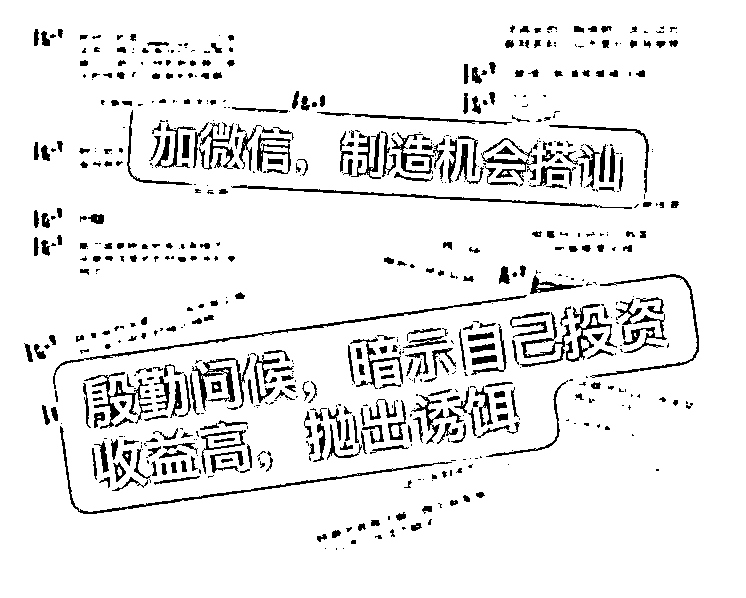

# 老人“炒股”血亏 60 万元丝毫不慌，竟说“炒股本来就有赚有赔的”，还不知道是骗局！

> 原文：[`mp.weixin.qq.com/s?__biz=MzIyMDYwMTk0Mw==&mid=2247545551&idx=5&sn=fd8aa39a98e74274fb1006a58004421f&chksm=97cbf9f7a0bc70e1df393d7aac6b42bc2ea8309456a7e9d2526fdcd8c175bcedaf55a5418972&scene=27#wechat_redirect`](http://mp.weixin.qq.com/s?__biz=MzIyMDYwMTk0Mw==&mid=2247545551&idx=5&sn=fd8aa39a98e74274fb1006a58004421f&chksm=97cbf9f7a0bc70e1df393d7aac6b42bc2ea8309456a7e9d2526fdcd8c175bcedaf55a5418972&scene=27#wechat_redirect)

**要不是警察找上门，家住浙江杭州余杭的已经退休的沈大爷，可能还对“补仓翻盘”深信不疑。可事实是，**哪里有“仓”啊，他的钱压根没在股市里，而是进了骗子的口袋。****

******事情得从 2021 年某天晚上说起。当晚，老沈正准备睡觉，微信上却跳出了一条好友申请，对方自称是“住在楼下的小卫”。老沈没多想，通过了申请。******

******没想到，小卫是来兴师问罪的：“你家今天晚上电视那么吵，都影响我们休息了！”******

******老沈觉得很奇怪，自己压根没开过电视，于是好言解释了一番。小卫随后表示，可能是物业给错了电话，才造成了误会。见小卫态度诚恳，老沈念着邻里之情，便没有删除对方微信。******

******之后，通过微信朋友圈，老沈得知小卫是个单亲妈妈，平时靠炒股赚钱，而且收益非常可观。于是，**老沈有些心动，几次询问小卫股票的情况。********

**********专家推荐股票要先收 888 元“茶水费”**********

********逐渐熟络之后，小卫表示，之所以自己能赚那么多，是因为有专家支招，只要跟着专家，内幕消息唾手可得，甚至能得到 10 倍的场外配资。之后，小卫给老沈发去了专家助理小蒋的微信。********

********联系上小蒋后，对方表示，按照规矩，**专家推荐股票要先收 888 元“茶水费”，老沈当即照办。**随后，小蒋发了只专家推荐的股票。后面几天里，老沈果然赚到了 6000 元。不久后，小蒋发给老沈公司配资平台的下载链接，表示只要在平台充值，就能获得 10 倍配资，赚得更多。********

********老沈是看过反诈新闻的，特意要求和小蒋视频，核对对方的证件和资质，又充了几元钱，试试能否从平台提现。一套操作下来，老沈没发现问题，就觉得这事靠谱了。自此，老沈开始充值，跟着专家在平台上炒股，果然连涨，加上杠杆盈利部分，投入的 5000 元很快变成了 50000 元。********

**********“只要跟着专家，几次操作下来保证翻盘”**********

********可好景不长，专家推荐的股票开始下跌，10 倍盈利变成了 10 倍亏损，老沈的本金全部亏光了。“股神巴菲特也不是每次都赚啊。”小蒋向老沈解释，**“只要跟着专家，几次操作下来保证翻盘。”**老沈也是心有不甘，于是继续充值补仓。********

********之后的一段时间里，老沈每天都跟着股市的涨跌“玩心跳”，涨了心花怒放，跌了不失斗志，继续追加资金。等到警方找上门时，老沈已亏掉了 60 万元，却浑然不觉，甚至丝毫不慌。“炒股本来就有赚有赔的，小卫运气好，赚得多，我不如她也正常。”老沈说。********

**********“小卫也是骗子，他是个小伙子，不是单亲妈妈……”民警把诈骗分子的套路拆解给老沈听。**********

********原来，“加错微信”正是这场骗局的开端，诈骗团伙分为“前端”和“后端”，“前端”假扮女性股民，以各种方式吸引被害人入局，“后端”则假扮“专家”“助理”，带着被害人在虚假平台进行交易，并以推荐风险股、诱导频繁交易、反向喊单等方式造成被害人亏损。********

****************

**********“其实，骗子的破绽一直都在”**********

**********与传统的“杀猪盘”诈骗不同，荐股诈骗打着投资、炒股的名义，专门诱骗像老沈这样没有太多炒股经验的人上钩。**********

********绝大多数的被害人直到案发都不知道被骗了，以为自己只是运气不好，遭遇了熊市。********

****************

********实际上，被害人的资金从未进入股市，平台上显示的涨跌情况也是人为设置的。至于老沈看到的身份证、营业执照，和小卫的朋友圈图片一样，全靠修图或盗图。********

********“其实，骗子的破绽一直都在。”该案的承办检察官说，比如老沈和小蒋聊天时，微信经常会提醒对方账号存在异常，又比如骗子的收款账户并不固定，有全国各地五花八门的公司账号，以及不同个人微信、支付宝账户，**“还有频繁更换投资平台、提现功能经常延迟等情况，骗子虽然会编造理由进行解释，但被害人只要多留一个心眼，理智判断一下，就能避免很多损失。”**********

**********近日，余杭区人民检察院以诈骗罪将该案的相关涉案人员提起公诉。目前，案件正在进一步审理中。**********

**********来源：平安浙江网，巴蜀反诈**********

********************

**********欢迎关注灰产圈社群服务号**********

****************************************

**********← 向右滑动与灰产圈互动交流 →**********

********************