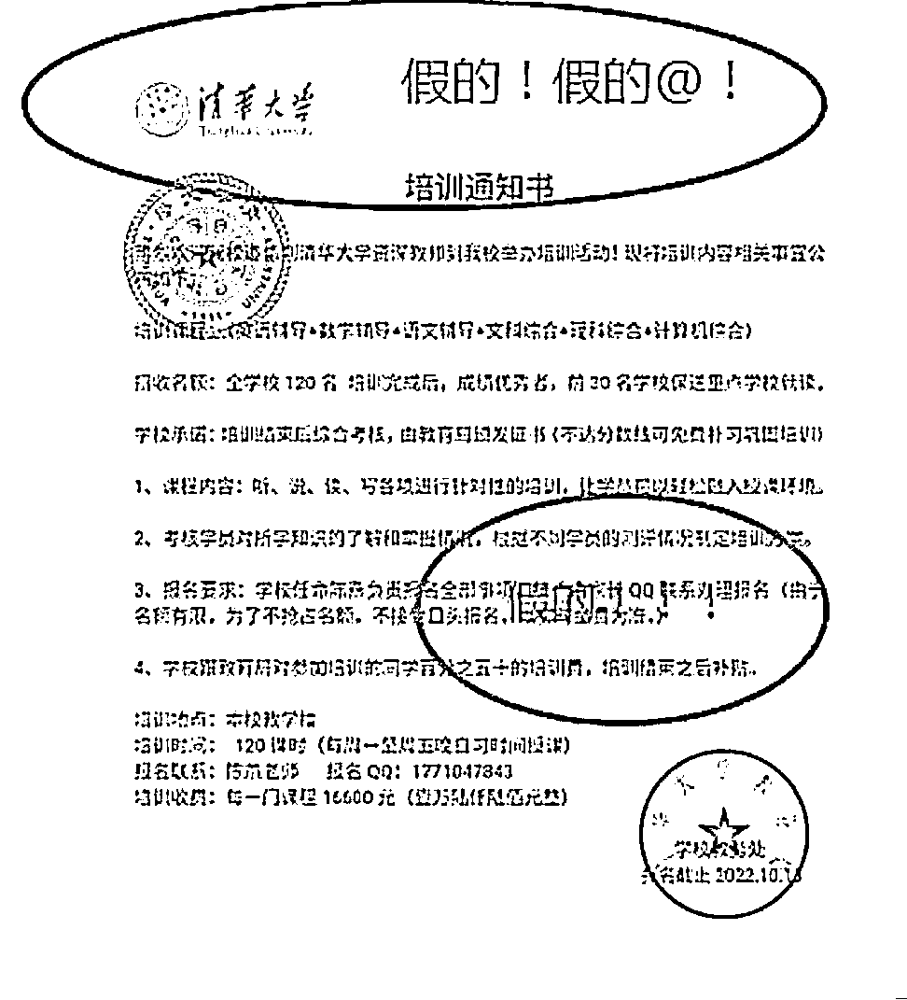
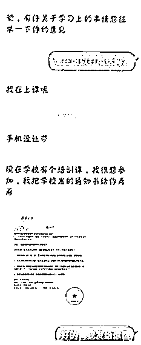
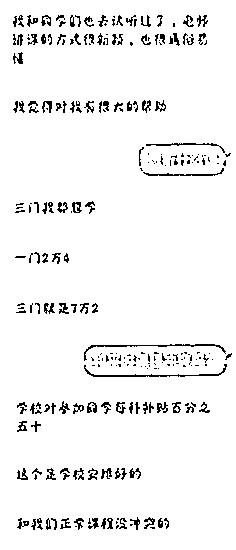
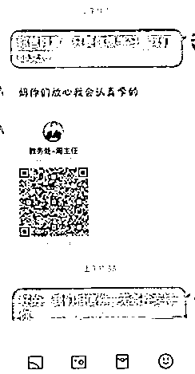
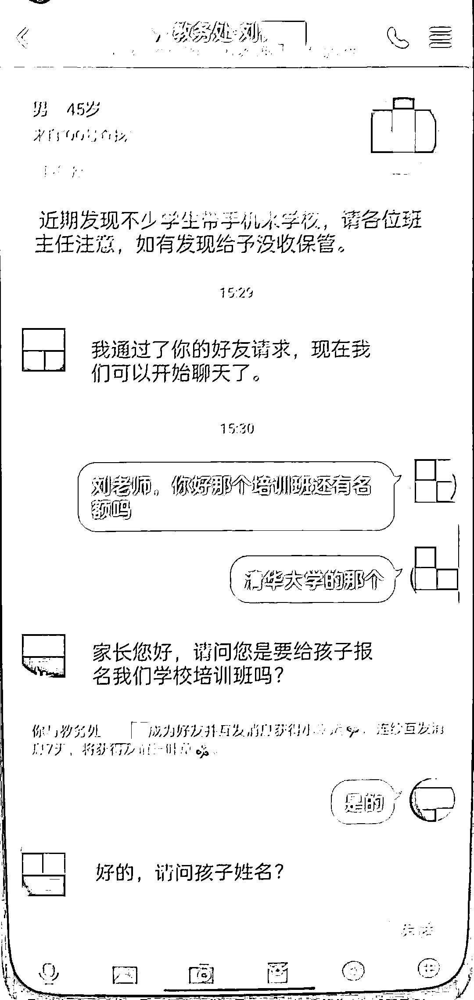
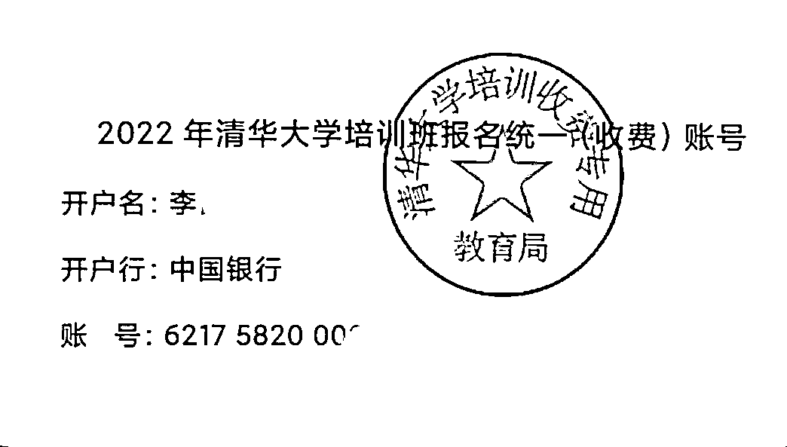
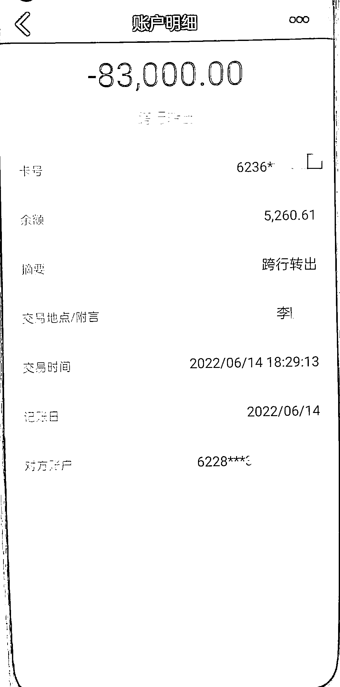

# 住校的“儿子”突然想报培训班，一家长被骗 19 万，另一家长被骗 7 万！

> 原文：[`mp.weixin.qq.com/s?__biz=MzIyMDYwMTk0Mw==&mid=2247545551&idx=6&sn=44475ec8e958bb4cb5812a477127429e&chksm=97cbf9f7a0bc70e1bfb7b9608dacb0291a265154b783ad10d4177ca599a04cfe55d97b3fdde0&scene=27#wechat_redirect`](http://mp.weixin.qq.com/s?__biz=MzIyMDYwMTk0Mw==&mid=2247545551&idx=6&sn=44475ec8e958bb4cb5812a477127429e&chksm=97cbf9f7a0bc70e1bfb7b9608dacb0291a265154b783ad10d4177ca599a04cfe55d97b3fdde0&scene=27#wechat_redirect)

自家孩子好学

作为家长当然要鼎力支持

一掷千金也在所不辞

孩子自己主动要求学习上进

各位家长估计也会心怀大慰 

而骗子正是利用了这一点

设下了圈套行骗

我市已有家长被骗

  大部分学生家长收到了冒充子女的 QQ 短信，都是以交培训费、补课费为名义的诈骗信息。骗子都是通过学生 QQ 和学校教务处老师 QQ 联络学生家长，针对性较强，极具迷惑性，受害人容易受骗上当。反诈中心提醒各位家长提高防骗意识，发现可疑信息后要注意核实，不可轻信，以免被骗受损。

    近日，我市某中学学生家长收到冒充其儿子和教务处老师的 QQ 信息，对方称需交培训费，学生家长误信，通过手机银行向对方汇去 7 万余元

案情回顾

如果你收到这样的微信或 QQ 信息，或者突然就当上"妈妈"“爸爸”，或者"老师"开门见山就提钱，**那么，请你注意，****可能遇到骗子了！**

       以下是小编整理的受害人与骗子的对话截图，大家一定要擦亮双眼，识别诈骗套路！

********

********

********

********

****身为父母，都想望子成龙，对于学习方面更是无条件支持****

****所以，在这种心理下，更容易掉入骗子的陷阱****

****这位家长同意孩子参加培训班后，“儿子”便发来学校“领导”QQ 号码**** 

****称需把培训费用转给此学校“教务处”周主任**** 

********

****至此，家长彻底掉入骗子陷阱****

****前后给对方提供账户三笔转入**7 万余元******

****后因对方让继续缴纳 3 万元押金，这名家长才起疑**** 

******立即报警******

********

******案件回顾 2******

****前不久，家住高铁新城的方女士收到一条 QQ 好友请求，看对方是儿子的名字，没多想就同意了。原来，学校邀请清华大学的教授来校举办培训班，当天是报名的最后一天，“儿子”就想报名参加，方女士觉得是好事便同意了。****

********

****这时，“儿子”表示，学校规定必须征得家长同意并由家长联系培训负责人刘主任报名。随后，“儿子”发给方女士“刘主任”的 QQ 号，添加好友后，“刘主任”给方女士一个银行账户，要求其尽快转 5 万元报名费。****

********

****这时，“儿子”称还需要再报两门，为了不耽误儿子的前程，方女士又转了 33200 元。“刘主任”称由于是最后一天报名，之前的账户已经结账了，后报名的两门课程需要重新转账，并保证之前转的金额会原路退还，信以为真的方女士又转去了 33200 元。****

****可事情远没有这么简单，“刘主任”又称之前交的只是一期的费用，第二期还需再缴纳 83000 元。方女士赶紧跟“儿子”确认，得到确认答复后，方女士又一次向转了 83000 元。“刘主任”发来报名成功的消息同时，又跟方女士透露还有一个重点班可以报名参加。****

********

****但方女士的账户内并没有多少钱了，在“刘主任”的各种催促下，方女士越想越不对劲，于是就跟儿子的班主任取得联系。班主任表示方女士的儿子一直在上课，压根就没有培训班这回事。这时，方女士才意识到被骗了，于是赶紧打电话报了警。****

******反诈中心提醒****** 

********

****犯罪分子购买了诈骗所需的电脑、银行卡、QQ、上网卡等设备后，分别通过网络查找高中家长 QQ 群，进群后根据备注名“某某某的家长”和微信朋友圈内容获取家长及其孩子的身份信息。****

****利用另外的 QQ 号冒充该家长的小孩、小孩学校主任等身份添加家长为 QQ 好友，从中骗取家长信任。****

****再以参加学校培训急需培训费、器材押金等理由，要求家长将钱款转账到指定的银行账户。****

****为了防止家长起疑，这些骗子还特地选在孩子上课时间段进行诈骗，并声称正在上计算机课，受骗家长因担心打扰孩子学习，均未电话核实便将钱款打了过去。****

****来源：天下有诈，洛阳市反诈骗中心，相城公安微警务****

********

****欢迎关注灰产圈社群服务号****

****************

****← 向右滑动与灰产圈互动交流 →****

********