# 女辅导员在男寝庆祝生日，照片流出被质疑行为不当，揭开职校乱象

> 原文：[`mp.weixin.qq.com/s?__biz=MzIyMDYwMTk0Mw==&mid=2247545600&idx=2&sn=12cd641e045f52aa7b930420e70e8f6a&chksm=97cbf838a0bc712ea58b6cac9bb2a82b7809824f753b3c897dc681d708943650ecd3327d9b8b&scene=27#wechat_redirect`](http://mp.weixin.qq.com/s?__biz=MzIyMDYwMTk0Mw==&mid=2247545600&idx=2&sn=12cd641e045f52aa7b930420e70e8f6a&chksm=97cbf838a0bc712ea58b6cac9bb2a82b7809824f753b3c897dc681d708943650ecd3327d9b8b&scene=27#wechat_redirect)

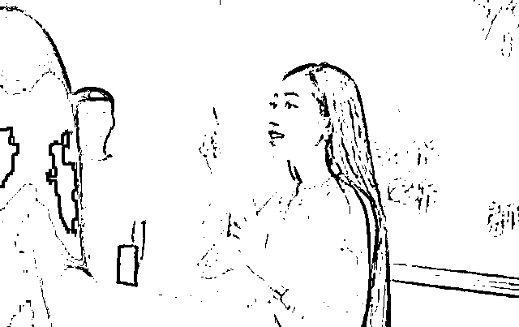

图文均来源网络

都说校园里的青春回忆是最难忘的，在一个懵懂的年纪才能最清楚的感受到校园的美好。 

当然在学校里首要任务就是学业，而学校的制度管理，聘请的教师还有学习的氛围都息息相关。

随着时代的变化，许多教师与学生之间相处的关系都会更加的密切一下，不会向往年那样过于有界限。

这样学生也会愿意与老师有更好的沟通，而且大学的教师，辅导员，年龄上和学生相差的也并不大，所以共同的话题也就多了。

而近日就有一位在校辅导员因与学生相处过于密切，引起了大家的关注。

甚至有网友怀疑这位辅导员思想不干净，受到了铺天盖地的指责，这究竟是怎么一回事呢？一起来看看吧！

01

事情源于该女辅导员分享了自己过生日的照片。

照片中这名女辅导员与多位男同学在男生寝室里吃蛋糕。

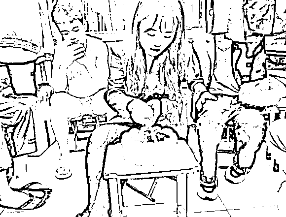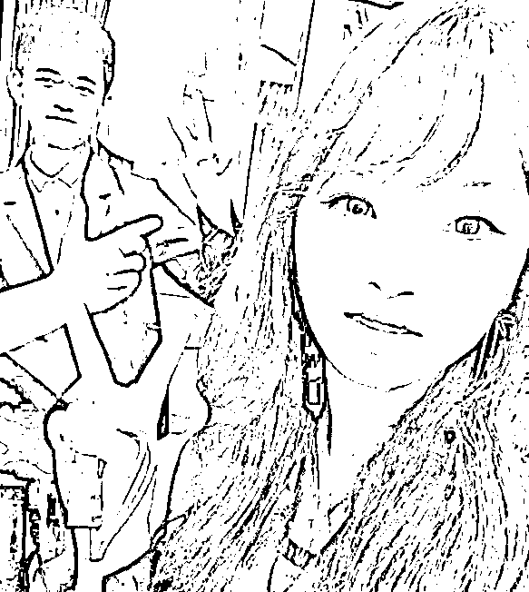

不少网友看到照片后，就觉得这位老师与学生之间过于亲密，没有一点分寸感。

毕竟大学生的年纪也不小了，该懂得的东西也都懂，更何况这位辅导员的年纪也不大，所以更应该要懂得避嫌。

据悉，这位女辅导员今年 28 岁，担任供电专业指导老师，在理工科里面大部分的学生都是男生，女孩子是属于凤毛麟角的存在。

而正好这位女辅导员近日刚好过生日，因为平时和学生们的关系也都还不错，班里的男同学知道后责怪老师没有通知他们。

**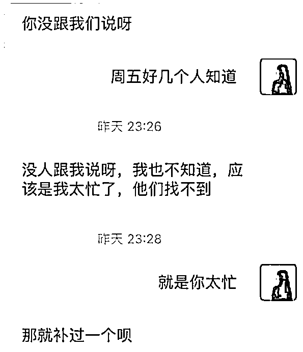**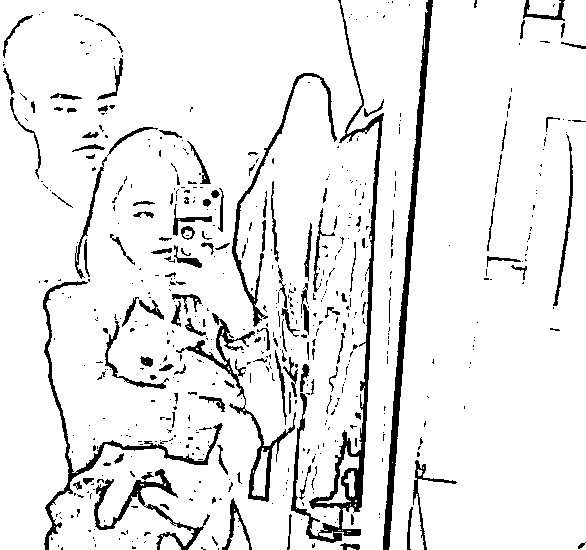

所以学生们就自行商议了一下，打算给女辅导员补办一个生日。

当晚在查寝的时候，女辅导员见学生们为自己准备好的心意也不好直接拒绝，就留下与学生们过完了这个生日，女辅导员觉得这个生日过得很有意义，就将照片发布到了社交平台上。

由于过程中，不仅仅只有拍与生日蛋糕的画面，还让别人帮自己拍照片，同时还有抱着宠物和男生单独的自拍，这看起来就有些不合规矩。

所以在照片流出之后，不少人都质疑这位女辅导员的行为不当，**对此，她专门发长文回应了此事。**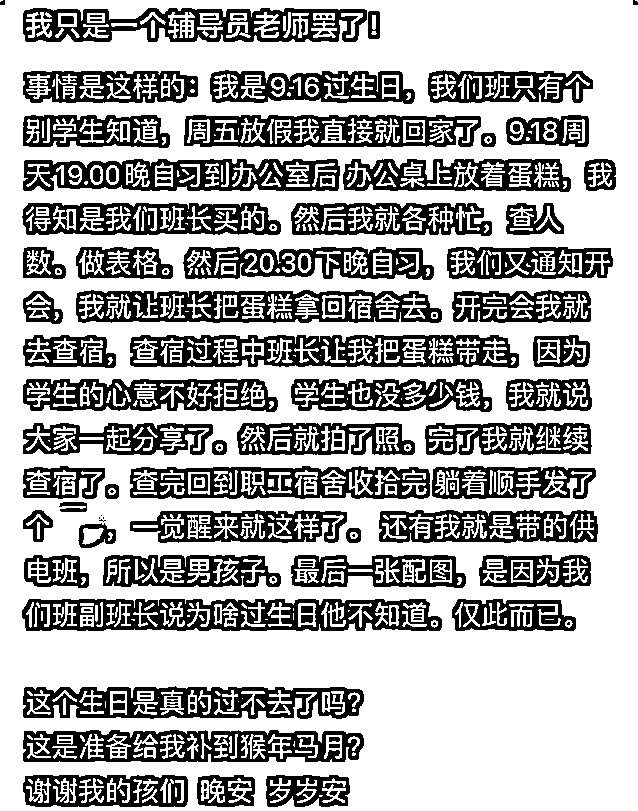

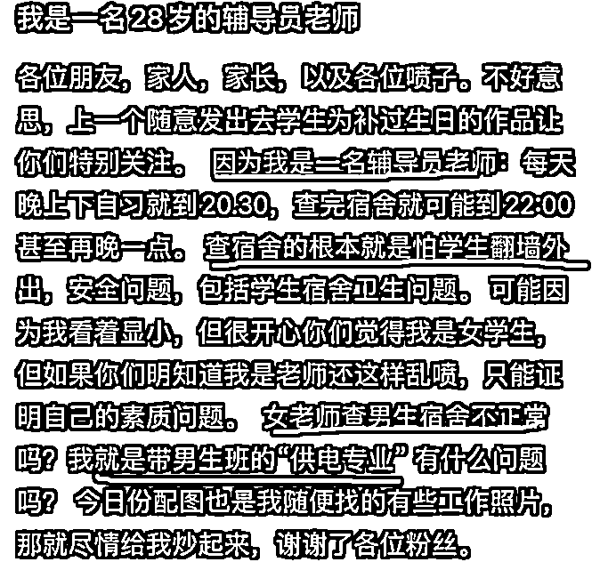

看起来好像整个事情都解释清楚了，而且这样的解释也算合规，

不过还是有很多网友不买账，认为身为女老师她应该懂得分寸，和男学生的互动也应该减少，更应该做符合教师身份的事。

02

经过一段时间的舆论压力，这位老师还是选择了离开学校。

即便是离开也有网友直接把职校拉下了水，**称这样的老师和学生只会出现在职校中，正经学校的老师才不会这样打扮。**

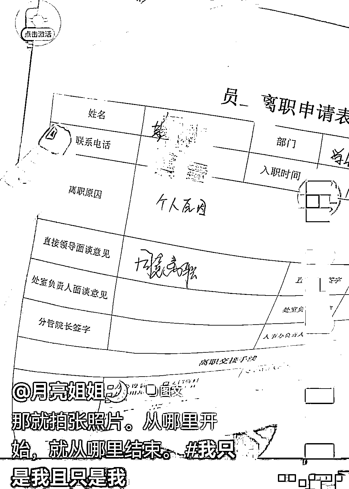

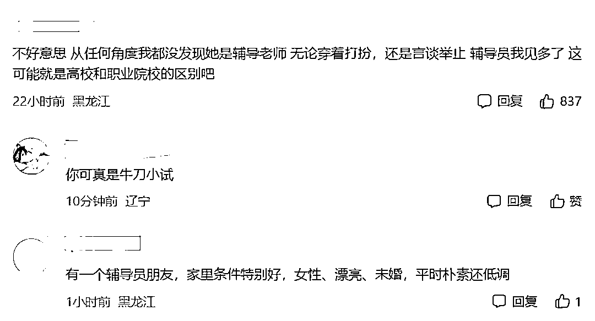

但话说回来，如果这位辅导员不是一个年轻漂亮的小姑娘，而是一个中年大妈，还是和一群男同学们在寝室里合照，这质疑的声音还会有吗？

大家只会在乎眼前看到的是怎么样，但这老师的教学能力，管理水平如何，大家一概不知，就只是因为这位老师是位年轻，颜值高的小姑娘就全盘否定她。

会不会过于苛刻了一些。

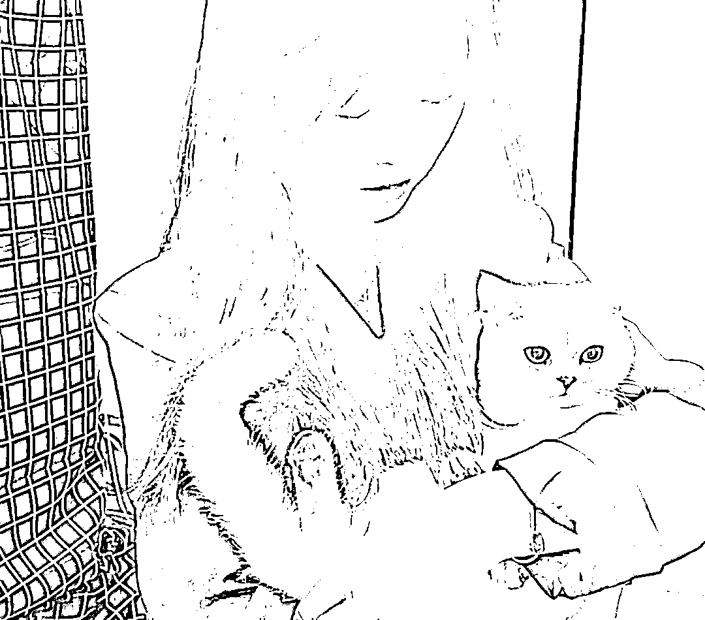

大众对于老师的外表有严格要求已经不是新鲜事了，从老师的妆容到穿着总能成为家长挑剔的因素。

在家长看来，老师颜值过高，打扮太好看说明心思没放在教学上，是不专业的表现。

而且老师颜值过高也会分走学生的注意力，让学生无法专心学习，可如果家长真的了解学生就会发现，学生对于老师也是有自己的偏爱的，会因为喜欢一个老师而认真学好一门课，也会在遇到喜欢的老师时收敛自己调皮的行为。

其实老师也是普通人，虽然说为人师表，**但是为人师表只是在为大家做表率，并不代表可以对老师的衣着有要求。**

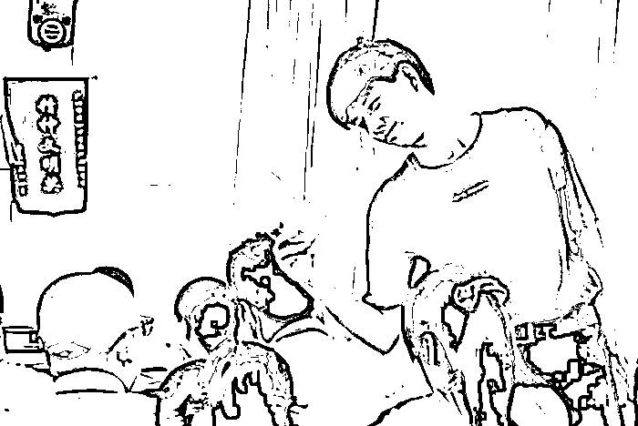

03

在学校里，一个合格的老师应该学会平衡好自己与学生的关系。

在教室里面可以谈笑风生，但是在私人场合，一年轻的老师们在私下和学生相处的时候一定是要学会避嫌。

如果老师和学生之间，没有距离感和边界感，久而久之很容易引发大问题，而最后基本上都是要老师来承担大部分责任。

因为大多数的人只会认为是老师没有好好教育学生，没有以身作则，才导致有这样的事情发生。

最终伤害的也是老师自己。

所以希望每一位老师，都可以严格要求自己的言行举止，不要做容易因为误会的事情，只有这样，自己在教育事业当中，才会发挥出更多的力量！

来源：幸福小酒馆

欢迎关注灰产圈社群服务号

← 向右滑动与灰产圈互动交流 →

