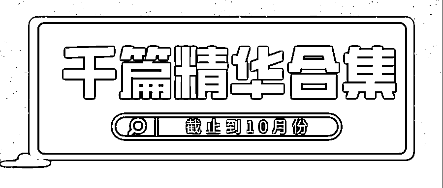

# 「灰产圈高端社群」千篇精华合集，截止到 10 月份

> 原文：[`mp.weixin.qq.com/s?__biz=MzIyMDYwMTk0Mw==&mid=2247545600&idx=3&sn=f60f9a9c555d931a84b001a50782f7bd&chksm=97cbf838a0bc712ecddf219ad22922fe28e0d7e8899173da7f621493e052e1c3cd290f10979c&scene=27#wechat_redirect`](http://mp.weixin.qq.com/s?__biz=MzIyMDYwMTk0Mw==&mid=2247545600&idx=3&sn=f60f9a9c555d931a84b001a50782f7bd&chksm=97cbf838a0bc712ecddf219ad22922fe28e0d7e8899173da7f621493e052e1c3cd290f10979c&scene=27#wechat_redirect)

人与人之间，**在认知上最大的竞争，其实是信息输入量的竞争。**

**信息的价值，赚过第一桶金的人都知道。**

足够的信息输入后，看问题的视角会更加多元，分析问题也会更有深度，也就是具备了洞察力。

**很多人付费几十万、上百万购买各种数据服务，只为看到那最关键的一点信息。**

前几天，有一位会员问我，灰产圈高端社群能提供的最核心价值是什么？ 

我告诉他，**毫无疑问，****是含金量高的、稀缺的、差异化的项目，资源，人脉和信息差。**

这是灰产圈高端社群最核心的价值，没有之一。

**而且，这些内容全都是真正的互联网创业项目秘籍 —— 大道理我们听的太多，在这里，只聊点接地气的实在干货。**

迄今为止，灰产圈高端社群已经有了** 2400+** 主题，**18**个项目资源主题分类。

**点击图片查看**

****