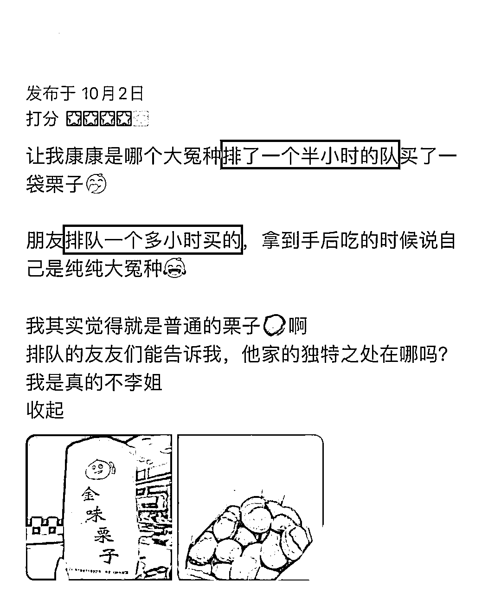
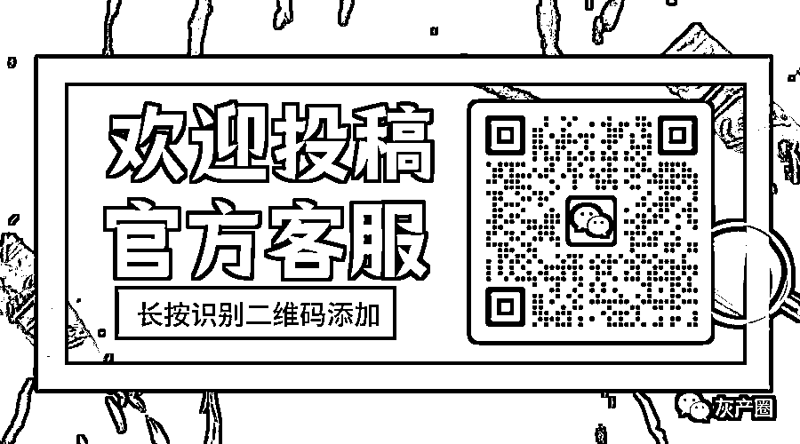

# 糖炒栗子都开始卷了？南京有假排队营销，上海有栗子“咖化”

> 原文：[`mp.weixin.qq.com/s?__biz=MzIyMDYwMTk0Mw==&mid=2247545600&idx=5&sn=94c86e396a9ef125583896920abca39c&chksm=97cbf838a0bc712e323465e0cfcf7af6eba23c6a90d78c77cb9a2bebf2f9521de60c0ab4ccad&scene=27#wechat_redirect`](http://mp.weixin.qq.com/s?__biz=MzIyMDYwMTk0Mw==&mid=2247545600&idx=5&sn=94c86e396a9ef125583896920abca39c&chksm=97cbf838a0bc712e323465e0cfcf7af6eba23c6a90d78c77cb9a2bebf2f9521de60c0ab4ccad&scene=27#wechat_redirect)

入秋降温之后

暖暖甜甜的糖炒栗子，都吃过了吧！🌰

估计没有人是**排长队**买的吧？ 

毕竟现在能让人心甘情愿排队的

大概只有核酸了 

可是南京有家栗子店

排成了这样里三层外三层 ⬇️

大街小巷都有的糖炒栗子而已 

这家店难道叫**“茶颜栗子”**吗？

那倒也没有哈哈哈哈哈

只是在南京搜索栗子

跳出来排行第一的这家栗子店罢了

在点评上看到的照片

也的确都是大排长队

这样的店

店门口贴的限购 2 斤可以理解么

可是都 2022 年了

这家栗子店是真的牛，**只收现金！**

这年头在办公室里

大家身边所有现金凑起来都没几个钱

所以

在这家只收现金的栗子店的门口

专门有个阿姨给大家**不等值换现金**

换现金需要加 2 块

还有可以电子支付的黄马甲代购

**不用排队，30 块一包**

属于是非常有规模的代购黄牛了！

有黄色的工作马甲

有黄色的栗子推车小货架

而且还是“明码标价”

那代购黄牛的货从哪儿来呢？

是有人排队买到之后 

转身就递给代购黄牛的

代购黄牛刚接过货

就拿给身后不愿意排长队的客人

加价 5 块售出

然后客人扫码付钱

这样的栗子交接

一次又一次

商家的套路实在是太明显了 

拍摄的博主

跟反复排队的大妈大爷一打听

这套路是更清楚了

**朝九晚五**

**一天一百**

合理怀疑

**栗子店，代购黄牛，排队的，换现金的...**

**都是连档模子来的？**

如果真是这样

那，栗子几乎就是加价出售？

在门口制造人气的长队，是假的？

这样的营销套路，早几年的确有效

而且上海的很多饮料小吃店都尝到过甜头的

但感觉现在已经不兴了啊...

三天两头的核酸排队已经够烦躁了 

谁还愿意为了买点吃，排长队

（严谨点，除了淮海路永远的顶流光明邨）

可南京的这家小小栗子店

感觉像是乐此不疲呢

而且还真的有网友大冤种

花了一个半小时排队

就买一袋普通的糖炒栗子吃吃

但也有网友非常不满代购黄牛的存在

说感觉店家故意放慢了炒栗子的速度

**“逼着人去买代购黄牛的”** 

可是看到不少网上的留言

又让人觉得这是一家常青店

而不是网红店

**“红火了好多年了”** 

**“真的很好吃”**

**“老南京人就认这个”**

**“大名无需做介绍”**

**“南京最牛的栗子”**

这些留言看下来

就更加疑惑了呀！

**既然这么好吃，还是家当地老字号**

**为什么还要请人排队、搞代购黄牛呢？**

上海的栗子店就不一样了

不玩这种营销套路了

已经开始逐渐**“咖化”**

和平时看到的只区分个头的相比

这属于是 SOE 栗子了！

连店铺都装修得很像咖啡店的

是真的“咖化”！

那之后是不是炒法也要区分一下了 

少糖/半糖/全糖
轻炒/正常炒/爆炒

就算是这么讲究的栗子店

其实也开不出来

一共 4 家店，3 家关门，只剩一家独苗

嗐！栗子其实没啥花头

根据网友建议，感觉**烤红薯和生煎**

倒是可以率先开始精细化 

红薯要么先浅分个产地吧

山东烟薯 25

福建六鳌蜜薯

陕西临潼板栗薯...

上海的生煎

首先就是皮子要分 **全/半/不 发面**

再是收口方式

里面的肉馅有无酱油... 

以前都是卷排队卷营销

如果真的都往精细化去卷，倒也挺好

虽然有点瞎讲究么，总比假排队好伐 

本文部分素材来自：b 站博主尔东木子 _ 、小红书博主 Freyaaf，来源：上海全知道

欢迎关注灰产圈社群服务号

← 向右滑动与灰产圈互动交流 →

