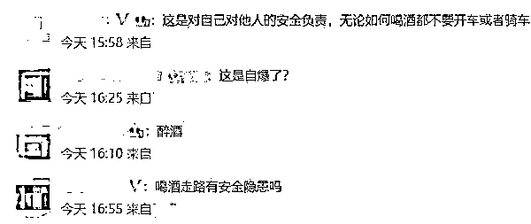

# 醉酒骑自行车也是“醉驾”？男子酒后骑自行车被罚！律师解读……

> 原文：[`mp.weixin.qq.com/s?__biz=MzIyMDYwMTk0Mw==&mid=2247545600&idx=7&sn=3b4e4ec765a28d1ae6c388525930944d&chksm=97cbf838a0bc712e03a2d0f120590966544f742d52002ac5e60609c7ea14d95c224432202cac&scene=27#wechat_redirect`](http://mp.weixin.qq.com/s?__biz=MzIyMDYwMTk0Mw==&mid=2247545600&idx=7&sn=3b4e4ec765a28d1ae6c388525930944d&chksm=97cbf838a0bc712e03a2d0f120590966544f742d52002ac5e60609c7ea14d95c224432202cac&scene=27#wechat_redirect)

近日，海南海口，一男子酒后骑自行车被交警拦下，男子不服气，称“骑自行车喝酒怎么了”，还和一旁的路人发生争执。民警带其去检测，男子血液酒精含量达到 112mg/100ml。

 醉酒能不能骑自行车上路？交警表示：这是违法行为。

**男子醉酒骑自行车被罚**

据南方新闻网，近日，一段海南省海口交警对酒后骑自行车行为处理的视频在网上引起热议。

视频显示，一名男子骑自行车在路上与人发生争执，交警闻声赶来发现该男子满身酒味。交警询问：“是否喝酒了？”该男子理直气壮地说：“**喝酒怎么了，我骑自行车！**”

图片来源：视频截图

尽管如此，交警还是拿着酒精测试仪验了一下，**经检测酒精含量 112mg/100ml** 。

最后按照交通安全法第七十二条第三项之规定，驾驶自行车、三轮车、电动自行车，不得醉酒驾驶，**处罚了男子 20 元**。

据《中华人民共和国道路交通安全法实施条例》第七十二条第三项规定：“**在道路上驾驶的自行车、三轮车、电动自行车、残疾人机动轮椅车，不得醉酒驾驶**。”

《中华人民共和国道路交通安全法》第八十九条内容为“行人、乘车人、非机动车驾驶人违反道路交通安全法律、法规关于道路通行规定的，**处警告或者 50 元以下罚款**。**非机动车驾驶人拒绝接受罚款处罚的，可以扣留其非机动车**”。

《海南省实施道路交通安全法办法》第六十三条第十五项规定：“**饮酒、吸毒后驾驶非机动车，处警告或者 50 元罚款**。”

对此，有网友表示，只要参与到交通中，都不能醉酒。也有不少网友表示：“喝酒走路有隐患吗？”

**律师：醉驾和酒驾有区别**

据红星新闻，陕西恒达律师事务所高级合伙人、知名公益律师赵良善告诉红星新闻记者，醉酒驾驶非机动车，与醉酒驾驶机动车存在本质上的区别。根据《中华人民共和国道路交通安全法》第八十九条规定，**骑自行车醉驾，可对骑车人处警告或罚款，但并不追究其刑事责任**。

赵良善律师表示，**并非喝酒后的驾驶行为就是醉驾，酒驾与醉驾存在着严格的区别**。如驾驶人员血液中酒精含量大于或者等于 20mg/100ml，小于 80mg/100ml，属于饮酒驾驶（是酒后驾驶的一种），简称“酒驾”。如驾驶人员血液中酒精含量大于或者等于 80mg/100ml，属于醉酒驾驶（是另一种酒后驾驶），简称“醉驾”。如“酒驾”驾驶的是机动车，驾驶人员需负行政责任，而不负刑事责任。如“醉驾”驾驶的是机动车，驾驶人员需负刑事责任，根据《刑法》第一百三十三条之一规定，构成危险驾驶罪。

河南泽槿律师事务所主任付建律师告诉红星新闻记者，如果饮酒后驾驶非机动车，而且体内每 100ml 血液中含有的酒精量大于或等于 80mg 的，属于醉酒驾驶非机动车的情形，应当按照规定处罚。**如果酒精含量未达到该标准，则不予处罚**。

赵良善律师指出，酒后骑自行车危险性较小，而酒后驾驶机动车危险性较大，所以法律规定骑自行车的人员只有醉驾，才算违法；而驾驶机动车的人员，即使酒驾，也是违法，也将受到行政处罚。

**海南省的《办法》**

**是否存在扩大化解释？**

有网友注意到，“椰城交警”提到的**《海南省实施道路交通安全法办法》第六十三条第十五项规定中“饮酒后驾驶”，与《中华人民共和国道路交通安全法实施条例》提及的“醉酒驾驶”，所描述的情况并不相同**。那么，《海南省实施道路交通安全法办法》是否对上述《条例》和《道路交通安全法》进行了扩大化解释？

据红星新闻，赵良善律师认为，虽然《海南省实施道路交通安全法办法》规定的“饮酒后驾驶”，与《中华人民共和国道路交通安全法实施条例》中规定的“醉酒驾驶”有所不同，但根据《中华人民共和国道路交通安全法》第八十九条规定“行人、乘车人、非机动车驾驶人违反道路交通安全法律、法规关于道路通行规定的，处警告或者 5 元以上 50 元以下罚款；非机动车驾驶人拒绝接受罚款处罚的，可以扣留其非机动车”，**《海南省实施道路交通安全法办法》的规定与《中华人民共和国道路交通安全法》的规定是一致的，并无扩大化解释**。

付建律师也认为，《海南省实施道路交通安全法办法》设立的行政处罚，**没有对《中华人民共和国道路交通安全法实施条例》或《中华人民共和国道路安全法》中的规定作出扩大化处理**。

付建律师提醒，自醉酒驾驶机动车入刑以来，“酒后不开车”逐渐成为社会共识。但是酒后、醉酒驾驶电动自行车等非机动车现象也存在严重的安全隐患，威胁自身和他人的生命健康及财产安全。对于此种情况，建议交警部门与其他社会机关为市民普及相关的法律知识；政府部门要加大宣传力度；市民也应当提升自我安全意识，养成遵守交通法规的良好习惯，酒后尽量不骑非机动车，维护道路交通安全。

不过，也有律师表达了相反的观点。据封面新闻，法度研究院研究员、北京海润天睿律师事务所刘烨律师告诉记者，首先，从位阶最高的《道路交通安全法》第八十九条来看，这一法条的意义是有关部门可以对非机动车驾驶人违反道交法律法规的行为进行警告或罚款，也为警方的处罚奠定了基础；其次，根据《中华人民共和国道路交通安全法实施条例》，该条例属于行政法规，其效力仅次于《道路交通安全法》。

“**该条例对酒后骑行有了更明确的规定，明确规定不得醉酒驾驶自行车**。”结合近些年“酒驾入刑”的相关新闻，我们可以知道饮酒驾驶与醉酒驾驶的区别非常大，**酒后驾驶并不等于醉酒驾驶**。也就是说**《道路交通安全法实施条例》并没有禁止民众在酒后驾驶非机动车，只是不能醉酒驾驶而已**。

“那么，海南是否有权力在该省的地方性法规中对醉酒驾驶自行车进行扩大化的修改？”

答案是否定的。根据《行政处罚法》第十二条规定：”地方性法规可以设定除限制人身自由、吊销营业执照以外的行政处罚。法律、行政法规对违法行为已经作出行政处罚规定，**地方性法规需要作出具体规定的，必须在法律、行政法规规定的给予行政处罚的行为、种类和幅度的范围内规定**。”海南制定的这两部条例属于地方性法规，虽说能够对法律、行政法规作出具体规定，但前提是在法律、行政法规规定的给予行政处罚的行为、种类和幅度的范围内进行。**《道路交通安全法实施条例》已经明确只有在达到醉酒标准才进行禁止并且进行相应处罚，海南省地方性法规却将范围扩展到饮酒驾驶，这明显是与《道路交通安全法实施条例》这一行政法规规定相违背**。

除了在法律层面探讨酒后骑行背后的问题，我们也应当结合实际综合考量。以北京为例，仅在 2021 年下半年共享自行车的骑行量就已经达到惊人的 4.5 亿人次，说明自行车依旧是不少人日常生活的交通工具。虽然说我们并不倡导酒后骑车，但是不少人在日常生活中很难做到滴酒不沾，尤其是在交通不发达地区，自行车、三轮车等非机动车依旧是主要的交通工具，倘若各地政府不顾法律、行政法规规定，禁止饮酒骑车，显然是不太现实的，这一做法也与依法治国理念相违背。

来源：每日经济新闻综合自南方新闻网、红星新闻、封面新闻、齐鲁晚报、公开资料

欢迎关注灰产圈社群服务号

← 向右滑动与灰产圈互动交流 →

