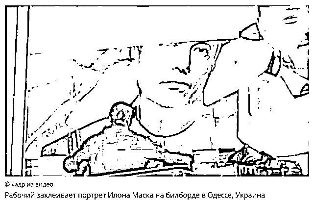
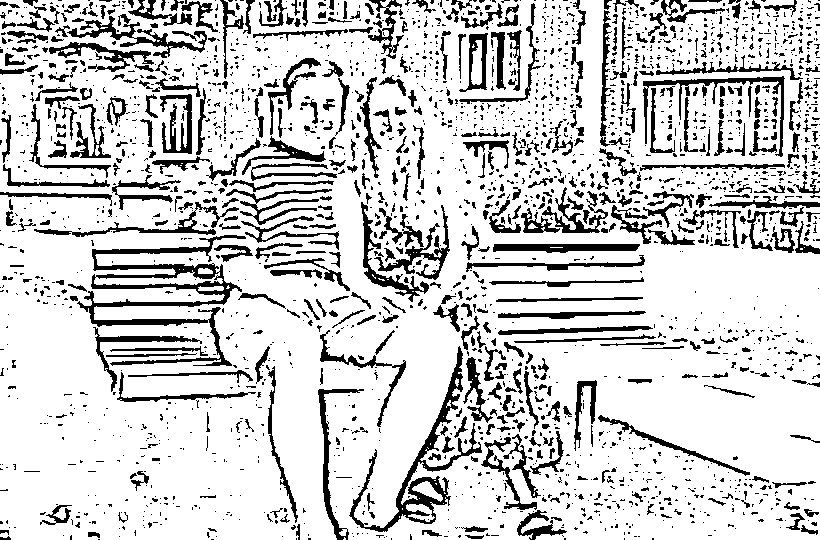
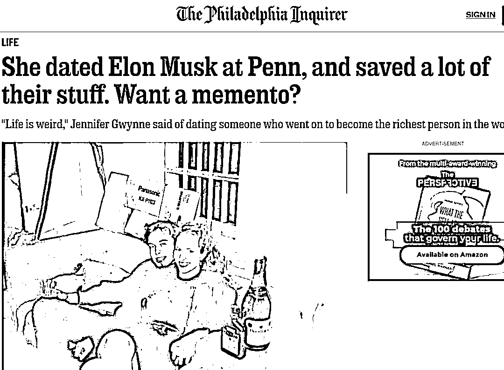
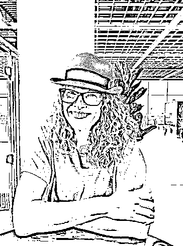
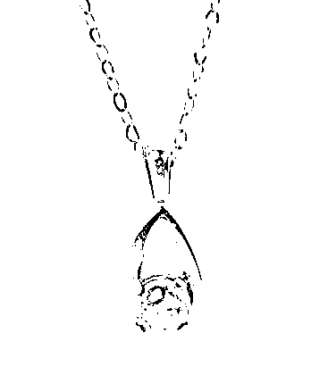

# 马斯克正接受美国政府调查，其照片被从“感谢支持乌克兰”广告牌上撤下

> 原文：[`mp.weixin.qq.com/s?__biz=MzIyMDYwMTk0Mw==&mid=2247545600&idx=8&sn=29c062103c18739d44e75fac015d1ed5&chksm=97cbf838a0bc712e8a5f1ac7fad205ca5eb114bc0ac587346221daad0c6fd13b8589874a3192&scene=27#wechat_redirect`](http://mp.weixin.qq.com/s?__biz=MzIyMDYwMTk0Mw==&mid=2247545600&idx=8&sn=29c062103c18739d44e75fac015d1ed5&chksm=97cbf838a0bc712e8a5f1ac7fad205ca5eb114bc0ac587346221daad0c6fd13b8589874a3192&scene=27#wechat_redirect)

据新华社消息，在一份 13 日公开的法庭文件中，美国社交媒体推特公司披露：**世界首富埃隆·马斯克因收购推特事宜正在接受美国联邦机构调查。**

路透社援引法庭文件报道，推特公司数月来要求马斯克的律师团队交出他们向联邦机构提交的一些文件，但是马斯克方面未予配合。于是，推特公司请求一名法官下令让马斯克方面交出这些文件。

按推特公司的说法，马斯克的律师团队 9 月下旬制订一份清单，罗列拒绝交给推特公司的相关文件，例如马斯克方面 5 月 13 日写给联邦证券交易委员会的电子邮件草稿、马斯克方面提交给联邦贸易委员会的演示幻灯片。

推特公司在这份落款 10 月 6 日的法庭文件里说：“‘把球藏起来’的游戏必须结束。”

就推特公司上述披露内容，马斯克的律师尚未作出回应。

马斯克 4 月宣布收购推特，7 月 8 日宣布终止收购协议。推特 7 月 12 日起诉马斯克，指控这名富豪拒绝依约收购，让推特蒙受巨大损失。马斯克 10 月初再度表达收购意愿，引发关注。特拉华州衡平法院 10 月 6 日裁定，暂停马斯克与推特的诉讼至 10 月 28 日，以便双方期间完成交易，否则 11 月还将重新开启庭审。

**延伸阅读：**

**马斯克照片被从“感谢支持乌克兰”**

**广告牌上撤下**

据今日俄罗斯电视台（RT）网站 12 日报道，**乌克兰港口城市敖德萨决定，将美国亿万富翁马斯克的照片从在俄乌冲突中支持乌克兰的国际名人广告牌上删除。**在该市做出这一决定之前，马斯克就停止俄乌冲突提出了自己的“和平计划”。

敖德萨市政府在社交媒体 Telegram 上发帖称：“广告管理部门正把埃隆·马斯克的照片从广告牌中删除，这些广告牌是我们用来向支持乌克兰的人表示感谢的。”敖德萨市政府还发布了一段视频，显示一名工作人员将一张巨大的蓝纸覆盖在这位亿万富翁的照片上。

当地时间 10 月 3 日，马斯克就停止俄乌冲突提出了自己的“和平计划”，包括：在“联合国的监督下”让顿涅茨克、卢甘斯克、扎波罗热、赫尔松四地重新进行“公投”；让克里米亚“正式成为俄罗斯的一部分”；保证克里米亚的供水安全；乌克兰保持中立。而他的此番建议，引发了包括乌克兰总统泽连斯基在内的乌各方人士的强烈批评。

接着，泽连斯基在推特上发起了自己的投票，问他的粉丝“你更喜欢哪个马斯克”，选项有“支持乌克兰的”和“支持俄罗斯的”。即将离任的乌克兰驻德国大使安德烈·梅利尼克用粗话回复马斯克“滚”。

10 月 6 日，乌克兰媒体《基辅邮报》6 日在推特上发文抨击马斯克：“埃隆·马斯克显然已经失控，在他试图冒充乌克兰问题专家时，自负和虚荣心似乎发挥了巨大作用。停下来，埃隆。承认你做过头了也没关系。停下来吧。”此外，该报还明确称不同意马斯克提出的“和平计划”。针对此番抨击，马斯克回应称，“我是乌克兰的忠实粉丝，但不是第三次世界大战的（粉丝）”。

来源：综合自中国新闻网、每日经济新闻、环球网等

# 马斯克青涩照好值钱，被前女友拍卖，拍出 118 万

北美报告

对多数人而言，翻出过去关系中留下的纪念品可能引发怀念之情、尴尬回忆，甚至还会面临现任伴侣的质问。

图源：RR Auction 

但是对特斯拉首席执行官马斯克（Elon Musk）在宾州大学时的前女友葛温（Jennifer Gwynne）而言，这些不只是回忆，还是财富。

**相恋一年，和平分手**

图源：Philadelphia Inquirer

费城询问报（Philadelphia Inquirer）报道，葛温最近通过波士顿 RR Auction 网络拍卖与马斯克两人的旧照与纪念品，为继子筹措大学学费，结果这些商品相当热门，售价最高的单品为马斯克赠送的一条项链，拍卖价 51008 万元（美元，下同）。

这些纪念品让葛温最终赚进**165265 元（****约合加币 22 万，人民币 118 万）**，相当于马斯克 2190 亿元身价约 0.00007%的收入。 

葛温大三时认识当时大四的马斯克，大约从 1994 年到 1995 年，他们也会分别前往多伦多探望马斯克的家人和罗德岛探望葛温的家人。

但在马斯克毕业后搬到加州，葛温在她回到费城完成学业之前曾拜访过他一次，之后两人和平分手，因为马斯克不喜欢异地恋，也不爱打电话。

从那以后，葛温了解到这个前男友找到了一家又一家的公司，从特斯拉到 SpaceX。今年，马斯克以 2190 亿元的净资产高居福布斯全球亿万富翁榜首。

媒体问她，看到前任成为世界上最富有的人是什么感觉？葛温回答说：“很难解释这有多奇怪，但对我来说，他只是我的第一个大学男友。”

葛温（图源：Philadelphia Inquirer）

葛温于 2020 年结婚，现在，住在南卡罗来纳州的葛温为一家大型医疗用品公司工作，之所以想要拍卖她与马斯克相处时的照片和纪念品，部分原因是为了资助她 13 岁的继子上大学的学费。

而灵感则来自去年（2021） 12 月，她看到一个故事，讲述了马斯克在宾夕法尼亚大学沃顿商学院担任助教时如何评分的家庭作业，在波士顿 RR Auction 的在线拍卖中带来了 **7753 元**的收入。

葛温回忆说：“当我初看到这则新闻时，第一个念头就是，‘我有什么？’”

RR Auction 的执行副总裁 Bobby Livingston 表示，葛温 的收藏是独一无二的。

Bobby Livingston 表示，这些片是了解马斯克的绝妙线索，“他现在是我们这个世界上的杰出人物......在这些照片里，他是一名大学生，与他的女朋友度过了愉快的时光。”

****一张卡片，也很值钱****

**葛温售出的这些纪念品，时间从 8 月 12 日至 14 日晚间止；这些商品包括一张手写卡片、一条翡翠项链和 18 张照片。**

**出价最高的商品是前面提到马斯克赠送给葛温的一条项链，成交价**51008**元；马斯克表示，项链上的翡翠出自他父亲在南非的矿场。**

****

**图源：RR Auction** 

**马斯克的手写生日卡片也相当抢手，最后成交价为 16643 元。卡片里提到的“Boo-Boo”是马斯克给葛温取的小名。**

**来源：新京报,世相研究所**

****

**欢迎关注灰产圈社群服务号**

********

**← 向右滑动与灰产圈互动交流 →**

****