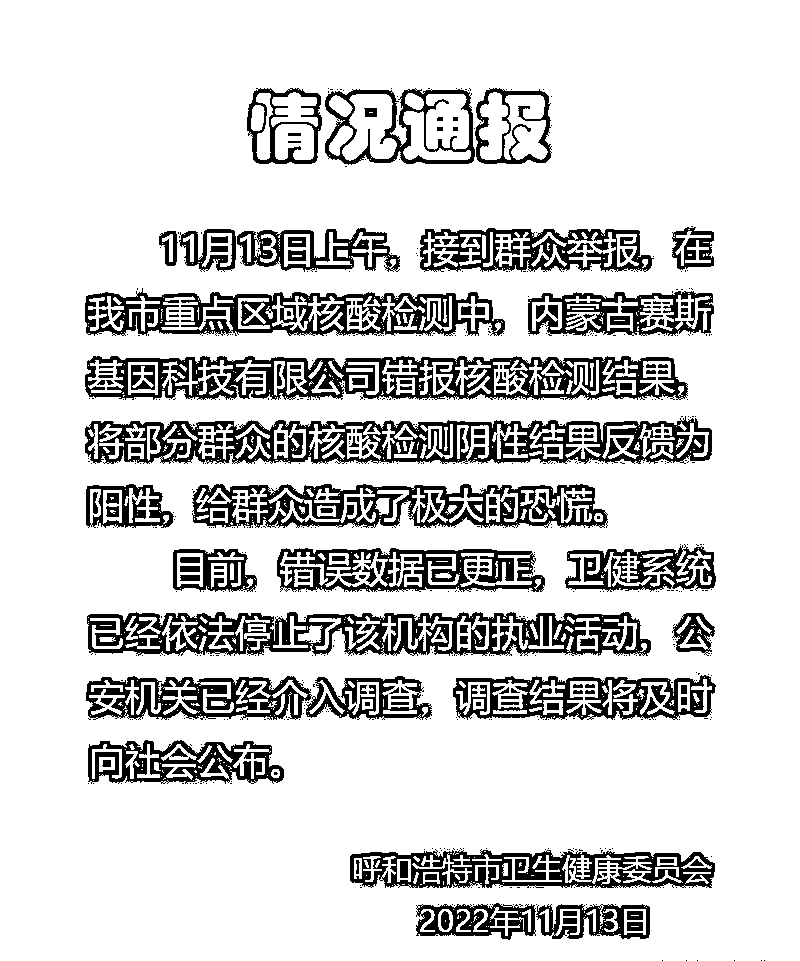
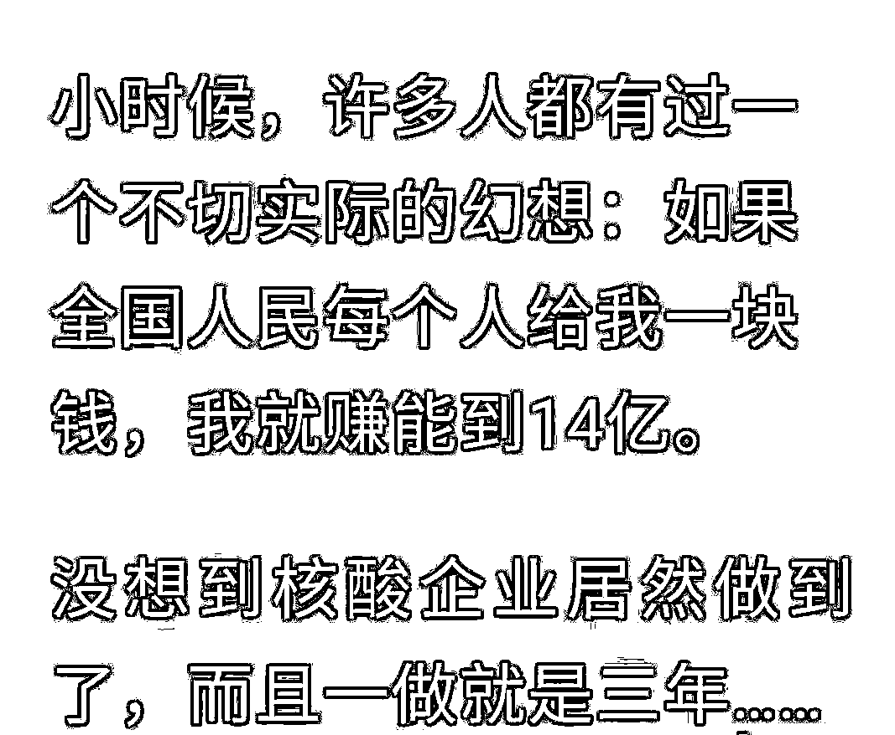
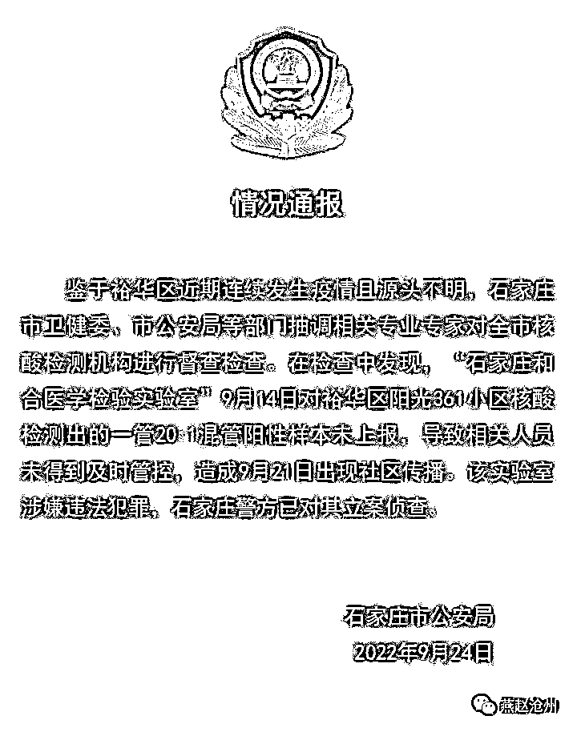
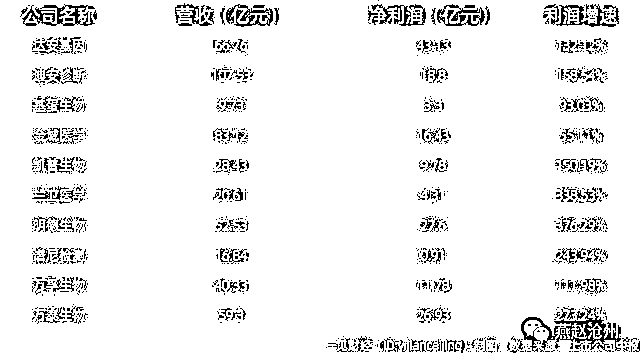
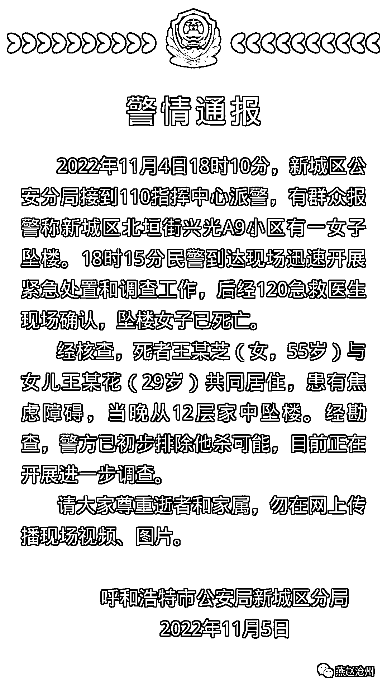

# 如此的核酸检测，与故意杀人何异？

> 原文：[`mp.weixin.qq.com/s?__biz=MzIyMDYwMTk0Mw==&mid=2247546127&idx=1&sn=692b17edd52e3fbfd08b82e0fc05f643&chksm=97cbfe37a0bc77211abfcf2cc19d3898baaac1012743f3dc9265f80bd8b3e4ce54475958403d&scene=27#wechat_redirect`](http://mp.weixin.qq.com/s?__biz=MzIyMDYwMTk0Mw==&mid=2247546127&idx=1&sn=692b17edd52e3fbfd08b82e0fc05f643&chksm=97cbfe37a0bc77211abfcf2cc19d3898baaac1012743f3dc9265f80bd8b3e4ce54475958403d&scene=27#wechat_redirect)

据呼和浩特市卫健委发布情况通报：11 月 13 日上午，接到群众举报，在呼和浩特市重点区域核酸检测中，内蒙古赛斯基因科技有限公司错报核酸检测结果，将部分群众的核酸检测阴性结果反馈为阳性，给群众造成了极大的恐慌。**目前，错误数据已更正，卫健系统已经依法停止了该机构的执业活动，公安机关已经介入调查，调查结果将及时向社会公布。**

****

**看到这则消息后，相信绝大多数因疫情被封控过的人都会极度愤恨，恨不得将这些无良的核酸检测公司千刀万剐。近两年来，总会林林总总地听到有人聚在一起谈论疫情为何不会结束的话题！大家众说纷纭，各有各的见解。随着时间的推移，有人提出一个大胆的猜想“疫情成了某些人或者机构发家致富的蛋糕！是有人不希望疫情结束罢了！”**

**大家可以充分发挥自己儿时的想象力，如下图：**

****

**大家是否还记得最初的核酸检测费用呢？相信比现在的费用要高出数十倍。马克思曾说过：“如果有 20%的利润，资本就会蠢蠢欲动；如果有 50%的利润，资本就会冒险；如果有 100%的利润，资本就敢于冒绞首的危险；**如果有 300%的利润，资本就敢于践踏人间一切的法律**”。如今的核酸检测费用虽然在逐步降低，但核酸检测公司却为数不多，而且是面对中国如此庞大的人口基数，因此仍属暴利。根据近两年疫情情况，我们有理由相信，不良不法核酸检测机构已经**践踏了中国一切的法律！****

******终于，今年接连报出了核酸检测公司因****造假被调查的事件。******

****2022 年 5 月 21 日、27 日、28 日，北京市公安局新闻办公室官方微信平台“平安北京”分别通报**北京朴石医学、北京金准医学、北京中同蓝博医学**三家核酸检测机构有问题，并对 24 人展开调查。**同时被调查的还有某些与之相关的官员。******

****过去都不常听到有核酸检测机构被查，更别提短短 10 日内，就报出 3 家有问题的核酸检测机构，而且还都在北京。他们到底干了什么？大概总结一下，无非**造假样本、漏查样本、稀释样本**三件事罢了，也正是因此三事，给中国公民生产、生后造成了难以想象，甚至短期内无法修复的伤害。****

****今年以来，在北京三起核酸检测机构被查之前，1 月 12 日郑州金域核酸检测造假、4 月 22 日合肥和合/合肥诺为尔核酸检测造假、5 月 12 日润达医疗/上海钧济核酸检测造假事件，这些情形令人瞠目结舌。**** 

****近期还有：****

********

****2022 年 11 月 11 日，昆明市卫生健康委综合监督执法局发布通报：昆明寰基医学检验所管理混乱、质控不严、失职失责，导致检测结果虚假，干扰了昆明市疫情防控工作。目前，昆明市卫生健康委综合监督执法局已依法对昆明寰基医学检验所立案调查，依法依规严肃查处。****

****下面，大家再来看一组十家核酸检测上市公司 2022 年半年报，十家上市公司的营收总和为 485.18 亿元，净利润总和达到 162.97 亿元，增速最快的明德生物达到 376.29%，增幅最小金域医学 55.11%。****

********

****如此大的利润让不良不法核酸检测公司头脑发昏了，他们的核酸检测造假行为给中国公民的生产生活造成了严重影响。有多少城市、小区、单元楼因核酸公司提供的假检测报告而被封控呢？又有多少人因此类封控失去了经济来源、乃至于生命呢？或许我们不得而知，但终归会有一个答案摆在大家面前。****

****话说到此，我们不得不再提一下发生在 2022 年 11 月 4 日内蒙古新城区北北垣街兴光 A9 小区有一女子坠楼事件。****

********

****呼和浩特因疫情封控是否与内蒙古赛斯基因科技有限公司核酸结果造假有关，或者说新城区北垣街兴光 A9 小区居民的核酸检测是否也是由内蒙古赛斯基因科技有限公司负责采集并检测出具结果呢？****

****在这场没有硝烟的战争中，到底有多少城市是因核酸公司核酸造假而造成的呢？又有多少人在这因核酸造假而造成的封控下失去了经济来源，生活的尊严以至于生命呢？****

******核酸检测公司的造假行为，无异于一把利刃，杀人于无形！试想一下，这造假的数据是否等同于故意杀人？******

****来源：燕赵沧州 作者：四金说话****

********

****欢迎关注灰产圈社群服务号****

****************

****← 向右滑动与灰产圈互动交流 →****

********