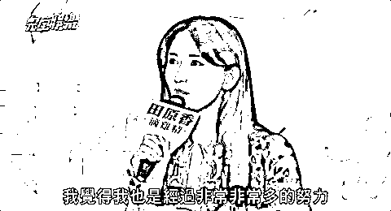
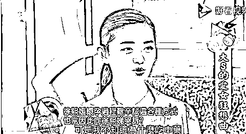

# “生吞青蛙、喝鸽子血、疯狂打针？！”这些女人为了怀孕都疯了么...

> 原文：[`mp.weixin.qq.com/s?__biz=MzIyMDYwMTk0Mw==&mid=2247546127&idx=3&sn=865463c2be99ec7141eb54a3d1d91053&chksm=97cbfe37a0bc7721ba7b5520fac7265c634e49efa043b0f7363b2ec607d22baa5828372c075b&scene=27#wechat_redirect`](http://mp.weixin.qq.com/s?__biz=MzIyMDYwMTk0Mw==&mid=2247546127&idx=3&sn=865463c2be99ec7141eb54a3d1d91053&chksm=97cbfe37a0bc7721ba7b5520fac7265c634e49efa043b0f7363b2ec607d22baa5828372c075b&scene=27#wechat_redirect)

不知道大家留意到没有，

自从结婚之后，志玲姐姐就很少出现在公众的视野了，

这两天无意中突然看到她才知道，原来，**她已经怀孕了。**

****

而且，根据她自己所说，

**46 岁的她，为了备孕，整整打了十几次试管针，花费至少 30 多万台币。**

说起来，林志玲已经不是第一个在公开场合自曝怀孕难的女明星了，

还记得当年还和汪小菲在一起的大 S，**为了怀孕，明明已经吃素十几年，**

却在婆婆的逼迫下，**不得不开始吃荤、喝中药，**导致整个人吹气球一般的长胖。

还有范玮琪，除了喝中药，还要密集地打排卵针。

打针之后，紧接着就是补充黄体素，补充的方式呢？

**就像卫生棉条那样，需要塞入下体，忍受极度的不适......**

除了这些，还有之前林依晨备孕的时候，也说过这样一句话，

**“所有该试的都试了，任何你想到的方式都试了”，**

****

而且林依晨的经纪人也透露，

这两年因为备孕，林依晨推掉的片酬足以盖几栋楼......

上面的这些女明星，还算是比较正常的，身体上虽然吃苦，但是几乎都是在用比较科学的方式备孕，

但你听说过那些，为了生孩子，**设神坛、拜巫术的女艺人么？**

刘德华的老婆朱丽倩，为了生娃，**不惜各地求神拜佛；**

徐子淇呢，则是在自己的卧室里**悬挂古代据说能够备孕的清宫图。**

除此之外，还有不少女明星，剑走偏锋，

到民间各种寻找偏方，**什么鸽子血，什么吃蛤蟆，**

更有艺人在康熙上吐槽说，**自己那时候一打嗝，蛤蟆就会自己跑出来......**

****

想想那个画面就觉得惊悚...

不敢说这样旁门左道到底有没有用，

但是可以看出，这些女明星为了怀孕，真的是拼上了自己的命。

可以理解女性想要为人母的心情，如果纯粹是女生自己的想法，是自己主观的意愿，那么这些都是可以理解的，

**但现实真的全都是如此吗？**

这些人中有多少是来自于婆家的逼迫，来自于丈夫的施压？

不知道大家有没有看过台湾艺人贺军翔的一则采访，

当被问到有没有要三胎的打算时，贺军翔说，

**自己很想要儿子，会努力继续拼，如果确认是儿子就生，如果不是就打掉。**

这淡定的口气，

仿佛打掉一个孩子，是一件稀松平常的事情......

而妻子因此身体遭受的一切磨难，仿佛都被他直接屏蔽掉了。

这些女明星明明已经事业有成，财富值超过了大部分普通人，

**却仍然被“女性必须要生育”的观念绑架，不惜糟蹋自己的身体，**

甚至有些人，在已经被医生明确告知不适合生育的情况下，仍然坚持要生，不顾一切，用尽所有手段的要生，

而那些普通人呢？那些没有经济能力，只能以命相拼的人呢？

**情况只会更加糟糕。**

不知道大家有没有听过那个纪录片《人间世》，那里面有这样一群女性，她们身上的标签，**四个字——搏命生子。**

有一个产妇，名叫林琴，已经 38 岁，

**已经生育了两个孩子，都是女孩，现在已经是高龄，却仍然坚持要生，理由很简单——要儿子。**

直到在生产中，遇到高危情况，医生告知家人，必须切除子宫才能保住孕妇的命，

这个时候，所谓的家人们都还在问**“真的没有办法了么？”**

可见，**对于儿子和孕妇的取舍，如果不是有这摄像头架着，不知道究竟会如何。**

还有一位孕妇，名字叫吴莹。

她有先天性心脏病，根本不适合生育，

但是，因为出于**“女性必须要有一个孩子才完整”**的“信念”，

她还是坚持要生。

于是，不顾医院的劝阻，她生了，

就在生产过程中，她还是没挺住，去世了。

孩子出生就被抱走，母子俩甚至没能见上一面。

**所谓的一命换一命，成真了。**

而在这个片段的最后，医生是怎么说的呢？ 

**“如果当事人无视医生的镜糕，抱着宁死也要生孩子的态度，医生也没有办法强迫孕妇放弃孩子”。** 

于是，就这样，孩子出生了，

**但是他的一生，都要活在妈妈为他而死的巨大阴影中。**

说到底，不管是女明星，还是身边的普通人，

**生育权是属于女性的，这没问题。**

但是，这样的生育，原本应该是，女性综合自身身体状况，出于对孩子的喜爱做出的决定，

**而不是什么为了维系家庭，或者是某种“生儿子”的荣誉，**

**亦或是为了“女人的完整”，这样荒谬的理由。**

**一个因为没有孩子就要把你赶出门的婆婆，**

**一个因为没有生儿子就看不起你的老公，**

**一句轻飘飘的“女人只有生了孩子才完整”的鬼话，**都不值得去牺牲。

无论男性还是女性，

作为生命体来到这世上感受一遭，并不是为了成为某种传宗接代的工具存在的。

我们，只是为了成为自己而已啊。

来源：不惑先生

欢迎关注灰产圈社群服务号

← 向右滑动与灰产圈互动交流 →

