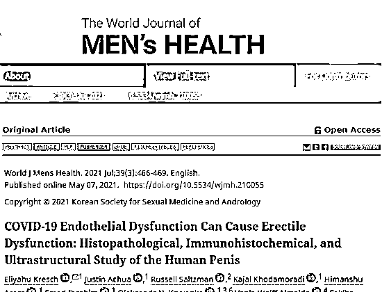
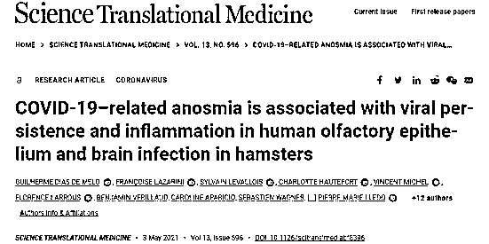
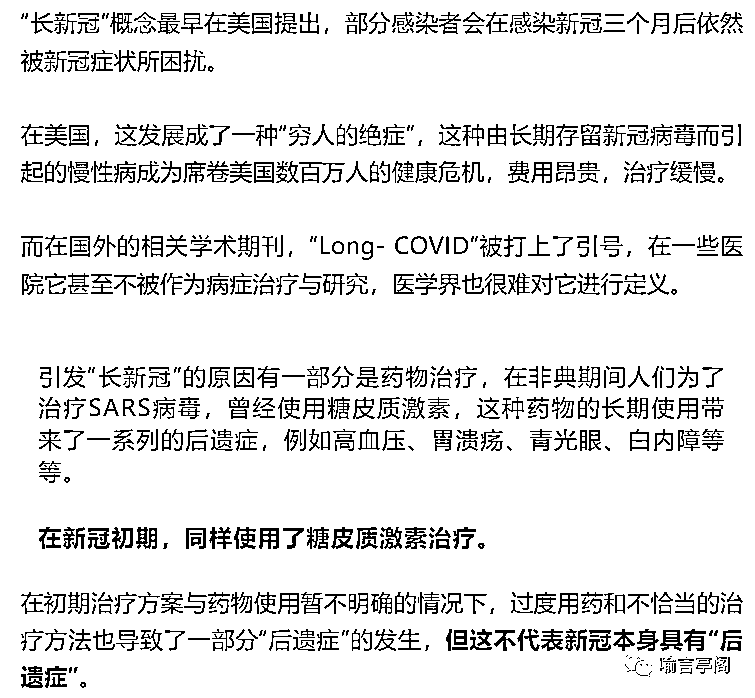
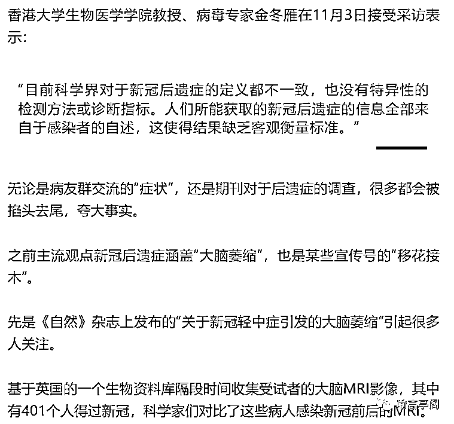
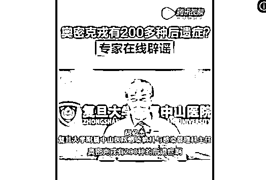
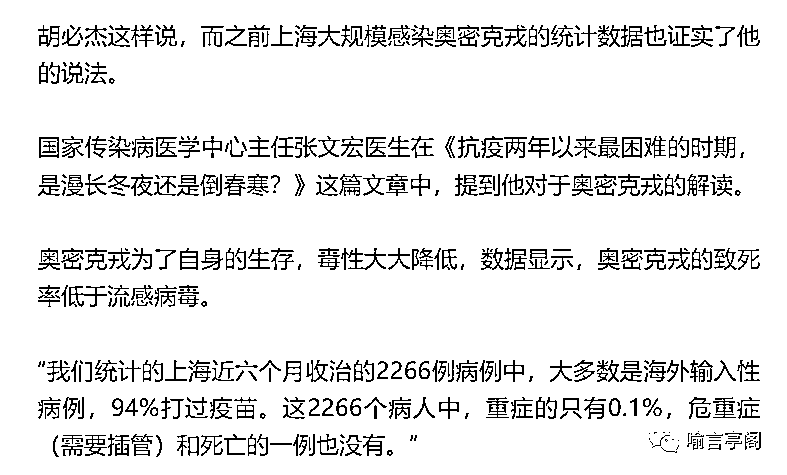
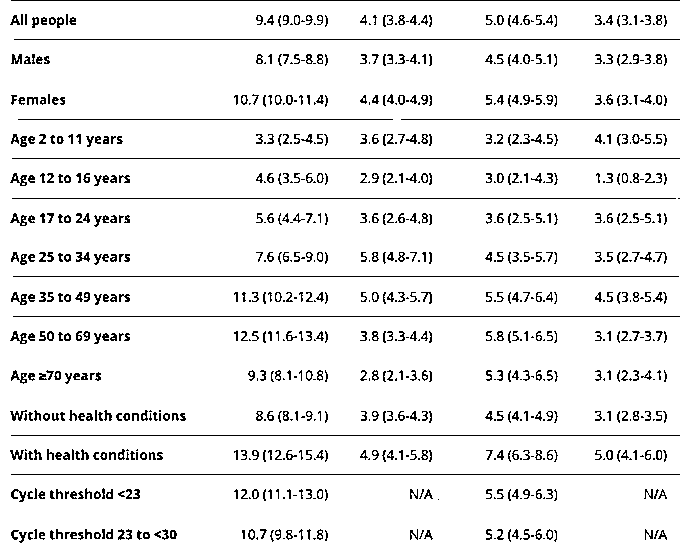
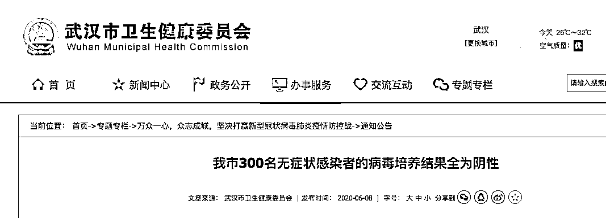

# 新冠的谎言正在被戳穿？我们究竟被“骗”了多久？

> 原文：[`mp.weixin.qq.com/s?__biz=MzIyMDYwMTk0Mw==&mid=2247546127&idx=4&sn=64fd084c94762c3ea3fa698544a9e2d6&chksm=97cbfe37a0bc772114eaf7d55fabc3152ca651b66a4dc9c3775f8c8074c5d69789c251dcc441&scene=27#wechat_redirect`](http://mp.weixin.qq.com/s?__biz=MzIyMDYwMTk0Mw==&mid=2247546127&idx=4&sn=64fd084c94762c3ea3fa698544a9e2d6&chksm=97cbfe37a0bc772114eaf7d55fabc3152ca651b66a4dc9c3775f8c8074c5d69789c251dcc441&scene=27#wechat_redirect)

郑州疫情相关事宜在网上传得沸沸扬扬。同时，郑州卫健委站出来辟谣：**新冠几乎没有后遗症**。还搬出王福生院士在 2020 年的说法，“自限性疾病”成为了新的疫情热词。

**难道，新冠后遗症是假的？我们又被“骗”了多久？**

**新冠后遗症的“真身”**

新冠后遗症，在国内外的正规医学期刊是要加引号的。

**因为根本没有新冠后遗症这种东西。**

是不是很惊讶？之前疯传的新冠会导致呼吸困难、大脑萎缩、阳痿......

至少很多人说的像模像样。

“痊愈后一个月吃柠檬面不改色，没有味觉......”

“四肢乏力，肌肉酸痛，呼吸时像戴了四五层口罩，不能工作......”

还有一些转载国外期刊、看起来非常吓人的后遗症数据。

“美国圣路易斯医疗保健系统流行病学中心的 Ziyad Al-Aly 研究团队通过对比分析 153760 名新冠患者的数据，发现新冠感染者中风风险增加 52%、心率失常风险增加 69%、炎症性心脏病风险增加 66%、心力衰竭风险增加 72%，并且新冠感染急性期病情越重，感染者心血管疾病的发病风险也越高。”

但其实一一溯源的话，会发现这些“后遗症”大部分是断章取义、道听途说的。

**第一、新冠不存在所谓的后遗症，目前主导舆论的“长新冠”其实是“长期新冠”**

另一部分则是新冠引起的并发症，这一类高发于重症患者和 80 岁以上、本身具有慢性病的老人。

在前期医疗紧张的情况下，很多重症患者只是缓解了相关症状便被迫出院，而数据统计的也大部分是这些人，新冠对于他们身体的侵蚀并没有停止。

JAMA《美国医学会杂志》给出的权威数据显示，进过 ICU 抢救的重症病人 43.1%有长新冠，住院病人 27.5%，都远高于非住院病人的比例 5.7%。

**第二、“新冠后遗症”，症状被无限夸大，缺乏科学论据的支撑**

得出的结论是感染新冠会使大脑某些部位的灰质减少。

首先，文章的设计是“假设引导下的研究”，即根据“嗅觉失灵影响大脑”这个科学假设去观察特定部位，即这篇文章的研究有先入为主的嫌疑。

其次，根据文章放出的数据来看，“新冠的影响”对于减少大脑灰质的数量很低，主要是针对老年患者，而他们的脑部本身每年就会有一定数量的灰质减少。

最后，研究结果与事实相悖，属于是逆推得出的结论，比较牵强。由于嗅觉障碍引发该区域灰质的减少，本着大脑本来拥有的“用进废退”原则，灰质减少应该是嗅觉使用减少的退化现象，而不是新冠病毒直接影响到脑中灰质的数量。

**因此，随着人们对于新冠的了解加深，“后遗症”的说法已然成为解释未知的工具，而非真正的科学现象。**

**新冠不能代表奥密克戎**

在诸多对于新冠后遗症的研究中，可以看到，标题注明的往往是对于“COVID-19”，不是现阶段主要流行的奥密克戎。

**研究的时间以及涵盖的病例也主要是 2020-2021 年间以及新冠早期患者，因此对于奥密克戎是否具有严重的后遗症，并没有说服力。**

之前网传的“新毒王”奥密克戎可致 200 种后遗症，也有国内专家现身辟谣。复旦大学附属中山医院感染病科与感染管理科主任胡必杰这样告诉人们：

图源：腾讯视频截图 

现在的奥密克戎基本大部分是上呼吸道，而早期的新冠主要是下呼吸道，也就是传统意义上的“肺炎”。

“只要免疫功能正常，没有免疫力非常非常差，或者肺部有非常严重的基础疾病，这种情况下后遗症是很少很少的，200 多种属于谣言。” 

少数 80 岁以上的老人，或者有免疫抑制、血液系统疾病、肿瘤化疗阶段、免疫功能相当差的情况下，才可能发生感染比较重。

“会死人，但病死率很低，从目前的数据来看是 1/1000 或者 0.1/1000，所以对这些重点人群要进行很好的保护。”

目前从上海的几万例来看，奥密克戎感染者 95%以上是无症状和轻型，大部分不需要用药，痊愈后也没有后遗症出现。

奥密克戎的传染性和逃逸性不容忽视，这两点性质让它获得了惊人的传染速度。

**但对于新冠的后遗症研究确实不能代表奥密克戎，奥密克戎也不是初期的新冠。**

用新冠来假冒“奥密克戎”，抛开事实谈毒性的，都有煽动情绪的嫌疑。

而据武汉市卫生健康委员会 2020 年得通告，无症状感染者的病毒培养结果全为阴性：

为使常态化疫情防控工作更精准，对无症状感染者管理更科学，让全国人民和武汉人民更放心，2020 年武汉市对 5 月 14 日—6 月 1 日集中核酸检测排查发现的 300 名无症状感染者，提取其痰液和咽拭子样本，经中科院武汉病毒所病毒分离培养，**300 人份样本均未培养出“活病毒”。**

专家认为，无症状感染者痰液及咽拭子样本中未培养出病毒，**表明样本中的病毒含量极低，或者不存在具有致病性的“活病毒”。**同时对 300 名无症状感染者使用过的牙刷、口杯、口罩、毛巾等个人用品采集擦拭样，检测结果均为阴性；**300 名无症状感染者的密切接触者 1174 人核酸检测结果均为阴性，****说明武汉市目前发现的无症状感染者没有传染性。**

来源：医学之声 ，作者：医学之声

欢迎关注灰产圈社群服务号

← 向右滑动与灰产圈互动交流 →

