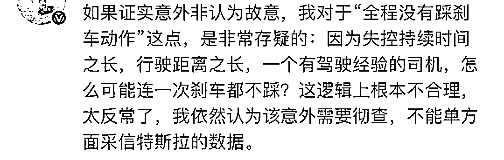
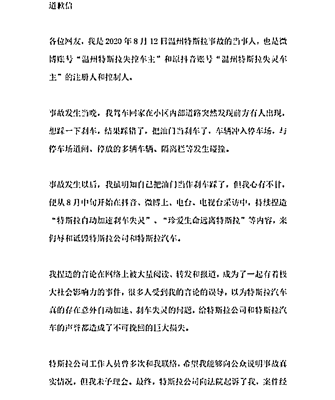

# 潮州特斯拉超速事故车主方称踩不下刹车，特斯拉：车主全程没有踩刹车动作

> 原文：[`mp.weixin.qq.com/s?__biz=MzIyMDYwMTk0Mw==&mid=2247546127&idx=6&sn=310174dd3086fa77457ab4afcb5c27b7&chksm=97cbfe37a0bc7721636b1441d76f5704353296051fb0b1242801faed3614c24b7c98378e81df&scene=27#wechat_redirect`](http://mp.weixin.qq.com/s?__biz=MzIyMDYwMTk0Mw==&mid=2247546127&idx=6&sn=310174dd3086fa77457ab4afcb5c27b7&chksm=97cbfe37a0bc7721636b1441d76f5704353296051fb0b1242801faed3614c24b7c98378e81df&scene=27#wechat_redirect)

**特斯拉**，因网上传出的一段事发现场全程监控视频，又成了这两天的最大热点。

▲事故车辆

11 月 5 日早上 6 点 59 分左右，广东潮州。

一辆特斯拉突然极速飞驰。

一路上几个监控拍到的画面显示，车速快到令人害怕。

头皮发麻，是不是上 180 迈了……

就这样失控般疾驰 2 公里，途中发生两起车祸，连撞多人多车，最终在路边撞停。

这起重大事故导致两死三伤。

车主詹先生身受重伤，至今在医院。

家属@詹丘比 放出监控视频并称，**当时车主多次踩刹车，毫无反应**，这是特斯拉的车质量有问题，呼吁彻查，并将该款车型召回。

划重点：

事发时，车主正准备在自家店铺前停车但**“刹车变硬”，踩下去没反应。**

疾驰过程中，有一段道路监控中显示，**高位刹车灯短暂亮起。**

11 月 13 日，特斯拉回应此事称：

1）车辆电门被长期深度踩下，并一度保持 100%。
2）全程没有踩下刹车的动作。
3）行驶期间驾驶员四次短暂按下 P 档按钮，又快速松开，同时制动灯也快速点亮并熄灭。

特斯拉方面称，目前警方正在寻求第三方鉴定机构进行鉴定以还原事故真相。

简单直白总结一下两方的观点。

车主方面说踩不下刹车，刹车变硬，换句话就是指**特斯拉刹车失灵。**

而特斯拉回应里的意思，其实也就是指**司机把油门当刹车了……**

到底是刹车失灵还是踩错踏板，区别一个天一个地了。

有的网友按逻辑推断，车主有 30 年的驾龄，不会犯这么低级的错误吧。。。

就算踩错了，也不至于这么久，而且看得出车主在尽力避让了，这样故意加速也不成立啊。

国外也有特斯拉刹车失灵的事故。

与此同时，撒谎刹车失灵，实则踩错踏板的先例也不是没有。

2020 年，“温州特斯拉刹车失灵”事件传得沸沸扬扬，8 月 12 日晚一辆特斯拉 Model 3 进小区停车场时失控，连撞十几辆车才停下来。

一开始车主发布了“特斯拉自动加速刹车失灵”等内容，还说自己十余年驾龄的老司机，不会踩错油门和刹车。

后来这位车主向特斯拉道歉：承认当时心有不甘才捏造事实。实际上发生事故的当晚，他想踩一下刹车，结果踩错了油门。

……

所以这次潮州的特斯拉事故，究竟是司机问题还是刹车失灵，还是得等有关部门的调查结果。

就是感觉，现在行车记录仪已经不够了，行脚记录仪该安排上了，还得装一套制动踏板位移记录器来证明你确实踩踏板了……

来源：上海全知道

欢迎关注灰产圈社群服务号

← 向右滑动与灰产圈互动交流 →

