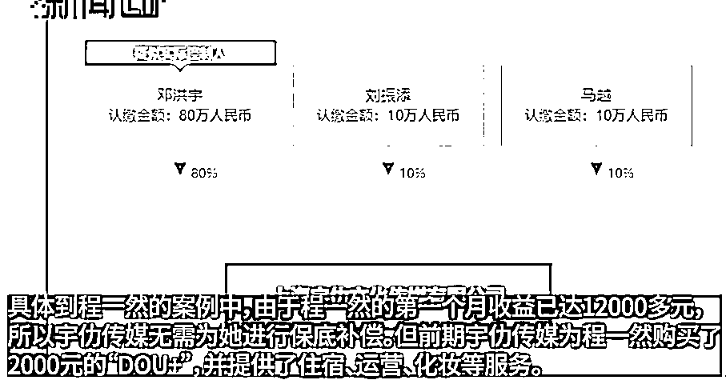

# 看主播好挣钱？现实是被协议“绑架”，一不当心就违约！想解约？赚 1 万赔 36 万

> 原文：[`mp.weixin.qq.com/s?__biz=MzIyMDYwMTk0Mw==&mid=2247546127&idx=7&sn=c930a7489b9a687edb0277704a6810a7&chksm=97cbfe37a0bc7721c7d23abc592f1df0d2ee3843453c10c9fb433cbfaac83c9dd51eed49f0f5&scene=27#wechat_redirect`](http://mp.weixin.qq.com/s?__biz=MzIyMDYwMTk0Mw==&mid=2247546127&idx=7&sn=c930a7489b9a687edb0277704a6810a7&chksm=97cbfe37a0bc7721c7d23abc592f1df0d2ee3843453c10c9fb433cbfaac83c9dd51eed49f0f5&scene=27#wechat_redirect)

本文部分素材来自：新闻晨报 周到上海 021 视频

今年刚刚过去的双 11，相当平淡

快递时效如常

路过快递站，也没有堆成山的快递了

热闹气氛全靠主播们苦苦支撑 

**直播**这个东西，可能是真的香吧

不然

怎么这么多的明星做起直播来了

⬇️ 刘涛、杨颖、陈赫

⬇️ 姜潮、马可、黄宥明

⬇️ 贾乃亮、林依轮、张柏芝

⬇️ 辰亦儒、谢孟伟、张柏芝

看到各路明星都出现在直播间里带货

让人有一种

**「流量的终点是直播带货」**的感觉

再想起早先薇娅的天价罚款。。。

还有经常看到的

那些网络主播偷税罚款的新闻

随便一则新闻

就是大几百万

甚至是上千万的。。。

再看看自己每个月的工资进账

只觉得：

**「主播的钱都是大风刮来的？」**

就是有这种错觉，有的人就冲了呀！

大概是觉得

这钱她们可以挣，我也可以！

但结果就是 ⬇️

就。。。还是打工人呗

除非自己当主播，也当老板

啥都干，还得样样都能干

不然一样被资本家剥削

最近发生在上海的一则主播相关新闻

主播也像打工人一样

被一家只有三个人的公司欺负

**“赚一万赔三十六万” **

23 岁的程一然也就是想

做做主播，聊聊天，带带货

大概就可以**月入数万元甚至数十万元**了

就在网上找了相关工作机会

毕竟“主播”这份工作

在大家印象里就是这么一个概念：

门槛低、收入高、限制少、前景光明

程一然在招聘 app 上看到

**“在直播行业打拼多年，**

**孵化了上百名高收入主播”**的说辞

觉得还挺有吸引力的吧

就去了这家“宇乐文化”面试

面试的地方，在宝山的一个办公园区里面

进到室内，就是一个直播间

还是这家公司的老板“宇哥”的卧室

谁知道程一然这个傻孩子

当时还以为，整个园区都是公司的

**“我当时觉得，这家公司好大呀。”**

再加上公司的一些华丽承诺：

**“每位伙伴的青春都是宝贵的！**

**我们会辅助你，**

**打造抖音大 IP，流量变现，**

**以后靠粉丝带货代言即可获得不菲的收入”。**

面试当天，程一然就签下了协议，

成为了宇哥旗下的一名主播

当时公司就跟程一然强调过：

**他们之间签订的是《合作协议》**

**而非《劳务合同》，**

**公司与程一然之间是合作关系。**

开始直播之后

程一然才觉得有些不对劲

签约前：

签约后：

8 月 20 日前后

程一然注册了直播账号、搬入了公司

正式开始了自己的主播生涯

一开始小姑娘直播应该还挺顺的

毕竟刚开始，是用 12 分的热情来做事吧

直播 8 天之后

按照协议她可以拿到的份额

就已经超过了收入保底金额 8000 元

不过播久了，就发现辛苦了

最先出现问题的

就是因为不断讲话而发炎的嗓子

可即便嗓子发炎还发烧

程一然也不得不带病坚持直播

可这样带病工作不是个事儿呀

一开始身体不好，还能勉强播

但到后面

程一然眼皮肿得厉害，实在是不能上播

这样子之后，公司就有点翻脸了

公司再次跟程一然强调：

**他们之间签订的是《合作协议》**

**而非《劳务合同》，**

**公司与程一然之间是合作关系。**

如果不上播

就会达不到协议里的直播时长要求

**单场直播时长 3h+**

**每天直播时长 6h+**

**每月直播天数 26 天+**

**每月直播总时长 156h+**

这样可算违约啊

只是公司老板的说辞更加简单粗暴：

**“不播就没收入，**

**事情也会越来越多，越来越大”**

还拿其他主播违约的开庭公告

来吓唬小姑娘

这。。。可以算是强迫卖艺吗？

生过病之后，程一然算是**“主播梦醒”**

当她想要离开的时候

才发现自己签的协议

简直就是“流氓协议”

在这份协议中

共列举了 24 种乙方（程一然）违约情形

却没有列举任何

甲方（宇乐）可能触发违约责任的违约情形

* 网络配图

现在，程一然在和宇乐合作期间赚了 1 万

按照协议

如果要离开，就要赔偿公司**36 万**

***“我现在只是赚了 1 万元，按照协议就要赔付 36 万元。如果我赚了 10 万元，那我就需要赔付 360 万元。就算我一分不赚，我在这家公司播的时间越久，对方对我的前期投入就越多，而我最后都要以 36 倍的金额赔给他们。”***

好夸张的

很想问问，这样子的协议是合法的么？

36 倍也是合法的么？

而宇乐公司和程一然说的，还挺唬人的：

**“你根本不可能赢”**

**“公司的律师团队非常专业”**

**“所有合同都是经过精心设计的”**

即使是面对媒体，宇乐也理直气壮

觉得自己付出了很多服务

就该这样签协议啊

直播发展了这些年之后

不管是税，还是合同

好像整个行业还都是挺乱的？

没点法律警惕性都不能入行 

来源：上海全知道

欢迎关注灰产圈社群服务号

← 向右滑动与灰产圈互动交流 →

