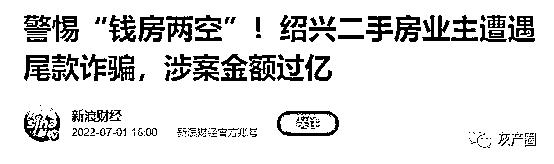
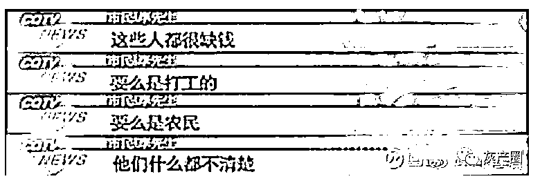
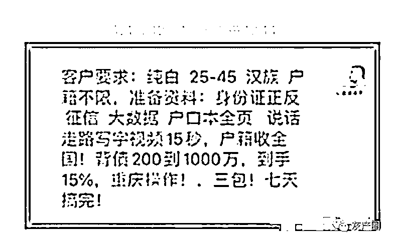
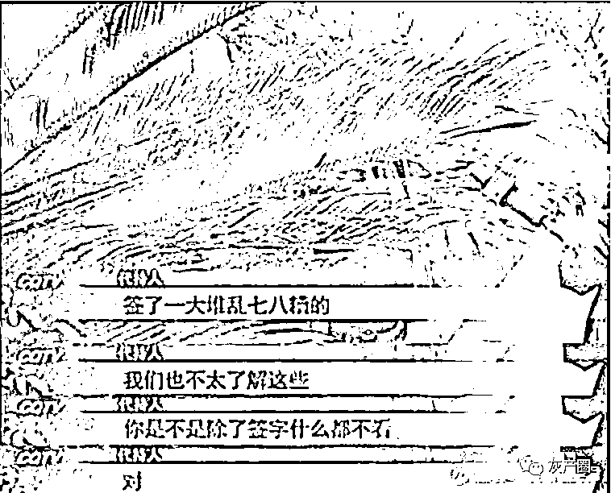
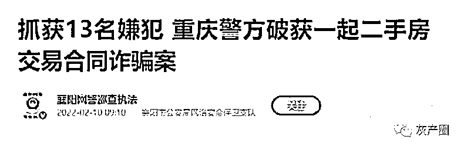
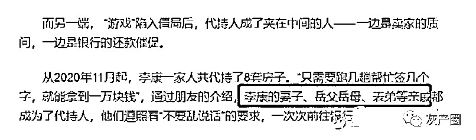
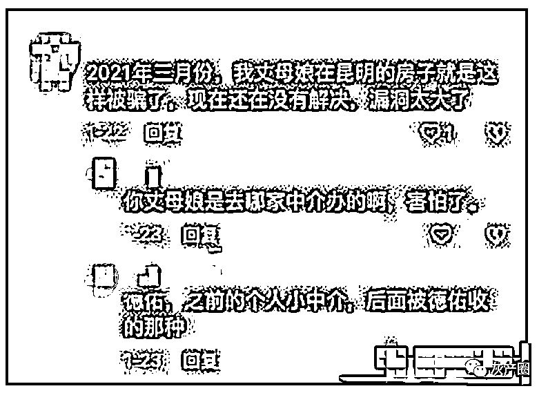
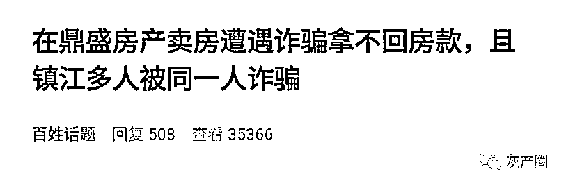
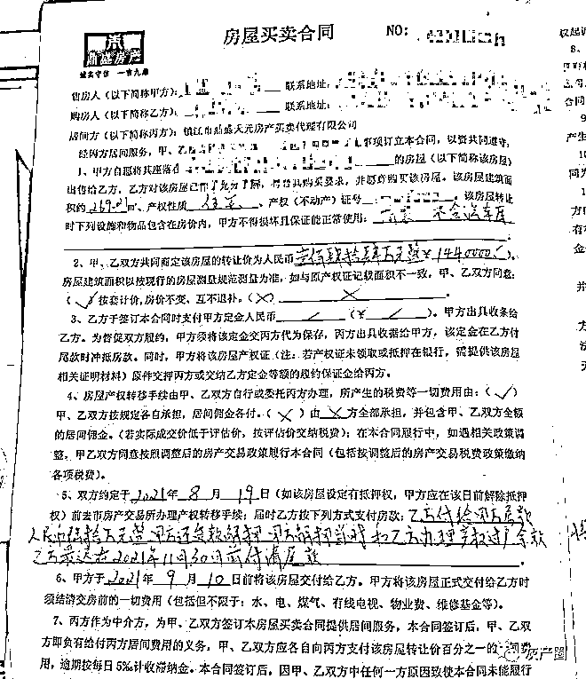

# 有房的注意了！新骗局来了！300 万的房子卖出去最后只收到 90 万！

> 原文：[`mp.weixin.qq.com/s?__biz=MzIyMDYwMTk0Mw==&mid=2247546127&idx=8&sn=2786110893b5adf089510c5af3461db3&chksm=97cbfe37a0bc772139885665c6e9a2f95c622865ebcc00ce75a27d34fb822b2e871bca06697b&scene=27#wechat_redirect`](http://mp.weixin.qq.com/s?__biz=MzIyMDYwMTk0Mw==&mid=2247546127&idx=8&sn=2786110893b5adf089510c5af3461db3&chksm=97cbfe37a0bc772139885665c6e9a2f95c622865ebcc00ce75a27d34fb822b2e871bca06697b&scene=27#wechat_redirect)

微博博主@庚白星君 发现了近期频繁发生的二手房骗局：
警惕！一场买房骗局正在全国蔓延！

  

警惕！近段时间，一场针对二手房交易的骗局，正在蔓延全国多个城市！其作案手法隐蔽，伤害极大，不少房东“钱房两空”，很难追回赔偿。
今天，我就把这个骗局拆解给大家看，所有打算卖房的读者，一定要小心小心再小心！
**.01**
今年年初，眼看市场持续低迷，位于浙江的老张便把自己 300 万的房子挂出，套取现金。
等了半年，终于有一位中介带着客户前来咨询。
买家非常爽快，一分钱都没有还价，而且还赶在一个星期之内，完成了几乎所有流程：
交 90 万首付、签购房合同和过户。
事情进展顺利，老张狂喜：
接下来的三个月，只要坐等 210 万尾款就行。
没有想到，就在这期间出事了！
在多次拖延后，210 万尾款竟然没了声响。这位“阔绰”的买家，也在他面前可怜兮兮地坦白：
“我就是个代持的，图个万把块钱好处，名下啥都没有。”
这就意味着，哪怕老张起诉成功，也追不回任何东西！
为什么会这样？
痛定思痛，老张发现事情演变有多离谱：
自己的房子已经被抵押出去，代持人名下全是债务，比卖房被骗的自己还惨。
这样的骗局，目前已经在重庆、浙江、江苏等多地发生，无数房东上当受骗。
那么，这种新型骗局有何恐怖之处？
**.02**
事实上，诈骗团伙的手段，可以拆解成几个步骤。
第一步：寻找房源，跟房东接触
这些人一般会扮演成有钱的大老板，出手大方，极少还价，以此骗取房东信任。而急于卖房的房东，会被率先盯上，成为首要目标。
第二步：找到名下没有资产、信用较好的代持人
这些代持人，一般都是骗子找来的熟人。
被盯上的，一般都是学历低、收入低，没有征信问题的“猪仔”。此前有媒体报道，这些人大多来自云南、贵州等地，属于外地务工人士。  

还有些诈骗团伙，直接在网上发布“招聘启事”，用丰厚的酬劳做诱饵，让这些“猪仔”提供自己的资料信息，出卖信用。 

代持人“猪仔”对法律一知半解，只是谨记：
少听不问直接签字，一个流程走完，几万块钱就能到手。  

这个时候，骗子们就会用：
我是外地人/我名下房子太多/这套房子是买给我表弟的等等话术，让房东放心跟代持人签约。
当然，这个时候房东会有点担心，但经不住骗子的糖衣炮弹：
“你行个方便，我也不跟你砍价了，你说多少钱就多少钱。”
着急用钱的房东，也就让步了。
第三步：正常走流程买房
接下来，就是正常的买卖步骤：
跟房东签订二手房买卖合同，付首付，办理银行按揭面签，再将房屋过户到指定的“代持人”名下。
到这里，一切都还是正常的。
然而，接下来就是最重要的一步！也是能让绝大部分新手卖家踩坑的一步。
**.03**
第四步：撤销按揭/实际没有办理按揭，用房产证抵押做经营贷
这一步，不同地方的诈骗团伙操作不太一样。
在监管比较完善的地方，骗子们会以节省手续费为理由，提出自己到银行办理按揭；
在浙江绍兴等地，二手房交易的流程跟常见的不太一样，是先过户再申请贷款，因此中介如果不可靠，就很容易出现风险；
而在重庆，部分骗子会在申请完按揭后，偷偷跑去银行撤销按揭贷款。
在重庆的案子里，银行人员表示，他们跟卖家不存在借贷关系，只对买家负责。因此，在银行按揭同意书下来以前，买家撤销按揭，银行是不能拒绝的，同样，他们也没有告知卖方的义务。

这就是部分地方二手房资金监管的一大漏洞。
要知道，在天津等监管更为严格的城市，房管局会在银行设立二手房资金监管账户，确保过户和抵押在同一天完成。
卖家一日收不到全款，买家就一日拿不到房产证。
总而言之，钻到了漏洞的骗子们，会把已经过户的房产抵押给别的金融机构，一般是地方审核比较松散的农商行，或者是民间借贷机构，获得大笔贷款。
绍兴骗局中，就有不少卖家的房子被挪用抵押，不少抵押贷款竟然高于房屋价格的七成。
割完这一波，还有第二波：
骗子们会拿着房子和“猪仔”的资料办理一切能拿到钱的贷款，大额信用卡、经营贷、装修贷等等，将房子的最后一点价值榨干为止。
至此，代持人也陷入了万劫不复的境地。
我见过最离谱的一个家庭是，通过好友介绍，一家人几乎全部代持，共计 8 套房子......  真是可悲！可叹！
**.04**
目前，重庆的这个团伙已经被抓获，但是类似的骗局还在全国上演。

例如，桂林、昆明、大连等地都有网友分享出自己的类似遭遇。  

在这场骗局里，尽管买房人起诉，一定会胜利，但是因为代持人名下没有钱，所以房款也很难追回。
就在今年，镇江也有房东爆出相似案例！  据这位卖家自述：
本人唯一一套住宅挂在 0511 网站出售，在 2021 年 8 月份，  房产中介公司带领一位看房人。
达成买卖共识后，在    丹徒新区枫华丽府店签订买卖合同，合同价格为 144 万，税费各付，当时中介公司业务员一直跟我们说买家是炒房老板，有实力，名下房产多，所以买家要求过户到他指定人名下。
我们对于这个操作心存疑虑，再三咨询中介业务员，觉得风险比较大，业务员与  区域经理再次肯定此人有买房实力，可以正常操作。基于对    大中介的信任感，我们也认可了此操作方式。
于是在 2021 年 8 月 19 日签订买卖合同，并且支付了首付款 60 万元后，在交易大厅完成过户，合同约定买家贷款时间为三个月，并且约定三个月未支付剩余房款，将无条件返还房产。
而在过户三天后，买家又将房产再次转让给第三人，我们发现后，买家说是由于贷款问题，需要转给他们一起的人重新办理贷款。
在约定到期后，我们跟买方要剩余房款 ，买方就一直拖延，期间我们报警，并发现此人在镇江有多起买卖不支付尾款的案件，至少数十起。
后通过律师查询，得知此房产被第三人拿去银行抵押贷款 234 万元，并且与我签订合同买家为失信被执行人，名下没有任何可执行资产。
此人也是利用这一点，觉得法律对他毫无约束力，肆无忌惮地诈骗一套又一套房产。  因此，大家卖房一定要打起十二分精神。
交易的时候，必须本人在场，核实买房人身份，听到“代持”、“亲戚买房”等用词，保持警惕。
此外，房东一定要等到对方拿到按揭贷款的贷款承诺函才去过户，过户之后，更是不能轻信中介，要时刻紧盯后续流程有没有按照银行按揭贷款流程走。
记住：一刻没有收到尾款，就一刻也不能放松！
另外，如果身边有人招呼你，给你一个赚钱的好活儿，例如签名代持，千万不要相信。
否则，很容易摊上大事儿。

图源：重庆天天 630，梦溪论坛

* * *

宥熙萌子:我就是南宁的受害者家庭，全部和博主描述的一模一样，我们在被南宁江山的中介推了一个买家，他说这个买家各种好，有钱大老板，想给自己的公司添置不动产，我们特意咨询了银行，也问过有经验的人都说，公司办贷款很麻烦，要抵押什么的，所以肯定不会被骗，后面来交易的时候是这个老板找了个表弟做代持人

桃扇青眉:我研究了一下，好像大概是这样：你卖房，我来买，我特有钱有信用，但是我名下房太多了，就跟你商量把这个房挂我弟名下，而且你看着我把首付钱和手续都办好了，就过户给我弟了，这时候我去银行把手续撤销，你跟我假弟扯皮吧。重点还是中间那个代持人，卖房只要不管什么高价都不过户给代持应该就没事

养了一只小吱吱:我们这边银行是过户办好抵押后款放到卖家账户的，我一直觉得有点问题，所以这样骗局就只局限于某些地方

仿生比格犬会梦见电子忍人吗:卖二手都是一个道理，拿到全款才能把东西给出去

来源：微博那些事儿

欢迎关注灰产圈社群服务号

← 向右滑动与灰产圈互动交流 →

